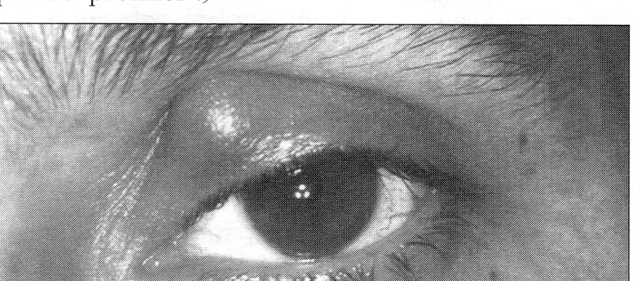
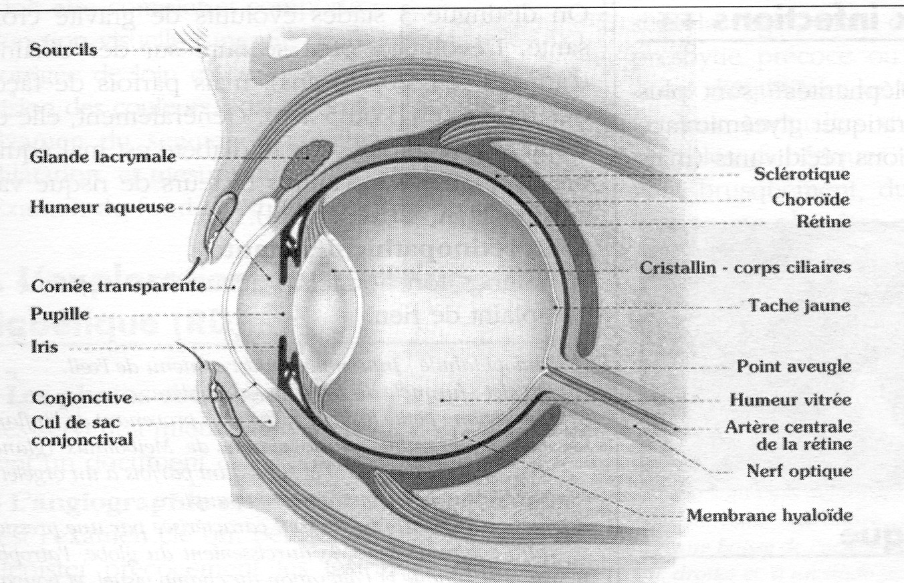

**NB** : Le lexique est en fin d'article.

## **I. L'examen ophtalmologique du diabétique**

### **1. Circonstances de découverte**

Le diagnostic est fait :

*   le plus souvent au cours du **bilan systématique** de la maladie,
*   parfois devant des signes fonctionnels liés a une **complication** : baisse brutale de l'acuité visuelle, myodésopsies, métatmorphopsie, syndrome maculaire, voile rouge, hémorragie intravitréenne ,
*   plus rarement de façon fortuite, à l'occasion d'un examen du fond d'ccil (FO), l'existence d'une réti­nopathie faisant alors découvrir le diabète.

### **2. L'examen ophtalmologique**

Il doit être complet et comporte :

*   Fonction visuelle : mesure de l'acuité visuelle (AV) corrigée de loin et de près, vision des contrastes, vision des couleurs, adaptation à l'obscurité.
*   Examen du segment antérieur avant et après dilatation, et mesure du tonus oculaire.
*   Examen du fond d'oeil, essentiel +++.

### **3. L'exploration de la rétinopathie diabétique (RD)**

#### **a) Les photos couleurs du FO**

Elles servent à mieux analyser les lésions et consti­tuent un document de référence.

#### **b) L'angiographie rétinienne fluorescéinique**

C'est l'examen clé qui permet de :

*   dépister précocement les lésions à leur début. alors que le FO peut être sensiblement normal,
*   suivre l'évolution,
*   guider le traitement par photocoagulation.

_**Un examen complet est donc nécessaire pour faire le diagnostic et apprécier la gravité de l'atteinte oculaire au cours du diabète**._

## **II. Les complications oculaires extra-rétiniennes du diabète**

Elles sont fréquemment associées à la rétinopathie, attention à ne pas les méconnaître.

### 1. Les troubles fonctionnels

Ils concernent la réfraction, l'accommodation, la vision des couleurs et la sensibilité de contraste.

#### **a) Troubles de la réfraction**

Ils touchent généralement les diabétiques de type I lors de la mise sous insuline. Les hypermétropies sont la règle, mais on peut aussi observer une presbytie précoce ou une myopie transitoire en cours d'équilibration. Ces troubles peuvent s'ajou­ter aux anomalies d'accommodation, fréquentes chez les diabétiques. Ainsi certains enfants peu­vent brusquement, durant cette période d'équili­bration, ne plus être capables de lire.

#### **b) Trouble de la vision des couleurs**

Des troubles de la vision (les couleurs ont égale­ment été mis en évidence cliez les diabétiques. Les altérations dans l'axe bleu-jaune sont les plus fréquentes. Ces modifications n'ont pas été obser­vées chez l'enfant et peuvent se manifester chez l'adulte dans une proportion pouvant atteindre 30 à 70 % des patients.

### **2. Les atteîntes de la surface oculaire**

Les atteintes de la cornée chez le diabétique ont des manifestations cliniques particulières. La sensibilité cornéenne est réduite et ce, d'autant plus que la rétinopathie diabétique est avancée. Ce phénomène est également proportionnel à la durée de la mala­die. Les kératites et ulcères sont plus fréquents chez le diabétique que chez le sujet sain. La cicatrisation des lésions cornéennes est plus lente et difficile.

### **3. Les atteintes cristalliniennes**

La cataracte chez le diabétique adulte est nette­ment plus fréquente que chez le jeune, sa fré­quence est de 2 à 5 fois plus élevée que dans une population non diabétique Elle est volontiers de type sous-capsulaire postérieure, parfois inaugura­le chez un sujet jeune (40 ans...) d'où la règle de pratiquer une glycémie en cas de cataracte chez un adulte jeune.

Le traitement de la cataracte chez le diabétique est fait, si possible, après celui de la rétinopathie (mais par définition, on risque d'être gêné par la cata­racte pour le FO, l'angiographie et le laser). La chirurgie nécessite une couverture antibiotique en raison du risque d'infection post-opératoire (et d'en dophtalmies).

### **4. Susceptibilité aux infections ++**

**Orgelet, chalazion** et blépharites sont plus fréquents, d'où la règle de pratiquer glycémie face à des orgelets et des chalazions récidivants (mais pas au premier !)

### **5. Neuropathie optique**

Une atteinte des nerfs optiques est possible.

## III. Les complications rétiniennes du diabète :  
rétinopathie diabètique (RD)

La rétinopathie diabétique est l'ensemble des lésions rétiniennes dues au diabète. Il s'agit d'une micro-angiopathie qui survient très fréquemment après 10 à 20 ans d'évolution (DID ou DNID). Dans les pays développés, elle est l'une des prin­cipales causes de cécité (définie par une acuité visuelle inférieure à 1/10) avant l'âge de 60 ans. Elle est devenue un problème de santé publique, les diabétiques vivant maintenant plus longtemps.

### 1. Physiopathologie

La RD est due à une lésion des capillaires rétiniens : micro-angiopathie. Elle dépend de l'ancienneté du diabète (80 % après 20 ans, rare avant 5 ans), du mauvais équilibre glycémique et des autres fac­teurs de risque vasculaire (HTA, alcool, tabac). Cette microangiopathie a 2 conséquences : hyper­perméabilité capillaire responsable de fuite intra­rétinienne de plasma (oedème) ou de globules rouges (hémorragies), et occlusion capillaire res­ponsable d'ischémie de la rétine. Cette redoutable ischémie va déclencher la formation de néovais­seaux "fragiles" et "vicieux", qui vont alors être res­ponsables de complications : hémorragies intra­rétiniennes, hémorragie dans le vitré, décollement rétinien tractionnel, glaucome néovasculaire.

### **2. Formes cliniques**

On distingue 3 stades évolutifs de gravité crois­sante. L'évolution peut se faire sur des dizaines d'années (10, 20, 30 ans), mais parfois de façon très rapide (en 3 ou 5 ans). Généralement, elle est d'autant plus rapide que le diabète est mal équili­bré et qu'il existe d'autres facteurs de risque vas­culaire (HTA, tabac, alcool).

#### **a) La rétinopathie débutante**

*   Signes fonctionnels : aucun ! Le sujet ne se plaint de rien.
*   Fond d'œil (FO) : l'examen est normal ou presque.

#### **b) La rétinopathie non proliférante oedémateuse et/ou ischémique**

*   Signes fonctionnels : parfois encore aucun... ou baisse visuelle en cas d'œdème maculaire ou d'hémorragie de la région maculaire.
*   FO et angiographie : deux aspects possibles selon la prédominance de l'œdème ou de l'ischémie (les formes mixtes sont fréquentes). Ainsi, l'angiographie, mieux que l'examen du FO, précise la forme clinique.

#### **c) Rétinopathie ischémique proliférante**

Il se développe une circulation collatérale, faite de néovaisseaux "anarchiques" et "fragiles". Ces néo­vaisseaux se développent sur tous les territoires ischémiques, sont de plus en plus nombreux, puis finissent par proliférer en avant de la papille. Ils sont visibles au FO (fins capillaires tortueux, en avant de la rétine) et mieux encore en angiographie car leur paroi, anormale, laisse diffuser le colorant.

### 3. Traitement

#### a) Préventif +++

Il est capital :

*   Equilibrage du diabète : très efficace dans la pré­vention, voire la régression des signes de rétino­pathie débutante. Indispensable ensuite aussi pour éviter l'aggravation.
*   Traitement des autres facteurs de risque : HTA surtout, arrêt du tabac.
*   Anti-agrégants : l'aspirine à faible dose permet de limiter les risques de thrombose.

#### **b) Curatif**

Il ne se conçoit que lorsque le diabète est bien équilibré... si possible...

*   **Médical : il n'en existe pas**. Aucun médicament ne prévient la survenue ni n'améliore la rétinopathie.
*   **Laser "semi-curatif** +++ : gigantesque progrès en ophtalmologie car il a permis d'éviter (le plus souvent) l'évolution vers la cécité. Il faut se rap­peler que l'on ne guérit pas mais on limite le risque de complications, ce qui sous-entend que l'équilibrage du diabète et la lutte contre les autres facteurs de risque vasculaire soient parfaits. On réalise une photocoagulation des zones de rétine ischémiques, ce qui permet de les exclure et d'éviter la prolifération des néovaisseaux.
*   **Chirurgical : rarement pratiqué**. Il s'agit d'un "pis-aller" car il s'adresse aux complications qui auraient dû être prévenues par l'équilibrage du diabète ou traitées par photocoagulation...

### Conclusion

Cette revue des complications dues au diabète met en évidence l'importance du suivi régulier des patients. L'amélioration importante du traitement de la maladie responsable et la possibilité d'offrir aux diabétiques des thérapeutiques oculaires effi­caces permettent de voir l'avenir ophtalmologique de ces patients avec beaucoup plus d'optimisme qu'il y a une vingtaine d'années. Il est probable que de nouvelles voies thérapeutiques s'ouvriront encore pour éviter aux diabétiques un handicap visuel qui les menaçait auparavant.

**Lexique**

**Métamorphopsie** : perception de "mouches volantes".  
**Myodésopsie** : perception de "mouches volantes"Métamoprhopsie : modification de la perception des images qui sont vues déformées.  
**Syndrome maculaire** : atteinte de la macula, entraînant une baisse de l'acuité visuelle, une vision ondulée des lignes droites, et, à un stade plus avancé, une tache centrale appelée scotome central, et parfois des troubles de la vision des couleurs et/ou des contrastes.  
**Hémorragie intra-vitréenne** : hémorragie siégeant dans le compartiment de l'oeil appelé le vitré.  
**Endophtalmie** : inflammation du contenu de l'oeil.  
**Orgelet** : furoncle du bord de la paupière.  
**Chalazion** : petite tumeur palpébrale provenant de l'inflammation, chronique d'une glande de Meibomius (glande sébacée de la paupière) et succédant parfois à un orgelet.  
**Blépharite** : inflammation de la paupière.  
**Glaucome** : maladie de l'oeil caractérisée par une pression intra-oculaire élevée, le durcissement du globe, l'atrophie du nerf optique et l'altération du champs visuel, et pouvant conduire à la cécité.  

_Développement et Santé, n°193, 2009_