**Conduite à tenir devant un oeil rouge non traumatiqueen zone sahélienne**

\*Médecin, Programme National de Lutte contre la Cécité, Niamey, Niger.

- Un oeil rouge est un oeil qui " souffre ".

- C'est toujours une urgence.

- Un examen soigneux vous permettra de :

- - garder le malade et de le traiter sur place, ou
  - de le référer au spécialiste.

- Un traitement bien conduit et une surveillance régulière permettront au malade :

- de guérir,

- ou d'être référé dans de bonnes conditions donc de guérir avec des séquelles amoindries.

**Rappels**

L'interrogatoire :

**1. Existe-t-il des douleurs ?**

- une gêne, une impression de *grains de sable* orientent vers la **conjonctive,**

- des douleurs majorées par le *clignernent* et/ou la *lumière* (photophobie) orientent vers la **cornée,**

- *des douleurs* *périorbitaires* et/ou des *céphalées* orientent vers des **lésions plus** **profondes** (uvéite, hypertonie).

**2. Existe-t-il une baisse d'acuité** **visuelle de loin ?**

- une diminution de l'acuité visuelle,

- une vision anormale (halos colorés) sont des **signes de gravité.**

**3. Existe-t-il des sécrétions et** **depuis quand ?**

Le sécrétions signent une surinfection.

**ATTENTION : Une surinfection peut compliquer une lésion profonde**

L'examen précise :

a\) La mesure de l'acuité visuelle. Si possible toujours comparer avec l'oeil sain.

b\) L'examen sera méthodique et soigneux, après nettoyage des sécrétions, si besoin.

Ces règles vous permettront de reconnaître les critères de gravité :

- Les paupières ne se ferment pas totalement (lagophtalmie).
- Les cils frottent sur la cornée (trichiasis).
- La rougeur est limbique (cercle périkératique).
- La cornée est blanche.
- La pupille est blanche,

<!-- -->

- et/ou irrégulière,
- et/ou petite (myosis),
- et/ou élargie (mydriase).  
  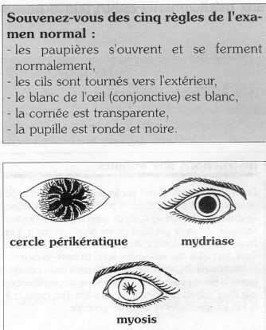

***Chez le petit enfant dont les paupières ne s'ouvrent pas spontanément, l'oeil est en danger***

Au terme de votre examen vous pourrez :

- Faire le diagnostic du siège de la lésion.
- Traiter sur place

<!-- -->

- les atteintes de la conjonctive,
- les atteintes superficielles de la cornée.

<!-- -->

- Mettre en route un traitement sur place

<!-- -->

- en assurer la surveillance régulière,
- référer en l'absence d'amélioration.

<!-- -->

- Référer les autres cas en précisant les critères de gravité.

**I. L'oeil rouge non douloureux**

**1. L'hémorragie sous-conjonctivale**

C'est une tache de sang survenue spontanément, souvent remarquée par l'entourage car indolore :

- elle n'a aucun critère de gravité
- elle disparaîtra en huit à quinze jours
- elle ne nécessite aucun traitement ;
- elle doit faire rechercher une cause générale hypertension artérielle, troubles de la coagulation, prise d'aspirine, effort de toux, accouchement...

**2. Les conjonctivites**

Elles réalisent le tableau de l'oeil qui " coule ". La gêne est induite par le larmoiement et/ou les sécrétions, l'atteinte est souvent bilatérale.

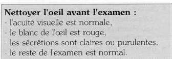

**Les conjonctivites purulentes**

Ce sont des conjonctivites bactériennes ou virales qui se surinfectent très souvent.

L'examen peut être rendu difficile par l'oedème palpébral :

- commencer par nettoyer l'oeil en décollant les cils,

- **il est impératif de voir la cornée et la** **pupille :** utiliser au besoin des écarteurs à paupières,

- **regarder les cils,**

**- retourner la paupière supérieure à la** **recherche** d'un corps étranger passé inaperçu, de follicules trachomateux.

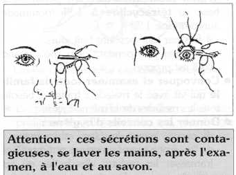

**3. Conduite à tenir**

**a) Il s'agit d'une conjonctivite purulente** **non compliquée quel que soit l'âge du** **malade**

- Expliquer et montrer comment nettoyer l'oeil **avant chaque traitement :**

<!-- -->

- avec une eau propre, sans savon,
- avec la main propre : de préférence sans instrument car la main pourra être relavée.

<!-- -->

- **Traiter** avec un collyre ou une pommade antibiotique quatre fois par jour pendant huit jours.

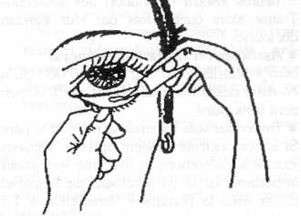

- **Expliquer les mesures préventives**

<!-- -->

- se laver les mains après chaque traitement,
- utiliser des linges de toilette individuels.

**b) Il existe des signes de trachome (voir** ***encadré)***

- Expliquer au malade ou à l'accompagnant que :

<!-- -->

- la maladie se cache **sous la paupière,**
- elle est très contagieuse,
- le traitement est long,
- les rechutes sont fréquentes.

<!-- -->

- **Traiter localement** avec une pommade à base de **tétracycline à 1%** (pommade auréomycine 1 %) .

<!-- -->

- 4 fois par jour pendant huit jours,
- 1 fois par jour pendant deux mois quand l'oeil est propre.

<!-- -->

- **Convoquer et examiner toute la famille** qui vit avec le malade : traiter si besoin tous les malades de la même façon.

- **Donner les conseils d'hygiène :**

<!-- -->

- du corps : lavage du visage et des mains,
- de l'environnement: mesures antimouches (ramasser les ordures, les brûler ou les enfouir, latrines fermées, animaux à distance).

**c) Cas particulier du nouveau-né (premier mois de la vie)**

- **La conjonctivite gonococcique survient dans les 48 heures qui suivent** **l'accouchement.**

Elle est redoutable car elle peut entraîner la perte des deux yeux en 24 heures, elle est très contagieuse. Les sécrétions sont très abondantes et l'oedème palpébral souvent majeur (faire un examen bactériologique).

- **Après un nettoyage soigneux** par pommade à base de tétracycline 1 %, traiter toutes les heures pendant 24 heures Puis toutes les 2 heures jusqu'à diminution des sécrétions. Traiter alors quatre fois par jour pendant dix jours.

- **Associer un traitement général** benzyl-pénicilline (30 mg/kg ou 50 000 Ul/kg en deux doses intramusculaires par jour pendant trois jours).

- Traiter par voie générale la mère et le père. Si la conjonctivite survient après le septième jour, si les sécrétions et l'oedème sont moins importants (si la bactériologie est négative), traiter avec la pommade tétracycline à 1 % quatre fois par jour pendant quinze jours. Il s'agit probablement d'une **conjonctivite à** **inclusion.**

**Il. L'oeil rouge douloureux**

**1. L'atteinte superficielle de la cornée** (kératite superficielle ou ulcération)

- **La douleur est majorée par la lumière** **et/ou le clignement des paupières** (le malade se présente souvent avec l'oeil fermé).

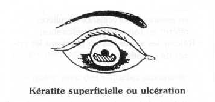

- Il faut examiner soigneusement l'oeil avec une lumière douce et latérale, en procédant avec douceur.
- Vous voyez un **cercle périkératique** complet ou localisé :

<!-- -->

- la cornée a perdu sa transparence,
- la pupille est noire et ronde.

<!-- -->

- Regarder les paupières : elles s'ouvrent et se ferment totalement.
- Retourner la paupière supérieure à la recherche :

<!-- -->

- d'un corps étranger sous palpébral, l'enlever doucement avec le doigt en le faisant glisser vers la marge ciliaire,
- de signes de trachome.

**2. Conduite à tenir**

- Prescrire un antibiotique local (collyre ou pommade) quatre fois par jour.

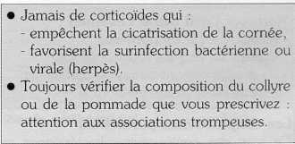

- **Mettre un pansement oculaire**

<!-- -->

- But du pansement : maintenir les paupières fermées.
- Danger du pansement : le pansement frotte sur la cornée et aggrave les lésions. Chez l'enfant, il doit être laissé le moins longtemps possible, entravant le passage de lumière, il peut être source d'amblyopie séquellaire (baisse de vision).

<!-- -->

- **Comment fabriquer un pansement** **oculaire :**

<!-- -->

- rondelle oculaire : tailler une rondelle de coton de six centimètres de diamètre et la placer entre deux rondelles de gaze de même diamètre,

- ou utiliser une compresse pliée en deux recouverte par une compresse carrée (6 cm de côté).

<!-- -->

- **Comment placer le pansement sur l'oeil :**

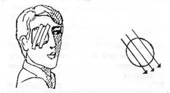

- demander au malade de fermer les deux yeux,
- placer la rondelle (ou la compresse pliée) sur l'oeil,
- mettre les sparadraps,
- demander au malade d'ouvrir les yeux **l'oeil sous le pansement doit rester** **fermé.** Dans le cas contraire, recommencer depuis le début.

<!-- -->

- **Vous devez revoir le malade**

En l'absence d'amélioration **au bout de 48** **heures,** référer au spécialiste. En cas d'amélioration, enlever le pansement dès que le malade ne souffre plus. Poursuivre le traitement local jusqu'à ce que l'oeil soit redevenu blanc.

**3. Autres cas**

- Le cercle périkératique, souvent brunâtre, s'accompagne de petites taches blanches Iambiques : ce sont les grains de trantas de la Limbo Conjonctivite Endémique Tropicale (LCET).

Il s'agit d'une conjonctivite " allergique "

- rechercher un trachome chez le malade et dans sa famille,
- la pommade auréomycine 1 % sera prescrite matin et so , ir pendant un mois,
- en l'absence d'amélioration ou en cas d'altération de la vision, il faudra référer le malade au spécialiste.

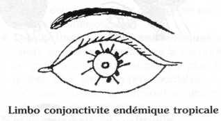

- Le **ptérygion inflammatoire :** c'est une prolifération conjonctivale qui, de l'angle interne de l'oeil, se dirige vers le limbe. Transférer au spécialiste si :

- l'acuité visuelle diminue,

- le traitement par antibiotique est inefficace.

- **Des cils frottent sur la cornée : il** **s'agit d'un trachome (trichiasis) :**

- procéder comme il a été indiqué au paragraphe " conjonctivites ",

- référer le malade au spécialiste pour **traitement chirurgical du trichiasis : prévenir le malade qu'il est en danger de** **devenir aveugle en l'absence de ce** **traitement,**

- ne jamais poser de pansements qui augmenterait la pression des cils sur la cornée.

- La paupière ne se ferme pas totalement, on parle de **Iagophtalmie soit par paralysie. faciale, soit par ectropion post-traumatique :**

- ne jamais mettre de pansement oculaire qui frottera directement sur la cornée,

- fabriquer une coque et la fixer.

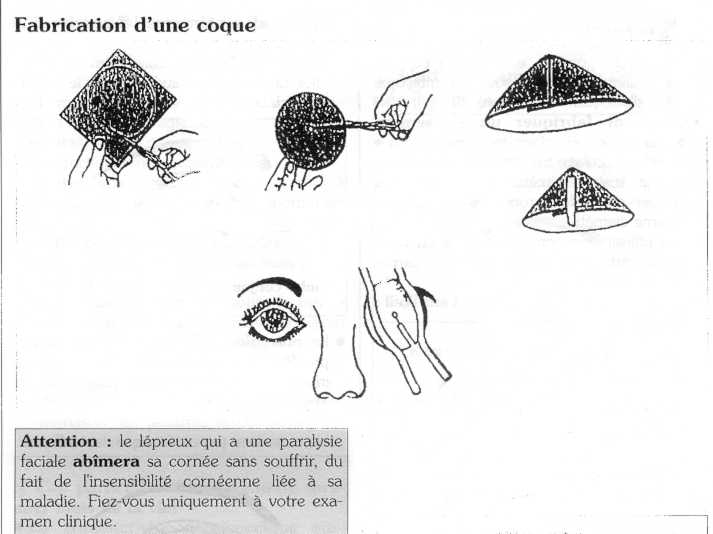

- Chez l'enfant de zéro à six ans, penser à une avitaminose A, surtout s'il est malnutri, s'il a la rougeole,

- prescrire une antibiothérapie locale,

- éviter le pansement (1 1 enfant ferme spontanément l'oeil s'il souffre),

- prescrire vitamine A :

200000 Ul aux jours J1, J2, J15,

1/2 capsule, de six mois à un an (ou poids inférieur à 8 kg),

1 capsule au-delà de un an (ou poids supérieur à 8 kg),

- traiter la maladie générale.

**4. Les cas où vous devez référer** **rapidement**

- **La pupille n'est pas visible :** l'atteinte cornéenne est profonde : traitement antibiotique, pansement oculaire, référer au spécialiste.

- **La pupille est en myosis ou irrégulière**

- le malade se plaint parfois de douleurs péri-orbitaires ou de céphalées,

- le cercle périkératique est très prononce,

- la cornée peut être normale,

- l'iris peut être masqué par un " niveau " blanc : c'est un hypopion (pus),

**il s'agit d'une uvéite :** référer au spécialiste.

- **La pupille est en mydriase**

- la douleur est très intense et s'accompagne parfois de vomissements,

- la vision est abaissée,

- le cercle périkératique est violacé,

- la cornée est trouble, la pupille peut être blanche,

**il s'agit d'une hypertonie (glaucome** **aigu) :** référer le plus vite possible au spécialiste. Si vous avez du Diamox, donner 1 cp 3 fois par jour.

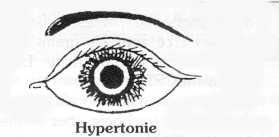

**III. Conclusion**

Devant tout oeil rouge :

**1. Vous devez toujours rechercher les critères de gravité**

**2. Vous pouvez traiter les atteintes superficielles de la cornée**

Mais rappelez-vous que :

- une atteinte de la cornée met en jeu le pronostic visuel ;

- une atteinte cornéenne qui ne guérit pas après 48 heures de traitement correct doit être référée ;

- les sécrétions sont le signe d'une infection, elles sont très contagieuses ;

- une conjonctivite peut compliquer une atteinte plus profonde ;

- en pays d'endémie trachomateuse, le trachome doit être recherché devant toute conjonctivite purulente chez le malade et sa famille ;

- en pays sahélien, l'avitaminose A doit être suspectée chez tous les enfants de 0 à 6 ans. La rougeole et la malnutrition augmentent le risque d'atteinte cornéenne ;

- vous ne devez utiliser que des collyres ou des pommades antibiotiques.

- **Les cyclines sont les antibiotiques de** **choix** car elles sont actives sur le trachome, le gonocoque et les germes les plus fréquents. Elles sont d'un prix abordable.

- Vérifier toujours la composition des produits que vous prescrivez.

**N'utilisez jamais de corticoïde.**

- Le pansement est une prescription médicale :

- il doit être correctement mis,

- il doit être propre,

- il doit être surveillé.

Les paupières sont le pansement idéal.

**Jamais de pansement chez l'enfant sans** **avis du spécialiste.**

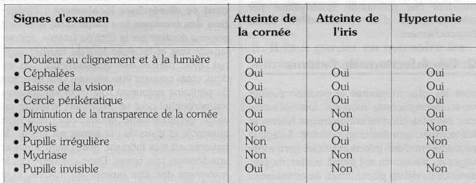

<table>

<tbody>

<tr>

<td valign="top">Les signes du trachome

Le trachome commence dans l'enfance. Il est alors caractérisé par une inflammation chronique de la conjonctive tarsale supérieure avec envahissement de la cornée par un voile vasculaire. Au cours de la phase inflammatoire, les signes fonctionnels sont discrets : gêne oculaire, picotements, sensation de sable dans les yeux. Dans les cas sévères, on note un larmoiement et une photophobie.

Le mal progresse au fil des ans : les infections répétées causent des lésions cicatricielles à l'intérieur de la paupière. Les cils palpébraux finissent par rentrer vers l'intérieur, frottent sur la cornée sur le devant de l'oeil. La cornée subit des lésions cicatricielles.

<em>Les lésions entraînent avec les années une</em> <em>grave perte de la vision d'où la nécessité de</em> <em>traiter dès la première infection à l'aide de pommade antibiotique.</em>

</td>

</tr>

</tbody>

</table>

*Développement et Santé, n°157, février 2002*
