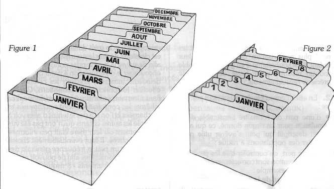
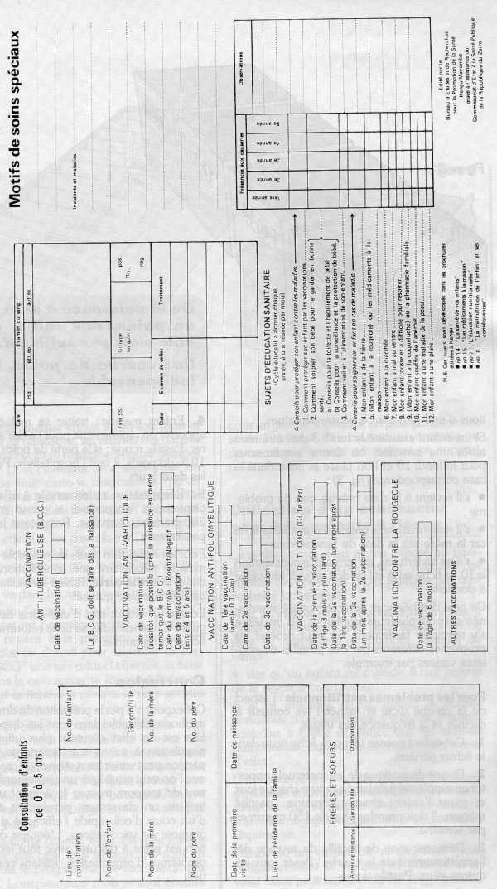

**Il** **existe dans chaque pays des** **directives qui concernent en** **général:**

*   **le matériel administratif** (fiches de surveillance, registre de vaccination, ... ) ;

*   **les règles** de prescriptions des médicaments ou des régimes appropriés aux situations nutritionnelles difficiles;

*   **les vaccinations** et l'utilisation de **vitamines.**

*   Ces directives sont d'une grande utilité, mais ne doivent pas empêcher les différents travailleurs de la santé de faire la démarche qui consiste à :

*   identifier les problèmes de santé des enfants de moins de cinq ans en individualisant les populations "à risque";

*   faire le bilan des capacités locales pour répondre à ces problèmes;

*   organiser des programmes visant toute la population ou tel groupe à risque;

*   évaluer les résultats de ces programmes.

**Partout, la tenue d'un fichier** **est rendue nécessaire**

par l'importance et la variété des informations que l'on doit gérer. En effet, il faut que le fichier permette:

**1.** D'avoir pour **chaque enfant** un **document** d'information permettant un suivi:

*   de la courbe de poids avec mention parallèle des régimes conseillés et entrepris;

*   des vaccinations;

*   des thérapeutiques entreprises:

- préventives: vitamines, fer, chloroquine,

- curatives: traitement d'une diarrhée, d'une fièvre;

*   des grandes maladies qui retentissent sévèrement sur l'état général: rougeole, parasitoses, etc.

Dans pratiquement tous les pays, il existe une fiche (_nous_ _donnons ci-joint la fiche kilo du Zaïre_), Cette fiche fournit un dossier simple, permettant de contrôler d'un coup d'oeil la situation de santé d'un enfant et éviter à celui-ci de n'être soigné que par à-coup à l'occasion d'une maladie. On peut avec cette fiche favoriser une croissance harmonieuse en tenant compte de tous les facteurs de santé et non pas seulement chercher à prévenir la malnutrition.

On peut reconnaître tôt les enfants en danger et influencer la santé de la famille dans son ensemble par l'espacement des naissances. Cette fiche restant en général en possession des parents entre chaque consultation, ce qui les rend plus responsables de la santé de leur enfant, il est souhaitable d'en garder un double (ou un résumé) pour éviter de perdre de précieux renseignements.

**2.** En effet, l'ensemble des fiches peut permettre :

*   d'une part de connaître l'ensemble de la population pour un risque donné, ce qui a un intérêt descriptif qui peut s'avérer utile pour délimiter des populations à risque;

*   d'autre part, de contrôler que les programmes de prévention sont correctement réalisés et efficaces, par exemple:

- **évaluation de la couverture vaccinale** qui est donnée par le pourcentage d'enfants suivis ayant reçu le vaccin polio une fois, deux fois, ou trois fois avant l'âge d'un an;

- évaluation de l'état nutritionnel des enfants de deux ans après une campagne prolongée en faveur de l'utilisation de bouillies enrichies.

**3.** En dernier lieu, le fichier peut parfaitement être utilisé pour suivre de façon rapprochée les enfants à risque.

## **Délimitation du champ d'action de la consultation**

Il n'y a pas de fichier modèle qui puisse s'appliquer à toutes les consultations. Un fichier doit être conçu en fonction:

**de la fréquence** des consultations que l'on pense pouvoir assurer (cette fréquence est elle-même fonction de la population, de l'importance du personnel formé et des locaux dont on dispose);

**du mode de recrutement** de la consultation : soit on attend que les enfants soient amenés spontanément par les mères et l'on se transforme vite en consultation de soins, soit on exige un suivi régulier selon un schéma préalable, mais il faut éventuellement se donner les moyens d'aller chercher à domicile les enfants qui ne se sont pas présentés à la consultation et prévoir du temps pour ce type d'activité;

**des objectifs** que se fixe l'équipe: par exemple pour le suivi de la première année, il est classique de voir le nourrisson chaque mois afin de suivre la bonne prise pondérale au sein, encourager la diversification à partir de la fin du deuxième trimestre, prévenir les carences et effectuer les principales vaccinations. Cependant si certains enfants suivent parfaitement ce schéma, les consultations sont nombreuses et surchargées et l'on n'a pas le temps d'aller voir à domicile les autres enfants qui n'ont pas été vus régulièrement car leur mère était peu informée ou peu motivée. Il faut éventuellement choisir de diminuer un peu la fréquence générale des consultations conseillées afin de pouvoir mieux se consacrer aux enfants. " à risques ".

*   ## **Utilisation d'un "fichier programme "**

Il en existe plusieurs types mais en règle générale, leur principe est assez simple: il consiste à suivre le cheminement de l'enfant en faisant bouger sa fiche d'une case à une autre.

Faisons l'hypothèse suivante: une équipe a choisi de voir les nourrissons au moins huit fois dans la première année, en précisant pour chaque consultation des objectifs principaux et des objectifs annexes:

**1.** **Consultation du premier mois:**

-Pesée / causerie sur l'allaitement maternel / BCG.

Examen.

**2. Consultation du troisième mois:**

-Pesée, examen.

Première injection de DT Coq et vaccination contre la polio.

S'assurer que le chemin de la santé est bien compris.

**3. Consultation du quatrième mois:**

-Pesée, examen.

Deuxième injection DT Coq et deuxième vaccin polio.

**4. ......................................................................................**

**5. ......................................................................................**

**6.** **......................................................................................**

**7. ......................................................................................**

**8. ......................................................................................**

Si l'on classe chaque enfant selon son mois et son année de naissance, les enfants nés dans la même année vont se répartir en douze grandes cases (_fig. 1_). A l'intérieur de chaque case, on dispose de huit cartons intercalaires _(fig. 2)_ pour prévoir les huit consultations de la première année. Si un enfant est inscrit à l'âge de huit jours à la consultation: une fois sa fiche faite, l'examen effectué, les conseils sur l'allaitement maternel donnés et le BCG fait, on donne un rendez-vous à la mère pour la deuxième visite si aucune surveillance rapprochée n'est à prévoir et la fiche va dans la case de la deuxième visite.

Si par contre l'enfant ne peut recevoir le BCG immédiatement pour une raison quelconque, sa fiche restera à la première case et un rendez-vous est donné pour effectuer rapidement le BCG; une fois celui-ci effectué, la fiche passe dans la case suivante (on peut écrire au crayon sur la fiche des parents la date prévue pour la prochaine visite).

De mois en mois, les fiches des enfants vont passer les cartons intercalaires, comme un groupe de sportifs franchissent les haies d'une course à pied. Si une fiche reste en arrière, on la repère tout de suite et l'on peut prévoir une visite à domicile pour savoir pourquoi l'enfant n'est pas venu et encourager la mère à rattraper le temps perdu.

Ainsi, à la fin de chaque mois, on peut faire le bilan case par case, des enfants qui sont en retard dans le programme de vaccination par exemple. Lorsque douze mois se sont écoulés

pour un groupe d'enfants, on peut pareillement se rendre compte de la couverture vaccinale, ou du nombre d'enfants nécessitant un support nutritionnel.

## **Utilisation d'un échéancier pour les " enfants à risque "**

Le système que nous avons exposé au paragraphe précédent concerne la majorité des enfants bien portants, pour lesquels une surveillance lâche suffit.

Mais à l'intérieur de la population générale, il existe des sous-groupes pour lesquels on ne peut se satisfaire d'un nombre restreint de visites:

*   dès qu'un enfant est malade, il faut prévoir de le revoir à court terme;

*   à un moindre degré, quand la courbe pondérale d'un nourrisson s'infléchit, il faudra contrôler à brève échéance que les conseils nutritionnels donnés à la mère sont suivis d'effet.

C'est pourquoi il est utile de sortir du fichier général les enfants présentant certains " critères de risque " pour s'assurer de ne pas les oublier si leur mère néglige de les présentera nouveau au dispensaire.

Mieux qu'un carnet de rendez-vous (sans obligatoirement le remplacer) une boîte de vingt cases peut représenter les vingt consultations d'une période de quatre semaines.

Si un enfant examiné le lundi 3 doit être revu après une semaine, on donne rendez-vous pour le lundi 10 et l'on place la fiche dans la case correspondante _(fig. 3):_

*   s'il revient à la date prévue, pas de problème;

*   s'il revient avant la date, on retrouve la fiche car la mère sait la date du rendez-vous;

*   s'il ne revient pas, en fermant la consultation le 10, sa fiche est là et l'on doit prévoir une visite à domicile.

Ce type d'échéancier peut être utilisé simultanément pour plusieurs problèmes. Si l'on désire s'y retrouver facilement, on peut repérer les problèmes différents par des pastilles de couleurs variées par exemple.

**Pour les problèmes nutritionnels:** l'aspect de la courbe dicte en général les conseils à donner et la fréquence des visites.

**1.** Cet enfant pousse bien: sa fiche reste dans le fichier général.

**2.** Risque de manque de lait maternel; apporter un supplément de lait de chèvre chaque jour et peser l'enfant chaque semaine: pastille marron. Il doit prendre plus de 150 grammes par semaine.

**3.** Démonstration de bouillie de sevrage dès l'aplatissement de la courbe. Peser tous les quinze jours. Pastille jaune.

**4.** Enfant malade : traiter sa maladie et lui apporter un régime riche pour l'aider à récupérer. Pastille rouge: si la perte de poids dépasse 10 % du poids, il faut l'hospitaliser. Peser tous les deux jours.

**5.** Récupération nutritionnelle à effectuer au dispensaire. Hospitaliser si prend moins de 200 grammes/semaine. Peser tous les jours: pastille rose.

Pour les enfants en cours de rougeole ou autre maladie nécessitant une consultation rapprochée : **pastille verte.** Revoir au moins une fois dans la semaine qui suit.

Lorsqu'un enfant sort d'une zone de danger, guérit d'une maladie, sa fiche retourne dans le fichier-programme.

### **Conclusion**

Cet exposé n'a pas la prétention de donner une méthode utilisable dans tous les dispensaires. Elle est en effet d'autant plus utile que la population à suivre est importante. D'autre part, on peut varier les systèmes de cases, selon que l'on veut privilégier un classement permettant de toujours trouver facilement une fiche (ici) ou un classement permettant d'évaluer d'un coup d'oeil rapide l'efficacité d'un programme de vaccinations. L'équipe de rédaction est prête à discuter avec tout lecteur des problèmes d'organisation utilisant ces méthodes.

_Développement et Santé, n°43, février 1983_