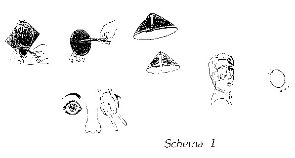
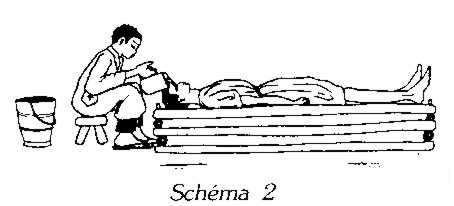
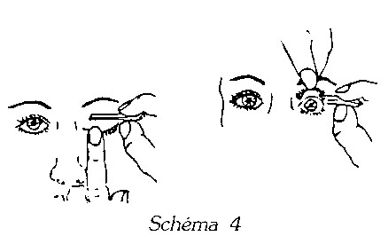

**Orientation diagnostique et conduite à tenir devant**

**Un traumatisme oculaire récent**

**par Marie-Thérèse Banos***

* Ophtalmologiste, Programme National de Lutte contre la Cécité, Niamey, Niger.

Cet article s'adresse plus particulièrement aux personnels non spécialisés des formations sanitaires des pays en développement. La connaissance des cours précédents est nécessaire à la bonne compréhension du texte.

Les traumatismes oculaires restent la principale cause de cécité monoculaire malgré les progrès intervenus dans les traitements.

La gravité augmente avec l'âge du traumatisé chez l'enfant, la survenue d'une amblyopie (perte de la vision) est la préoccupation constante malgré une réparation anatomique et esthétique satisfaisante, et ce, d'autant plus que l'enfant est plus jeune.

Dans les pays en développement, la gravité s'accroît du fait de la méconnaissance des populations et des personnels sanitaires non spécialisés, de l'éloignement des formations sanitaires, de l'équipement incomplet des services de spécialité.

Devant tout traumatisme oculaire, il est nécessaire de respecter les principes suivants

**1. Tout traumatisme oculaire, même minime, doit être considéré comme potentiellement grave**

**-** l'infection est la complication majeure des plaies oculaires, des brûlures et des atteintes cornéennes, même superficielles,

- les traumatismes graves peuvent être minimisés à tort : la douleur et la baisse d'acuité visuelle peuvent faire défaut,

- la notion de traumatisme oculaire doit être constamment présente à l'esprit, en particulier chez les enfants car le traumatisme est souvent inavoué par les enfants et leurs parents. Le retard diagnostique aggrave le pronostic anatomique et fonctionnel,

- la description de l'agent causal est primordiale, nous le verrons dans l'orientation diagnostique et la conduite à tenir.

**2. Il faut éviter d'aggraver les lésions existantes**

**-** l'examen d'un oeil suspect de traumatisme doit se faire avec douceur : l'ouverture des paupières ne doit jamais être obtenue

par la force. Rassurer le malade et expliquer ses gestes suffisent le plus souvent à obtenir sa coopération. En cas d'impossibilité, mieux vaut référer,

- les efforts de toux, le hoquet, les vomissements, les clignements palpébraux, les transports chaotiques aggraveront les lésions. Ces éléments doivent être pris en compte avant d'envisager une évacuation.

**3. Il faut connaître les gestes qui font gagner de précieuses minutes**

Savoir et pouvoir :

- faire rapidement un lavage oculaire,

- faire un pansement oculaire, - prévenir l'infection,

- organiser une évacuation vers un centre spécialisé.

Ainsi, un traumatisme oculaire récent est une _urgence_ fonctionnelle. Mais attention, un traumatisme oculaire _n'engage jamais le pronostic vital_ du malade. Il n'est jamais responsable d'hémorragie interne ou de coma. En cas de traumatismes associés (accident de la circulation, blessures multiples...), le diagnostic d'atteinte oculaire ne doit jamais retarder la prise en charge générale du malade (réanimation, chirurgie abdominale, artérielle...).

La demande comporte deux étapes

- reconnaître une urgence : une plaie du globe, ou une projection de produit caustique,

- ensuite rechercher des signes de contusion oculaire et un corps étranger.

**I. Peut-il y avoir une plaie du globe ?**

**1. C'est une urgence,** l'oeil est _" ouvert " et_ exposé à :

- l'aggravation des lésions par l'examen, l'ouverture des paupières, la toux, les pleurs...

- l'infection...

Il faut envisager une bonne évacuation vers le centre spécialisé le plus proche pour une chirurgie sous anesthésie générale. Les délais d'intervention sont idéalement de six heures.

Sont susceptibles d'entraîner une plaie oculaire (on parle aussi de traumatisme perforant) :

- les agents piquants : aiguilles, fourchettes, épines d'arbre, ciseaux, flèches,

- les agents coupants : couteaux, machettes, bois, pare-brise, verres de lunettes, éclats de pierre...,

- les projectiles : armes à feu (fusils de chasse, armes de défense ou de guerre ...), pierres, éclatement d'une bouteille contenant un liquide sous pression,

- les écrasements par poing, crampons...

Plus l'agent est pointu (aiguille, épine), plus le traumatisme risque de passer inaperçu, plus l'agent est large ou projeté avec force, plus les dégâts sont importants (éclatement du globe).

Le danger est maximal quand existe la possibilité de corps étranger intraoculaire :

- végétal (bois, épines...) : risque septique bactérien et mycosique,

- métallique (l'ouvrier qui tape sur une pierre avec un burin métallique), outils souillés par de la terre (risque septique par anaérobies et risque de tétanos).

*   **Ce qu'apporte l'examen :**

Il doit toujours être doux et rassurant. Ne jamais appuyer sur le globe ou les paupières. Si l'examen est impossible, les circonstances de l'accident suffisent à référer le malade vers le centre spécialisé le plus proche, en prenant les mesures indiquées ci-dessous.

Le diagnostic est parfois facile :

- le malade n'y voit plus,

- vous ne reconnaissez pas les structures de l'oeil normal (oedème conjonctival, sang...),

- la plaie est visible avec des " débris " noirâtres (iris, corps ciliaire, choroïde).

Le diagnostic est souvent plus difficile :

- la douleur est absente et l'acuité visuelle peut _être_ normale,

- mais une hémorragie sous conjonctivale doit faire craindre une plaie sclérale sous-jacente,

- il faut rechercher : un aplatissement de la chambre antérieure (distance cornée iris), une déformation de la pupille.

Attention : la présence d'une petite formation noire sur l'iris ne doit pas être prise pour un corps étranger, c'est l'iris qui fait hernie par une petite plaie cornéenne.

Ces signes sont le témoin d'une perforation. Les possibilités de récupération dépendent de vous.

**2. Conduite à tenir :**

• Ce qu'il ne faut pas faire :

- essayer " d'enlever" le corps étranger

- instiller un collyre ou mettre de la pommade

• Ce qu'il faut faire : (schéma 1)

- rassurer le patient et la famille

- ne rien mettre dans l'oeil

- mettre un pansement non serré (rondelle oculaire ou coque)

- préparer le transport vers le centre spécialisé le plus proche :

- prévenir le centre

- maintenir le malade à jeun

- la position couchée n'est pas obligatoire - le transport doit se faire à vitesse constante, en évitant les cahots

- donner au malade une fiche indiquant les lésions constatées et les soins reçus.

**II. Y a-t-il eu projection de produits caustiques ?**

1. La notion de projection de liquide caustique, de quelque nature que ce soit, impose un geste immédiat : le lavage abondant et prolongé (10 à 15 minutes) à l'eau propre :

- c'est la seule façon de diluer le toxique : ne jamais utiliser de neutralisant,

- ne pas perdre de temps à faire bouillir et refroidir de l'eau : de l'eau propre suffit, dans une pissette ou une tasse propre,

- rassurer le malade et le prévenir : les brûlures oculaires sont toujours douloureuses,

- allonger le malade et procéder oeil par oeil,

- irriguer du nez vers la tempe,

- commencer par le cul de sac inférieur en demandant au malade de regarder vers le haut,

- poursuivre par le cul de sac supérieur en demandant au malade de regarder vers le bas : retourner la paupière pour bien rincer la conjonctive tarsale (schéma 2).

2. Interroger alors le malade sur la nature du produit liquide :

- les acides, antirouilles, décapants, acide chlorhydrique (eau de Javel) ne diffusent pas. Les lésions sont constituées d'emblée,

- les bases, soude caustique, déboucheurs, ammoniaque, potasse, chaux, ciment diffusent en surface et profondeur plusieurs jours après l'accident,

- la concentration du produit en augmente la toxicité, d'où l'intérêt du lavage immédiat, sur les lieux mêmes de l'accident,

- les solvants (alcool, acétone, éther, formol) et les détergents sont moins dangereux,

- les liquides chauds (eau ou huile bouillantes) se refroidissent rapidement. Dans tous les cas le lavage oculaire réduit les conséquences,

- le venin du serpent cracheur n'est théoriquement pas toxique. Un bon lavage à l'eau est néanmoins indiqué.

_3. Les brûlures thermiques_ sont moins dangereuses pour l'oeil, les paupières servant de protection. Mais les brûlures conjonctivales induites peuvent être responsables de complications secondaires (symblépharon, ectropion ou entropion cicatriciels) imposant un bilan spécialisé.

Les brûlures par radiations (ultraviolets des soudeurs à l'arc, du désert, des rampes de stérilisation) surviennent 6 à 10 heures après l'exposition. Très spectaculaires, elles sont sans gravité guérissant en quelques jours sans séquelles.

_4. L'examen recherche des signes de gravité:_

_-_ présence de corps étrangers non mobilisables par le lavage,

- une ischémie conjonctivale qui se traduit par des îlots blanchâtres avasculaires,

- une cornée blanche est le témoin d'une atteinte cornéenne profonde.

5. Ce qu'il faut faire :

*   Il existe des signes de gravité :

- instiller un collyre antibiotique (de préférence à une pommade),

- mettre un pansement ou une coque,

- prévenir l'infection : Pénicilline G intramusculaire et sérovaccination antitétanique,

- préparer une évacuation vers un centre spécialisé sous antalgiques généraux.

• Il n'existe pas de signes de gravité

- collyre ou pommade antibiotique

- mettre un pansement ou une coque

- revoir le malade le lendemain :

- le malade ne souffre plus, ouvre spontanément son oeil : poursuivre le traitement local, quatre fois par jour sans pansement pendant cinq jours,

- le malade souffre : préparer une évacuation comme ci-dessus.

Vous avez éliminé une plaie et une brûlure, vous devez rechercher:

- des signes de contusion oculaire,

- un corps étranger cornéen ou conjonctival.

**III. S'agit il d'une contusion oculaire?**

**1. Une contusion oculaire peut être provoquée par un choc**

- sur l'oeil ouvert ou à travers les paupières : balles de tennis, ballon, pierre, coup de poing...

- sur le visage ou la tête : chicotte, gifle, coup divers. L'oeil est très sensible aux ébranlements, en particulier chez les enfants.

**2. Les signes fonctionnels peuvent être importants**

**-** malaise avec bradycardie par réflexe oculo-cardiaque,

- douleurs, altération de la vision.

Ces signes traduisent la violence du choc et doivent faire craindre des lésions "internes " du globe oculaire. Un bilan spécialisé s'impose.

**3. L'examen doit toujours rechercher**

- une déformation pupillaire ou une mydriase,

- une absence du réflexe photo moteur,

- la présence de sang dans la chambre antérieure ou hyphéma,

- une lésion cornéenne.

**4. Conduite à tenir**

- éviter la survenue où la récidive d'une hémorragie intraoculaire, toujours possible dans les vingt-quatre heures,

- contacter le spécialiste si possible et décrire les lésions,

- donner des antalgiques par voie générale en évitant l'Aspirine qui peut favoriser le saignement,

- calmer la toux et les vomissements si besoin,

- laisser le malade au repos en position assise,

- faire boire abondamment,

- pommade antibiotique local, pansement ou coque.

Le lendemain :

• En l'absence d'amélioration, organiser le transfert en milieu spécialisé :

- transport en position assise,

- à vitesse constante, en évitant les cahots,

- ne pas oublier le dossier contenant la description des lésions initiales et les soins reçus.

• Si l'état du malade s'améliore, il est néanmoins conseillé d'envisager un bilan ophtalmologique au huitième jour, des complications secondaires étant toujours possibles (cataracte, glaucome, décollement de rétine).

**IV. Existe-t-il un corps étranger superficiel, conjonctival ou cornéen?**

1. L'interrogatoire ne retrouve pas les circonstances précédentes mais le malade signale avoir reçu "quelque chose dans l'oeil ". Il est photophobe, larmoyant. Les douleurs sont augmentées par le clignement des paupières. Certaines circonstances sont évocatrices : soudure à l'arc, battage du riz, circulation à moto...

2. L'examen note l'absence des signes déjà décrits et objective un corps étranger (CE) sur la cornée : blanc ou noir.

• Si le CE est rond et noir : éliminer une plaie oculaire (cf. plus haut) par l'interrogatoire, vérifier l'absence de déformation pupillaire. Ne jamais toucher la cornée en l'absence d'anesthésique local (Novésine) (schéma 3).

Vous avez de la Novésine :(schéma 3)

- attendre cinq minutes après l'instillation de deux gouttes,

- utiliser un instrument mousse, tangentiellement au globe oculaire,

- pousser doucement le CE vers la conjonctive.

Vous n'avez pas de Novésine :

- essayer de mobiliser le CE au travers des paupières vers la conjonctive.

3. Vous ne trouvez rien sur la cornée : pensez à retourner la paupière supérieure à la recherche d'un _corps étranger conjonctival._ Dégagez le CE à l'aide d'un objet mousse, toujours tangentiellement comme indiqué sur le schéma 4.

4. Vous avez pu enlever le CE cornéen ou conjonctival :

Dans les deux cas, mettre une pommade antibiotique et un pansement ou une coque, revoir le malade le lendemain.

Il ne souffre plus : poursuivre l'antibiothérapie locale quatre fois par jour pendant cinq jours, sans pansement ; il souffre : référer au centre spécialisé.

5. Vous n'avez pas pu enlever le CE :

- mettre une pommade antibiotique et un pansement ou une coque,

- référer le plus tôt possible vers le centre spécialisé.

**V. Cas particuliers**

1. Il existe une plaie palpébrale :

- ne pas oublier d'examiner le globe oculaire à la recherche d'une plaie oculaire (cf. plus haut),

- si la plaie intéresse l'angle interne, le canal lacrymal est probablement sectionné. En l'absence de suture par un spécialiste, il persistera un larmoiement définitif,

- si la plaie intéresse le bord libre, confier la suture à un spécialiste,

- ne pas oublier que la dynamique palpébrale conditionne l'intégrité cornéenne : toute plaie expose à un ectropion cicatriciel avec risque de kératite d'exposition. Les sutures doivent toujours être soigneuses et faites par un chirurgien, la prévention antitétanique est la même que pour toute plaie.

**VI. Cas d'un traumatisme oculaire vu à distance**

La démarche diagnostique est la même que précédemment.

_1. La chambre antérieure est blanche, le_ malade souffre, y voit mal : il s'agit d'une infection grave du globe oculaire _ou panophtalmie._ Faire une antibiothérapie générale (Pénicilline, sérovaccination antitétanique), évacuer très rapidement le malade vers un centre spécialisé.

_2. La chambre antérieure est rouge, le_ malade souffre et y voit mal : il s'agit d'un hyphéma, se reporter au chapitre " contusion oculaire ".

_3. Le malade souffre ou signale une baisse d'acuité visuelle,_ rechercher un corps étranger cornéen ou conjonctival (cf. paragraphe IV). Si vous ne trouvez pas le CE, référer vers le centre spécialisé.

**VII. Conclusion**

Les traumatismes oculaires mettent toujours en jeu le pronostic fonctionnel de l'oeil. Le pronostic dépend de la rapidité de la mise en oeuvre des premiers soins : une bonne démarche diagnostique, la connaissance de gestes simples, une évacuation bien menée sont de précieux atouts.

Cependant, malgré l'amélioration des traitements, les résultats fonctionnels restent mauvais, en particulier chez l'enfant en raison du risque d'amblyopie post-traumatique.

La prévention est donc essentielle. Le dernier rapport de l'OMS insiste sur la nécessité de développer des actions urgentes dans les domaines suivants :

- création d'un environnement moins dangereux,

- éducation de la population (meilleure surveillance des activités des enfants par les parents, les instituteurs..., possibilité de faire un lavage oculaire correct sur les lieux mêmes de l'accident...),

- législation dans le domaine des accidents du travail, du port de la ceinture de sécurité, de la fabrication de jouets dangereux...

- traitement immédiat des blessures oculaires (diagnostic précoce, accès facile aux soins oculaires primaires, système d'évacuation vers les centres spécialisés).