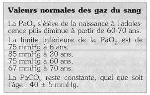
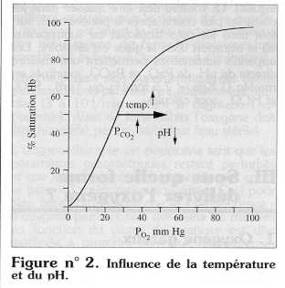
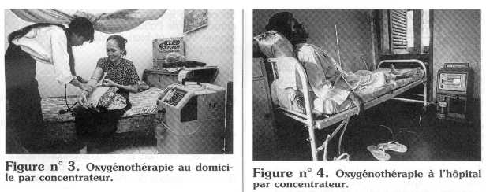

Après un rappel physiologique sur le transport et la mesure de l'oxygène dans le sang qui intéresse plus particulièrement les médecins, nous traitons, dans cet article, des moyens d'approvisionnement en oxygène et des indications. Ces informations aideront nos lecteurs à s'équiper et à utiliser au mieux l'oxygénothérapie, surtout en situation d'urgence.

## I. Transfert des gaz

Les gaz respiratoires, oxygène et gaz carbonique, sont véhiculés par le sang depuis le capillaire pulmonaire jusqu'au capillaire périphérique. L'oxygène est transporté dans le plasma sous forme dissoute (1 %) ou combinée à l'hémoglobine (99 %). L'oxygénation du sang et par voie de conséquence des tissus est donc sous la dépendance de 2 facteurs : la pression partielle de gaz (forme dissoute), des propriétés de combinaison à l'hémoglobine.

Bien que faible en pourcentage, la forme dissoute n'en demeure pas moins importante car c'est la pression qui détermine les échanges gazeux. Il existe une relation entre oxygène dissous (PaO2 mesurée en mm de mercure ou Kpa) et oxygène combiné (pourcentage d'oxygène réellement fixé sur l'hémoglobine défini par la saturation : SaO2), représentée par la classique courbe de dissociation de l'hémoglobine (*figure n° 1*). Certains points de la courbe doivent être mémorisés par le clinicien car ils permettent de guider la prescription d'oxygénothérapie. La tonne de la courbe n'est pas linéaire. Dans sa partie verticalisée, de petites variations de PaO2 entraînent de grandes variations de saturation, alors que dans la partie semi-horizontale des variations relativement importantes de PaO2 influent peu sur le contenu en oxygène (SaO2). À 40 mm de mercure la saturation est dé l'ordre de 75 % et à 60 mmhg la saturation est de l'ordre de 90 %. Au-dessus de 60 mmhg l'administration d'oxygène est généralement inutile. L'oxygénothérapie a pour but d'obtenir une saturation de l'ordre de 90 % et non de normaliser la PaO2. Celle-ci d'ailleurs varie avec l'âge *(encadré).* La température modifie la fixation de l'oxygène sur l'hémoglobine. Un malade ayant une fièvre à 40° aura une saturation moindre en oxygène pour la même PaO2 que s'il est apyrétique (déplacement de la courbe de dissociation vers la droite). Il en est de même pour un malade en acidose, alors que l'alcalose (et l'hypothermie) vont déplacer la courbe vers la gauche (*figure* *n° 2).*

Bien que beaucoup plus soluble que l'oxygène dans le sang, le CO2 est principalement transporté sous forme combinée (95 %). Cependant, comme pour l'oxygène, la fraction dissoute est la forme obligatoire que doit emprunter le CO2 lors des échanges avec le milieu extérieur. La majeure partie du CO2, combiné est plasmatique, par le biais du système tampon des bicarbonates (85 %) alors que le reste est combiné à l'hémoglobine.

## II. Gaz du sang artériel

Il est difficile d'adapter l'oxygénothérapie en l'absence de cette mesure sans risque d'aggraver la situation du malade. Le matériel de mesure des gaz du sang devrait faire partie intégrante du plateau technique de tout hôpital, dès que les moyens financiers le permettent. Cette remarque est valable pour les hôpitaux de province des pays en développement souvent démunis. Les oxymètres de pouls (saturomètre) d'un coût bien inférieur peuvent être une alternative transitoire mais n'indiquent que les valeurs de SaO2. L'examen ne doit pas non plus être tarifé trop cher compte tenu du revenu moyen par habitant dans certains pays, d'autant qu'il est souvent répétitif pour adapter le traitement. L'oxygène doit être considéré comme un médicament. Il se prescrit à une certaine posologie (débit en I/min) pour une certaine durée quotidienne. L'examen implique une technique correcte avec un matériel adapté (seringues jetables héparinées moins onéreuses que les capillaires héparinés montés sur aiguille). La mesure doit être réalisée dans les délais les plus courts après le prélèvement, surtout dans les pays tropicaux ou subtropicaux où le transport dans la glace est aléatoire. Les appareils automatisés permettent une mesure directe du pH, de PaO2 et PaCO2, exprimés en mmhg (1 Kpa = 7,5 mmHg ou Torr); SaO2 et HCO3- sont calculés.

## III. Sous quelle forme délivrer l'oxygène ?

### 1. Oxygène gazeux

Les grands hôpitaux disposent généralement d'une centrale à oxygène (grand container ou multiples bouteilles d'oxygène gazeux). Par un circuit mural avec inverseurs et réducteurs de pression, l'oxygène arrive au lit du malade. Mais on connaît bien des systèmes vétustes où les fuites peuvent atteindre 50 % ce qui représente un danger et un grand gaspillage au plan économique. En situation d'urgence on a souvent recours à cet oxygène gazeux, stocké sous pression dans des cylindres de taille variable. Les bouteilles sont lourdes, encombrantes, et doivent être souvent renouvelées. Ce système d'un coût élevé devrait être plutôt utilisé en réserve de secours.

### 2. Oxygène liquide

C'est une forme onéreuse qui n'a pas encore sa place dans les pays en développement. L'oxygène liquide peut être stocké en grande quantité à condition d'être maintenu dans des réservoirs spéciaux car il est alors très froid (- 183 °C). L'avantage est de pouvoir remplir de petits réservoirs qui ont une autonomie supérieure à celle des petites bouteilles d'oxygène gazeux et de pouvoir délivrer de forts débits. Dans les pays chauds, les échanges de température avec l'extérieur font que le produit s'évapore, occasionnant une perte d'oxygène.

### 3. L'extracteur d'oxygène (ou concentrateur)

Son principe est simple et consiste à séparer l'oxygène de l'azote de l'air pour laisser sortir un mélange gazeux enrichi en oxygène. La concentration en oxygène est alors voisine de 95 %.  
C'est un matériel peu cher, avec une source inépuisable mais qui a l'inconvénient d'être peu mobile, assez bruyant et tributaire d'un courant électrique aussi uniforme que possible. Initialement conçu dans les pays développés pour une oxygénothérapie de longue durée à domicile, ils peuvent suppléer à l'absence ou à l'insuffisance des circuits d'oxygène dans les structures hospitalières. Leur débit est souvent limité à 5 I/mn mais il est possible de brancher deux extracteurs en Y pour délivrer des débits supérieurs. Ils doivent être régulièrement entretenus (changement des filtres) avec contrôle de débit de sortie. Quelques aménagements peuvent être nécessaires pour éviter leur colonisation possible par des hôtes indésirables, insectes (blattes) ou rongeurs (souris)... Dans notre expérience vietnamienne il s'agit de la solution idéale, tant au domicile qu'à l'hôpital *(figures n° 3 et 4).*

## IV. Indications

Il convient de distinguer 2 situations totalement différentes : l'urgence et l'oxygénothérapie de longue durée.

### 1. Oxygénothérapie en situation d'urgence

Il s'agit d'administrer de l'oxygène chez un malade en insuffisance respiratoire aiguë, laquelle se définit sur des critères gazométriques : hypoxie (PaO2< 55 mmhg), avec ou sans hypercapnie (PaCO2 > 50 mmhg) révélée en situation aiguë. Les causes peuvent être multiples et les gaz du sang ne sont qu'un élément d'évaluation de gravité dans la démarche diagnostique. L'anamnèse, l'examen clinique, la radiographie thoracique, l'ECG et un bilan sanguin (numération, hématocrite) vont orienter le diagnostic : décompensation d'une bronchopathie chronique obstructive (BPCO), asthme (état de mal ou asthme aigu grave), oedème aigu du poumon, obstruction des voies aériennes supérieures, pneumopathie aiguë infectieuse, pneumothorax suffoquant, hémoptysie grave voire embolie pulmonaire. Il ne faut pas oublier qu'une dypsnée aiguë peut être révélatrice d'une anémie aiguë par hémorragie interne. Chaque diagnostic aura son traitement spécifique auquel sera associée l'oxygénothérapie comme principal traitement symptomatique. Plus la situation prend un caractère d'urgence, plus le traitement symptomatique (oxygénation voire ventilation) prime sur le diagnostic étiologique.

Le but du traitement est de combattre l'hypoxémie et de ramener la PaO2 à des valeurs supérieures ou égales à 60 mmHg et surtout la saturation à un taux supérieur à 90-92 %. Il convient cependant de différencier la maladie hypercapnique du patient normo ou hypocapnique. Dans le premier cas, il s'agit souvent d'une décompensation de BPCO avec hypercapnie de base. L'oxygène est à lui seul un traitement capital mais l'apport sera prudent : 1 à 2 I/min au départ. L'oxygène est administré plutôt par sonde nasale que par lunettes. Mais l'augmentation de PaO2 sous traitement s'accompagne souvent d'une majoration de la capnie d'où la nécessité des débits bas et de contrôler l'évolution gazométrique à intervalle rapproché (10 à 15 min pendant la phase aiguë). Si la PaO2 reste basse et s'il n'y a pas d'augmentation de la capnie, il faut alors augmenter progressivement le débit d'oxygène sachant qu'une élévation modérée (et transitoire) de capnie est acceptable et qu'il y a aussi des variations individuelles de tolérance à l'hypercapnie.

Dans l'asthme aigu grave, l'oxygène nasal est toujours indiqué et un débit de 3 à 4 I/min est suffisant quel que soit le niveau de la capnie. L'oxygène est aussi le gaz vecteur classique des nébulisations de broncho-dilatateurs qui constituent la base du traitement étiologique.

Chez le patient non hypercapnique des débits plus importants peuvent être administrés d'emblée (3 à 10 I/min suivant le degré de l'hypoxémie). Avec de forts débits l'oxygène doit être humidifié par un barboteur (eau stérile).

L'oxygénothérapie est poursuivie tant que les paramètres gazométriques restent perturbés et que le traitement étiologique n'a pas encore permis l'amélioration souhaitée. Ceci pour bien faire comprendre que le "saupoudrage", d'oxygène pendant une quinzaine de minutes en fonction du degré de cyanose est une méthode à proscrire bien que malheureusement utilisée dans certaines structures sous-équipées. Si l'on dispose de masque, l'oxygène sera mieux pris qu'avec une sonde.

### 2. Oxygénothérapie de longue durée

Par ordre de fréquence elle s'adresse avant tout aux insuffisants respiratoires chroniques par BPCO. Il existe d'autres indications plus rares : cyphoscoliose, fibrose interstitielle diffuse, maladies neuromusculaires, bronchectasies, mucoviscidose... La prescription d'oxygène est alors soumise à certaines règles : hypoxémie avec PaO2 < 55 mmhg ou PaO2 comprise entre 55 et 60 mmhg dans la mesure où elle est associée à d'autres signes (polyglobulie, coeur pulmonaire chronique, hypertension artérielle pulmonaire, désaturation < 90 % pendant au moins 30 % du temps de sommeil). Il faut dans ce dernier cas disposer d'un oxymètre de pouls avec un enregistrement. De plus l'hypoxie doit être confirmée par au moins 2 mesures successives réalisées à 3 semaines d'intervalle chez un malade stable en dehors de toute poussée aiguë. Le débit doit être approprié, généralement bas pour les BPCO (1 à 2 I/mn) et l'oxygène doit être administré de façon suffisante, pas moins de 15 h/jour. Afin de limiter la dépendance à l'oxygène pour les actes de la vie courante compte tenu de la désaturation nocturne plus prononcée, l'oxygène sera pris majoritairement pendant la nuit puis réparti dans la journée par périodes non inférieures à 2 heures.

Le concentrateur d'oxygène reste le matériel idéal et le moins onéreux. L'oxygénothérapie de longue durée bien conduite augmente l'espérance de vie, la tolérance à l'effort physique, améliore les fonctions psycho-intellectuelles, diminue la polyglobulie, l'hypertension artérielle pulmonaire et les signes cardiaques droits.

Même dans les pays en développement l'oxygénothérapie de longue durée peut être mise en place au domicile pour peu que la maintenance du matériel puisse être assurée et que le patient bénéficie de contrôle gazométriques ou au moins saturométriques réguliers.

En premier lieu les médecins doivent prendre conscience de l'utilité de l'oxygénothérapie de longue durée et bien connaître les règles de prescription.

## V. Les bonnes pratiques de l'oxygénothérapie

C'est essentiellement en cas d'oxygénothérapie à domicile qu'il faut apporter quelques précisions et donner au malade des précautions d'utilisation.

D'abord respirer par le nez et non par la bouche : éviter que le tuyau de raccordement source-nez ne fasse des coudes ; sa longueur peut cependant être d'une dizaine de mètres sans diminution de débit de sortie. Garder les extrémités du tuyau propre. On peut facilement vérifier l'arrivée correcte d'oxygène en trempant l'extrémité du tuyau dans de l'eau pour voir s'il y a formation de bulles. L'oxygène n'explose pas mais il favorise le développement du feu. Il faut absolument interdire de fumer pendant la prise d'oxygène, au risque de graves brûlures. Si le concentrateur d'oxygène dispose d'un manomètre, ne jamais modifier soi-même le débit mais seulement après avis médical et contrôle des gaz du sang. L'oxygène n'est pas toxique dans les conditions de prescription. La toxicité de l'oxygène n'existe que si l'on respire de l'oxygène pur non mélangé à de l'air pendant plusieurs jours (c'est un problème de pilote de chasse, de plongeur ou cosmonaute mais pas d'une prescription médicale habituelle).

Le concentrateur d'oxygène est la solution idéale, moins onéreuse que l'oxygène gazeux qui devrait plutôt être utilisé en réserve de secours, mais les problèmes de maintenance peuvent nécessiter des formations sur place de médecins et de techniciens.

**Remerciements**

Nous remercions Ph. Garo pour les documents photographiques.

*Développement et Santé, n° 139, février 1999*
