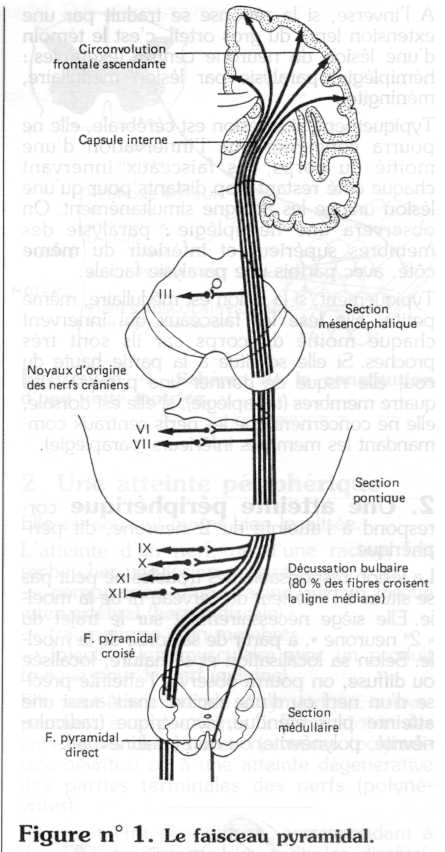
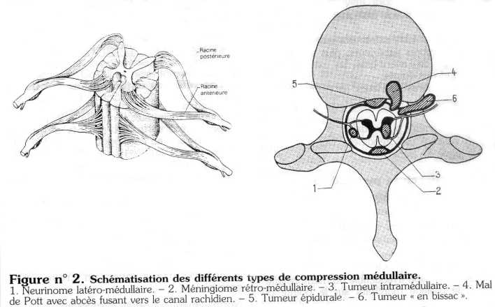
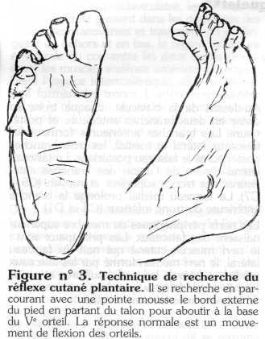
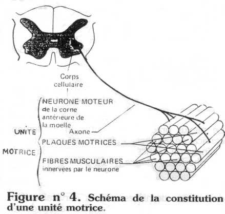

Quand un patient consulte pour une perte de la mobilité volontaire d'un bras ou d'une jambe, qu'il s'agisse :

<ul>
<li>d'une paralysie : abolition de la force musculaire,</li>
<li>ou d'une parésie : simple diminution,</li>
</ul>

il est urgent de découvrir la cause car un nerf lésé peut ne jamais récupérer. Nous allons donc:

<ul>
<li>faire un rappel anatomique des nerfs moteurs,</li>
<li>préciser l'examen clinique à effectuer,</li>
<li>envisager, enfin, les principales causes des paralysies.</li>
</ul>

## I. Rappel anatomique

Deux neurones conduisent l'influx du cerveau au muscle.

### 1. Un premier neurone central, dit faisceau pyramidal croisé

Il naît du cortex cérébral (circonvolution frontale ascendante), descend vers le bulbe rachidien où il croise la ligne médiane puis redescend vers la corne antérieure de la moelle où il va s'articuler au deuxième neurone (un autre faisceau pyramidal ne croise la ligne médiane que plus bas dans la moelle).

### 2. Un deuxième neurone dit périphérique

Il naît dans la corne antérieure de la moelle, sort de la moelle par la racine antérieure et s'unit avec la racine postérieure qui contient les nerfs sensitifs. Ces deux nerfs forment donc le nerf rachidien (sensitif et moteur) qui va gagner les membres et se terminer dans les muscles.

**En conclusion**

- Toutes les voies de la motricité volontaire croisent la ligne médiane : une lésion de la partie droite du cerveau entraînera une paralysie du côté gauche, et vice versa ;
- Toute lésion du premier neurone entraîne une paralysie dite centrale ;
- Toute lésion du deuxième neurone entraîne une paralysie périphérique.

## Il. Examen clinique

Il vise à déceler le siège de la lésion avant d'en déterminer la cause.

### 1. L'interrogatoire

Plus qu'ailleurs, en neurologie l'interrogatoire du malade est capital pour préciser l'importance de la paralysie, surtout si elle est discrète (gêne à la marche, maladresse de la main), et s'orienter vers une cause :

- notion de traumatisme, de plaie,
- fièvre récente,
- vaccinations,
- ancienneté des troubles,
- évolutivité : amélioration ou aggravation.

### 2. La marche

Si elle est possible, elle peut être évocatrice :

- d'attitude de "fauchage" où les membres inférieurs sont avancés, raides, en commençant par s'écarter sur le côté, en cas d'atteinte centrale (pyramidale) ;
- d'attitude de "pédalage" où les genoux sont exagérément remontés, avec le pied tombant, en cas de lésion des nerfs périphériques.

### 3. Le déficit moteur

Il doit être apprécié ensuite : il est parfois massif, plus souvent incomplet et doit être systématiquement analysé :

#### a. Aux membres supérieurs

- *Les deux membres tendus horizontalement*
  - les yeux fermés,
  - normalement les deux membres demeurent à la même hauteur,
  - un déficit se traduit par l'abaissement progressif d'un membre.
- *Les doigts écartés* *au maximum,* *les deux* *paumes étant face à face sans se toucher*
  - le déficit se traduit par un écartement moindre des doigts.

#### b. Aux membres inférieurs

- Le sujet *couché sur le ventre* fléchit les jambes à angle droit sur les cuisses : normalement le sujet sain peut rester deux à trois minutes.

- Le sujet couché sur le dos fléchit les cuisses à angle droit sur le bassin, les jambes étant à angle droit sur les cuisses : le sujet sain peut demeurer ainsi deux à trois minutes.

### 4. On peut enfin classer la force musculaire en cinq niveaux

0 : aucune contraction du muscle,

1 : simple contraction musculaire visible sans déplacement du membre,

2 : déplacement possible sur le plan du lit,

3 : mouvements actifs verticaux,

4 : mouvements s'opposant à l'examinateur,

5 : force normale.

### 5. Autres signes

Il faut aussi rechercher une anomalie des réflexes ostéotendineux et du tonus musculaire des membres atteints.

## III. Topographie de la lésion

Il est essentiel, dans un premier temps, de déterminer la localisation de la lésion grâce à l'examen clinique, pour rechercher, en conséquence, la cause de l'atteinte.

### 1. Atteinte centrale

**1. Une atteinte centrale** correspond à une lésion du premier neurone, dit central, au niveau du cerveau, du bulbe rachidien ou de la moelle épinière.

Elle touche :

- non pas un muscle isolé mais tout un groupe de muscles,
- plus souvent les extrémités que la racine,
- aux membres supérieurs, plus souvent les fléchisseurs de l'avant-bras, les extenseurs de la main et des doigts,
- aux membres inférieurs, les fléchisseurs.

Trois signes sont très évocateurs de l'atteinte centrale :

- la contracture pyramidale,
- les réflexes ostéotendineux vifs,
- le signe de Babinski.

#### a. La contracture pyramidale

Elle traduit la libération d'activités motrices normalement bloquées par le faisceau pyramidal.

La contracture entraîne :

- une flexion irréductible du membre supérieur,

- une extension irréductible du membre inférieur, le malade marchant sur le pointe du pied.

#### b. Les réflexes ostéotendineux vifs

La percussion des tendons rotulien, achillien, bicipitaux, tricipitaux, entraîne une réponse ample, vive, diffusant parfois à tout le membre, voire au côté opposé.

#### c. Le signe de Babinski

Devant tout déficit d'un membre inférieur, sa recherche est indispensable, car s'il existe, il permet d'affirmer une lésion du cerveau ou de la moelle.  
Le sujet étant sur le dos, le plus possible " détendu ", on effleure lentement la partie externe de la plante du pied depuis le talon jusqu'aux orteils (avec un crayon par exemple).  
Normalement les orteils fléchissent.

À l'inverse, si la réponse se traduit par une extension lente du gros orteil, c'est le témoin d'une lésion du neurone central (exemples : hémiplégie, paralysie par lésion médullaire, méningite).

Typiquement, **si la lésion est cérébrale**, elle ne pourra concerner que l'innervation d'une moitié du corps, les faisceaux innervant chaque côté restant trop distants pour qu'une lésion unique les atteigne simultanément. On observera une hémiplégie : paralysie des membres supérieur et inférieur du même côté, avec parfois une paralysie faciale.

Typiquement, **si la lésion est médullaire**, même petite, elle lèse les faisceaux qui innervent chaque moitié du corps car ils sont très proches. Si elle se situe à la partie haute du cou, elle risque de donner une paralysie des quatre membres (tétraplégie), si elle est dorsale, elle ne concernera que les nerfs centraux commandant les membres inférieurs (paraplégie).

### 2. Atteinte périphérique

**Une atteinte périphérique** correspond à l'atteinte du 2e neurone, dit périphérique.

La lésion responsable des troubles ne peut pas se situer à l'intérieur du cerveau ni de la moelle. Elle siège nécessairement sur le trajet du "2 e neurone", à partir de sa sortie de la moelle. Selon sa localisation et sa nature, localisée ou diffuse, on pourra observer l'atteinte précise d'un nerf ou d'une racine, mais aussi une atteinte plus étendue, symétrique (radiculonévrite, polynévrite) ou non (multinévrite.

- Si la lésion siège près de la corne antérieure, le déficit moteur sera isolé (exemple poliomyélite).  
  Les réflexes ostéotendineux sont ici diminués ou abolis.  
  Enfin, l'amyotrophie est souvent importante.
- Si la lésion siège aux racines ou en périphérie, les nerfs sensitifs sont aussi touchés : au tableau précédent s'ajoutent des troubles sensitifs :
  - Subjectifs : douleurs spontanées, fourmillements, engourdissements.
  - Objectifs : hypo ou anesthésie à la piqûre, au chaud, au froid.

En conclusion, l'interrogatoire et l'examen clinique soigneux permettent souvent de repérer le siège et la nature de la lésion.

## III. Principales causes de paralysie

### 1. Atteinte centrale

Elle peut être :

#### a. Cérébrale (hémiplégie)

Peut correspondre à toute atteinte localisée du cerveau :

- traumatique (accident de la voie publique, traumatisme crânien),
- infectieuse (abcès, séquelle de méningite, d'encéphalite, de neuropaludisme),
- vasculaire (hémorragie cérébrale chez un hypertendu, thrombose),
- tumorale.

#### b. Médullaire (paraplégie, quadriplégie)

Le plus souvent elle est due à des lésions vertébrales comprimant la moelle épinière :

- traumatiques (fractures du rachis par accident de la voie publique),
- infectieuses (tuberculose osseuse : mal de Pott, autres infections vertébrales).

Il peut aussi s'agir :

- de tumeur de la moelle ou des annexes,
- d'infection médullaire (myélite), plus rare.

### 2. Atteinte périphérique

Elle est souvent moins bien localisée.

L'atteinte d'un nerf ou d'une racine, fait rechercher une lésion précise :

- compression d'une racine par un disque intervertébral (hernie discale),
- traumatisme d'un membre,
- injection intramusculaire avec un produit toxique pour le nerf (quinine).

Elle peut être bilatérale et symétrique, correspondant à une atteinte inflammatoire des enveloppes des racines nerveuses (polyradiculo-névrites) ou à une atteinte dégénérative des parties terminales des nerfs (polynévrites).

Elle peut être plus diffuse, correspondant à des atteintes infectieuses multiples disséminées des nerfs moteurs (poliomyélite).

Dans bien des cas, il faudra s'aider d'examens complémentaires (étude du liquide céphalorachidien, radiographies osseuses, scanner) en milieu équipé pour aboutir à un diagnostic précis, mais une forte présomption est déjà souvent acquise par l'examen clinique.

*Développement et Santé, n°123, juin 1996*
