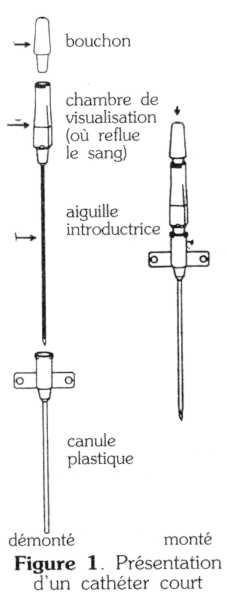
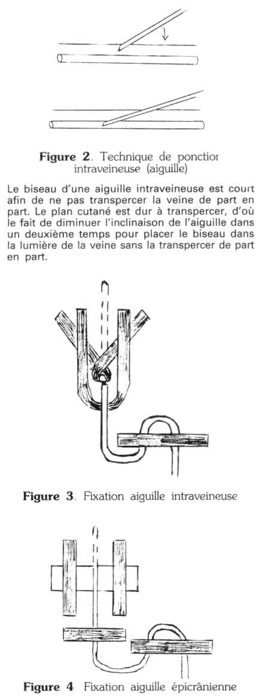
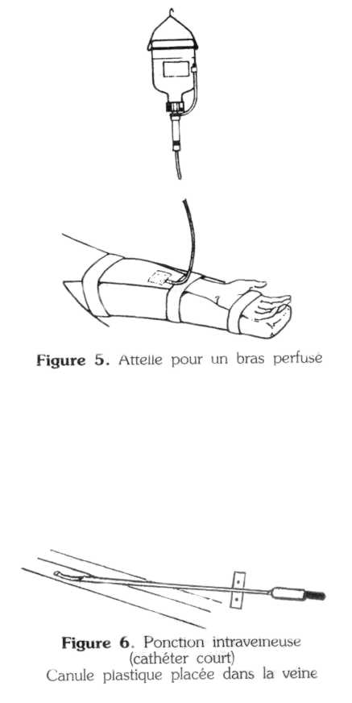

La perfusion est une technique d'injection prolongée, par voie veineuse. Du savoir-faire de l'infirmier et des qualités du matériel utilisé dépendra en grande partie la réussite de la perfusion intraveineuse.

La pose d'une perfusion intraveineuse, bien que quotidienne, n'est pas un geste anodin. Cet acte technique peut être source d'infection majeure, mais aussi entraîner de graves conséquences sur la santé du patient en cas d'erreur de produit injecté ou de volume injecté, compte tenu de la rapidité de l'effet liée à la voie utilisée.

## **I. Technique**

### **1. Matériel à la disposition de l'infirmier**

**a. Aiguille intraveineuse métallique, à usage multiple**

Le moins bon des moyens pour deux raisons:

*   Il faut la stériliser entre chaque usage, après un lavage soigneux, soit au poupinel (une heure à 180 °C) soit à l'autoclave (vingt minutes à 130 °C). L'ébullition est à réserver comme moyen de secours (ce n'est pas une stérilisation, mais une désinfection), au minimum vingt minutes.

*   Sa réutilisation et sa manipulation font que le tranchant du biseau est souvent émoussé, il faut impérativement le vérifier sur une compresse avant la stérilisation et aiguiser si nécessaire sur une pierre polie.

**b. Aiguille épicrânienne** **ou aiguille à ailettes**

Toujours à usage unique. Si usage multiple, seule l'ébullition pendant vingt minutes permet de la " désinfecter ".

**c. Cathéter court à usage unique**

Le cathéter est composé d'une canule en plastique munie d'une aiguille introductrice à l'intérieur, c'est le moyen idéal à l'heure actuelle (_figure_ _1)._

Précision pour le matériel à usage unique présenté sous sachet papier stérile : il faut vérifier l'intégrité du sachet, tant que celui-ci n'est pas perforé la stérilité est garantie.

### **2. Préparation du malade**

*   Expliquer au malade et à sa famille ce que l'on va lui faire et pourquoi.

*   Installer confortablement le malade, allongé ou assis, de manière à ce qu'il bouge le moins possible.

*   Si le malade est choqué, l'allonger à plat et lui relever les jambes afin que le sang reflue vers le système veineux supérieur.

*   Repérer où la perfusion peut être posée afin d'adapter et de choisir le matériel.

### **3. Préparation du matériel**

Il est indispensable de réunir tout le matériel avant d'effectuer le geste, car tout manque inopiné entraîne des manipulations intempestives responsables d'échec.

**a. Matériel à prévoir**

- un garrot

- des compresses ou du coton stérile

- un désinfectant

- du sparadrap déjà découpé en trois bandes de cinq à six centimètres

- une aiguille, une épicrânienne, ou un cathéter court

- une protection pour le lit.

**b. Préparation de la perfusion**

**a.** Vérifier le soluté à perfuser, sa date de péremption. Si la péremption est dépassée, vérifier l'intégrité du flacon, que celui-ci n'ait pas été déjà ponctionné (on vérifie le vide d'air à l'intérieur d'un flacon en le retournant et en frappant sur le fond, un bruit sec doit s'entendre à ce moment).

*   Se laver les mains.

*   Désinfecter le bouchon, ne pas mettre les doigts sur l'aiguille qui va transpercer le bouchon.

*   Purger la tubulure :

- remplir la chambre compte-gouttes en pressant sur celle-ci,

- purger le reste de la tubulure en ouvrant la pince régulatrice. L'embout terminal doit rester stérile, ne pas y mettre les doigts ou toucher quoi que ce soit avec.

### **4. Technique de la ponction intraveineuse**

**a. Poser le garrot sur le membre supérieur**

**b. Préparer la veine à perfuser**

*   Prendre son temps pour faire apparaître une veine, même chez un malade choqué, la ponction à l'aveugle est aléatoire.

*   Tapoter les trajets veineux jusqu'à ce que les veines se remplissent de sang et gonflent.

*   Si le malade doit rester perfusé plusieurs jours, choisir en premier une veine sur le dessus de la main, afin de réserver les veines supérieures pour les perfusions ultérieures.

*   Eviter les veines situées au niveau du poignet ou du coude, le malade va bouger involontairement et gêner l'écoulement de la perfusion ou se transpercer la veine avec l'aiguille.

*   Eviter les veines apparentes, dures comme des cordons, probablement sclérosées par des perfusions ou injections antérieures de produits irritants.

**c. Ponction intraveineuse avec aiguille****ou épicrânienne** _(figure 2)_

*   Tendre la peau et immobiliser la veine de la main gauche sans l'écraser, la veine doit rester apparente.

*   Tenir l'aiguille entre le pouce et l'index ou les ailettes repliées pour épicrâniennes, le biseau tourné vers le haut.

*   Pénétrer le plan cutané, puis réduire l'angle d'inclinaison de l'aiguille et enfoncer l'aiguille dans la veine, on sent une diminution de la résistance lorsque l'on est dans la veine et le reflux de sang en témoigne.

*   Desserrer le garrot.

*   Ouvrir la pince régulatrice, le liquide s'écoule. On peut également vérifier que l'on est bien dans la veine en abaissant le flacon en dessous du niveau du point de ponction, le sang reflue dans la tubulure.

*   Fixer soigneusement l'aiguille et la tubulure en passant une bande de sparadrap sous l'aiguille puis en rabattant les bouts alternativement en les croisant par dessus l'aiguille. Deux bandes sont ensuite posées en transversales pour consolider _(figures 3_ _et 4)._

Pour les enfants et les adultes inconscients, il faut installer le bras sur une attelle _(figure 5)._

**d. Ponction avec un cathéter court** _(figure 6)_

*   L'angle d'inclinaison avec le plan cutané est plus réduit et on ne le modifie pas.

*   Lorsque le sang reflue dans la chambre du cathéter, ne plus bouger l'aiguille et faire coulisser la canule en plastique dans la veine à l'aide de la main gauche. a Retirer l'aiguille et adapter la tubulure.

### **5. Surveillance**

**a. Réglage du débit**

Avec une tubulure standard, on compte :

- 20 gouttes de soluté aqueux = 1 ml

- 15 gouttes de sang = 1 mi

Pour régler le débit, on va calculer le nombre de gouttes par minute en fonction du volume à perfuser et du temps souhaité pour perfuser ce volume _(tableau)._

_Exemple._ la prescription est de 500 ml de sérum physiologique pendant trois heures.

1/- On compte le nombre de gouttes total dans un flacon de 500 ml :  
20 gouttes par ml x 500 ml = 10000 gouttes.

2/- On calcule la durée de la perfusion en minutes :  
60 min x 3 h = 180 min.

3/- On divise le nombre de gouttes total par le nombre de minutes et on obtient le nombre de gouttes par minute :  
10000 : 180 = 55,5 soit 56 gouttes/min.

**b. Conseils au malade et à sa famille**

La coopération du malade et de son entourage est souhaitée, l'attention de l'infirmier ne peut être mobilisée en permanence par la surveillance d'une perfusion.

Pour cela, il faut avertir le malade et son entourage d'appeler l'infirmier dès que :

- la perfusion ne coule plus ou coude trop vite,  
- le flacon est vide,  
- le point de ponction gonfle et devient douloureux,  
- un signe anormal apparaît  
- douleur, rougeur le long du trajet veineux,  
- sensation de malaise général, etc.

Demander au malade de ne pas faire de mouvement intempestif propre à désadapter le branchement ou à enfoncer l'aiguille et transpercer la veine.

## **II. Incidents et complications**

### **1. La chambre compte-gouttes est pleine**

*   Fermer la pince régulatrice.

*   Retourner le flacon.

*   Chasser une partie du liquide dans le flacon.

*   Réinstaller le flacon et à nouveau régler le débit.

**2. L'air dans la tubulure**

Si la tubulure comporte un caoutchouc (site d'injection), pour éviter de désadapter la tubulure de l'aiguille, il suffit de piquer avec une aiguille stérile dans le caoutchouc et de laisser ainsi échapper l'air.

S'il n'y a pas de caoutchouc, désadapter la tubulure de l'aiguille et purger.

### **3. Le débit est ralenti,** **voire arrêté**

*   Examiner l'aiguille: s'il y a un gonflement autour du point de ponction, il y a diffusion du liquide dans les tissus car l'aiguille est en dehors de la veine. Repiquer.

*   L'aiguille est bouchée par un caillot: débrancher la tubulure, mettre l'embout dans une compresse stérile imbibée d'alcool iodé. Déboucher l'aiguille à l'aide d'une petite seringue contenant du sérum physiologique. Si échec, repiquer le malade.

*   Le biseau de l'aiguille est plaqué contre la paroi de la veine. Mobiliser doucement l'aiguille jusqu'à ce que le liquide s'écoule franchement et sans gonflement. Fixer l'aiguille dans cette position.

*   Vérifier si la **tubulure** n'est pas **coudée.**

### **4. Lymphangite**

Le trajet veineux devient rouge, chaud et douloureux; il peut y avoir une adénopathie axillaire. Enlever l'accès veineux et repiquer le malade à l'autre bras. Appliquer un pansement alcoolisé chaud sur le trajet veineux et le renouveler trois à quatre fois par jour jusqu'à la disparition de la lymphangite.

**Conclusion**

Au total, pour réussir la mise en place et le maintien d'une perfusion intraveineuse, l'infirmier doit :

*   réunir le matériel le plus performant,

*   obtenir, dans la mesure du possible, la confiance et la coopération du malade et de sa famille,

*   maîtriser sa technique et surveiller:

- le débit de la perfusion,  
- l'état local du point de ponction.  

_Développement et Santé, n°116, avril 1995_