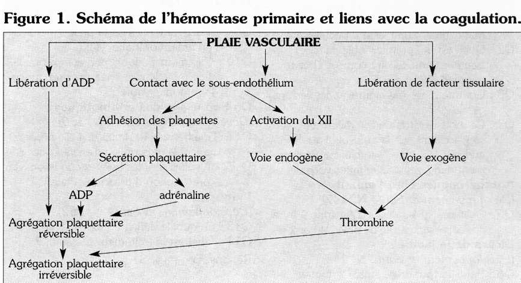
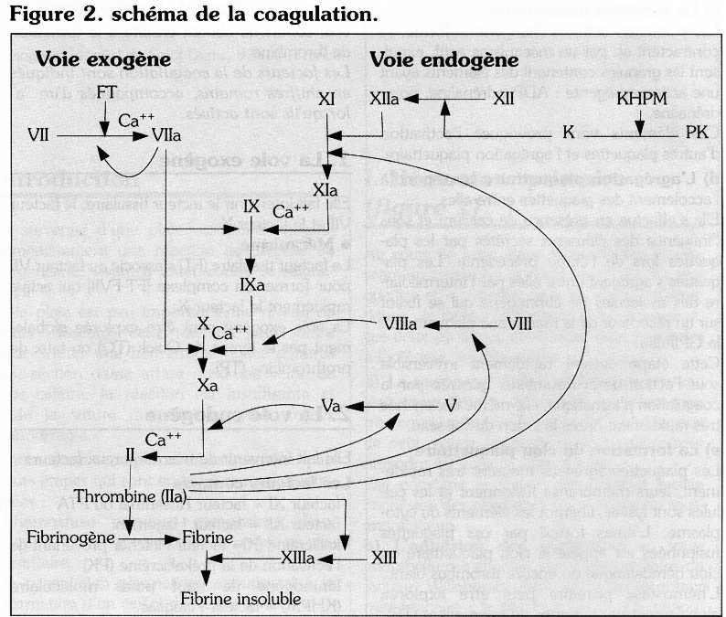
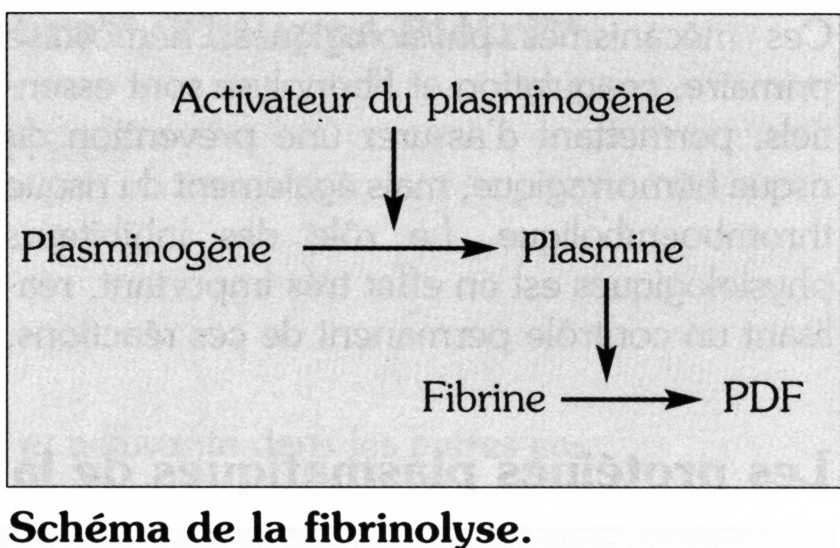
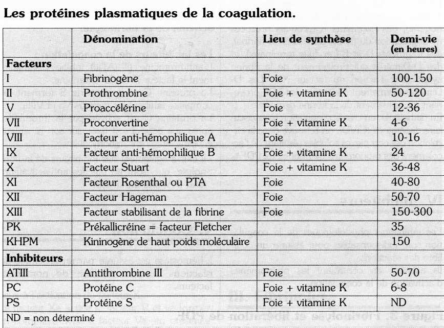

## I. Hémostase primaire _(figure 1)_

Au cours de cette étape interviennent le vaisseau, en particulier la paroi vasculaire, les plaquettes et au moins deux protéines plasmatiques : le facteur Willebrand et le fibrinogène, ces deux protéines étant également présentes à l'intérieur des plaquettes.

### a) La vasoconstriction réflexe du vaisseau lésé

C'est un élément de défense important mais très court, surtout efficace pour les vaisseaux de petit calibre. La diminution du calibre peut atteindre 40 % de sa taille initiale.

Elle constitue le temps vasculaire et facilite l'adhésion des plaquettes au collagène du sous-endothélium.

### b) L'adhésion des plaquettes au sous-endothélium

Elle s'effectue par l'intermédiaire du facteur Willebrand, fixé sur son récepteur membranaire : la protéine GPIb. Ce phénomène est très rapide. Il provoque l'activation des plaquettes.

### c) La sécrétion plaquettaire

Les plaquettes activées changent de forme, se contractent et, par un mécanisme actif, expulsent les granules contenant des éléments ayant une action agrégante : ADP, adrénaline, noradrénaline.

Ces éléments vont provoquer l'activation d'autres plaquettes et l'agrégation plaquettaire.

### d) L'agrégation plaquettaire

Elle correspond à l'accolement des plaquettes entre elles.

Elle s'effectue en présence de calcium et sous l'influence des éléments sécrétés par les plaquettes lors de l'étape précédente. Les plaquettes s'agrègent entre elles par l'intermédiaire des molécules de fibrinogène qui se fixent sur un récepteur de la membrane plaquettaire, la GPIIbllla.

Cette étape devient rapidement irréversible sous l'action de la thrombine, générée par la coagulation plasmatique, elle-même déclenchée très rapidement après la lésion du vaisseau.

### e) La formation du clou plaquettaire

Les plaquettes agrégées meurent très rapidement, leurs membranes fusionnent et les cellules sont lysées, libérant les éléments du cytoplasme. L'amas formé par ces plaquettes fusionnées est appelé le clou plaquettaire ou clou hémostatique ou encore thrombus blanc. L'hémostase primaire peut être explorée globalement par le temps de saignement (TS).

## Il. La coagulation _(figure 2)_

La coagulation intervient pour consolider le clou plaquettaire obtenu à la fin de l'hémostase primaire, ce dernier étant insuffisant pour assurer une hémostase complète.

L'étape finale de la coagulation est la transformation de fibrinogène en fibrine, sous l'action de la thrombine.

Cette transformation a lieu après une série de réactions faisant intervenir de nombreux facteurs, plasmatiques mais aussi plaquettaires. La coagulation est donc étroitement liée à l'hémostase primaire.

On distingue classiquement deux voies permettant d'aboutir à cette formation de thrombine : la voie endogène ou intrinsèque et la voie exogène ou extrinsèque, toutes deux aboutissant à l'activation du facteur X. Une voie commune aboutit ensuite à la formation de thrombine.

_Les facteurs de la coagulation sont indiqués_ _en chiffres romains, suivis d'un_ "a" _lorsqu'ils sont activés._

### 1. La voie exogène

Elle fait intervenir le facteur tissulaire, le facteur VII et le facteur X.

#### Mécanisme

Le facteur tissulaire (FT) s'associe au facteur VII pour former un complexe [FT-FVII] qui active rapidement le facteur X.

La voie exogène peut être explorée globalement par le temps de Quick (TQ) ou taux de prothrombine (TP).

### 2. La voie endogène

Elle fait intervenir de très nombreux facteurs :

#### Les facteurs contacts

*   facteur XI facteur Rosenthal ou PTA
*   facteur XII facteur Hageman
*   kallicréine (K)= facteur Fletcher provenant de l'activation de la prékallicréine (PK)

*   kininogène de haut poids moléculaire (KHPM) = facteur Flaugeac.

#### Les autres facteurs

*   facteur IX = facteur anti hémophilique B
*   facteur VIII = facteur anti hémophilique A
*   les phospholipides de la membrane plaquettaire, facteur 3 plaquettaire (F3P)
*   le calcium (Ca++).

#### Mécanisme

Le facteur XI, activé par le facteur Xlla, vient activer le facteur IX (qui devient IXa).

Le facteur IXa se fixe sur les phospholipides de la membrane plaquettaire, par l'intermédiaire du calcium. C'est à ce niveau que le facteur IXa vient ensuite activer le facteur X, cette activation n'étant rapide qu'en présence de facteur VIII. La voie endogène peut être explorée globalement par le temps de céphaline kaolin (TCK) ou temps de céphaline activé (TCA).

### 3. Voie commune

#### Formation de thrombine

Les voies exogène et endogène mènent toutes deux à l'activation du facteur X.

Le facteur Xa active le facteur V et va former un complexe avec le facteur Va, en présence de calcium et des phospholipides de la membrane plaquettaire. Ce complexe, encore appelé "prothrombinase" active la prothrombine (facteur Il) en thrombine ( facteur lIa). Le facteur V est également activé par la thrombine formée, ce qui amplifie le phénomène.

#### Formation de fibrine

C'est la thrombine qui va transformer le fibrinogène en fibrine, qui se polymérise.

#### Stabilisation de la fibrine

La dernière étape de la coagulation fait intervenir le facteur XIIla qui vient stabiliser le caillot de fibrine en rendant insoluble le polymère de fibrine. L'activation du facteur XIII est accélérée par la thrombine, ainsi que par la fibrine.

## III. Fibrinolyse

La formation d'un caillot de qualité va permettre de stopper l'hémorragie et la cicatrisation de la plaie vasculaire. Cette cicatrisation terminée, le caillot, devenu inutile, va être dissous par un mécanisme faisant intervenir d'autres facteurs. Ce mécanisme est la fibrinolyse.

### Les facteurs

*   le tPA ( activateur tissulaire du plasminogène),
*   les facteurs de la phase contact : surtout le facteur XIla,

*   le plasminogène,
*   l'urokinase.

### Mécanisme _(figure 3)_

Sous l'action des activateurs (tPA, facteur XII, urokinase), le plasminogène présent entre les mailles du caillot est transformé en plasmine. Cette plasmine formée va "découper" le caillot de fibrine en fragments qui seront ensuite éliminés dans la circulation. Ces fragments sont les produits de dégradation de la fibrine (ou PDF).

En cas de lyse localisée d'un caillot, seuls les produits de dégradation de la fibrine sont retrouvés dans le sérum du malade. En cas de fibrinolyse généralisée, on retrouve également des produits de dégradation du fibrinogène : parmi les PDF, on retrouve des fragments Y (produits précoces de dégradation du fibrinogène), des fragments X (produits précoces de dégradation du fibrinogène et de la fibrine), des fragments D et E (produits terminaux), et des D-Dimères qui proviennent de la fibrine ayant subit l'action du facteur XIII. Les D-Dimères permettent d'identifier les PDF provenant exclusivement de la fibrine dégradée.

En pathologie, en cas de coagulation intravasculaire disséminée (CIVD), on retrouve dans la circulation des complexes solubles résultant de l'accolement des monomères de fibrine aux PDF.

## IV. Inhibiteurs

Les inhibiteurs physiologiques de la coagulation sont indispensables pour assurer un équilibre des réactions.  
Ils agissent en contrôlant les phénomènes d'activation de la coagulation.

Les inhibiteurs de la coagulation

L'antithrombine III (ATIII) inhibe essentiellement le facteur Xa et la thrombine. La protéine C et la protéine S forment un complexe inhibant les facteurs Va et Vllla. La protéine C est activée par la thrombine, après que celle-ci soit fixée sur son récepteur endothélial : la thrombomoduline.  
Il existe également des inhibiteurs de la fibrinolyse, qui sont en fait des anti-activateurs (anti tPA, anti urokinase...).

## V. Conclusion

L'hémostase est assurée par un ensemble de réactions faisant intervenir de nombreux facteurs.

 Ces mécanismes physiologiques, hémostase primaire, coagulation et fibrinolyse sont essentiels, permettant d'assurer une prévention du risque hémorragique, mais également du risque thromboembolique. Le rôle des inhibiteurs physiologiques est en effet très important, réalisant un contrôle permanent de ces réactions, qui risqueraient d'aboutir à une exagération des phénomènes de coagulation.

Ainsi un déficit en facteur de la coagulation entraînera plutôt un risque hémorragique, tandis qu'un déficit en inhibiteur sera responsable d'accidents thrombotiques.

