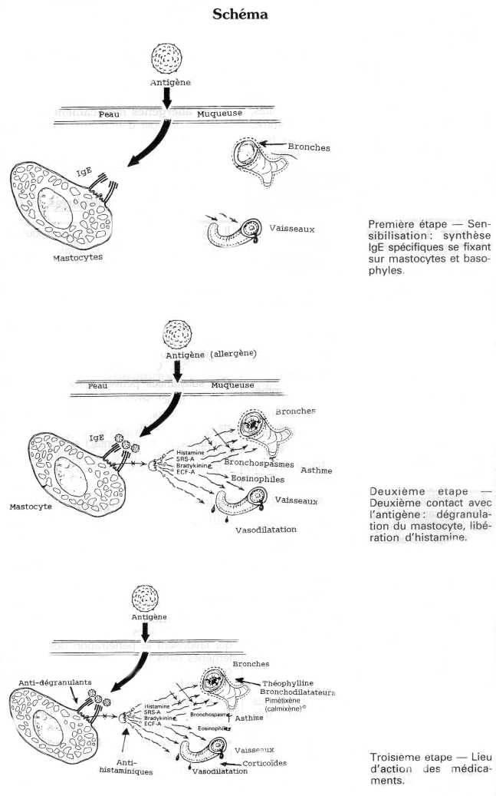

Les maladies allergiques tiennent une place de plus en plus importante dans la pathologie. 
Il peut s'agir de conjonctivites, de rhinites, d'eczéma, d'urticaire, mais surtout d'asthme. 
Plus rarement, l'allergie entraîne des troubles digestifs aigus ou chroniques, voire des chocs exceptionnellement mortels.

## I. Généralités sur l'allergie

A l'état normal, l'organisme est capable de reconnaître et de rejeter ou tolérer les éléments qui entrent à son contact.

L'allergie est une réaction immunologique qui aboutit à une production exagérée d'anticorps de type IgE qui, en se fixant sur l'allergène, vont provoquer une réponse nuisible pour le sujet.

Il faut préciser que tout sujet normal synthétise des IgE pour lutter contre certains parasites (vers ronds en particulier).

Trois composantes interviennent à l'origine de l'allergie.

### 1. L'atopie

C'est la capacité héréditaire à développer des réactions allergiques par production d'anticorps particuliers de type IgE au contact d'une substance le plus souvent banale entrant au contact des muqueuses ou de la peau (exemples: lait de vache, acariens, médicaments, etc.). 5 à 10 % des sujets ont, dès la naissance, un terrain atopique.

### 2. Les allergènes

On en distingue schématiquement trois types :

- **Les pneumallergènes:** ils sont présents dans l'air ambiant et peuvent, même à très faible dose, déclencher une réaction allergique. Exemples: pollen, acariens, poussière de maison, allergènes du chat, du chien.

- **Les trophallergènes:** les aliments peuvent agir sur la muqueuse intestinale et provoquer des manifestations digestives, respiratoires, cutanées en générales. Exemples: lait de vache, arachide, soja, poisson, oeuf.

- **Les allergènes méacamenteux:** quelle que soit la voie d'administration, de nombreux médicaments sont capables de provoquer des allergies. Exemples: pénicilline, sulfamides, aspirine, etc.

### 3. Les immunoglobulines E (IgE)

Il s'agit d'anticorps spécifiques produits dès le premier contact avec l'allergène.

Elles vont se fixer sur certaines cellules (polynucléaires basophiles et mastocytes) sans déclencher de réaction nuisible *(schéma).* Mais lors d'un second contact avec l'allergène, celui-ci se fixe sur l'IgE et cette " rencontre explosive" irrite la cellule porteuse de l'IgE qui alors libère brutalement des substances toxiques (histamine, sérotonine, prostaglandine). C'est la dégranulation.

Ces substances peuvent provoquer :

- un bronchospasme: asthme,

- une vasodilatation cutanée : urticaire,

- une vasodilatation générale : choc.

A chaque nouveau contact avec l'allergène, le même phénomène se reproduira.

## II. Autres facteurs intervenant dans l'allergie

Bien d'autres éléments s'interposent entre le "terrain atopique et l'allergène". Citons :

- **La pollution:** la pollution de l'air provoque des lésions respiratoires muqueuses qui favorisent la pénétration des pneumallergènes dans l'organisme: c'est une explication à la recrudescence de l'asthme dans les grandes villes.

- **Les infections virales:** qu'elles soient digestives ou pulmonaires, elles déclenchent parfois un asthme ou une allergie digestive.

- **Les facteurs psychologiques:** chez l'asthmatique, il est bien connu qu'une émotion, une contrariété peuvent rapidement provoquer une crise.

## III. Quel traitement proposer ?

L'idéal, quand l'allergène est connu, est, bien sûr, de l'éloigner du malade. Exemples: chat, chien, aliment, médicament. Malheureusement, bien souvent, le malade est allergique à plusieurs substances qu'il est bien difficile d'identifier.

### 1. Les antihistaminiques

Ils bloquent l'action de l'histamine, principale substance libérée par la dégranulation des mastocytes. Très utiles, ils n'empêchent pas la réaction IgE-allergènes et surtout, ils n'agissent pas sur toutes les autres substances libérées par les mastocytes (prostaglandines, sérotonines).

### 2. Les antidégranulants

- Cromoglycate (Lomudal®).

- Kétotifène (Zaditen®).

Ils freinent la libération des substances contenues dans les mastocytes. Leur *action* est donc *préventive.*

C'est pourquoi ils nécessitent des traitements prolongés plusieurs mois. Le cromoglycate reste à la surface de la muqueuse respiratoire, il ne sera donc utile que dans l'asthme.

### 3. Les corticoïdes

Toujours utiles, ils agissent comme anti-inflammatoires.

### 4. Les bronchodilatateurs

Ils agissent en fin de réaction en s'opposant à l'action de l'histamine sur la bronche. Ils ne sont bien sûr utiles que dans la crise d'asthme.

*Développement et Santé, n°114, décembre 1994*
