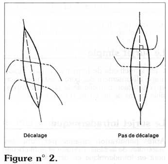
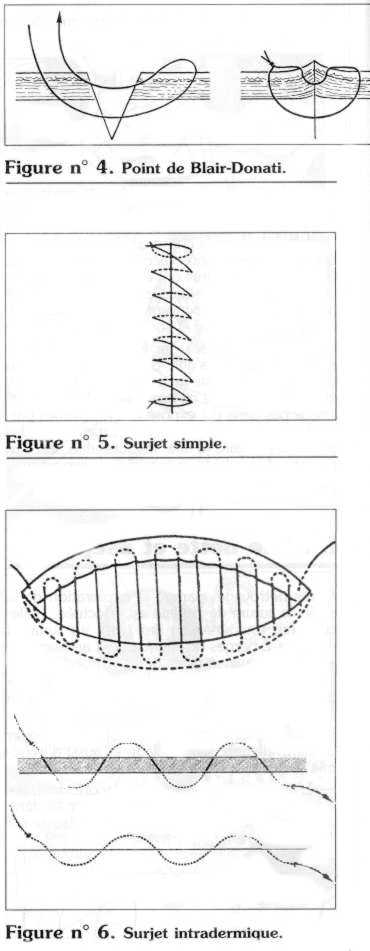

Les problèmes posés par les plaies sont différents selon qu'il s'agit d'une plaie nette ou contuse, qu'il existe une perte de substance, qu'elle est septique ou aseptique. Nous ne parlerons pas dans cet exposé des problèmes particuliers que sont les plaies articulaires, les plaies en regard d'une fracture dite fracture ouverte et les plaies en regard d'un axe artériel.

## I. Plaie nette et aseptique

Après nettoyage, parage et exploration de la plaie, la suture de la plaie est effectuée. Celle-ci se fait toujours plan par plan, en suturant donc les 2 berges de chaque plan anatomique ayant été traversé (avec de la profondeur vers la superficie : le muscle, l'aponévrose, le tissus cellulaire sous-cutané, la sous-peau et la peau).

Il faut alors faire attention à ne pas provoquer de dénivellation, de décalage et aussi d'ischémie :

*   L'aiguille doit charger de façon identique les 2 berges de la plaie afin d'éviter la dénivellation et le chevauchement d'une berge sur l'autre _(figure n° 1_).

*   Le trajet de l'aiguille doit être strictement perpendiculaire au tracé de la plaie afin d'éviter le décalage (_figure_ _n° 2)._
*   Il ne faut pas trop serrer les noeuds afin d'éviter une ischémie locale.

### 1. Le point simple

Il s'adapte à toutes les plaies. On peut retirer les points simples un par un permettant ainsi une désunion partielle de la plaie lorsque cela est nécessaire. Les deux complications principales qui peuvent nécessiter la désunion partielle d'une plaie suturée sont l'hématome et l'infection, bien que pour cette dernière il vaille mieux enlever tous les points afin d'effectuer un nettoyage efficace (_figure_ _n° 3)._

### 2. Le point de Blair-Donati

L'aiguille pénètre par une des berges et ressort par l'autre berge à égale distance puis refait le trajet en sens inverse en étant plus proche de chaque berge _(figure n° 4)._ Il permet alors un très bon affrontement mais donne une cicatrice moins esthétique.

#### **Le surjet simple**

C'est la méthode de fermeture la plus rapide mais l'affrontement des berges est moins bon et la désunion partielle de la plaie est impossible en cas de problème _(figure n° 5)._

#### **Le surjet intradermique**

Après pénétration cutanée par l'une des extrémités de la plaie, l'aiguille et le fil cheminent en intradermique en décrivant des créneaux prenant alternativement les 2 berges, et ceci jusqu'à l'autre extrémité de la plaie _(figure n°_ 6). On applique ensuite des steristrips sur la plaie ainsi que sur les 2 extrémités du fil pour les bloquer.

Son avantage est de donner de très belles cicatrices lorsqu'il est correctement réalisé, sinon le risque de désunion est plus important. Enfin la désunion partielle volontaire en cas de problème n'est bien entendu pas possible.

## **II.** Plaie nette et septique

Dans ce cas, il faut insister sur la décontamination de la plaie avec nettoyage et rinçage très abondant.  
Si la plaie est profonde, il vaut mieux fermer sur un drainage ou sur des crins de Florence.  
Si l'on a des doutes sur l'efficacité de la décontamination, il vaut mieux effectuer une fermeture lâche afin de ne pas emprisonner des germes dans un bouillon de culture. On réalise alors quelques points de rapprochement des berges puis on met la plaie en cicatrisation dirigée.

## III. Plaie confuse septique ou aseptique

Le temps thérapeutique très important consiste en un parage soigneux et ceci de tous les plans. L'erreur trop fréquemment réalisée est celle d'un parage à minima par l'opérateur sous-estimant les lésions ou redoutant la perte de substance qui s'ensuivra.

Après ce parage, on peut alors se retrouver devant 2 cas :

*   Soit la suture est possible sans tension et celle-ci sera réalisée sur drainage en un ou plusieurs plans.  
*   Soit la suture est impossible sans tension on peut alors réaliser une plastie de glissement, c'est-à-dire décoller les berges cutanées soutenues par un matelas sous-cutané, ou alors réaliser une incision de décharge en cas de nécessité impérieuse de fermer la plaie. On effectue alors une incision parallèle à la plaie à distance de celle-ci afin de gagner encore un peu. Si ces procédés ne suffisent pas, on se contentera alors de pansements gras avant de greffer à distance ou de réaliser un lambeau de couverture, ce qui sort de notre propos.

## IV. Cas particuliers

### 1. Plaies du cuir chevelu

Le fil peut être remplacé par l'utilisation d'agrafes.  
Le drainage est effectué par crins de Florence si celui-ci est nécessaire.

### 2. Plaies de la face

L'aspect esthétique est primordial. Il faut utiliser du fil très fin de type nylon 4/0 ou 5/0 et le type de suture à réaliser le plus fréquemment est le surjet intradermique.

Enfin, il ne faut jamais drainer une plaie de la face.

### 3. Plaies de la langue

Un aide est nécessaire afin d'extérioriser la langue et de la maintenir hors de la bouche avec une compresse. La suture est alors réalisée à l'aide de points séparés de fil résorbable de type vicryl. Ceux-ci prennent toute l'épaisseur des tissus sectionnés afin d'assurer une bonne hémostase.  
Chez l'enfant, une anesthésie générale peut être nécessaire du fait de la difficulté de coopération.

### 4. Plaies de la lèvre

Seules les plaies rompant la continuité cutanéo-muqueuse posent problème. Un aide pince la lèvre à proximité des commissures et la tient éversée afin d'assurer une hémostase temporaire par compression directe du pédicule coronaire et de présenter la lèvre à la suture. Le premier point réalisé doit être celui qui aligne le bord rouge afin d'assurer un bon résultat esthétique. Le versant muqueux est ensuite réalisé avec du fil fin résorbable et le versant cutané par du fil non résorbable de type nylon.

### 5. Plaies par morsure

La règle classique est de ne jamais suturer une plaie par morsure, qu'elle soit humaine ou animale. Concrètement, ces plaies situées le plus souvent au niveau des mains peuvent être suturées de façon très lâche à condition qu'un parage rigoureux soit effectué spécialement en cas d'exposition d'organes nobles sous-jacents (tendons nerfs...).

<table>

<tbody>

<tr>

<td>

Types de fils

<ul><li>Résorbables : vicryl (résorption en 2 à 3 mois), PDS (polydioxanone se résorbant en 6 mois.</li><li>Non résorbables : United States Pharmacopea (USP) = 2, 1, 0, 2/0, 4/0... 11/0, 12/0 (microchirurgie).</li></ul>Types d'aiguilles  
<ul><li>Diamètre de l'aiguille en microns</li><li>Corps de l'aiguille : 1/4 de cercle, 3/8 de cercle, 1/2 cercle</li><li>Pointe : ronde - tapercut - spatulée (ophtalmologie)</li></ul></td>

</tr>

</tbody>

</table>

<table>

<tbody>

<tr>

<td>

Ablation des fils

Face : 6 jours                                    Membres : 15 jours

Main : 10 à 14 jours                           Cuir chevelu : 8 à 10 jours

</td>

</tr>

</tbody>

</table>

## V. Conclusion

La peau est un organe noble qui ne doit pas être négligé. Des principes rigoureux doivent permettre de traiter toutes les plaies en s'adaptant à leur localisation et à leur aspect anatomique. Le geste fondamental qui ne doit jamais être sous-estimé est le parage afin de partir sur de bonnes bases pour la reconstruction.

<table>
<caption>Bilan à réaliser devant une plaie</caption>

<tbody>

<tr>

<td><ul><li>Inspection et recherche de déficit</li><li>Radiographie si suspicion de corps étranger</li><li>Prophylaxie antitétanique</li><li>Nettoyage de la plaie (povidone iodée)Parage</li><li>Exploration</li><li>Traitement chirurgical</li><li>Antibiothérapie seulement si plais souillée ou septique (règle des 6 heures dépassées</li></ul></td>

</tr>

</tbody>

</table>

<table>
<caption>Prévention de l'infection</caption>

<tbody>

<tr>

<td>

Prévention du tétanos

<ul><li>Vaccination ou rappel inférieur à 10 ans : en règle</li><li>Pas de vaccination à jour : sérothérapie +/- vaccination</li></ul>

Place de l'antibiothérapie dans la plaie simple

Elle varie en fonction des circonstances et du délai

<ul><li>Morsure (animale ou humaine) : pénicilline + tétracycline et sérothérapie antirabique si l'on est en zone d'endémie</li><li>Délai : au-delà de 6 heures après l'accident :<ul>*   si plaie propre : nettoyage chirurgical simple sans antibiothérapie*   si plaie souillée : amoxicilline-acide clavulanique : 1g x 2/24 h/8j. En cas d'allergie : macrolide (érythromycine : 2g/j)</ul></li></ul></td>

</tr>

</tbody>

</table>

_Développement et Santé, n° 142, août 1999_