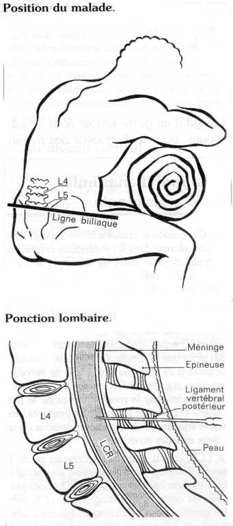
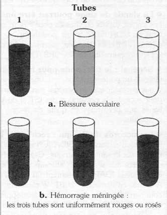

Il s'agit d'un geste simple dont il faut maîtriser la technique, les indications et les risques, et qui est effectué pour le diagnostic des méningites et de la trypanosomose.

## I. Rappel d'anatomie et de physiologie

Le LCR (liquide céphalorachidien) est un liquide clair, sécrété dans les ventricules cérébraux. Il circule et passe dans les espaces méningés de la base du crâne où il est réabsorbé. Il circule également dans les espaces méningés situés autour de la moelle épinière, à l'intérieur du canal formé par l'empilement des vertèbres. L'étui méningé qui contient le LCR descend jusqu'à la deuxième vertèbre sacrée (S2) alors que la moelle s'arrête à la deuxième lombaire (L2). Il est ainsi possible de recueillir avec une aiguille le LCR entre L2 et S2, sans risque de toucher la moelle. On pique le plus souvent entre L4 et L5, mais on peut très bien piquer également un espace en dessous ou un à deux espaces au-dessus.

Le LCR est au contact du cerveau et de la moelle épinière. Sa composition est modifiée dans de nombreuses maladies neurologiques. Ainsi au cours des méningites, le LCR subit des modifications biochimiques (glucose, albumine) et renferme des micro-organismes (bactéries, virus ou parasites).

## II. Indications

*   Syndrome méningé
*   Comas, surtout fébriles, tableaux cliniques évoquant une maladie du sommeil ou une hémorragie méningée.

**_Tout syndrome méningé nécessite une ponction lombaire_**

## III**.** Contre-indications

Il faut bien savoir les reconnaître.

*   L'hypertension intra-crânienne : elle est marquée comme la méningite par des maux de tête et des vomissements, mais elle est souvent non fébrile et apparue progressivement. Le fond d'oeil, fait autant que possible avant toute ponction lombaire (PL) chez l'adulte, permet d'en faire le diagnostic car il montre un oedème de la pupille.  
*   Si l'on suspecte un mal de Pott (tuberculose vertébrale), on ne doit pas faire une PL, car l'aiguille risque d'entraîner des bacilles dans les méninges.  
*   L'existence d'un syndrome hémorragique (saignements diffus) contre-indique également la PL qui pourrait provoquer une hémorragie méningée.

## IV. Technique

*   Il faut être au moins **deux,** l'aide maintenant le patient en bonne position.  
*   Le **matériel** doit être parfaitement stérile, si possible à usage unique ; on utilise en général des **aiguilles spéciales, à** biseau court et à mandrin. Si elles ne sont pas à usage unique, elles doivent être soigneusement stérilisées après nettoyage, entre chaque usage. Si l'on ne possède pas ces aiguilles, on peut à la rigueur utiliser une aiguille à injection intramusculaire de gros calibre et à biseau court.  
*   **Asepsie :** avant de piquer, il faut se laver les mains à l'eau et au savon en se brossant les ongles, et se désinfecter à l'alcool à 90° et ensuite mettre des gants. On badigeonne la peau du malade à l'alcool iodé largement autour du point de ponction, afin d'éviter tout risque d'infection due à la PL. Les doigts de l'opérateur sont également désinfectés à l'alcool iodé.  
*   **Position :** le patient, de préférence à jeun, doit présenter un dos le plus rond possible afin que l'on n'ait aucune peine à passer l'aiguille entre deux épineuses. Il est installé :
    *   soit assis, courbé en avant (en s'enroulant par exemple autour d'un oreiller comme sur la figure), les jambes pendantes,
    *   soit couché sur le côté, cuisses bien fléchies sur l'abdomen et tête fléchie.

Cette dernière position est préférée chez un malade en mauvais état général, ou si l'on n'a pas les moyens de s'assurer que le fond d'oeil est normal.

Quelle que soit la position choisie, l'aide maintient fermement le patient dans celle-ci afin d'éviter toute blessure intempestive due à un mouvement de recul.

*   **Repères :** l'espace inter-épineux L4-L5 se repère en traçant une ligne horizontale entre les deux crêtes iliaques.  
*   **Mise en place de l'aiguille :** après avoir vérifié que le mandrin coulisse bien, on repère l'espace avec le doigt désinfecté à l'alcool et l'on enfonce l'aiguille entre les deux épineuses allant un peu vers le haut, mais en restant sur la ligne médiane. On traverse ainsi la peau, le tissu sous-cutané, le ligament interépineux et le ligament jaune qui présente une certaine résistance. On s'arrête juste après avoir vaincu cette résistance : l'extrémité de l'aiguille est dans l'espace sous-arachnoïdien.

**Recueil du LCR :** il se fait dans des tubes stériles.

*   On retire alors le mandrin. Le LCR coule en gouttes rapprochées. En cas de méningites, il est souvent hypertendu et coule en jet. Si rien ne vient on peut retirer très doucement l'aiguille en la tournant un peu. On peut aussi, si l'on pense ne pas être assez loin, enfoncer plus, après avoir remis le mandrin.  
*   On peut augmenter la pression du LCR (et donc le débit) en appuyant sur le ventre du patient ou en lui comprimant les jugulaires.  
*   Il ne faut en aucune façon aspirer à la seringue.  
*   Le liquide est recueilli dans deux tubes. On prend environ 5 cc pour un adulte, 3 cc chez un enfant (deux fois quinze gouttes).  
*   Le prélèvement fait, on remet le mandrin et on retire l'aiguille rapidement, puis on frotte vigoureusement le point de ponction avec un coton alcoolisé pour éviter que le LCR continue de s'écouler. Puis on met un petit pansement stérile. Le malade doit ensuite rester couché sur le dos, à plat strictement, pendant plusieurs heures (au moins quatre heures).

## V. Incidents et accidents

Il y a peu d'ennuis à redouter si toutes les précautions sont respectées.

*   Au passage de l'aiguille, on peut toucher une racine nerveuse. Cela déclenche des douleurs en éclair dans les jambes. Il faut retirer l'aiguille.  
*   La ponction peut être blanche : ne pas ramener de liquide. Il faut essayer un ou deux espaces plus haut.  
*   Un ennui fréquent, sans gravité mais gênant pour l'examen du LCR est la piqûre d'une veine : du sang rouge coule dans le tube. Il est alors capital de savoir faire la différence entre la piqûre d'un vaisseau et une véritable hémorragie méningée.

Dans le premier cas, le liquide s'éclaircit progressivement et le sang coagule en masse. Si, au contraire, le liquide reste uniformément rouge ou rosé et ne coagule pas, c'est une hémorragie méningée et il faut prélever très peu de liquide (cf. schéma ci-contre).

En pratique, si on a la malchance d'avoir du sang, il vaut mieux retirer l'aiguille rapidement et repiquer un espace plus haut. La piqûre vasculaire est assez fréquente chez l'enfant

Le seul accident grave est l'engagement du tronc cérébral dans le trou occipital s'il y avait une hypertension intra-crânienne et que l'on ait fait la PL par erreur. Cela se traduit par des céphalées atroces, des troubles de conscience, une hypertonie des membres et des troubles cardiorespiratoires pouvant entraîner la mort. Il faut rapidement coucher le malade la tête en bas.

## VI. Résultats

### A. En l'absence de laboratoire

L'aspect du liquide est très important à noter immédiatement. Si l'on constate qu'il est légèrement ou franchement trouble, il s'agit d'une méningite purulente. Dans les cas difficiles, on peut comparer le tube de liquide prélevé avec un tube rempli d'eau pure examinés devant une surface blanche (drap, blouse). Un liquide clair élimine une méningite purulente.

Dans certains cas, il est important d'adresser le prélèvement à un laboratoire pour reconnaître les germes. Ceux-ci sont fragiles et le transport doit durer moins de 6 heures, à la température ambiante ou mieux dans une boite isolante contenant une bouteille d'eau très chaude.

### B. Si l'on dispose d'un laboratoire

rois types de renseignements peuvent être recherchés

#### 1. Biochimiques

Il faut un appareillage coûteux et complexe (photomètre) en général réservé aux grands hôpitaux. Normalement l'albumine ne dépasse pas 0,25 g/l (elle est augmentée en cas de méningite), le glucose ne descend pas au-dessous de 0,5 g/l (sauf en cas de méningite purulente ou tuberculeuse).

#### 2. Cytologiques

*   Les cellules peuvent être identifiées sur frottis après centrifugation et coloration au May-Grünwald-Giemsa. Les polynucléaires altérés correspondent à une méningite purulente.  
    Les lymphocytes peuvent se voir dans d'autres inflammations des méninges (virus, tuberculose, trypanosomose).  
    Des plasmocytes vacuolisés (cellules de Mott) sont caractéristiques de la trypanosomose.

*   Les cellules peuvent être comptées à la cellule de Nageotte (il faut compter le nombre des éléments de 8 bandes verticales et diviser par 10). Normalement il y a moins de 6 éléments/mm3. Un liquide trouble correspond toujours à un excès important d'éléments.

#### 3. Bactériologiques et parasitologiques

Sur un liquide trouble, l'identification du germe peut se faire sur la coloration de Gram.

*   Le méningocoque est un germe gram négatif, en forme de cocci, donnant un aspect de grain de café.  
*   Le pneumocoque est un germe gram positif qui se présente en forme de cocci, donnant un aspect de flamme de bougie.  
*   _Haemophilus influenzas_ est un bacille gram négatif en forme de bâtonnet.

Sur un liquide clair, si l'on craint une méningite tuberculeuse, il faut rechercher le bacille de Koch (coloration de Ziehl); si l'on craint une maladie du sommeil, il faut examiner à l'état frais le culot de centrifugation du liquide, les trypanosomes se déplacent sous le microscope.

<table>

<tbody>

<tr>

<td class="rtecenter">

Même en l'absence de laboratoire, la ponction lombaire  
est le seul moyen de faire le diagnostic de méningite.

</td>

</tr>

</tbody>

</table>

_Développement et Santé, n° 183, mars 2006_