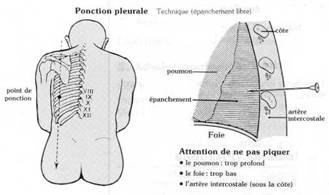
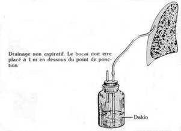

Tout épanchement dans la cavité pleurale doit être ponctionné :

<ul>
<li>pour en reconnaître la cause (tuberculose, pleurésie purulente, etc.),</li>
<li>pour soulager le malade si l'importance de l'épanchement le gêne pour respirer.</li>
</ul>

## I. Matériel

*   Alcool iodé.  
*   Compresses stériles.  
*   Aiguille munie d'un mandrin (type aiguille à ponction lombaire).  
*   Seringue de 20 cm3.  
*   Tubulure stérile.  
*   Bocal.  
*   Tubes stériles pour prélèvements.  
*   Xylocaïne à 1 %.  
*   Seringue de 10 cm3 et aiguille fine pour anesthésie locale.

## II. Technique

Le malade est assis confortablement. Chez le sujet craintif, une prémédication est nécessaire Atropine 0,25 mg SC.

doses pour adulte : Valium 10 mg IM

Une anesthésie locale est souhaitable. Injecter 2 à 3 cc de Xylocaïne à 1 % au lieu de péné­tration préalablement désinfecté à l'alcool iodé.

**Il faut ponctionner** :

*   **Perpendiculairement à la peau.**
*   **En pleine matité** _(percussion)._
*   En arrière à 10 cm de la ligne médiane _(en général sous la pointe de l'omoplate)._
*   Dans un espace intercostal en passant au bord supérieur de la côte inférieure pour ne pas piquer l'artère intercostale.

Après avoir traversé la peau et les muscles, il faut retirer le mandrin de l'aiguille et adapter la seringue. Dès lors, l'aiguille est enfoncée progressivement tout en aspirant à l'aide de la seringue.

Lorsque la cavité pleurale est atteinte, on per­çoit un léger ressaut et le liquide fait irruption dans la seringue. Il faut alors prélever du liqui­de pour les examens bactériologiques et chi­miques _(tube sec et tube avec anticoagulant)_.

Lorsque l'on désire évacuer l'épanchement, il faut adapter une tubulure _(type tubulure de perfusion)_ à l'aiguille préalablement fixée _(sparadrap)_ au thorax du sujet.

Il faut demander au malade de ne pas respirer pendant que l'on retire la seringue pour adap­ter la tubulure _(pour éviter la création d'un pneumothorax)_.

Avant d'être adaptée à l'aiguille, la tubulure doit être clampée et munie d'une seringue à son extrémité libre.

L'aspiration à la seringue permet ensuite d'amorcer l'évacuation du liquide.

La seringue est alors retirée et l'extrémité de la tubulure est placée dans un bocal posé par terre. L'évacuation du liquide se fait alors seule, **lente­ment**, sous surveillance continue du malade. Lorsque l'évacuation est terminée, l'aiguille est retirée d'un coup sec.

## **III. Incidents**

La piqûre d'un vaisseau intercostal est sans gravité. La piqûre du poumon est révélée par la venue de sang rouge dans la seringue, de la toux et parfois une hémoptysie témoignant que la pénétration était trop profonde _(il suf­fit de retirer l'aiguille d'un cm)._

L'évacuation trop rapide du liquide pleural est rarement responsable d'un oedème pulmonai­re _(toux, malaise, gêne respiratoire)_ nécessi­tant l'arrêt immédiat de la ponction.

La création d'un pneumothorax par piqûre du poumon est l'incident le plus fréquent _(il est le plus souvent minime)._

Les accidents neurologiques, la mort subite sont exceptionnels.

## IV. Drainage pleural

Il a pour but l'évacuation d'un liquide abondant :

*   pleurésie purulente,
*   hémothorax,
*   voire pneumothorax récidivant.

### 1. Matériel

De nombreux modèles existent :

*   cathéter monté sur mandrin métallique,
*   drain semi-rigide avec mandrin.

### 2. Technique

Prémédication : elle est souhaitable.

*   1/2 mg d'Atropine IM
*   10 mg de Valium IM pour adulte

**Lieu de drainage** : il est habituel de ponc­tionner les épanchements gazeux dans le deuxième espace intercostal en avant, un peu plus en bas et en dehors pour les épanche­ments liquidiens.

**Drainage** _(type drain avec mandrin)_ :

*   La peau est rigoureusement désinfectée.  
*   Anesthésie locale à la Xylocaïne à 1 % (10 à 20 cc).  
*   Le drain monté sur le trocart est alors enfon­cé perpendiculairement à la peau.  
*   L'irruption dans la plèvre se traduit par un ressaut. Le mandrin est alors retiré de 2 à 3 cm et le drain enfoncé de 2 à 3 cm.

La répétition de cette opération permet de mettre en place le drain sans risquer de léser le poumon avec le mandrin. Lorsque le drain est en bonne position, il est clampé **pour éviter l'entrée d'air dans la plèvre**.

L'extrémité libre du drain, une fois le mandrin retiré, est fixée et raccordée à un système d'aspiration (tubulure de 80 cm plongeant dans un flacon de Dakin). On fixera solide­ment le drain à la peau par un point en U. Si possible, vérifier sa position par une radio du thorax.

### 3. Intérêt des aspirations

On peut utiliser un système aspiratif (20 à 60 cc d'eau) de dépression en cas de pneumotho­rax grave (suffocant ou récidivant). En cas de pleurésie, le drainage simple suffit. Le drainage est laissé en place tant que du liquide s'écoule.  
Il faut vérifier souvent que le drain n'est pas obstrué (déboucher avec du sérum physiolo­gique si besoin).

### 4. Incidents

*   choc rare,
*   pneumothorax par blessure du poumon,
*   l'infection doit être prévenue en prenant des précautions chirurgicales lors de la mise en place du drain.

_Développement et santé, n°183, 2006_