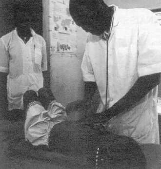

L'enfant est un être en développement, il n'est pas un adulte en miniature. La transformation physiologique qu'il subit au cours de la maturation modifient :

<ul>
<li>le devenir de nombreux médicaments (pharmacocinétique),</li>
<li>la réponse à certains médicaments (pharmacodynamie).</li>
</ul>

Ignorer ces particularités peut conduire à des accidents médicamenteux ou à l'inefficacité du traitement.

## I. Particularités pharmacocinétiques chez l'enfant

Dans l'organisme, les médicaments sont successivement résorbés, distribués, métabolisés puis éliminés.

### 1. Résorption

#### Voie orale

Chez le nourrisson, la lenteur de la vidange gastrique et la vitesse réduite de résorption intestinale font que les médicaments gagnent le sang plus tardivement, ils agissent donc plus lentement.

#### Voie rectale

La résorption des suppositoires est très variable, quel que soit l'âge, on ne connaît donc pas la dose de médicament qui sera active. Par conséquent, il est préférable d'éviter cette voie, sauf en cas d'intolérance gastrique ou de refus d'une forme orale. De plus la conservation des suppositoires est difficile en milieu tropical (à conserver au réfrigérateur). **Deux exceptions :** Le diazepam (Valium®) rectal, aussi efficace par la voie rectale que par I.V. et également la quinine intra-rectale.

#### **Voie intramusculaire**

La vitesse de résorption I.M. des médicaments est très diminuée chez le nouveau-né et le nourrisson car les masses musculaires sont faibles.  
Il vaut mieux éviter cette voie, sauf pour certains vaccins naturellement.

#### **Voie percutanée**

Attention ! La peau du nourrisson est très perméable et cela a entraîné beaucoup d'accidents.  
Il faut limiter l'application à de petites surfaces pour :

*   l'alcool iodé et les autres dérivés iodés (qui peuvent entraîner une hypothyroïdie),
*   la vaseline salicylée (car risque d'intoxication à l'aspirine),
*   de l'hexachlorophène,
*   les corticoïdes (risque d'hypertension intracrânienne),
*   avan t3 mois les pansements alcoolisés (risque d'intoxication éthylique).

Il faut **toujours préciser à** la mère la surface de peau à traiter pour éviter les surdosages.

#### Voie intraveineuse

S'il n'y a pas de particularités liées à cette voie, l'administration pose des problèmes techniques chez le nourrisson en raison du panicule adipeux et de la taille des veines. Des erreurs de doses sont fréquentes en raison des petits volumes à injecter.

Les plus graves surviennent avec :

*   la quinine,
*   la théophylline,
*   la caféine.

Enfin, les petits volumes injectés sont parfois totalement "perdus" dans les volumes morts des tubulures, d'où une inefficacité thérapeutique.

De plus, l'utilisation de la perfusion intraveineuse expose au risque de surcharge liquidienne car les volumes à perfuser pour passer les médicaments peuvent rapidement dépasser les quantités tolérées par l'enfant.

### 2. Distribution

Du fait de l'augmentation du volume extracellulaire (le corps de l'enfant contient plus d'eau que celui de l'adulte), les doses par kilo sont plus élevées chez l'enfant pour la plupart des médicaments (exemple : on donne 50 mg/kg d'amoxicilline chez l'enfant et seulement 25mg/kg chez l'adulte).

### 3. Métabolisme

**Avant trois mois, deux organes sont** **immatures, le foie qui transforme de** **nombreux médicaments et le rein qui** **élimine. Ainsi le chloramphénicol est** **dégradé très lentement (mieux vaut ne** **pas l'utiliser avant trois mois). Il en est** **de même pour la théophilline, l'atropine, mais aussi le triméthoprime-sulfaméthoxazole.**

**4. Elimination**

Chez le nouveau-né, la filtration glomérulaire équivaut à 30 % de celle de l'adulte. Elle est normale vers trois mois.  
Tous les médicaments à élimination urinaire s'accumulent dans l'organisme d'où risque d'intoxication. Cela est vrai pour :

*   les aminoglycosides (genatmycine),
*   les céphalosporines,
*   la digitaline (digitoxine),
*   le furosémide,

tous d'un usage courant (en cas d'infection ou de cardiopathie).

En pratique, avant 15 jours de vie, il faut espacer les prises, 1 à 2 par jour au lieu de 3 ou 4 par jour.

## Il. Particularités pharmacodynamiques

La réponse à certains médicaments peut être très différente chez l'enfant.

La tolérance aux médicaments est en général meilleure que chez l'adulte (tolérance gastrique en particulier).

A l'inverse, certaines complications sont uniquement pédiatriques :

*   les corticothérapies prolongées bloquent la croissance, ce qui peut conduire à une petite taille définitive,
*   les quinolones provoquent des douleurs articulaires, voire des lésions des cartilages de croissance,
*   la vitamine A et la vitamine D, à forte dose, peuvent entraîner une hypertension intracrânienne grave,
*   les cyclines prescrites avant l'âge de 7 ans provoquent une coloration inesthétique et définitive de l'émail dentaire.

Les médicaments administrés en fin de grossesse peuvent retentir chez le nouveau-né :

*   les benzodiazépines (diazépam) peuvent provoquer :
    *   troubles de la succion
    *   apnée
    *   hypotonie
*   les bêtabloquants peuvent provoquer :
    *   hypoglycémie
    *   bradycardie
*   les anti-inflammatoires non stéroïdiens peuvent provoquer :
    *   des malformations
    *   un accouchement prématuré
    *   une insuffisance rénale.

## III. Règles générales de prescription

**L'enfant est plus souvent exposé aux** **erreurs d'utilisation des médicaments,** **et cela pour diverses raisons :**

*   erreur de calcul des posologies ;
*   absence de formes pédiatriques : pas de comprimés ou de gélules avant 6 ans, ces formes peuvent provoquer des fausses routes : explique aux parents comment les écraser ou les ouvrir ;
*   intermédiaires entre le médecin et l'enfant.

Ainsi, prescrire en pédiatrie nécessite plus qu'ailleurs **prudence et rigueur,** tant sur le choix du produit que sur les quantités et sur le mode d'administration. Des accidents liés à une intoxication médicamenteuse secondaire à une mauvaise utilisation de produits surviennent régulièrement et des enfants sont hospitalisés en réanimation à cause de ces erreurs évitables.

_Développement et Santé, n° 159, juin 2002_