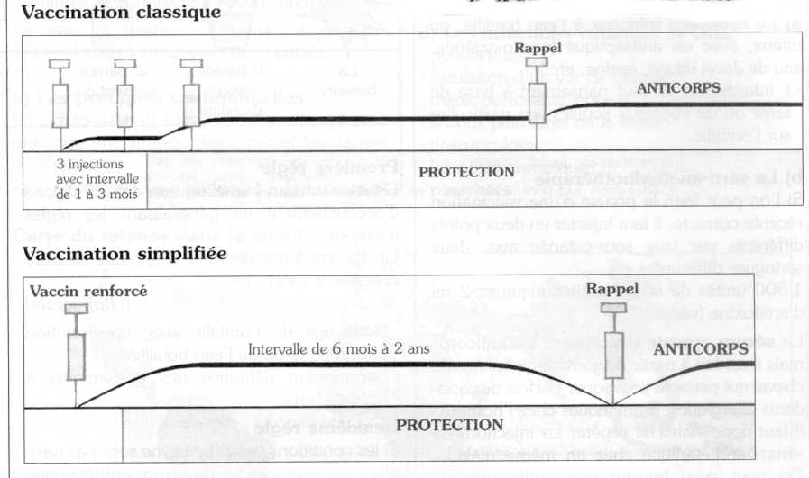

Le tétanos demeure une maladie redoutable qui, une fois déclarée, nécessite un traitement difficile et onéreux. Sa prévention, par contre, est facile et découle, en premier lieu, du traitement correct des portes d'entrées possibles. Toute plaie peut constituer une porte d'entrée, surtout si elle est souillée par la terre qui contient le bacille tétanique en spores. Le deuxième élément de prévention est la vaccination

<ul>
<li>vaccination devant toute plaie,</li>
<li>vaccination systématique de masse.</li>
</ul>

## **I. Les portes d'entrée**

### ****1. **Dans près de la moitié des cas, l'inoculation  
du bacille tétanique est traumatique :**

*   blessure des pieds ;
*   plaies par objets métalliques, écharde, épine, arête de poisson ;
*   brûlures se surinfectant secondairement.

Le risque du tétanos est évalué à 1 cas pour 1 000 blessures mineures chez l'enfant.

### **2. Les pratiques traditionnelles**

La circoncision et aussi l'excision clitoridienne ont tenu une grande place parmi les causes du tétanos.

Les scarifications, tatouages, les percées d'oreilles sont aussi souvent responsables, surtout si l'on applique des préparations végétales de terre, voire d'excréments animaux.

### **3. Inoculation obstétricale**

Il est rare qu'un accouchement provoque le tétanos chez la mère.  
Le tétanos après avortement provoqué se multiplie par contre dans les villes.

### **4. Les infections cutanées et ORL**

*   pyodermites,
*   fistulation d'un ver de Guinée,
*   maux perforants lépreux
*   lésions plantaires de la lèpre,
*   dracunculose,
*   otites chroniques,
*   pyorrhées.

### **5. Les accidents thérapeutiques**

Les interventions chirurgicales apportent toutes un risque, si une faute d'asepsie est commise.

Cependant, même faites dans de bonnes conditions, certaines interventions exposent au tétanos :

*   Occlusions, péritonites, césariennes, fractures ouvertes.  
*   Les injections intramusculaires représentent une cause redoutable (avec la Quinine surtout).  
*   Les vaccinations par scarification (variole, BCG) ont été accusées, en particulier lorsqu'une application de terre a été faite sur le vaccin.

Dans 1 0 à 20 % des cas enfin, on ne trouve pas de porte d'entrée, on pense que **le** **bacille passe alors par le tube digestif.**

## **II. La prévention**

Deux mesures s'imposent devant une plaie :

### **1.** Le nettoyage soigneux

A l'eau bouillie, ou mieux, avec un antiseptique (eau oxygénée, eau de Javel diluée, éosine, etc.).

L'interdiction de tout pansement à base de terre ou de végétaux souillés, en particulier sur l'ombilic.

### **2.  La séro-anatoxinothérapie**

Si l'on peut faire la preuve d'une vaccination récente correcte, il faut injecter en deux points différents par voie sous-cutanée avec deux seringues différentes :

1 500 unités de sérum antitétanique et 2 ml d'anatoxine (vaccin).

Le **sérum** apporte directement les anticorps mais il est fait à partir de gamma-globulines de cheval qui peuvent provoquer parfois des accidents allergiques, dramatiques chez l'homme. Il faut donc éviter de répéter les injections de sérum antitétanique chez un même malade. On peut aussi injecter une petite quantité de sérum, par exemple : 0,5 cc., attendre une demi-heure, et si le malade va bien, injecter le reste du sérum (méthode Besredka).

Le **vaccin** (anatoxine) va stimuler les défenses du sujet et le protéger beaucoup plus longtemps.

**Les gamma-globulines humaines antitétaniques** (préparées à partir de volontaires hyperimmunisés par le vaccin) **sont très efficaces préventivement et n'ont pas les dangers du sérum antitétanique.**

*   **Traitement préventif :** **250 unités = une ampoule.**
*   **Traitement curatif : 3000 à 6000unités.**

Elles sont malheureusement d'un **prix élevé.**

Pour entraîner une immunité solide, une seconde injection de vaccin sera effectuée 15 jours plus tard.

Si le blessé est vacciné depuis moins de 5 ans, on peut se contenter d'une injection de vaccin (2 cc. d'anatoxine).

### 3. Cas particuliers - tétanos ombilical

Il est si redoutable (mortalité 90 %) que tout doit être mis en oeuvre pour l'éviter.

### 4. Conduite à tenir devant une blessure

####   

  

Première règle

C'est avant tout l'amélioration des conditions d'accouchement en généralisant les règles d'asepsie.  
Un spasme survenant à la suite d'une blessure entraîne la mort. _(Hippocrate)_

*   Nettoyage de l'ombilic avec une solution antiseptique ou de l'eau bouillie.  
*   Suppression définitive des pansements à base de terre.

#### Deuxième règle

Si les conditions précédentes ne sont pas remplies, on peut injecter du sérum antitétanique au nouveau né.

-C'est efficace si l'on administre 750 unités internationales pendant les premières heures de vie. Cette mesure ne s'applique que si l'on découvre un ombilic sale ou très suspect d'infection.

#### Troisième règle

_Immunisation active de la mère_

Si la mère a des anticorps antitétaniques, on sait qu'ils vont traverser le placenta et donc protéger le nouveau-né. On peut donc :

*   Si la mère a été vaccinée avant sa grossesse, faire une simple injection de rappel.  
*   En l'absence de vaccination antérieure, administrer deux injections de vaccin à un mois d'intervalle.

**_Le tétanos tue 500 000 personnes par an dans le monde, les deux tiers ont moins de 20 ans._**

## **III. La vaccination**

Le vaccin antitétanique est le plus sûr, le plus efficace et le moins dangereux de tous les vaccins actuellement utilisés.

### **1. Vaccination classique**

Trois injections séparées par des intervalles de un à trois mois et suivies d'un rappel l'année suivante ou d'un rappel tous les 10 ans assurent une parfaite protection.

Malheureusement un tel nombre d'injections rend difficile la vaccination de masse.

### **2. Vaccination en deux temps**

En utilisant un vaccin 5 à 10 fois plus concentré et associé au phosphate d'alumine ou au calcium, il est possible d'obtenir avec une seule injection une bonne protection en quelques semaines.

Une seconde injection avec la même vaccin dans un délai de six mois à deux ans entraînera une parfaite immunité.

On comprend le progrès de cette méthode pour la vaccination de masse.

**_Le tétanos ne crée pas d'immunité, il ne faut donc pas oublier de vacciner un sujet qui vient de guérir du tétanos._**

_Développement et Santé, n°178, août 2005_