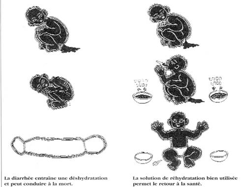
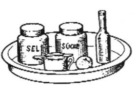
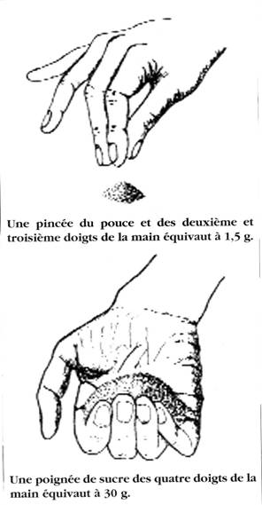

Les diarrhées aiguës sont l'une des premières causes de mort des nourrissons dans le monde. Leur rôle considérable et les difficultés fréquentes du traitement curatif justifient des mesures (le prévention.

Trois buts doivent être visés :

<ul>
<li>expliquer les causes des diarrhées et comment les combattre ;</li>
<li>expliquer les éléments de protection de l'enfant contre les diarrhées graves et comment les favoriser ;</li>
<li>expliquer les risques de la déshydratation et comment les contrôler.</li>
</ul>

<table>

<tbody>

<tr>

<td>Recommandations pour la prévention des diarrhées<ul><li>Education pour la santé</li><li>Vaccinations</li><li>Supplémentation en vitamine A</li><li>Assainissement, accès à l'eau</li><li>Nutrition</li><li>Lutte contre les maladies infectieuses</li></ul></td>

</tr>

</tbody>

</table>

## I. Les causes des diarrhées

Il s'agit le plus souvent d'agents infectieux transmis avec l'alimentation en raison du manque d'hygiène.

### 1. Mesures générales

*   L'usage des latrines, afin de bloquer la transmis­sion des microbes à partir des selles des malades, est surtout important chez le grand enfant. Il a peu d'effet chez le nourrisson.  
*   L'emploi d'une eau stérile dans l'alimentation de l'enfant est délicat à réaliser. L'usage de l'eau bouillie peut se heurter à des traditions contraires et se révèle parfois difficile lorsqu'il faut chercher et transporter du bois, faire chauffer et refroidir l'eau avec les ustensiles habituels.  
*   Le nettoyage des récipients à grande eau est moins précis mais paraît plus facile et s'est révélé efficace pour réduire la fréquence des infections à shigelles. Mais tant qu'il faut aller chercher de l'eau à une colonne d'alimentation centrale, elle est employée en petite quantité. Il faut apporter l'eau par canalisation non seulement dans les villages, mais jusque dans les foyers.

### 2. Mesures individuelles

Le lait maternel donné au sein est stérile, mais le biberon, lorsqu'il est utilisé, est le véhicule obliga­toire de la majeure partie de l'alimentation du tout petit et sa stérilisation est très difficile à assurer correctement. Actuellement, le biberon est l'une des principales causes indirectes des diarrhées aiguës.

Il est donc indispensable d'encourager l'allaitement maternel, sauf si la mère est VIH+, et de donner le complément à la cuillère, plus facile à nettoyer efficacement. On a pu dire que le biberon repré­sentait un fléau pour les nourrissons et on a parlé du "biberon qui tue".

Il faut expliquer à la mère que ce n'est pas tant la nature que la propreté de l'alimentation qui est responsable de la diarrhée.

## II. Les éléments de protection

Ils sont digestifs et nutritionnels.

### 1. Digestifs

Si les microbes arrivent dans l'intestin du grand enfant, ils rencontrent une barrière de protection qui les empêche de traverser la paroi : ce sont des protéines particulières (immunoglohulines A). Mais, chez le nouveau-né et le nourrisson, cette barrière n'est pas encore constituée, ce qui favorise les diar­rhées. Le lait maternel contribue à la constitution (le cette barrière à cet âge. Il joue ici un rôle protecteur très important et l'allaitement maternel doit être encouragé, sauf si la mère est infectée par le VIH.

### 2. Nutritionnels

Pour se défendre contre les infections, en particu­lier digestives, l'organisme a besoin de disposer d'un bon état nutritionnel. Une malnutrition, même modérée, et passée inaperçue de la famille vient favoriser et aggraver la diarrhée infectieuse. Les pesées régulières et la vérification que la courbe de poids se situe bien dans le "chemin de la santé" apprécient la qualité de l'état nutritionnel et permettent de corriger les anomalies. Si la malnutrition favorise la diarrhée, chaque diar­rhée est une cause de malnutrition et peut ainsi enclencher un cercle vicieux redoutable. La pré­vention de la diarrhée ne se conçoit pas sans la pré­vention de la malnutrition.

## III. Les risques de la déshydratation

Ils sont à envisager devant toute diarrhée. La mère devrait savoir déceler les premiers signes inquié­tants qui justifient de conduire l'enfant au centre de santé, et d'emblée lui donner un apport alimentaire adapté.

### 1. Les premiers signes

Ils ne sont pas toujours spectaculaires, mais l'ap­prentissage de petits signes doit affiner le sens de l'observation des mères.

Si l'enfant est "trop mou", si "ses yeux se ferment mal quand il dort", si la fontanelle se creuse, si la langue est sèche, "si l'enfant respire vite sans tousser", il convient de le conduire au centre de santé où une décision de perfusion intraveineuse pourra être prise en fonction des résultats d'une analyse plus complète.

### 2. L'apport alimentaire

Dès le début de la diarrhée, les liquides perdus doivent être remplacés par un apport non toxique pour le tube digestif. **Les solutés de réhydrata­tion sont la priorité absolue.**

Le lait maternel doit être conservé si la diarrhée ne paraît pas grave, puisqu'il fournit à l'organisme des moyens de défense importants.

<table>

<tbody>

<tr>

<td>La solution conseillée par l'OMS comprend :<ul><li>Chlorure de sodium (sel de table) :       3,5 g</li><li>Bicarbonate de soude :                         2,5 g      </li><li>Chlorure de potassium :                        1,5 g</li><li>Glucose (dextrose) :                             20,0 g</li></ul>

à dissoudre dans un litre d'eau propre (bouillie ou stérilisée).

</td>

</tr>

</tbody>

</table>

Ce qui est perdu en premier dans la diarrhée, ce sont l'eau et le sel. Mais pour que l'eau salée fournie soit absorbée par l'intestin et conservée par l'organisme, il faut lui ajouter du sucre. Elle peut être reconstituée à partir de sachets de poudre préparés par la pharmacie centrale d'ap­provisionnement. Mais ces sachets peuvent être élaborés sans difficulté par les pharmacies de dispensaires et d'hôpitaux ruraux.

Si la mère n'en dispose pas au début de la diarrhée de l'enfant, elle peut d'emblée lui donner une solu­tion "de début" faite simplement à la maison avec :

*   3 g de sel de cuisine (2 pincées)
*   4 g de sucre (8 morceaux)
*   le jus d'une orange (contenant du potassium)
*   pour un litre d'eau propre.

**Le nécessaire de réhydratation consiste en  
une gourde munie d'un bouchon pour conserver l'eau,  
une tasse assez grande, une boîte de sel et une boîte de sucre.**

La majorité des enfants diarrhéiques peuvent être convenablement soignés à la maison où la mère peut se constituer un "nécessaire de réhydratation". Il doit comprendre un récipient à bouchon, pour conserver l'eau destinée à l'enfant aussi propre que possible, des contenants bien hermétiques pour le sucre et le sel, une tasse et une cuillère. Il faut montrer à la mère comment préparer la solution juste avant de la donner à l'enfant.

## **IV. L'éducation sanitaire**

L'éducation sanitaire visant la prévention des diarrhées aiguës doit avoir plusieurs impacts :

*   La mère, lorsqu'elle est vue à l'occasion d'une diarrhée de son enfant, en consultation ou à l'hô­pital. L'accent doit alors être mis sur les risques de la déshydratation et leur contrôle, mais ne peut régler les autres buts.  
*   La mère, lors des séances régulières de PMI selon un programme pré-établi avec démonstrations pour apprendre à réaliser la "solution de réhydratation". Au cours des mêmes séances, on peut développer l'intérêt de l'allaitement maternel.  
*   A l'école, pour sensibiliser les enfants au problè­me de l'eau et de l'attitude à avoir devant les pre­miers troubles digestifs.  
*   Les chefs de famille et les responsables pour per­mettre un meilleur approvisionnement en eau et la confection locale de sachets de poudre permet­tant de reconstituer la "solution OMS".

_Développement et Santé, n°194, 2009_