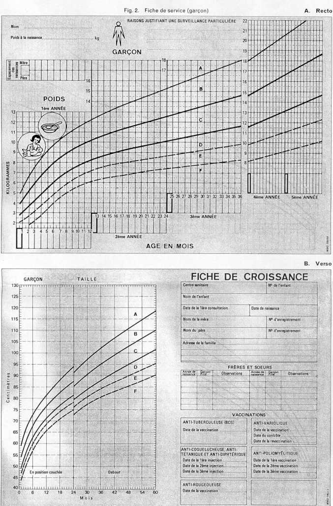
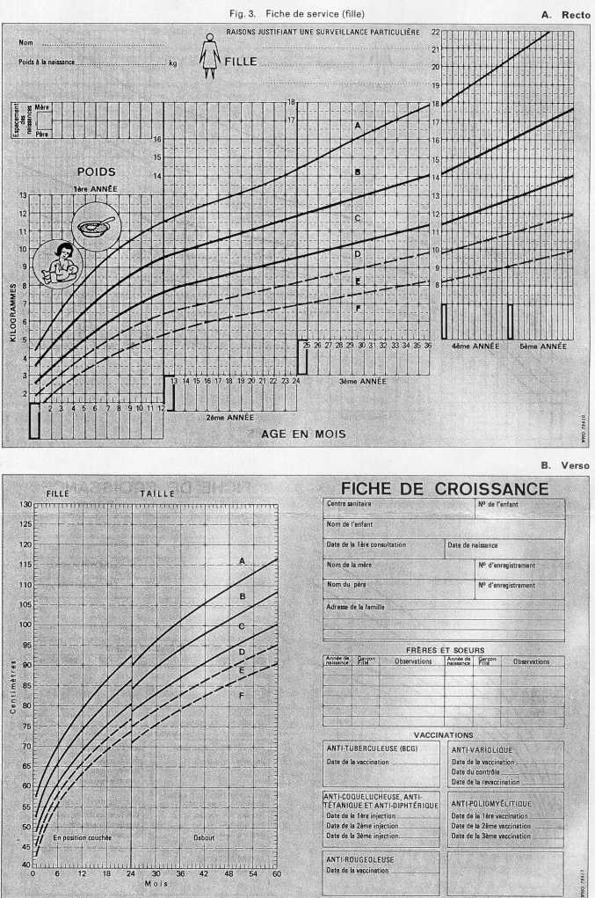

La prise en charge d'un enfant malnutri se place schématiquement dans trois types de circonstances :

1. Lorsque la malnutrition est assez importante pour constituer en soi un motif de consultation. Il s'agit alors de Kwashiorkor ou de marasme.

2. Lorsqu'un enfant est amené dans une structure de santé pour une maladie le plus souvent infectieuse et que l'examen trouve une malnutrition qui avait pu passer inaperçue.

3. Lorsqu'un enfant considéré comme bien portant par sa famille est vu à un examen systématique (vaccination, PMI) et que l'analyse de son poids et de sa taille permet de déceler une malnutrition modérée.

Dans les deux premiers cas, l'enfant est vu en hospitalisation et sera éventuellement adressé en centre de récupération nutritionnelle. Dans le troisième cas, l'enfant est suivi en PMI.

La malnutrition peut être facilement reconnue et classée selon l'échelle de Gomez basée sur le rapport entre le poids de l'enfant et le poids normal pour son âge.

La malnutrition du premier degré correspond à un poids compris entre 90 % et 75 % du poids normal.

La malnutrition du deuxième degré correspond à un poids compris entre 75 % et 60 % du poids normal.

La malnutrition du troisième degré correspond à un poids inférieur à 60% du poids normal ou à la présence d'oedèmes.

## En hospitalisation

Sont vus les enfants malnutris des 2e et 3e degrés. Un traitement symptomatique peut être indiqué d'emblée:

*   celui d'une déshydratation aiguë en prenant garde à deux dangers :

*   celui d'un diagnostic par excès: le pli cutané avec peau fine est plus le fait de la malnutrition elle-même que d'une déshydratation associée,
*   celui d'une surcharge en eau et en sodium et d'un déficit en potassium. La perfusion, si elle est indiquée, ne doit pas débuter par du sérum salé à 9%o, mais du glucosé à 5% avec 3 g de Cl Na et 3 g de Cl K par litre ;

*   celui d'une anémie, quelle qu'en soit la cause (hémolyse congénitale, paludisme, ankylostome, malnutrition elle-même), par transfusion sur la base de 20 ml/kg en l'absence de donnée de laboratoire ;
*   celui d'une infection patente qui est souvent le motif de consultation.

Une fois la malnutrition reconnue, il faut en préciser le type, essayer d'en déceler la cause, rechercher une infection associée et la traiter.

### Le type

La malnutrition peut porter sur l'ensemble des nutriments (calorique) ou préférentiellement sur les protéines (protéique). Elle est souvent mixte mais les déficits exclusivement calorique (marasme) et exclusivement protéique (Kwashiorkor) sont les plus spectaculaires.

L'enfant marastique a un déficit pondéral très supérieur au déficit statural. Sa maigreur est impressionnante. La peau fine laisse deviner des muscles atrophiques. Le visage est émacié, le regard vif. Une diarrhée est très souvent associée.

L'enfant atteint de Kwashiorkor est bouffi, ce qui masque en partie son déficit pondéral. La peau est d'épaisseur normale, parfois siège de zones hyper ou hypopigmentées. Les cheveux sont fins, secs et clairsemés. Il existe souvent des plaies au niveau des plis. L'enfant est apathique et grincheux.

Cette distinction clinique correspond à une différence biologique: en cas de marasme, la protidémie et l'albuminémie sont normales ou peu diminuées; en cas de Kwashiorkor, la protidémie et l'albuminémie surtout sont effondrées.

## La cause

L'interrogatoire de la mère et d'elle seule permet souvent de comprendre l'origine des troubles et d'aborder l'aspect préventif.

### Le mode alimentaire de l'enfant est fondamental à préciser :

*   _en cas de marasme_, il s'agit le plus souvent d'un enfant âgé d'un an ou moins, sevré trop rapidement (dans les premiers mois) et nourri de façon inadaptée au lait artificiel par biberon.  
*   _en_ cas de _Kwashiorkor,_ il s'agit le plus souvent d'un enfant âgé de plus de 18 mois et dont le sevrage s'est effectué à l'âge normal (entre 1 et 2 ans) mais trop brutalement.

### Une pathologie associée a pu aggraver le déséquilibre alimentaire

La rougeole est souvent responsable d'une perte de poids rapide. Des épisodes de diarrhée infectieuse aiguë, ou une diarrhée chronique, facilitée par la malnutrition viennent la renforcer par un véritable cercle vicieux.

### Une infection associée

Toute infection doit être reconnue et traitée d'emblée sous peine de rendre la réalimentation impossible ou inefficace. Sur un terrain de malnutrition, la pathologie infectieuse est souvent difficile à identifier; la fièvre peut manquer, les signes fonctionnels rester très discrets, l'examen clinique être pauvre ou normal.

La recherche doit donc en être systématique au niveau des organes le plus souvent en cause :

*   _les oreilles :_ l'absence de douleur et d'écoulement ne suffisent pas à éliminer une otite. L'examen à l'otoscope est indispensable ;
*   le _poumon_ : même en l'absence de dyspnée et de toux, l'auscultation doit être minutieuse, sans oublier le dos et les creux axillaires. Une radiographie du thorax pourrait montrer des images d'ampleur inattendue.  
*   _les urines_ : sans dysurie ou pyurie clinique, un examen simple à la bandelette (protéinurie modérée) ou mieux au microscope peut montrer des leucocytes en faveur d'une infection urinaire ;
*   _le paludisme :_ en pays d'endémie doit être traité systématiquement, même sans expression clinique ni biologique (Chloroquine 10 mg/kg/j).  
*   _les parasites intestinaux_ : doivent également être recherchés et traités systématiquement (Solaskyl 3 mg/kg en une prise, ou Mintézo150 mg/kg en une prise selon les parasites prédominant dans la région).

## Le traitement

Après avoir compris la cause de la malnutrition, avoir dépisté et traité les complications infectieuses, le traitement consiste en une alimentation adaptée en qualité et en quantité par le mode le plus efficace.

### Qualité

Pour fournir les éléments caloriques (100 à 200 cal. /kg) et protidiques (4 g/kg/j) nécessaires de la façon la plus simple et la plus facilement acceptable par l'enfant, c'est le lait sec demi-écrémé reconstitué et sucré au saccharose qui est l'aliment de choix.

En cas de malnutrition à prédominance protidique (type Kwashiorkor) il est utile d'ajouter 2 g de chlorure de potassium par litre de lait et, éventuellement, un complément protidique (protéolysat, hyperprotidine) de l'ordre de 10 g par litre de lait.

Dans les premiers jours, quel que soit l'âge de l'enfant, il vaut mieux se limiter à l'alimentation lactée qui risque d'être la mieux tolérée.

Parfois, cependant, le lait semble faire apparaître ou aggraver une diarrhée. Ceci est dû à une intolérance, en général transitoire, au sucre du lait (lactose) liée à l'état de malnutrition. Elle se corrige le plus souvent en quelques jours. Elle ne justifie l'arrêt de l'alimentation que si elle dure et se majore. Il faut alors tenter un régime sans lactose, difficile en l'absence de produits très onéreux du commerce (AL 110), viande mixée, bouillie de céréales (riz, mil, blé) à l'eau, jaune d'oeuf.

### Quantité

La ration de base est de l'ordre de 120 ml/kg/j. Elle doit être complétée par un apport digestif en eau, en cas de déshydratation modérée. Elle doit être limitée dans les premiers jours sous peine d'intolérance (80 ml/kg le premier jour, 100 ml/kg le deuxième, 120 ml/kg le troisième). En l'absence d'incident, elle doit être augmentée selon l'appétit de l'enfant, sans autre limite que sa satiété.

### Mode

L'alimentation normale par la bouche est toujours à essayer en premier lieu. Mais il existe souvent (surtout en cas de Kwashiorkor) une anorexie invincible. Il faut alors, sans attendre, gaver l'enfant en lui donnant au moins six repas par cette voie. II peut être bon, surtout en cas de troubles digestifs, de fragmenter encore davantage l'alimentation: en huit gavages par exemple. La nutrition entérale à débit constant (gavage continu) est mieux tolérée mais réclame théoriquement une pompe régulatrice. En son absence, la sonde peut être raccordée par une tubulure au lait placé dans un flacon de perfusion. Mais le débit naturellement irrégulier (il s'agit d'une émulsion) doit être constamment surveillé et le flacon périodiquement agité. Ceci peut être confié à la mère qui reste auprès de son enfant.

Lorsque l'appétit est revenu, après avoir été testé, le gavage peut être arrêté. L'alimentation peut alors se faire au biberon ou à la cuillère. Il vaut mieux cependant éviter le biberon, source de contaminations bactériennes et que la mère nourrisse d'emblée son enfant à la cuillère.

A ce stade (qui réclame en général une semaine), une diversification de l'alimentation est possible en utilisant les denrées locales: mil, blé, maïs, sorgho, manioc, oeufs, viande, poissons, fruits. II est alors souhaitable que l'enfant et sa mère puissent bénéficier d'un centre de récupération nutritionnelle pour coupler l'amélioration de l'état de l'enfant à l'éducation nutritionnelle de la mère.

## En centre de récupération nutritionnelle

Un tel centre concerne les malnutritions modérées après un séjour, en hospitalisation ou dépistage en PMI. Le but est une éducation nutritionnelle des mères dans un cadre aussi proche que possible de celui de leur vie quotidienne, sous la surveillance d'une structure de santé. Il est bon qu'il se situe à distance de l'hôpital (pour ne pas être assimilé à un centre de soins) et qu'il soit installé dans des maisons ou concessions traditionnelles (pour bien marquer que ce qu'on y apprend doit correspondre à la vie de tous les jours). Une animatrice locale y prend en charge une dizaine de mères avec leurs enfants malnutris et conseille ou équilibre leur alimentation à partir du marché du village, sans produit importé. Le spectacle de l'amélioration de l'état de leur enfant grâce aux repas qu'elles font elles-mêmes, avec des denrées locales est le meilleur éducateur. Au bout de trois semaines environ, l'état de l'enfant et l'éducation de la mère leur permettent de rentrer chez eux. Mais ils devront être suivis en PMI.

## En Protection Maternelle Infantile

La surveillance de l'état nutritionnel est, avec les vaccinations, le but principal de la PMI. La prise du poids et si possible de la taille (en position couchée avant deux ans, et debout après deux ans) sont les premiers gestes de la consultation de PMI.

L'OMS propose deux types de fiches :

*   une fiche de service, gardée dans le fichier PMI où sont inscrites de façon précise la courbe de poids et la courbe de taille normale ainsi que leurs variations normales (couloirs B et C) ou anormales (couloirs A, D, E, F);

*   une fiche familiale, confiée à la mère où est inscrite une zone correspondant aux variations normales du poids. Si le poids de l'enfant se situe en dehors de ce " chemin de santé ", il est malnutri.

Dans un premier temps, l'analyse des causes par l'interrogatoire de la mère et les conseils de régime avec démonstrations donnés en conséquence peuvent amener aux consultations suivantes un retour du poids dans la zone normale. Si, dans un deuxième temps, malgré ces conseils, le poids continue à s'écarter de la zone normale, l'enfant et sa mère devraient bénéficier d'un centre de récupération nutritionnelle ou, à défaut, de consultations plus fréquentes (tous les quinze jours).

En cas d'échec, dans un troisième temps, ' l'hospitalisation peut _être_ jugée nécessaire si elle vise non seulement le traitement de l'enfant mais aussi l'éducation de la mère.

L'ampleur des problèmes économiques et sociaux n'est pas seule en cause dans l'apparition de la malnutrition de l'enfant. L'éducation nutritionnelle et la prévention des infections permettent au moindre frais de limiter le problème : elles sont le rôle essentiel des structures de santé.

_Développement et santé, n°32, avril 1981_