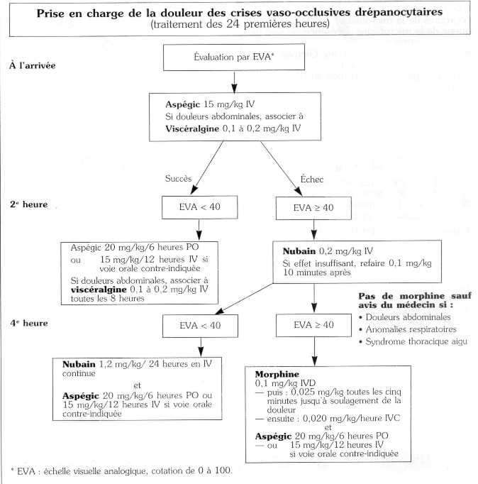

Consensus du Réseau INSERM, Paris, 1996.

Depuis dix ans, un réseau d'étude de la drépanocytose a été créé en France pour suivre les drépanocytaires. En 1997, plus de mille malades ont été régulièrement suivis.

De nombreuses études prospectives ont été réalisées et ont abouti à une amélioration considérable de la prise en charge des complications et des moyens préventifs.

Voici, en complément de l'article du Docteur Mohamed Chérif Rahimi, l'arbre décisionnel sur la prise en charge de la douleur, établi de façon consensuelle.

_Développement et Santé, N° 132, décembre 1997_