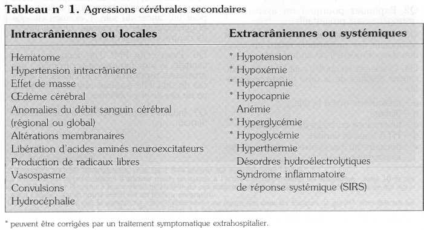
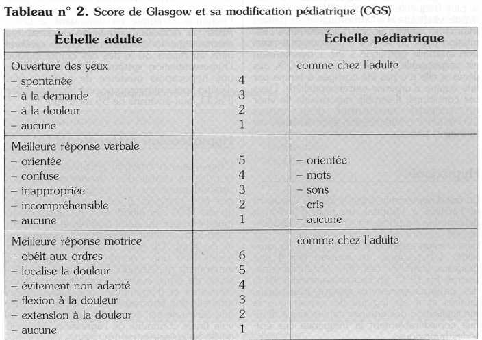
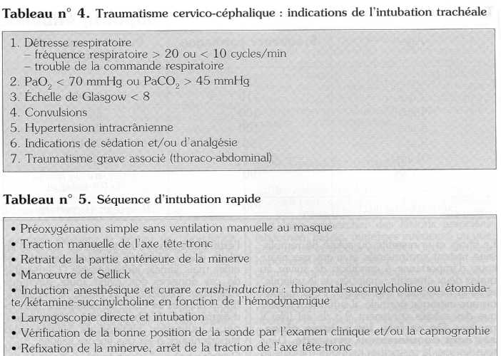
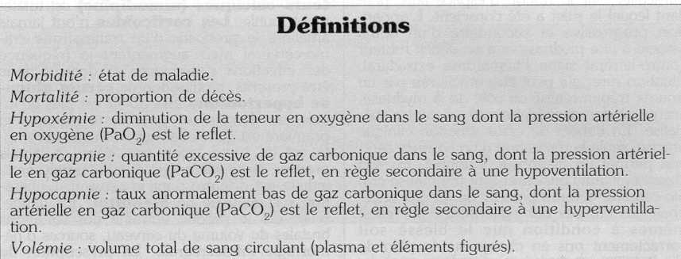

**Prise en charge des traumatisés crâniens : les priorités**

**par P. Adnet* et R. Gauzit****

* Service d'Accueil et d'Urgences du CHRU de Lille, Hôpital R.-Salengro, 59037 Lille Cedex.  
** Médecin Anesthésiste-Réanimateur DAR, Hôpital Jean-Verdier, 93143 Bondy Cedex.

L'aggravation en chaîne des lésions initiales du cerveau (contusion, attrition, cisaillement) débute immédiatement après le traumatisme crânien. L'origine de cette agression cérébrale secondaire est soit intra-, soit extracrânienne (_tableau n° 1_). S'il n'est pas possible à l'heure actuelle de protéger directement le cerveau par l'utilisation de médicaments spécifiques, il est réaliste, en revanche, de concentrer ses efforts sur l'amélioration de la prise en charge initiale des patients victimes d'un traumatisme cranio-cérébral (TCC) grave. L'objectif est de diminuer l'incidence des agressions cérébrales secondaires d'origine systémique qui alourdissent la morbidité* et la mortalité*. Contrôler les agressions cérébrales secondaires d'origine extracrânienne passe par l'amélioration des traitements symptomatiques initiaux qui doivent être débutés dès la prise en charge du patient, poursuivis pendant le transport, à l'arrivée dans un service d'urgences, lors de la réalisation d'examens complémentaires puis à l'admission dans un service spécialisé. Cette notion de "chaine de protection cérébrale continue", doit être respectée en permanence. Notre exercice quotidien nous montre à l'évidence qu'il existe de nombreuses périodes à " risque " lors, par exemple, des transferts extra- et intrahospitaliers ou encore pendant la réalisation d'examens complémentaires (angiographie, scanner) : le patient peut alors perdre tout ou partie de ses chances de récupération.

**Physiopathologie appliquée**

Au niveau du point d'impact (choc direct ou par contre-coup), les lésions cérébrales vont de la simple commotion qui récupère intégralement à l'attrition associant destruction des axones et hémorragies. Les lésions des zones de pénombre (situées autour des points d'impacts traumatiques directs) sont faites d'extravasations vasculaires, d'obstructions des microvaisseaux.

Le débit sanguin cérébral (DSC) après un traumatisme crânien est pratiquement toujours diminué initialement jusqu'à la 6è heure) et se situe au-dessous du seuil critique d'ischémie pour un tiers des patients (33 %). Secondairement (après la 6e heure), l'incidence de l'ischémie diminue rapidement (rééquilibration du DSC) montrant qu'une prise en charge tardive est peu utile. Il faut donc considérer tout patient victime d'un traumatisme cranio-cérébral en état d'ischémie cérébrale ; aussi, rétablir et/ou maintenir une pression de perfusion cérébrale donc une pression artérielle normale est une priorité absolue qui doit être prise en charge comme un arrêt cardio-circulatoire.

**Principaux mécanismes responsables des agressions cérébrales secondaires**

**Hypotension artérielle**

C'est l'agression cérébrale secondaire de loin la plus fréquente et la plus délétère. On sait depuis vingt ans que la mortalité d'un patient traumatisé crânien double s'il présente à l'admission dans un service d'urgence une pression artérielle systolique < 90. L'hypotension est responsable, à elle seule, de 60 % des décès si elle n'a pas été corrigées temps par une équipe d'urgence extrahospitalière. Dans ces conditions, il semble raisonnable de viser un objectif tensionnel d'au moins 120 mmhg. L'hypotension peropératoire est tout aussi néfaste.

**Hypoxémie***

En cas d'hypoxémie entre le lieu de l'accident et l'arrivée à l'hôpital, un taux d'évolution défavorable de 50 % est observé. Le pronostic est encore plus sombre s'il existe une hypotension artérielle associée (75 % de mortalité). L'hypoxémie est souvent liée à une mauvaise libération des voies aériennes supérieures. En 1993, en France, seulement 40 % des patients comateux étaient transportés intubés et il est logique de penser que la médicalisation des équipes de secours a diminué considérablement la fréquence des épisodes hypoxiques.

**Hypercapnie***

La grande majorité des patients comateux (score de Glasgow < 8) sont hypercapniques avant les gestes de libération des voies aériennes supérieures avec ou sans intubation trachéale. Le traumatisme cranio-cérébral est presque toujours associé à une hypoventilation, elle-même corrélée à la profondeur du coma. L'obstruction partielle des voies aériennes supérieures en est la principale cause. L'hypoventilation centrale se voit plus rarement et doit faire rechercher une lésion de la moelle cervicale. Une souffrance médullaire aiguë de niveau supérieur à C4 se traduit par un tableau de choc spinal associant une hypotension artérielle associée à une bradycardie sinusale, une paralysie flasque, une détresse respiratoire avec hypercapnie, une rétention aiguë d'urine.

**Hypocapnie***

Pour une pression artérielle normale, la réponse du débit sanguin cérébral (DSC) est presque linéaire entre 20 et 80 mmhg de pression artérielle en gaz carbonique a (PaCO2) : réduire de moitié la PaCO2 de40 à 20 mmHg divise par deux le DSC. De même, doubler la PaCO2 de 40 à 80 mmHg double le DSC. L'hyperventilation diminue la pression intracrânienne mais risque d'augmenter l'ischémie cérébrale en diminuant le DSC. Aussi, la réduction spontanée du DSC qui accompagne le traumatisme cranio-cérébral dans au moins 30 % des cas contre-indique l'hyperventilation systématique. En pratique, une hypocapnie modérée de sécurité, afin d'éviter toute hypercapnie, est recommandée (PaCO2 aux environs de 35 mmHg).

**Hypertension artérielle (HTA)**

L'hypertension artérielle en phase initiale de la prise en charge d'un traumatisme cranio-cérébral grave est très fréquente et ne doit pas être corrigée. Il est possible, en effet, qu'une HTA soit plutôt utile. Il faudrait avant tout s'enquérir du statut tensionnel du patient avant le traumatisme (hypertendu connu, traité ou non). Un sujet âgé tolérera d'autant moins bien une "normotension" qu'il était auparavant hypertendu. En pratique, en l'absence de signe évident d'hypertension intracrânienne et d'anamnèse, une hypertension artérielle doit être respectée parce que l'ischémie cérébrale est, comme nous l'avons vu, la voie finale commune de l'agression cérébrale quelle qu'en soit la nature.

**Conduite pratique**

Tout patient comateux (score de Glasgow < 8) doit être considéré comme porteur d'une lésion du rachis cervical jusqu'à preuve du contraire. La mise en place d'une minerve ou de deux sacs de sable en région cervicale sera systématique. Toute mobilisation du sujet devra maintenir la tête en position axiale. Une fois les variables respiratoires et hémodynamiques vérifiées, un examen neurologique initial sera effectué sur les lieux de l'accident.

**Bilan neurologique**

L'examen évaluera le niveau de conscience par le score de Glasgow. Cette échelle graduée est simple, rapide et reproductible, permettant une transmission facile entre les différentes équipes qui recevront le blessé. L'état de coma se définit comme un score de Glasgow inférieur à _8 (tableau n°_ 2). C'est un indice pronostique de grande valeur, bien corrélé à la gravité des lésions et au risque de décès quels que soient les moyens mis en œuvre secondairement. Une adaptation de la réponse verbale aux enfants de moins de deux ans est nécessaire. Lorsque le patient ne peut

ouvrir les yeux pour des raisons externes (hématome, traumatisme direct), le score est compté 1. Si la réponse aux stimulus est asymétrique - par exemple le patient évite le stimulus à gauche et ne réagit pas à droite -, le score est compté 4. La stimulation doit être réalisée par un frottement appuyé sur le sternum pendant 5 à 10 secondes. Le pincement du mamelon ne doit pas être le stimulus douloureux car non symétrique.

**État hémodynamique**

Un traumatisé crânien pur est rarement choqué, s'il l'est, c'est que son état neurologique est très grave. Un collapsus cardiovasculaire doit faire rechercher des lésions associées (abdomen, bassin, membres inférieurs) ou une atteinte de la moelle épinière. Cette dernière hypothèse doit être évoquée devant un syndrome vagotonique associant : bradycardie, hypotension artérielle et hypothermie. Dans tous les cas, restaurer une pression artérielle normale en fonction de l'âge est une priorité absolue. La pression artérielle varie en fonction de l'âge _(tableau n°_ 3). Le traitement doit être aussi agressif que celui réalisé lors d'un arrêt cardio-circulatoire et fait appel au remplissage parfois associé aux vasopresseurs.

Le choix et la quantité du soluté de remplissage restent controversés et n'ont pas beaucoup d'importance à condition de suivre au moins deux objectifs : maintien de la volémie* et de la natrémie à 140 Meq/I. Pour maintenir une natrémie normale, il suffit de n'utiliser que des solutés contenant 9 g de sel (NACI) par litre. **De ce fait, les solutés glucosés sont unanimement proscrits.** Dans tous les cas, la restriction hydrique n'a plus sa place dans la prise en charge initiale car elle est source d'hypotension artérielle et de baisse de la pression de perfusion cérébrale. Pendant longtemps, les cristalloïdes (sérum salé, ringer lactate) ont été bannis de toute réanimation neurochirurgicale. Cette attitude était justifiée par l'apparition d'oedèmes périphériques chez des patients ayant reçu de grandes quantités de ces liquides. En fait, les cristalloïdes n'ont probablement pas leur place en cas de choc hypovolémique, le volume de distribution du sérum salé étant tel (volume extracellulaire) qu'il faudrait perfuser au moins 4 litres pour compenser la perte d'un litre de sang. **Par contre, le sérum** **salé est le soluté de choix pour maintenir une hydratation normale du** **patient (maintien d'une normo-natrémie).** Le ringer lactate n'est pas iso-osmotique (273 mOsm.L-1) et ne devrait pas être administré mais, à défaut, il convient mieux que le sérum glucosé. En cas d'hypotension, les colloïdes et les hydroxy-éthyl-amidons sont les solutés à utiliser en première intention. Ces solutés accentuent l'anémie responsable d'une augmentation parfois considérable du débit sanguin cérébral (mécanisme compensateur de la baisse du contenu artériel en O2). Un patient jeune peut supporter un taux d'hèmoglobine égal à 7 g/dl (hématocrite à 25%). Le remplissage sera guidé par l'interprétation raisonnée de la pression artérielle, la fréquence cardiaque, le débit urinaire, et l'estimation des pertes sanguines. La mise en place d'une pression veineuse centrale est utile, mais jamais indispensable. L'ensemble de ces données doit éviter toute surcharge volémique fréquente à la phase de récupération d'un état de choc hémorragique (risques d'aggravation de l'hypertension intracrânienne) . L'utilisation clinique de solutés salés hypertoniques n'est pas encore validée.

Certains auteurs nient toute indication des agents vasopresseurs dans la phase initiale de réanimation du polytraumatisé. En fait, l'effet désastreux de l'hypotension artérielle lors d'un traumatisme cranio-cérébral sévère fait recommander le recours précoce à des agents vasopresseurs. Les catécholamines (dopamine, adrénaline, noradrénaline) devraient faire partie de l'arsenal thérapeutique initial pour le maintien à tout prix de la pression de perfusion cérébrale.

**État respiratoire**

Tout patient ayant un score de Glasgow inférieur à 8 doit bénéficier d'une intubation trachéale et d'une ventilation contrôlée compte tenu du retentissement majeur des variations de pression artérielle en oxygène (PaO2) et surtout de PaCO2 sur le débit sanguin cérébral. D'autres indications sont résumées dans le _tableau n°_ 4. La fréquence d'une lésion cervicale associée au traumatisme cranio-cérébral est estimée entre 1,8 et 10 %. Aussi, toute manoeuvre visant au rétablissement de la liberté des voies aériennes supérieures doit prendre en considération le risque potentiel de déplacement secondaire d'une fracture cervicale instable. Différentes techniques ont été décrites. Les points importants résident dans le maintien de l'axe tête-tronc et la détection d'une difficulté à l'intubation (corps étranger, traumatisme facial, fracture mandibulaire). Un exemple de séquence rapide d'intubation trachéale peut être proposé _(tableau n° 5_). En l'absence de détresse respiratoire aiguë, plusieurs techniques sont possibles : intubation nasale à l'aveugle, intubation rétrograde, fibroscopie bronchique lorsque c'est possible.

Dès que la liberté des voies aériennes supérieures est assurée, la majorité des patients développe une hyperventilation centrale neurogénique qui peut induire une hypocapnie parfois importante (risque d'ischémie cérébrale). Ailleurs, une respiration anarchique peut être observée. Dans ces différents contextes, la ventilation mécanique aidée d'une sédation permet d'optimiser au mieux la PaCO2 d'autant que la marge thérapeutique (35 mmHg < PaCO2 < 40 mmHg) est étroite.

**Sédation et analgésie**

La sédation doit être précoce car elle fait partie intégrante de la chaîne de protection cérébrale. Son indication doit cependant passer après l'évaluation des détresses vitales et le bilan neurologique initial. L'agitation d'un patient peut être le symptôme d'une hypoxie, d'une hypertension intracrânienne, d'une hémorragie ou d'une douleur importante ; il est donc impératif de réaliser un examen clinique complet avant toute prescription. L'administration d'un agent anesthésique ou sédatif ne doit pas se faire au détriment du maintien de la pression artérielle et doit donc être particulièrement prudente chez un patient hypovolémique. L'ensemble de ces précautions prises, il n'existe que des arguments favorables à une sédation précoce du patient traumatisé cranio-cérébral : aide à l'intubation trachéale, adaptation au respirateur, lutte contre la douleur, diminution des besoins en nutriment du cerveau. En revanche, l'argument contre une sédation qui occulte toute surveillance clinique est un faux problème.

- L'imagerie par scanner cérébral, et la possibilité de répéter cet examen si nécessaire, rend désormais possible de " protéger " médicalement le cerveau dès la phase préhospitalière. Tout traumatisé cranio-cérébral devrait bénéficier au plus vite d'un scanner cérébral qui, seul, orientera la thérapeutique à suivre. Secondairement, lorsque l'évolution scanographique le permettra, des " fenêtres " thérapeutiques s'avéreront nécessaires afin de suivre cliniquement l'évolution du patient. Dans l'immédiat, laisser un patient comateux et agité, lutter contre le respirateur afin qu'un neurochirurgien puisse l'examiner cliniquement est une " aberration " clinique qui ne devrait plus exister. Depuis l'excellence de l'imagerie, et en dehors du score de Glasgow initial (réalisé par un médecin non spécialiste ou un infirmier), il n'a jamais été prouvé qu'un examen neurologique spécialisé précoce avait une quelconque utilité sur le pronostic du patient.

- **En l'absence d'imagerie par scanner cérébral, la radiographie de** **crâne, face et profil, n'est d'aucune** **utilité chez un patient comateux.**

On peut donc s'en passer tout en prenant en charge correctement le patient. Il faut insister, ici, sur la valeur de l'examen clinique et, en particulier, sur la notion d'espace libre pendant lequel le sujet a été conscient. L'apparition progressive et secondaire d'un coma associé à une mydriase et à un déficit moteur contro-latréral signe l'hématome extradural, situation rare, qui peut être améliorée par un trou de trépan réalisé du côté de la mydriase, avant transfert secondaire vers un centre spécialisé. En dehors de cette situation clinique précise, seule la réalisation d'un scanner cérébral permet un diagnostic lésionnel. En son absence, il faut considérer tout traumatisé cranio-cérébrai comme porteur de lésions encéphaliques diffuses qui " guériront " par elles-mêmes à condition que le blessé soit correctement pris en charge sur le plan de l'hydratation, de la nutrition et du nursing.

**Glycémie**

La grande majorité des patients traumatisés cranio-cérébraux sont hyperglycémiques et il est préférable de n'utiliser que du sérum salé en surveillant régulièrement la glycémie. La même attitude peut être recommandée chez l'enfant en sachant qu'une hypoglycémie survient plus rapidement (réserve du foie en glycogène moindre) ; il est dès lors préférable d'apporter du glucose dès la 12è heure après le traumatisme sous forme iso-osmotique (glucose additionné de 9 g de NaCI/l).

**Thermorégulation**

Une hyperthermie, observée chez des patients atteints de lésions cérébrales majeures, est associée à un mauvais pronostic. L'effet protecteur cérébral d'une hypothermie modérée est connu mais son efficacité reste toujours controversée. Une hypothermie profonde (32°C) augmente le risque d'arythmies ventriculaires graves sans bénéfice supplémentaire pour le patient. Un réchauffement rapide pendant la période post-traumatique immédiate peut être source d'hypertension intracrânienne. En pratique, il est licite de respecter l'hypothermie d'un patient dans une fourchette raisonnable (32 < température < 36).

**Quelle stratégie thérapeutique ?**

Tout traitement n'est que symptomatique. Aucune molécule n'a, en effet, montré une quelconque activité de protection cérébrale après un traumatisme crânien.

Aussi, la prescription systématique **d'oxygénateur cérébral (piracétam), d'inhibiteurs calciques (nimodipine)** est totalement inutile. **Les** **corticoïdes** n'ont jamais amélioré le pronostic d'un traumatisme cranio-cérébral mais augmentent la fréquence des infections systémiques et doivent donc être proscrits. L'utilisation de **sérum glucosé hypertonique** (SG 30 %) est plus qu'inutile car dangereuse pour deux raisons : la première est que l'effet hypertonique escompté est de toute façon transitoire et jamais prouvé ; la deuxième est que l'hyperglycémie induite est délétère pour le cerveau. L'utilisation systématique de **Mannitol**®est dangereuse car le produit entraîne des variations brutales du volume du cerveau, sources d'hémorragie intracérébrale. La prescription de **diurétiques de l'anse (furosémide)** est formellement proscrite. **L'apport hydrosodé** est de l'ordre de 15 à 20 ml/kg de sérum salé, soit environ 1 litre pour un patient de 60 kg. Il n'est pas nécessaire de surveiller la glycémie les 48 premières heures car le traumatisme cranio-cérébral grave est pratiquement toujours hyperglycémique. En revanche, l'hypoglycémie est plus précoce chez l'enfant et l'administration de glucosé dès la 12e heure après le traumatisme est recommandée (par exemple, 15 à 20 ml/kg de sérum glucosé à 5 % additionné de 9 g de NaCI par litre). **L'alimentation précoce par voie entérale** à l'aide d'une sonde gastrique est le meilleur garant du maintien de l'homéostasie du sujet. Cette hydratation peut d'ailleurs être débutée par sonde gastrique, dans les 24 heures qui suivent un traumatisme cranio-cérébral en l'absence de contre-indication abdominale et après protection des voies aériennes supérieures d'un patient dans le coma. Le soluté le plus efficace est dès lors la solution de réhydratation orale distribuée par l'OMS. **L'antibioprophylaxie** ne doit pas être systématique sauf s'il existe une fracture ouverte de la voûte du crâne ou une suspicion de fracture de la base (hématome en lorgnette, présence de sang au niveau du conduit externe de l'oreille, écoulement de liquide céphalorachidien au niveau du nez).

**Conclusion**

Une amélioration de la prise en charge des paramètres vitaux respiratoires (intubation trachéale, ventilation assistée) et hémodynamiques (remplissage vasculaire adapté), et surtout une sensibilisation des équipes de transfert dans leur rôle crucial de surveillance ont abouti à une diminution des épisodes d'hypoxie et d'hypotension avec une amélioration corollaire du pronostic. Aussi, la majorité des progrès résultent directement de l'éducation et de l'entraînement des médecins et infirmiers, et peu des nouvelles technologies.

Il faut bien reconnaître qu'en matière de traumatisme cranio-cérébral, nous ne possédons aucun traitement spécifique à disposition mais que, seul, un ensemble de petits moyens, directement inspiré des connaissances actuelles de la physiopathologie, permet au mieux d'améliorer la survie, au pire, de ne pas aggraver le pronostic déjà sombre d'un patient atteint d'un traumatisme cranio-cérébral.

_Dévelopement et Santé, n°135, juin 1998_