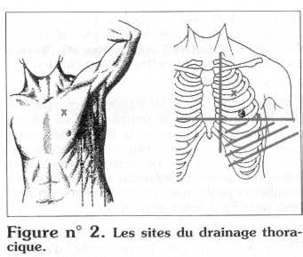
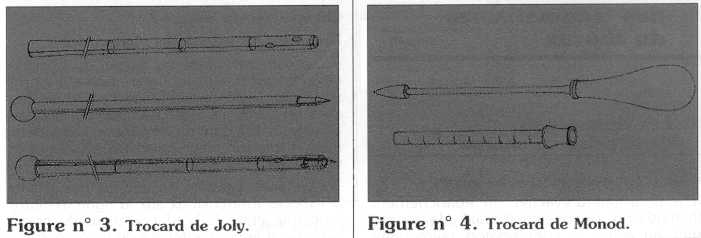
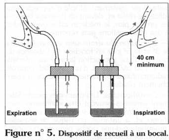
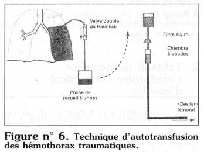
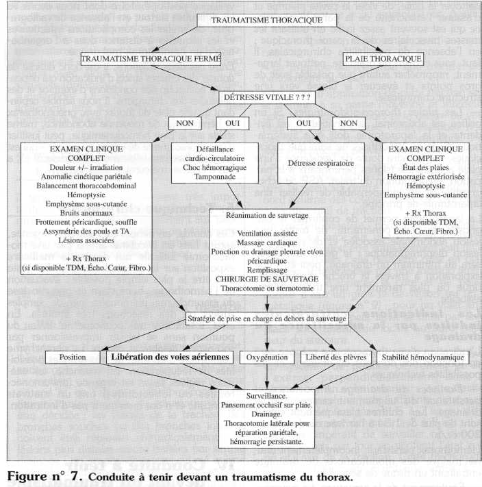
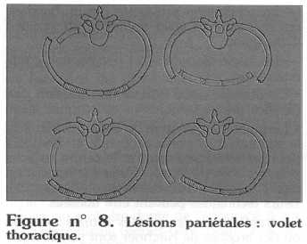
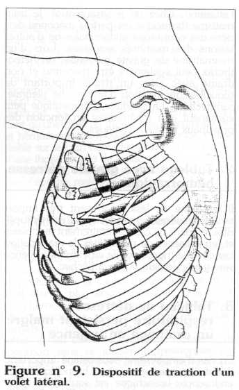
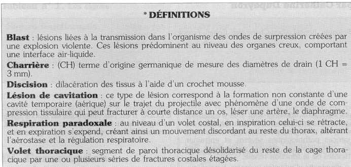

**Prise en charge des traumas thoraciques : attitudes pratiques**

**par F. Pons* et B. Tremblay****

* Service de chirurgie viscérale et thoracique, hôpital d'Instruction des Armées, Percy, Clamart, France.  
** Service de chirurgie thoracique et vasculaire, hôpital Avicenne, Bobigny, France.

Les traumatismes thoraciques sont un problème redouté en particulier lorsque les moyens d'agnostiques et le plateau technique sont limités. L'évolution immédiate ou différée de ces traumatismes peut mettre en jeu la fonction circulatoire et respiratoire et peut évoluer rapidement vers une issue fatale. Pourtant des moyens thérapeutiques simples, au premier plan desquels l'utilisation judicieuse du drainage thoracique, permettent de traiter efficacement 80 % de ces traumatismes.

**I. Mécanismes et conséquences** _(figure n°_ 1)

**1. Mécanismes**

Parmi les traumatismes thoraciques, il faut distinguer 2 mécanismes :

*   _Les traumatismes ouverts ou plaies du thorax_

Ils sont provoqués par des armes blanches, des projectiles divers (balles, éclats), parfois des cornes d'animaux (et il faut souligner le caractère particulièrement septique de ces plaies). Lors d'une plaie thoracique, il y a ouverture de la cavité pleurale et si l'orifice est volumineux, cette cavité peut communiquer directement avec le milieu extérieur, on parle alors de plaie thoracique soufflante. Souvent, lorsque l'orifice est petit, les plans musculaires assurent une étanchéité au niveau de la plaie.

*   _Les traumatismes fermés_

Ils sont la conséquence de mécanismes de contusion, d'écrasement ou de chutes (accidents de la circulation ou d'abattage d'arbre, rixes, lynchages). La paroi du thorax est atteinte ainsi que son contenu mais il n'y a pas de communication avec le milieu extérieur.

**2. Conséquences**

Quel que soit le mécanisme, les lésions peuvent intéresser la paroi du thorax (côtes, sternum, rachis, vaisseaux intercostaux), les poumons et l'arbre trachéo-bronchique, le médiastin (coeur et gros vaisseaux, oesophage).

Les conséquences sont doubles : l'hémorragie et le risque respiratoire.

*   _L'hémorragie_

Elle se fait le plus souvent dans la cavité pleurale réalisant alors un hémothorax qui peut provoquer un choc hémorragique et une compression du poumon ou du médiastin, s'il est de grande abondance.

*   _Le risque respiratoire ou risque d'asphyxie_

Il peut être en rapport avec :

_- un pneumothorax_, présence d'air dans la plèvre provenant d'une plaie du poumon ou d'une bronche ou d'une plaie ouverte du thorax. Cet épanchement gazeux peut entraîner un pneumothorax compressif ;

_- une obstruction des bronches ou de la_ _trachée_, par rupture directe, par inondation de sang ou par encombrement secondaire chez un blessé algique qui ne tousse plus ;

_- des lésions du parenchyme pulmonaire par plaie directe ou par contusion pulmonaire_ qui altèrent les échanges gazeux. Les contusions pulmonaires s'observent surtout dans les traumatismes fermés graves mais peuvent aussi accompagner les plaies par balle à grande vitesse ou avec explosion réalisant des lésions de " cavitation " ou de _" blast* "_ ;

_- une perte de stabilité de la paroi thoracique ou un_ _volet thoracique*_ qui, en se mobilisant à contretemps, réalise une respiration paradoxale*.

**Il. Prise en charge des traumatismes du thorax**

**1.Les trois armes de la prise en charge**

*   _Le drainage thoracique ou pleural_

Il a pour but d'évacuer un épanchement (hémothorax ou pneumothorax), de supprimer ou éviter la compression pulmonaire et/ou médiastinale provoquée par cet épanchement et de recréer le vide pleural nécessaire pour maintenir le poumon en contact avec la paroi et permettre sa réexpansion.

*   _La réanimation_

Les gestes de base sont toujours: compenser une hémorragie par le remplissage vasculaire et la transfusion, assurer la liberté des voies aériennes, assister la ventilation si l'on dispose d'oxygène et de possibilités d'intubation (tableau critères d'intubation trachéale) et de ventilation prolongée, ce qui implique un plateau technique assez développé.

*   _La chirurgie_

Elle a pour but, par thoracotomie, d'arrêter une hémorragie et de réparer des lésions importantes pariétales ou trachéo-bronchiques; elle ne demande pas de matériel spécifique par rapport à la chirurgie viscérale mais elle nécessite parfois une ventilation prolongée du blessé dans les suites opératoires.

La prise en charge d'un traumatisé du thorax peut donc être difficile pour un médecin ou un infirmier isolé ne disposant généralement pas de possibilité de ventilation prolongée et de peu de possibilités chirurgicales ; dans ces conditions d'exercice, la seule arme dont on dispose toujours est le drainage thoracique et il est donc impératif de pouvoir le mettre en oeuvre de manière optimale.

Nous envisagerons donc successivement les modalités du drainage thoracique, les indications thérapeutiques dans les plaies du thorax, les indications thérapeutiques dans les traumatismes fermés.

**2. Drainage thoracique ou pleural**

La mise en place d'un drain thoracique est précédée chaque fois que possible d'une radio afin de confirmer et de préciser le siège de l'épanchement.

**_Où mettre le drain ?_**

Deux sites sont classiques _(figure n° 2)_

- _La voie antérieure au niveau du 2e espace intercostal sur la ligne mamelonnaire verticale._ C'est la technique la plus simple chez un blessé allongé par terre ou chez un polytraumatisé dont on ne peut relever le bras mais la mise en place peut être gênée par le volume du muscle grand pectoral.

- _La voie axillaire au niveau des 4e ou_ _5e espaces intercostaux sur la ligne axillaire_ _moyenne_ entre le bord postérieur du grand pectoral et le bord antérieur du grand dorsal.

L'introduction est généralement plus facile car le gril costal est directement sous la peau.

Le choix entre les deux n'a pas une très grande importance. Elle est fonction des habitudes et des circonstances ; si l'on ne dispose pas de possibilités d'aspiration, il faut préférer le siège axillaire car le drainage se fait plus facilement par simple gravité.

Mais deux principes sont à respecter : jamais au-dessous de la ligne mamelonnaire horizontale (risque de traverser le diaphragme et de blesser foie ou rate) ; ne pas utiliser un orifice de plaie (risque de reprise hémorragique et risque d'infection).

**_Quel matériel utiliser ?_**

Un drain trocart de Joly (_figure n° 3_) ou un trocart de Monod _(figure n° 4),_ plus sûr, de bon calibre: 24 ou 28 CH (Charrière*). En fait, on utilise les tuyaux dont on dispose, éventuellement une sonde urinaire ou un simple tuyau sur lequel on crée des orifices supplémentaires, en choisissant toujours un gros calibre pour éviter qu'il ne soit bouché par les caillots.

**_Comment mettre un drain ?_**

- Faire une anesthésie locale et une ponction préalable avec une longue aiguille pour confirmer l'épanchement liquidien ou gazeux. Si l'on ne trouve pas d'épanchement en ponctionnant, il faut essayer à un autre endroit. Cette ponction préalable doit être systématique et à plus forte raison si l'on n'a pas pu faire de radiographie pulmonaire.

- Faire une incision toujours large (2 à 3 cm), vraie " minithoracotomie " qui doit permettre l'introduction d'un doigt dans la plèvre. C'est le meilleur moyen pour éviter une blessure du poumon.

- " Disciser* " les muscles avec une pince si possible (type Christophe, Kelly ... ).

- " Racler " le bord supérieur de la côte inférieure (pour éviter le pédicule intercostal qui suit le bord inférieur de la côte).

- Diriger le drain vers le haut et en arrière (pneumothorax), vers le bas et en arrière (hémothorax).

- Fixer solidement le drain à la peau et laisser un fil en attente par un point en U.

**_Appareillage et maintenance du_ _drainage_**

Les difficultés commencent lorsque le drain a été mis en place: comment l'équiper et comment le surveiller ? Un système de drainage pleural doit être :

_- aseptique_ : manipuler avec précautions, faire un pansement autour du drain, ne pas repousser un drain dans le thorax, ne pas réutiliser un orifice ancien ;

- _perméable_ : un drain non fonctionnel car bouché est inutile (voire dangereux en cas d'épanchement compressif). Il faut " traire " le drain plusieurs fois par jour à la main ou à la pince pour fragmenter d'éventuels caillots ; cette traite peut être confiée après éducation au blessé ou à la famille accompagnante ;

_- irréversible_ : c'est-à-dire que les liquides et l'air ne doivent jamais pouvoir retourner vers le patient : pour cela il faut deux choses : un récipient pour recueillir le liquide et un système dit antiretour qui interdit le passage de l'air ou du liquide vers le patient.

Plusieurs systèmes antiretour sont possibles. Le plus simple est réalisé par une poche à urine comme récipient et une valve unidirectionnelle de Heimlich entre le blessé et la poche. En l'absence de valve de Heimlich, un doigt de gant fendu et noué sur le drain peut en tenir lieu mais reste cependant d'efficacité moyenne (la poche à urine doit être percée pour permettre l'évacuation de l'air). Autrement, un système avec un bocal et de l'eau _(figure n° 5_) fait à la fois office de récipient et de dispositif antiretour. Le tuyau venant du drain (patient) est plongé dans l'eau de 2 cm ce qui interdit à l'air de revenir, un tube court ne plongeant pas dans le liquide où un orifice fait communiquer le bocal avec l'atmosphère. Ainsi toute ré-entrée d'air est impossible lors des mouvements inspiratoires mais une remontée liquidienne est toujours possible lors de mouvements très amples et, il faut, pour l'éviter, que le bocal soit au moins à 40 cm au-dessous du thorax du patient. Il est donc important que ces patients ne soient pas allongés par terre ; au fur et à mesure que le niveau du liquide monte, l'aspiration devient moins efficace et il faut changer le bocal ou remonter le tuyau dans le liquide ; des dispositifs plus efficaces (mais plus compliqués) avec deux, voire trois bocaux peuvent aussi être utilisés.

_- Aspiratif_ : l'idéal est de raccorder le (ou les bocaux) à une aspiration, ce qui facilite la vidange pleurale et la ré-expansion pulmonaire ; mais ceci est souvent impossible dans des structures limitées car on dispose rarement de source de vide et l'on peut avoir recours à d'autres solutions : _siphonnage simple_ où l'évacuation du liquide se fait par simple gravité et qui peut être efficace si le drainage est parfaitement surveillé ; _traite régulière de la_ _valve de Heimlich_ par le blessé lui-même ou par son entourage après éducation ; _aspiration discontinue plusieurs fois par_ jour en fonction des disponibilités du matériel et des infirmiers, en utilisant une aspiration à pied type Pedavid ou un petit aspirateur électrique.

- _Un dispositif de retransfusion_. Il faut citer l'intérêt de l'autotransfusion (_figure n° 6_) dans une structure où les disponibilités en produits sanguins sont limitées. Le sang recueilli dans une poche à urine pourra être immédiatement retransfusé au patient après filtrage en utilisant une tubulure de transfusion.

Il faut souligner que lorsque l'on appareille un drain thoracique, un des principaux problèmes est celui des raccords. Si l'on ne dispose pas de raccords du commerce, il est généralement facile d'en fabriquer avec des bouts de tuyaux et de caoutchouc. Il est donc indispensable que tout médecin ou infirmier isolé ait prévu, avant de recevoir en urgence un traumatisé du thorax, et en fonction du matériel dont il dispose, les différents raccords nécessaires depuis le patient jusqu'au dispositif de recueil ou de retransfusion. Un système complet et cohérent doit ainsi être prêt et stérilisé. Il faut vérifier régulièrement le montage : drains, tuyaux, raccords. Tous les raccords doivent être apparents et non dissimulés par des pansements pour éviter qu'ils ne se désadaptent sans que l'on s'en aperçoive.

**_Surveillance du drainage_**

La surveillance clinique est pluriquotidienne auscultation du patient, palpation à la recherche d'un emphysème sous-cutané, inspection des tuyaux et raccords, examen de la poche ou du bocal : aspect et quantité du liquide, existence d'un bullage.

- _La radiographie pulmonaire_, idéalement, est quotidienne et sera refaite après toute modification du drainage. En pratique, après mise en place du drain, une radiographie pulmonaire au lit est rarement possible et la position des drains ne peut être contrôlée. Par la suite, il est également difficile d'apprécier leur efficacité réelle et, devant un drain qui bulle ou ne produit plus, le médecin est souvent réduit à des interrogations sans réponse.

_- L'ablation du drain_ sera envisagée entre le 3e et le 5 e jour en fonction de l'absence du bullage, d'une production liquidienne inférieure à 150 cc/24 h et d'un éventuel contrôle radiographique confirmant l'absence d'épanchement résiduel.

_- Complications._ Les drainages incomplètement surveillés peuvent être insuffisants avec un risque immédiat de surinfection et de pyothorax et, à distance, un risque de séquelles (organisation d'une poche pleurale, pyopneumothorax chronique).

**III.** **Conduite à tenir** **devant une plaie** **du thorax**

**1. Examen et bilan initial**

À l'arrivée, sera pratiqué un examen rapide du blessé et un premier bilan :

- Aspect général, état hémodynamique, pouls, TA.

- Examen du ou des orifices (toujours retourner avec précaution le blessé pour rechercher un orifice postérieur) afin d'essayer de préciser le trajet : Y a-t-il passage à travers le médiastin ? Y a-t-il lésion d'un ou des deux hémithorax ? Y a-t-il pénétration abdominale ?

- Auscultation et percussion des deux hémithorax à la recherche de signes d'épanchement gazeux ou liquidien, auscultation des bruits du coeur qui peuvent être plus ou moins déplacés.

- Palpation de l'abdomen à la recherche de signes évoquant une lésion abdominale associée.

À l'issue de ce bilan, plusieurs tableaux peuvent être individualisés et la conduite à tenir en découle _(figure n° 7_).

**2.Tableau de détresse** **circulatoire chirurgical** **d'emblée**

_- Deux indications chirurgicales de sauvetage._

*   Tableau de détresse circulatoire majeure par hémothorax massif qui nécessite une thoracotomie d'extrême urgence du côté de la plaie.

*   Tableau de tamponnade avec une plaie dans l'aire cardiaque. Le tableau associe jugulaires turgescentes, position allongée insupportable, baisse de la TA, assourdissement des bruits du coeur avec une plaie dans l'aire cardiaque limitée en haut par les clavicules, en dehors, par les lignes mamelonnaires et en bas par l'auvent costal qui impose une sternotomie ou une thoracotomie d'hémostase en urgence.

_- Dans une structure peu équipée, l'indication chirurgicale ne doit pas être récusée_ _de principe._

Un hémothorax massif peut être dû à une plaie minime d'une artère intercostale qu'un simple point en X suffira à traiter ; de même, une plaie du coeur par arme blanche qui a pu arriver jusqu au chirurgien est souvent de petite taille et de traitement facile. Une thoracotomie d'extrême urgence peut donc sauver le patient si les lésions sont limitées et rapidement traitées.

Les indications de ces thoracotomies de sauvetage doivent aussi être pesées en tenant compte des possibilités techniques locales mais aussi du contexte social, politique ou culturel et après avoir prévenu l'entourage (un décès sur table peut être interprété soit comme un échec que l'on pourra reprocher au chirurgien, soit inversement comme la preuve qu'il a fait tout ce qu'il pouvait devant une telle situation).

_- Technique anesthésique et chirurgicale._

L'induction anesthésique ne se fera si possible qu'après drainage thoracique.

L'abord de ces blessés ne peut se faire qu'en décubitus dorsal (l'état hémodynamique ne permet pas de tolérer un décubitus latéral), en mettant un coussin sous l'épaule pour pouvoir latéraliser un peu le patient.

La voie sera une thoracotomie antérolatérale du côté de la plaie (incision sous le bord inférieur du grand pectoral) ou une sternotomie médiane verticale si une plaie du coeur est suspectée et si l'on dispose du matériel nécessaire.

**3. Tableau de détresse respiratoire non chirurgical d'emblée**

Il faut s'assurer de la liberté des voies aériennes.

- _Thorax soufflant évident :_ il faut en urgence obturer la plaie avec un gros pansement humide pour arrêter le cercle vicieux de la compression et il est impératif de mettre un drain pour éviter d'enfermer un épanchement compressif. Le drain peut être mis selon les modalités décrites précédemment ou si l'orifice de la plaie est très important, le drain peut être provisoirement introduit dans cet orifice sous contrôle visuel. En règle générale, il faut toujours éviter d'utiliser l'orifice de la plaie.

- _Pneumothorax ou_ _hémothorax mal supporté_ : il faut ponctionner en urgence pour exsuffler puis mettre un drain qui le plus souvent améliorera rapidement l'état respiratoire.  

**4. Blessé ne présentant pas** **de détresse vitale**

Le cas, heureusement le plus fréquent, est celui d'un blessé du thorax stable ou rapidement stabilisé après une courte réanimation sur le plan circulatoire et respiratoire. Il peut bénéficier d'un bilan un peu plus important, en particulier une radiographie pulmonaire recherchant les signes d'un épanchement et un éventuel projectile. Un abdomen sans préparation sera également réalisé. En fonction du plateau technique dont on dispose, on peut également pratiquer une échographie abdominale pour éliminer un hémopéritoine, voire un examen tomodensitométrique.

Tout épanchement justifie la mise en place d'un drain thoracique. La conduite thérapeutique ultérieure et les indications chirurgicales seront guidées par la surveillance de ce drainage.

**_Les indications chirurgicales liées_** **_au type de_** **_lésions_**

_- Les gros délabrements pariétaux_. Le geste chirurgical a pour but de parer et de

nettoyer la plaie, de vider la cavité pleurale et d'assurer l'étanchéité de la paroi thoracique, ce qui est souvent assez facile en utilisant les masses musculaires de la paroi thoracique ; en l'absence de possibilités chirurgicales, il faut, sous couvert du drainage, nettoyer largement, rapprocher autant e possible avec de gros points et évacuer leu blessé vers une structure chirurgicale.

_- Les plaies thoraco-abdominales_. Si un orifice est abdominal, la pénétration est évidente et la laparotomie oit être systématique. Si le ou les orifices ne sont que thoraciques, au moindre doute de l'existence d'une plaie abdominale (signes péritonéaux à la palpation, reconstitution du trajet, ASP ou échographie), il est indispensable de réaliser une laparotomie de principe.

La laparotomie permet de confirmer le diagnostic de plaie pénétrante, de traiter une lésion abdominale associée et de réparer la lésion diaphragmatique ; le geste thoracique sera au minimum un drainage, peut-être une exploration à travers la brèche diaphragmatique ou plus rarement une thoracotomie associée.

**_Les_ _indications_ _chirurgicales_ _induites par la surveillance du_ _drainage_**

L'indication d'une thoracotomie précoce sera en fonction des données du drainage et des possibilités techniques.

_- Données du drainage._ Importance et persistance du saignement ramené par le drainage. Les chiffres classiquement admis sont de plus de 1,5 I à l'arrivée ou de plus de 300 cc/h.

Hémothorax persistant, incomplètement drainé malgré des modifications de drainage entraînant un risque de séquelle.

_- Équipement de la structure_. Le pourcentage de ces thoracotomies pour plaies du thorax est en fait très variable allant de 20 à 80 % ; en effet, les indications dépendent beaucoup du contexte.

Dans une structure très bien équipée permettant une surveillance précise de l'efficacité du drainage, les indications sont assez rares.

Dans une structure peu équipée avec peu de possibilité de surveillance et de réanimation mais disposant d'un chirurgien, les indications d'une thoracotomie pour hémothorax peuvent être plus larges. Cela a l'avantage de limiter la réanimation et les besoins de rem plissage d'un hémothorax qui continue à saigner, de pouvoir faire d'emblée un bilan et un traitement précis des lésions avec une hémostase et une pneumostase soigneuse, d'avoir la certitude d'une bonne position des drains et par la suite de simplifier grandement la survaillance postopératoire dont nous avons vu les difficultés surtout en l'absence de radiographie, de limiter les complications infectieuses et les séquelles à distance dues à l'organisation d'un hémothorax mal drainé.

Entre ces deux situations, il est donc difficile de donner des critères stricts d'indication qui dépendront beaucoup des conditions d'exercice et des habitudes des chirurgiens. Il nous semble cependant qu'une plaie du thorax avec pneumothorax et hémothorax de moyenne abondance, même stable sur le plan hémodynamique, peut justifier d'une thoracotomie de " mise au propre " qui est un geste avec une faible morbidité lorsqu'il n'y a pas d'exérèse majeure).

**5. Technique chirurgicale**

Ces abords, en dehors de l'extrême urgence, seront faits en décubitus latéral par une thoracotomie latérale qui donne la meilleure exposition sur la cavité thoracique. Le geste doit être le plus simple possible : évacuation de l'hémothorax, hémostase et pneumostase du parenchyme pulmonaire par de simples sur ' jets ou des résections très limitées. En effet, il faut être très économe au niveau du poumon sans se laisser impressionner par son aspect délabré et contus. Le parenchyme pulmonaire a en effet de très grandes possibilités de récupération. En revanche, les exérèses réglées faites en urgence (pneumonectomies ou lobectomies) ont un mauvais pronostic et n'ont quasiment pas d'indication.

**IV. Conduite à tenir devant un traumatisme fermé**

**1. Examen et bilan initial**

Un examen clinique précis et une radiographie pulmonaire systématique chaque fois que possible seront les éléments indispensables du bilan initial de tout traumatisé ; il faut souligner dans les traumatismes fermés la relative fréquence des hémothorax en deux temps, d'où la nécessité d'examens cliniques répétés et d'une nouvelle radiographie pulmonaire systématique avant la sortie chez tout traumatisé du thorax, même si la radiographie pulmonaire initiale était normale, et une à distance (à 15 jours - un mois si possible).

La conduite thérapeutique est souvent plus difficile car il n'y a pas d'orifice pour attirer l'attention. Chez un polytraumatisé, le traumatisme thoracique est parfois méconnu derrière des contusions abdominales ou d'autres lésions des membres associées. Lors d'un traumatisme de gravité moyenne, un hémothorax peut également être méconnu et non drainé avec alors un risque important de séquelles (organisation d'une poche pleurale, surinfection). La conduite thérapeutique peut également être schématisée en fonction des principaux tableaux cliniques.

**2. Tableau avec grande détresse hémorragique**

Il témoigne de lésions souvent très importantes, bilatérales ou associées à un hémopéritoine ; dans ce cas, contrairement aux plaies et, en l'absence de possibilités de réanimation lourde, une thoracotomie en extrême urgence sera généralement vouée à l'échec.

**3. Tableau de détresse respiratoire persistant malgré un drainage en urgence**

En cas d'emphysème sous-cutané important, il faut suspecter une rupture bronchique ; une endoscopie bronchique est souhaitable pour la mettre en évidence ; si l'emphysème s'étend et en l'absence de fibroscopie, une thoracotomie du côté du traumatisme peut être décidée ; les lésions de la trachée, des bronches souches ou des bronches lobaires doivent être réparées chirurgicalement ; les lésions plus distales seront traitées par simple drainage; un emphysème sous-cutané qui ne s'étend pas et sans détresse respiratoire n'est pas l'indication d'une exploration chirurgicale et se résorbera le plus souvent spontanément dans les 3 ou 4 jours.

En cas de grande lésion pariétale (volet thoracique) (_figure n°_ _8)_ le volet thoracique se mobilisant à contretemps (respiration paradoxale), se pose la question de la nécessité d'immobiliser ce volet. En fait, la détresse respiratoire accompagnant un volet est plus souvent la conséquence de la contusion du poumon sous-jacent que du volet lui-même.

_Le traitement d'une contusion étendue._ Ce ne peut être que l'intubation et la ventilation prolongée dont nous avons vu les limites ; cependant, en l'absence de possibilité de réanimation, la stabilisation d'un grand volet peut aider à améliorer la fonction respiratoire et à passer un cap.

_Les méthodes d'immobilisation d'un_ _volet_ sont :

- Immobilisation provisoire par un bandage quimaintient le volet immobile en position

d'impaction.

- La suspension du volet par traction continue :

*   Le principe est d'exercer une traction perpendiculaire au volet.

*   Le point d'application de cette traction sera le sternum à sa partie moyenne et inférieure pour les volets antérieurs et le centre du volet pour les volets latéraux. Cette méthode n'est pas applicable aux volets postérieurs. Plusieurs techniques peuvent être utilisées :

_La traction sur les parties molles_ : des fils ou des broches de Kirchner sont passés à travers la peau au centre du volet en rasant le bord externe des côtes et reliés par des étriers à un dispositif de traction.

_La traction osseuse_ : pour un volet latéral, la traction s'exerce sur une côte au centre du volet et le fil doit être suffisamment loin du ou des deux foyers ; elle peut être mise en place sous anesthésie locale par une incision limitée permettant d'aborder la côte et de passer autour d'elle un gros fil de Nylon ou un fil métallique (_figure n° 9_) ; pour un volet antérieur, la traction peut aussi se faire par un fil placé sous anesthésie locale au bord postérieur du sternum.

Le dispositif de traction doit être installé avec un système de poulies de renvoi et doit s'exercer perpendiculairement, donc au zénith pour un volet antérieur ; cette traction doit être souple et juste suffisante pour maintenir le volet (en général 5 à 7 kg au début puis rapidement diminuée à 2 à 3 kg) ; il est bien sûr impératif de surveiller ce dispositif plusieurs fois par jour en vérifiant l'état cutané et l'axe de la traction. Cette traction doit être théoriquement maintenue entre 15 et 20 jours.

La persistance ou l'apparition progressive d'une détresse respiratoire, malgré un drainage efficace et une éventuelle immobilisation d'un volet, doit faire suspecter d'importantes lésions de contusions pulmonaires ; la traduction radiologique de cette contusion est souvent différée au 2e ou au 3e jour; le seul traitement est une ventilation assistée si l'on en a la possibilité.

**4. Blessé ne présentant pas** **de détresse vitale**

C'est aussi le cas le plus habituel et la conduite thérapeutique consiste à essayer d'éviter l'encombrement des voies aériennes en prescrivant un traitement antalgique des fractures costales, en aidant le patient à tousser (clapping, kinésithérapie respiratoire).

Tout épanchement justifie la mise en place d'un drain thoracique.

Les indications de thoracotomie sont également induites par la surveillance du drainage, devant un hémothorax abondant ou persistant avec des chiffres identiques ou devant un hémothorax mal drainé risquant de se compliquer.

En pratique, les indications de thoracotomies pour un traumatisme fermé sont beaucoup moins fréquentes que dans les plaies.

**V. Conclusion**

Les traumatismes graves du thorax avec tableau d'hémorragie massive sont relativement rares et justifient une thoracotomie dont l'indication peut être large en cas de plaie et beaucoup plus réservée en cas de traumatisme fermé . Ce geste chirurgical doit être considéré comme un "quitte ou double", dont il faut avoir prévenu l'entourage.

La majorité des traumatismes seront efficacement traités par le drainage pleural sous réserve de placer le drain correctement et surtout de le surveiller avec efficacité. Tout

médecin ou infirmier exerçant dans des conditions limitées doit donc, en fonction du matériel dont il dispose, avoir mis au point un système cohérent de drainage et un protocole de surveillance.

Les indications de thoracotomies restent réduites à moins de 20 % des blessés mais paradoxalement des conditions limitées de surveillance et de réanimation peuvent inciter à augmenter ces indications afin d'essayer de limiter les séquelles.

_Développement et Santé, n°141, juin 1999_