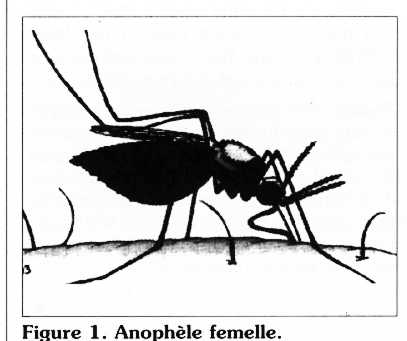
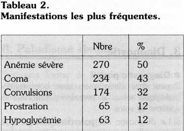
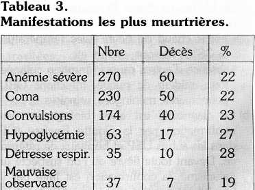
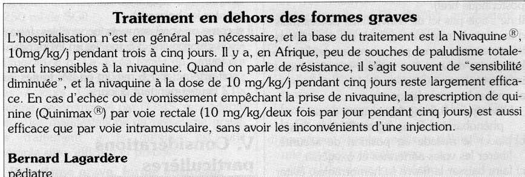

Le paludisme est la première cause de morbidité dans les pays africains et souvent une fréquente cause de mortalité, en particulier dans les groupes vulnérables que sont les enfants, les femmes enceintes et les voyageurs.

## I. Introduction

Le paludisme est une maladie parasitaire endémo-épidémique due à un hématozoaire, le *Plasmodium* *(falciparum*, *vivax, ovale, malariae)* ; ce *Plasmodium* est transmis à l'homme par la piqûre d'un moustique, l'anophèle femelle *(figure 1*).

L'OMS estime à 2 milliards le nombre de sujets exposés à la maladie. Chaque année, on enregistre 200 millions de cas dont 2 millions de décès, en majorité des enfants de moins de 5 ans et des femmes enceintes, soit un mort toutes les 15 secondes !

Il s'agit donc d'un problème majeur de santé publique, cause d'absentéisme scolaire et de gène considérable des activités de production et un frein potentiel au développement des pays d'endémie palustre.\*

*\* Voir l'article de Pierre Gazin, "Epidémiologie du paludisme en Afrique tropicale et en Asie du 'Sud-Est"*

## II. Axes stratégiques de lutte contre le paludisme

Face à ce fléau mondial, l'OMS et les autorités sanitaires ont adopté de nombreuses stratégies, notamment :

- la prise en charge correcte des cas,
- la chimioprophylaxie des femmes enceintes,
- la promotion et l'utilisation des matériaux imprégnés d'insecticides,
- la recherche opérationnelle et l'intégration de la lutte antipaludique aux autres stratégies de promotion et protection de la santé.

Que ce soit à domicile ou dans les centres de soins, la prise en charge du paludisme doit respecter certaines règles, selon qu'il s'agit des cas simples ou des formes graves de paludisme.

## III. Paludisme simple

C'est une forme de paludisme d'évolution bénigne et dont les manifestations ne menacent pas d'emblée le pronostic vital du patient.

### 1. Physiopathologie

Lors de l'infestation de l'homme par le Plasmodium, les hématies sont colonisées par le parasite qui s'y multiplie. Les hématies parasitées, qui apparaissent comme des rosaces, éclatent libérant des mézoroïtes. Cet éclatement des rosaces s'accompagne de multiples conséquences.

### 2. Manifestations cliniques

Les manifestations cliniques du paludisme simple sont polymorphes et variables selon l'âge, l'état immunitaire du sujet et l'intensité de l'infestation plasmodiale. Les signes cliniques fréquemment rencontrés sont :

#### a) chez l'enfant et l'adulte

- fièvre, frissons, sueurs
- inappétence, insomnies, vertige
- troubles digestifs (goût amer, vomissements, diarrhées, douleurs abdominales)
- céphalées, courbatures, arthralgies
- urines foncées, asthénie.

#### b) chez le jeune nourrisson

- refus de téter,
- pleurs incessants,
- fièvre ou hypothermie.

Dans le paludisme simple, il n'y a pas de signes de gravité tels que troubles de la conscience, hypoglycémie, etc.

<table>
<caption>Tableau 1. Conséquences du parasitisme des hématies</caption>

<thead>

<tr>

<th class="rtecenter" scope="col" style="width: 247px;">Conséquences  
physiologiques</th>

<th class="rtecenter" scope="col" style="width: 193px;">Conséquences  
cliniques</th>

</tr>

</thead>

<tbody>

<tr>

<td style="width: 247px;">

Eclatement des rosaces entraînant :

<ul><li>Hémolyse avec anémie</li><li>Libération de pigment malarique</li><li>Débris de GR en circulation</li><li>Libération d'hémoglobine et de bilirubine dans le sang</li><li>Phénomènes immunologiques</li><li>Thrombopénie</li></ul></td>

<td style="width: 193px;"><ul><li>Fièvre</li><li>Ictère</li><li>Splénomégalie</li></ul></td>

</tr>

</tbody>

</table>

### 3. Diagnostic

#### Diagnostic positif

Il peut être clinique ou avec confirmation biologique selon le niveau opérationnel du système de soins.

a\) Le diagnostic est purement clinique (présomptif) au niveau communautaire et dans les Unités de Soins Primaires (USP) sans possibilités de diagnostic microscopique :

- corps chaud ou fièvre avec température > 38°C, frissons, sueurs etc.,
- absence d'autres causes, éruption cutanée, toux, raideur de nuque, infections ORL, pulmonaires, méningées, urinaires ...

b\) Le diagnostic est aussi biologique, avec confirmation par la Goutte Epaisse (GE) dans les autres USP et hôpitaux de référence. Devant toute fièvre où l'on suspecte un paludisme, la confirmation est faite par la GE qui est positive. On y identifie le ou les espèces plasmodiales. Le frottis sanguin permet de dénombrer les parasites.  
En dehors de la GE et du frottis, d'autres examens sont :

- indispensables : la glycémie, le LCR, le taux d'hémoglobine ou l'hématocrite,
- utiles (si réalisables) : ECBU, radio de thorax, hémoculture, IDR à la tuberculine, VS, NFS, taux de plaquettes...

#### Diagnostic différentiel

Toutes les fièvres ne sont pas "palustres". Par ailleurs une goutte épaisse positive n'exclut pas la présence d'autres maladies fébriles. De même certaines affections fébriles peuvent présenter un tableau clinique évoquant un paludisme. Il faudra surtout penser aux maladies suivantes :

- méningite (faire une ponction lombaire au moindre doute)
- fièvre typhoïde,
- infection urinaire,
- infection ORL (otite ou autre),
- infection respiratoire aiguë,
- tuberculose,
- rougeole (en incubation),
- septicémie, etc.

### 4. Traitement

Un traitement correct et précoce peut éviter les formes graves de paludisme. Les familles et la communauté doivent donc être considérées comme de véritables partenaires pour une meilleure prise en charge des cas de paludisme. D'ailleurs, des études récentes ont prouvé que :

a\) 1 décès sur 2 survient à domicile.

b\) 80 % des cas de paludisme ont reçu un traitement initial avant d'arriver dans les structures de soins.

c\) 75 % des dépenses de santé sont supportées par les familles.

La chloroquine est toujours l'antipaludique de premier choix pour le traitement des cas de paludisme simple. C'est un médicament facilement accessible, d'administration aisée et efficace.

Sa posologie est de 25mg/kg répartis sur 3 jours (J1 *:* 10 mg/kg, J2 : 10 mg/kg, J3 : 5 mg/kg).

### 5. Erreurs souvent rencontrées

Certaines erreurs sont souvent rencontrées lors de la prise en charge du paludisme simple.

#### Au niveau communautaire

- traiter les fièvres exclusivement avec des antipyrétiques (aspirine, paracétamol et leurs dérivés) sans la chloroquine,
- arrêter la chloroquine dès la disparition de la fièvre,
- traiter les fièvres avec des doses insuffisantes de chloroquine.

#### Au niveau des structures sanitaires

- examen sommaire et incomplet du malade (sans le poids, sans la température, sans rechercher la raideur de nuque ... ),
- négligence des examens de laboratoire,
- retard de la mise en route du traitement antipaludique,
- croire qu'avec des mesures "préventives correctes" on ne peut pas faire une crise de paludisme,
- utilisation abusive de la voie parentérale,
- utilisation non justifiée des antipaludiques de 2e intention....
- utilisation de traitements accessoires coûteux et potentiellement dangereux ("remontants", corticoïdes ... ).

## IV. Paludisme grave

Selon l'OMS, le paludisme grave est un paludisme à *Plasmodium falciparum*, assez grave pour constituer une menace vitale et donc une urgence médicale. On considère qu'un malade est atteint de paludisme grave s'il présente une parasitémie à *Plasmodium falciparum* (formes asexuées), et au moins une des manifestations suivantes :

- changement de comportement (confusion, agitation, somnolence),
- altération de la conscience ou coma,
- convulsions souvent répétées,
- ictère,
- collapsus circulatoire ou choc,
- oligurie (diurèse < 15 ml/kg : 24 h),
- hémorragies diffuses,
- urines foncées,
- détresse respiratoire, et sur le plan biologique :
  - hypoglycémie ( 0,40 g/I ou 22 mmol/I),
  - taux d'Hb < 6g/dl ou hématocrite < 20 %),
  - hémoglobinurie,
  - acidose.

Les personnes à risque sont les enfants (7 mois - 7 ans), les femmes enceintes (surtout les primigestes) et les voyageurs.

### 1. Tableau clinique

Une étude effectuée à Lomé en 1998 et portant sur 540 enfants malades a permis d'identifier les manifestations les plus fréquentes de paludisme grave *(tableau 2)* ainsi que les formes les plus meurtrières *(tableau 3).*

<table>

<tbody>

<tr>

<td valign="top">

</td>

<td valign="top">

</td>

</tr>

</tbody>

</table>

\$1<table>

<caption>Tableau 2. Manifestations les plus fréquentes</caption>

<thead>

<tr>

<th scope="col" style="width: 145px;"> </th>

<th class="rtecenter" scope="col" style="width: 102px;">Nombre</th>

<th class="rtecenter" scope="col" style="width: 76px;">%</th>

</tr>

</thead>

<tbody>

<tr>

<td style="width: 145px;">

Anémie sévère

Coma

Convulsions

Prostration

Hypoglycémie

</td>

<td style="width: 102px;">

270

234

174

65

63

</td>

<td style="width: 76px;">

50

43

32

12

12

</td>

</tr>

</tbody>

</table>

\$1<table>

<caption>Tableau 3. Manifestations les plus meurtrières</caption>

<thead>

<tr>

<th scope="col" style="width: 202px;"> </th>

<th scope="col" style="width: 43px;">Nbre</th>

<th scope="col" style="width: 41px;">Décès</th>

<th scope="col" style="width: 29px;">%</th>

</tr>

</thead>

<tbody>

<tr>

<td style="width: 202px;">

Anémie sévère

Coma

Convulsions

Hypoglycémie

Détresse respiratoire

Mauvaise observance

</td>

<td style="width: 43px;">

270

230

174

63

35

37

</td>

<td style="width: 41px;">

60

50

40

17

10

7

</td>

<td style="width: 29px;">

22

22

23

27

28

19

</td>

</tr>

</tbody>

</table>

### 2. Physiopathologie du paludisme grave

La multiplicité des manifestations du paludisme grave explique la diffusion de plusieurs hypothèses physiopathologiques. Toutefois le *primum movens* de toutes les théories demeure dans deux mécanismes explicatifs : la séquestration des hématies parasitées et l'hypersécrétion de cytokines.

#### La séquestration des hématies parasitées

Dans le paludisme à *Plasmodium falciparum*, on constate une séquestration des globules rouges contenant des parasites matures (schizontes, grands trophozoïtes). Ces hématies parasitées ont tendance à attirer les hématies non parasitées vers elles, formant un aspect de "rosette". Ce phénomène se produit dans de nombreux organes et tissus ; il expliquerait l'altération de la conscience, l'acidose ainsi que d'autres manifestations du paludisme grave.

#### L'hypersécrétion de cytokines

Substances sécrétées par l'organisme dans les états infectieux graves, ces cytokines sont produites en excès au cours du paludisme. La TNF *(Tumor* *Necrosis Factor),* cytokine la mieux connue actuellement, est retrouvée en grande quantité dans l'organisme au cours des formes létales de paludisme grave. Elle expliquerait la fièvre, le coma, l'hypoglycémie, l'acidose, l'anémie et la détresse respiratoire.

### 3. Diagnostic positif

Il consiste à réunir, grâce à l'interrogatoire et un examen minutieux, un faisceau d'arguments cliniques et biologiques essentiels. Il faudra pour cela,

a\) chercher d'abord

- une fièvre avec/sans pâleur sévère,
- des signes neurologiques ou des hémorragies,
- et tout autre signe de paludisme grave.

b\) ensuite faire les quatre analyses indispensables, GE, Hb, glycémie et étude du LCR (en cas de convulsions et/ou coma).

c\) les scores de Glasgow et Blantyre précisent les stades du coma et les éléments de sa surveillance.

### 4. Diagnostic différentiel

Il se pose avec différentes maladies graves, selon les manifestations dominantes. Ainsi faut-il éliminer :

#### En cas de fièvre

Une fièvre typhoïde, éruptions virales, infection urinaire, infection ORL, tuberculose, septicémie.

#### En cas de coma ou altération de la conscience

Méningo-encéphalite, méningite, coma diabétique.

#### Devant des troubles du comportement

Encéphalite (y compris la rage), traumatisme crânien, troubles métaboliques, intoxications, hypoglycémie de diverses causes.

#### En cas de convulsions

Convulsions hyperpyrétiques, méningites, Glomérulo Néphrite Aiguë (GNA), convulsions d'origine métabolique.

#### Raideur de nuque

Méningite, méningo-encéphalite, méningisme.

#### Devant une détresse respiratoire

Insuffisance cardiaque, infections respiratoires aiguës (IRA).

#### En cas d'urines foncées

Hématuries, hémoglobinuries des autres causes d'hémolyse intravasculaire (infections sévères, déficit en G6PD, anémies hémolytiques auto-immunes).

#### En cas d'anémies sévères

Une crise hémolytique drépanocytaire.

Rôle de l'infirmier dans la pr

### 5. Traitement des principales formes de paludisme grave

#### Le traitement standard du paludisme grave

Il repose sur l'emploi du sel de quinine, à raison de 10 mg/kg en perfusion de 20-25 ml/kg de Sérum Glucosé Isotonique (SGI) toutes les 8 heures.

Il faudra ajouter au SGI :

- du Nacl 10 % 3 g/I (soit 7,5 ml de Nacl 10% pour 250 ml de SGI),

- du Kcl 1,5 g/I (3,5 ml de Kcl pour 250 ml de SGI),

- du gluconate de Ca lg/I (soit 2,5 ml pour 250 ml de SGI).

On passera à la quinine *per os* (ou sous perfusion), dès que possible, à la dose de 10mg/kg/8 h. La durée totale du traitement (voie parentérale + voie orale) ne dépassera pas 7 jours. Ce traitement standard à la quinine, recommandé par l'OMS, sera adapté selon les manifestations du paludisme grave. Le traitement à la quinine est une thérapie sûre, efficace et pratique.

### Paludisme grave, forme anémique

C'est la forme la plus fréquente, de pronostic souvent mauvais du fait des retards de prise en charge et aussi des multiples contraintes relatives à la disponibilité du sang.

Sur le plan clinique le malade présente

- une pâleur palmaire sévère (avec ou sans ictère),

- une dyspnée (avec ou sans fièvre),

- une tachycardie = 140/min,

- un très mauvais état général (asthénie sévère, hypotonie ou agitation, geignement, convulsion avec ou sans coma).

Que faire ?

a\) oxygéner le malade,

b\) traiter la fièvre (moyens physiques, paracétamol),

c\) faire rapidement le groupage, l'Hb ou l'Hte, la GE et la glycémie,

d\) transfuser dans les meilleurs délais (si l'anémie est mal tolérée), avec :

- 20 ml/kg de sang total, ou
- sang total (ml) = Â Hb x 6 x P, ou
- Culot (ml) = Â Hb x3 x P (Ä : Hb désiré - Hb du malade; P = poids en kg).

e\) s'il y a dyspnée, agitation ou geignement avant, pendant ou après la transfusion, faire Furosémide®, à raison de 1 mg/kg en IM une seule fois,

f\) se rappeler que la quinine (du traitement standard) peut provoquer une hypoglycémie.

### Paludisme grave, forme neurologique, avec coma

C'est l'une des formes les plus meurtrières, d'où la nécessité de mettre le traitement en route le plus rapidement possible. Sur le plan clinique le malade présente une obnubilation importante ou un coma avec ou sans méningisme.

#### Que faire ?

a\) évaluer le coma par le score de Glasgow ou Blantyre,

b\) faire la glycémie (à la bandelette), la GE, l' Hb ou l'Hte, la PL,

c\) prendre un abord veineux avec du Sérum Glucose (SG) 10 % (250 ml + électrolytes, en attendant le résultat de la glycémie : il ne faut pas oublier qu'il peut s'agir d'un coma diabétique !),

d\) placer en position de sécurité et libérer les voies aériennes,

e\) traiter une fièvre éventuelle,

f\) appliquer le traitement standard à la quinine,

g\) répéter le score de Glasgow ou Blantyre toutes les heures,

h\) éviter les escarres et la dénutrition.

### Paludisme grave, forme neurologique, avec convulsion

Il ne faut pas confondre cette forme grave avec un paludisme simple accompagné d'une convulsion hyperpyrétique (avec un coma postcritique bref.

Il ne s'agit pas ici de convulsions isolées mais d'un état de mal convulsif ou de convulsions itératives avec coma plus ou moins profond. Les gestes doivent être rapides et précis, sans improvisation :

a\) arrêter les convulsions avec :

- diazépam 0,5 mg/kg en intra rectal,
- phénobarbital 5 mg/kg en IM, une fois,

b\) placer le malade en position de sécurité, libérer les voies aériennes et oxygéner,

c\) faire baisser la fièvre (si hémorragies, éviter l'Aspirine e),

d\) faire GE, PL, glycémie, Hb et groupage sanguin,

e\) appliquer le traitement standard à la quinine.

### Paludisme grave avec hypoglycémie

Cette forme s'accompagne souvent de séquelles si la prise en charge n'est pas rapide et vigoureuse.

Les signes cliniques sont une hypotonie importante, voire des convulsions. Que faire?

a\) faire bilan biologique : glycémie, GE, PL, Hte, Hb, groupage sanguin,

b\) administrer de l'eau sucrée ou du SG 30 % 5 ml/kg en IVD relayé par SG 10 % ou SGI,

c\) faire le traitement standard à la quinine,

d\) veiller à la survenue éventuelle de séquelles.

### Paludisme grave avec urines foncées

L'émission d'urines foncées est impressionnante au cours du paludisme grave. Elle doit évoquer une hémolyse intravasculaire, un déficit en G6PD, une crise drépanocytaire. Que faire ?

a\) s'assurer si le malade a déjà reçu une dose de quinine,

b\) rechercher l'hémoglobine dans les urines par la bandelette Hémastix et faire GE, Hb, groupage, Hte, glycémie,

c\) faire G6PD (si possible, surtout si sexe masculin),

d\) faire une créatininémie (si possible),

e\) prendre abord veineux avec SGI + Nacl (pas de Kcl),

f\) si anémie non tolérée, transfuser,

g\) pas de quinine, ni Aspirine®, ni sérum physiologique, ni Kcl,

h\) si fièvre, faire Prodafalgan® 20 mg/kg/6 h,

i\) en l'absence de coma ou vomissements : donner chloroquine ou halofantrine (et augmenter les boissons),

j\) si coma ou vomissements incoercibles, faire

- soit chloroquine 3,5 mg/kg en IM pendant 5 jours,
- soit artéméter 1,6 mg/kg en IM toutes les 12 heures pendant 3 jours.

## V. Considérations particulières

### 1. Paludisme congénital

#### Définition

Longtemps discuté, l'existence du paludisme congénital est aujourd'hui admise par des auteurs malgré leur divergence. Deux formes cliniques sont à distinguer :

a\) Paludisme Congénital-Infestation (PCI)

C'est une parasitémie cliniquement asymptomatique et qui disparàit spontanément en 2 ou 3 jours.

b\) Paludisme Congénital-Maladie (PCM)

Il se traduit par une parasitémie persistante avec des manifestations cliniques, pathologiques au cours des sept premiers jours de vie ; elle a une évolution spontanée souvent fatale.

Ces deux formes sont à distinguer du paludisme néonatal qui est dû à une inoculation postnatale précoce (piqûre d'anophèle femelle infectée ou par transfusion de sang parasité)

et qui s'explique généralement dès le 15e jour de vie ou parfois tôt après le 7e jour de vie lorsqu'il s'agit du *Plasmodium falciparum*.

Fréquent en zone d'endémie et d'hypo-endémie palustres : le Paludisme Congénital-Maladie (PCM) reste rare, peut-être en raison des difficultés diagnostiques.

#### Signes

a\) Critères diagnostiques du paludisme congénital-maladie :

- manifestations cliniques pathologiques du nouveau-né
- mise en évidence du même hématozoaire dans le sang périphérique du nouveau-né et de la mère
- absence d'inoculation précoce
- mise en évidence d'IgM antipalustre chez le nouveau-né
- lésions placentaires palustres.

b\) Principales manifestations cliniques du PCM par ordre de fréquence :

- signes neurologiques

- signes hématologiques

- détresse respiratoire

- antécédent de souffrance néonatale

- hémodynamique

- irrégularité thermique

- trouble alimentaire

- hépatomégalie

- prématurité

- naissance en état de mort apparente

- splénomégalie

- RCIU

- symptomatologie indéterminée

- Densité parasitaire PCM : 700 - 3000 P/ml

- PCI : 360 - 370 P/mI.

## Conclusion

En zone d'endémie palustre, les manifestations cliniques pathologiques et la densité parasitaire ne permettent ni d'identifier le paludisme congénital-maladie ni de le distinguer d'un paludisme congénital-infestation associé à une infection néonatale.

### 2. Paludisme grave de la femme enceinte

#### Définition

Le paludisme grave de la femme enceinte est une infestation parasitaire sévère due au *Plasmodium falciparum* transmis par un moustique, l'anophèle femelle.

Le paludisme est plus grave au cours de la grossesse, pouvant mettre en jeu le pronostic vital maternel et foetal. Il transforme une grossesse normale en une grossesse pathologique, ce qui rend la chimioprophylaxie indispensable chez la femme enceinte.

#### Signes

Le paludisme grave survient après des accès non ou mal traités ou même d'emblée. C'est une encéphalopathie qui provoque :

- une fièvre à 40°C,
- des convulsions,
- des troubles de la conscience allant jusqu'au coma.

Il faut ajouter aussi les signes d'une anémie clinique :

- pâleur des conjonctives,
- signes de détresse respiratoire.

L'évolution spontanée est toujours mortelle.

La mise en évidence de *Plasmodium* \_falcipa_rum se fait par la goutte épaisse et le frottis sanguin.

Le traitement est essentiellement à base de perfusion de sels de quinine : 25 mg/kg/jour. Le traitement adjuvant de la fièvre se fait par du paracétamol et de l'acide acétyl salicylique ou du métamizole.

#### Pronostic maternel et foetal

L'évolution spontanée est toujours mortelle. Le paludisme est la principale cause d'anémie au cours de la grossesse en zone tropicale. L'anémie est la troisième cause de décès maternel après les hématozoaires et l'infection. Elle aggrave la mortalité maternelle et périnatale. Les autres risques sont :

- l'accouchement prématuré,
- l'hypotrophie foetale,
- la mort foetale *(in utero).*

Pendant l'accouchement une forte fièvre peut être la cause de la mort *intra-partum*, d'où la nécessité d'un traitement précoce et correct.

## Conclusion

Le paludisme transforme une grossesse normale en grossesse pathologique : la chimioprophylaxie (300 mg de chloroquine/semaine) est indispensable.

*Développement et Santé, n°153, juin2001*
