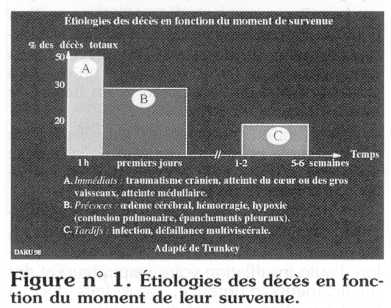
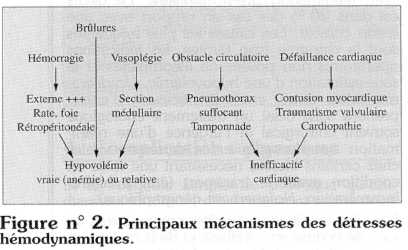
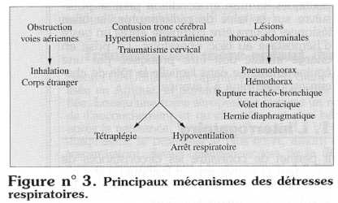
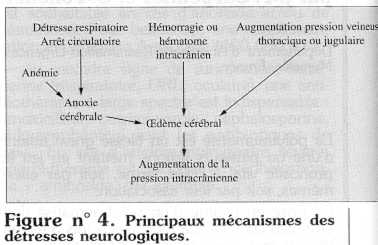
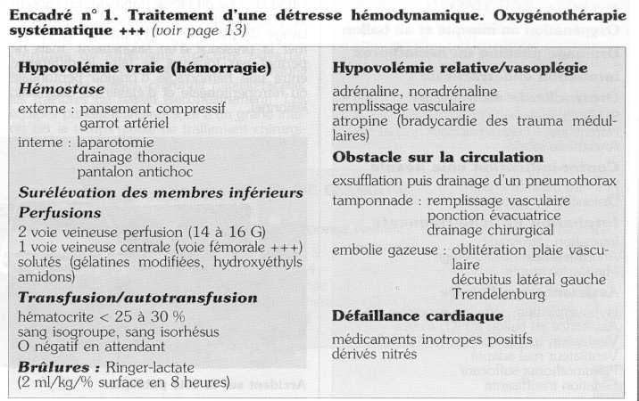
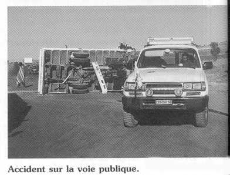
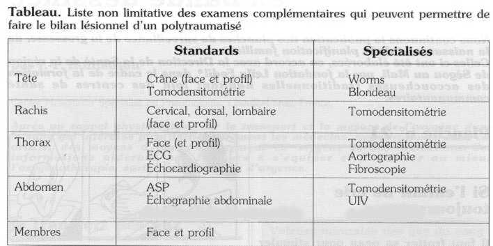

**Prise en charge initiale du polytraumatisé a l'hôpital :**

**la règle des 5 fois 3**

**par J.-P. Carpentier et C. Ponchel**

Département d'Anesthésie-Réanimation-Urgences, hôpital d'Instruction des Armées Alphonse-Laveran, Marseille, France.

Le polytraumatisé est un blessé grave atteint d'une ou plusieurs lésions mettant en jeu le pronostic vital à court terme, soit par elles-mêmes, soit par leur association.

La prise en charge d'un polytraumatisé doit être bien codifiée. La règle des 5 fois 3 est un moyen que nous nous donnons pour nous rappeler les 5 points importants de la prise en charge : les 3 principes et les 3 étapes de la prise en charge, les 3 détresses vitales et les 3 examens radiologiques de base, les 3 conduites pratiques en fonction du degré d'urgence.

**I. Les 3 principes de la prise en charge**

Trois principes sont à garder à l'esprit lors de la prise en charge d'un polytraumatisé :

*   le pronostic vital est engagé, il faut être rapide et efficace ;

*   les lésions sont multiples, il faut les reconnaître ;

*   la prise en charge doit être hiérarchisée en tenant compte de l'évolutivité des lésions.

Chez le polytraumatisé, le facteur " temps " est prédominant (_figure n° 1_) et deux concepts s'opposent : celui d'une évacuation "non médicalisée" où la priorité est donnée à la rapidité du transport vers une structure adaptée et celui d'un transport médicalisé avec réanimation pré-hospitalière. Le décès est dans 20% des cas en rapport avec une lésion curable. Les causes les plus fréquentes sont la chirurgie trop tardive, les indications opératoires non posées ou incomplètes et la sous-estimation d'une hypovolémie. Un dilemme existe donc, entre la nécessité d'entreprendre sans délai un traitement étiologique souvent chirurgical et l'urgence d'une réanimation symptomatique des détresses vitales chez certains blessés nécessitant une mise en condition avant le transport (état précaire, incarcération, éloignement géographique).

L'évaluation clinique doit être continue tout au long de la mise en condition et de la réalisation du bilan lésionnel. Nombre de lésions évoluent pour leur propre compte (choc hémorragique), d'autres ne se révèlent que secondairement (insuffisance cardiaque révélée par un remplissage vasculaire, décompensation d'un pneumothorax sous ventilation mécanique).

**Il. Les 3 étapes de la prise en charge hospitalière**

Les difficultés viennent de l'intrication des différentes étapes de la prise en charge d'un polytraumatisé. L'examen clinique se fait simultanément avec les premiers gestes thérapeutiques, la mise en condition peut se poursuivre sur la table de radiographie, le bilan lésionnel pourra être complété après un geste d'hémostase au bloc opératoire. La prise en charge initiale doit être pratiquée par une équipe entraînée dans laquelle le rôle de chacun est déterminé à l'avance.

**1. L'interrogatoire**

Il permet de connaître les circonstances de l'accident et le mécanisme lésionnel, l'état clinique initial, le délai de prise en charge et les éventuels traitements entrepris.

**2. L'évaluation clinique initiale** **recherche 3 détresses vitales**

- _Une détresse hémodynamique_ suspectée devant un blessé pâle, agité ou prostré, couvert de sueurs froides; un temps de recoloration capillaire augmenté; un pouls petit, filant, rapide, perceptible uniquement sur les gros troncs artériels ou au contraire une bradycardie; une pression artérielle effondrée, voire imprenable; un tableau de tamponnade péricardique* associant état de choc et grosses jugulaires _(figure n°2)._

- _Une détresse respiratoire_ évoquée devant: une tachypnée superficielle ou au contraire une bradypnée, des pauses respiratoires, des gasps; des signes de lutte pouvant associer battement des ailes du nez, cornage, tirage sus-claviculaire ou intercostal, balancement thoraco-abdominal; des signes d'épuisement avec une respiration paradoxale*; l'immobilité d'un hémithorax, un fracas costal, un volet, une plaie soufflante, un emphysème sous-cutané; une toux douloureuse avec crachats sanglants ou une hémoptysie abondante; une cyanose qui peut être masquée par une déglobulisation ou une vasoconstriction _(figure n_ ° _3)._

_- Une détresse neurologique,_ évaluée par le score de Glasgow, la comparaison du diamètre et de la réactivité pupillaire, la recherche d'un déficit _(figure n° 4)_

**3. La mise en condition initiale**

- Le déshabillage, le plus souvent avec découpage des vêtements aux ciseaux, afin de limiter les mobilisations.

- L'oxygénothérapie est systématique si l'on dispose d'oxygène, avec si nécessaire la mise en place d'une canule de Guedel pour assurer la liberté des voies aériennes, voire d'une sonde d'intubation si l'état du traumatisé nécessite une assistance ventilatoire.

- La pose d'une ou deux voies veineuses périphériques de gros calibre (16 G ou plus), pour permettre un remplissage vasculaire par du sérum salé isotonique (9 pour 1000) et des macromolécules.

- Les prélèvements sanguins avec le groupage sanguin ABO et Rhésus, et si possible la recherche d'agglutinines irrégulières. D'autres examens biologiques peuvent être demandés selon le laboratoire dont on dispose : hémogramme ou hématocrite, coagulation, urée, créatinine, protidémie, ionogramme, calcémie, glycémie, gazométrie, enzymes hépatiques, amylases, CPK, CPKMB, myoglobinémie, myoglobinurie, lactates, alcoolémie, toxicologie.

- Les 3 examens radiologiques, que l'on peut avoir d'emblée et sans mobiliser le blessé : un cliché du thorax de face, un abdomen sans préparation (ASP) à défaut d'un examen échographique de l'abdomen et un bassin de face à défaut d'un scanner.

- La mise en place d'une surveillance du pouls et de la pression artérielle, de la diurèse avec pose d'une sonde vésicale ou d'un cathéter sus-pubien et de la température.

- Cette mise en condition est complétée par la pose d'une sonde gastrique, la préparation du matériel d'intubation et de ventilation (ballon d'auto-insufflation voire respirateur) et des médicaments d'urgence, pour faire face à toute évolution de l'état du patient.

**III.** **Stratégie diagnostique** **et orientation thérapeutique**

À l'issue de cette évaluation sommaire et de cette mise en condition initiale, on peut se trouver face à trois situations. La stratégie suivante peut être proposée

_(figure n° 5)._

**1. Situation 1 : le blessé** **est en état de détresse extrême**

La mise en condition initiale est inefficace. Dans ce contexte, les examens complémentaires sont réduits au strict minimum.

_La détresse hémodynamique_ est la principale cause de mortalité en urgence. Le collapsus cardio-vasculaire persiste malgré le remplissage vasculaire initial. Le recours à la chirurgie ne doit pas être retardé par des examens complémentaires inutiles si les lésions responsables sont évidentes (hémopéritoine, hémorragie extériorisée). Si les lésions ne sont pas évidentes, un diagnostic lésionnel rapide est souhaitable, orienté sur les circonstances de l'accident et l'examen clinique initial _(encadré n° 1)._

_La détresse respiratoire_ peut être en rapport avec une obstruction des voies aériennes ou une atteinte pulmonaire. Le rétablissement de la liberté des voies aériennes passe d'abord par le nettoyage de la cavité buccale et du carrefour pharyngé, la protrusion du maxillaire inférieur et la mise en place d'une canule de Guedel, mais le plus souvent il faudra intuber pour assurer une ventilation manuelle ou mécanique. Le fonctionnement de l'échangeur pulmonaire nécessite de rétablir la vacuité pleurale, c'est-à-dire d'évacuer un épanchement d'autant plus mal supporté qu'il est sous pression. La persistance d'une détresse respiratoire ou d'un saignement thoracique abondant (1,5 à 2 litres ou 500 ml/h), chez un patient drainé, intubé et ventilé conduit généralement à poser l'indication d'une thoracotomie en urgence pour une chirurgie d'hémostase ou d'aérostase _(encadré n° 2)._

_La détresse neurologique_ est une cause importante de mortalité à la phase initiale et ultérieurement peut être responsable de lourdes séquelles. Le maître signe de la détresse neurologique est l'existence ou l'apparition d'un coma avec ou sans signe de localisation. Plusieurs éléments doivent être ris en compte pour évaluer de manière fiable la détresse neurologique : un état hémodynamique et respiratoire correct, l'absence d'hypothermie profonde, l'absence d'intoxication médicamenteuse et éthylique et l'absence de sédation. Un score de Glasgow < à 7 doit faire poser l'indication d'une intubation endotrachéale afin de protéger les voies aériennes d'une inhalation et de contrôler la ventilation _(encadré n° 3)._

**2. Situation 2 : le polytraumatisé** **est dans un état précaire** **mais stabilisé**

La pression artérielle est maintenue au prix d'un remplissage vasculaire mais chute à son arrêt ou à sa diminution. Un bilan lésionnel plus complet peut être entrepris, orienté en fonction de l'état du patient et adapté à l'évolution clinique du blessé (tableau) En l'absence d'échographie abdominale, la ponction lavage du péritoine (PLP) permet de confirmer la présence d'un saignement, mais ne permet pas toujours de faire la différence entre une hémorragie d'origine péritonéale ou rétro péritonéale et d'établir un diagnostic lésionnel.

**3. Situation 3 : il n'y a pas de détresse vitale mettant en jeu le pronostic vital à court terme**

Le collapsus initial se corrige sous remplissage, l'hypoxie régresse sous oxygénation, l'examen neurologique est normal dès que l'équilibre hémodynamique et respiratoire est rétabli. Le nombre des examens n'est plus limité que par le facteur " temps " imposé par les interventions chirurgicales urgentes. Une hiérarchisation des lésions est nécessaire afin d'organiser au mieux la prise en charge d'un polytraumatisé. Par ordre de priorité le traitement chirurgical commence classiquement par les hématomes extraduraux ou sous-duraux aigus, puis les lésions hémorragiques (hémopéritoine, hémothorax, rupture vasculaire), les lésions médullaires pour décompression (hématome, entorse et luxation vertébrales), les lésions abdominales peu hémorragiques (rupture d'organe creux, rupture du diaphragme, plaie abdominale), les lésions oculaires, chirurgie orthopédique (fracture ouverte, ischémie aiguë, crush syndrome), les lésions rachidiennes stables, chirurgie maxillo-faciale, les fractures du bassin (secondairement). Les équipes pluridisciplinaires sont d'un grand intérêt car le temps global de traitement chirurgical est réduit, les délais préopératoires sont diminués, améliorant ainsi le pronostic fonctionnel de chacune des lésions. Le traitement de toutes les lésions en un seul temps reste l'idéal mais n'est pas toujours possible.

**IV. Conclusion**

L'accueil d'un polytraumatisé, qui est l'exemple type d'un patient médico-chirurgical lourd de réanimation, doit se faire dans le cadre de structures disposant d'un plateau technique et d'équipes multidisciplinaires comprenant au moins un anesthésiste-réanimateur, un chirurgien et un radiologue, le laboratoire et la banque de sang devant être avertis.

_Développement et Santé, n° 139, février 1999_