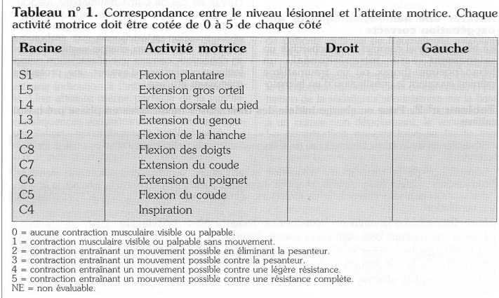
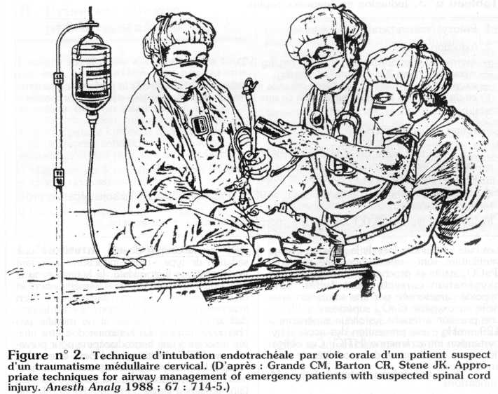
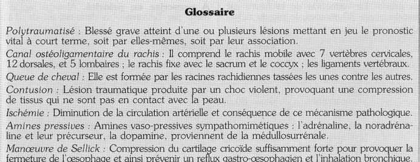

**Prise en charge pré-hospitalière des traumatismes médullaires**

**par Frédéric Adnet* et Christophe Denantes****

* Médecin, SAMU 93 (Service d'Aide Médicale d'Urgence), hôpital Avicenne, Bobigny, France.

** Médecin anesthésiste, DAR, hôpital Avicenne, Bobigny, France.

L'incidence des traumatismes médullaires est d'environ 20 à 30 patients par million d'habitants en Europe et probablement plus importante dans les pays en développement. Les principales causes sont les accidents de la voie publique (70 %), les chutes d'une hauteur et les accidents de sport (plongeon). Parmi les patients décédés dans un accident de la route, 20 % des autopsies révèlent la présence d'une lésion du rachis cervical, celle-ci intéresse la charnière C1/C2 dans 80 % des cas. Les lésions graves du rachis cervical au cours d'un accident de voiture sont rares (< 5 %) lorsque le patient a attaché sa ceinture de sécurité. La majorité des traumatismes graves du rachis cervical est associée à un polytraumatisme (70 %) et près de 10 % des lésions médullaires cervicales sont associées à des fractures vertébrales intéressant d'autres régions.

Le lien entre traumatisme crânien et traumatisme médullaire suspecté, bien que constituant un "dogme ", en médecine d'urgence, n'est pas établi. En revanche, la présence d'une lésion médullaire chez un traumatisé crânien semble être prédictive de la gravité de l'atteinte du parenchyme cérébral.

Plus de 50 % des patients pris en charge pour traumatisme médullaire ont moins de 25 ans et la population est en majorité masculine (sexe ratio = 3/1). Les lésions médullaires post-traumatiques sont une tragédie pour le patient et représentent un coût financier élevé pour la société.

**I. Physiopathologie**

L'anatomie osseuse du rachis est reproduite dans la _figure n° 1._

La moelle épinière est protégée par le canal ostéoligamentaire du rachis, le sac dural avec les méninges et l'espace sous-arachnoïdien. Dans cet espace la moelle se termine au niveau de la deuxième vertèbre lombaire et se prolonge par la queue de cheval. Ces structures baignent dans le liquide céphalo-rachidien.

La moelle peut être comparée à un centre cablé qui transmet des informations du cerveau vers la périphérie et envoie les informations périphériques que sont le toucher, la douleur, le chaud et le froid vers le cerveau.

Il est classique de considérer qu'il existe deux phases lors d'un traumatisme du système nerveux central ; la lésion primaire directement liée au mécanisme du traumatisme et les lésions secondaires constituant les phénomènes d'auto-aggravation. Le processus commun à toutes ces lésions est l'ischémie de la moelle épinière aboutissant à une interruption de la conduction nerveuse.

**I. Lésion primaire** **le traumatisme**

Les mécanismes mécaniques primaires de la lésion rachidienne sont variés : traumatisme en hyperflexion dû à une décélération brutale, traumatismes en hyper-extension par impact céphalique brutal ou accélération brutale du corps, traumatisme de compression verticale par chute. La compression médullaire peut résulter d'une hernie du disque intervertébral, de la constitution d'un hématome ou de la localisation intracanalaire d'un fragment osseux. Les traumatismes rachidiens entraînent rarement une section complète de la moelle mais plus souvent des phénomènes de lacérations partielles par des fragments osseux. Ces lésions aboutissent à des contusions médullaires avec des foyers hémorragiques. L'instabilité de ces lésions est un facteur de mauvais pronostic. Une diminution du débit sanguin au niveau de la micro-circulation est constante, induisant une ischémie post-traumatique qui s'aggrave pendant les premières 24 heures.

**2. Lésions secondaires**

La lésion médullaire est extensive pendant les 24 premières heures. Il existe, comme pour le parenchyme cérébral, des phénomènes d'auto-aggravation par des mécanismes à la fois vasculaires et de libération de substances toxiques au niveau de la zone lésée, dont la résultante est l'aggravation de l'ischémie médullaire conduisant à la mort cellulaire. Une autre origine de l'auto-aggravation peut être retrouvée dans une prise en charge inadaptée (mobilisation sans précaution, pas de correction d'une hypoxie hypercapnie ou d'une hypotension initiale) ou dans une priorité thérapeutique autre que médullaire (saignement intrapéritonéal, traumatisme crânien grave, hémo-pneumothorax, etc.).

**Il. Diagnostic**

La prise en charge des traumatismes médullaires s'intègre souvent dans un contexte d'accident avec une vitesse importante et donc chez un polytraumatisé. La correction d'une hypoxie et d'une hypotension initiale est déterminante dans le pronostic de ces patients. L'intubation endotrachéale, dans ce contexte, impose des précautions particulières et une procédure spécifique développée plus loin.

**1. Examen neurologique**

L'examen d'un traumatisé médullaire doit être simple et méthodique. Il existe un risque non négligeable d'ignorer une lésion médullaire lors de l'examen initial d'un patient traumatisé et une lésion rachidienne doit toujours être évoquée dans le cadre d'un polytraumatisme. **Il** **existe constamment une douleur** en regard du foyer de fracture associée, le plus souvent, à une contracture musculaire. **Le** **niveau lésionnel** doit être précisé par l'examen de la motricité et la sensibilité des territoires segmentaires sans oublier l'examen périnéal. Une lésion complète se caractérise par une absence de toute forme de sensibilité et de motricité sous le niveau lésionnel, y compris pour les territoires correspondant au segment sacré. La préservation d'une sensibilité et d'une motricité de la région anale alors que les autres territoires sont atteints indique que la lésion médullaire est incomplète. De même, la présence d'une sensibilité sous-lésionnelle, même partielle, est fondamentale à rechercher car sa présence est associée à un meilleur pronostic fonctionnel. Le niveau lésionnel peut être facilement déterminé à partir de l'activité motrice simplifiée du score ASIA (American Spinal Injury Association) résumé dans le _tableau n° 1_. Ce score permet une évaluation rapide du patient.

Le choc " spinal neurogénique " se traduit par une paralysie flasque sous-lésionnelle avec atteinte des fonctions neurovégétatives. Il traduit une sidération médullaire sous-lésionnelle dont la durée est comprise entre 4 jours et 8 semaines. Dans les atteintes dorsales, les troubles de la régulation neurovégétative s'observent surtout lors d'atteinte complète au-dessus de la 5e vertèbre dorsale. Dans ce cas, la disparition du tonus sympathique est responsable d'une vasoplégie et parfois d'une bradycardie. Dans les atteintes cervicales au-dessus de la 4e vertèbre cervicale, niveau d'émergence des nerfs phréniques, la paralysie diaphragmatique entraîne une perte de l'autonomie respiratoire. Dans les atteintes cervicales basses, l'autonomie respiratoire est conservée mais précaire : l'inhibition de la toux par la paralysie des muscles intercostaux et intra-abdominaux favorise l'encombrement bronchique.

**III.** **Prise en charge pré-hospitalière**

**Il existe un dogme qui considère tout** **patient traumatisé ou comateux** **comme porteur d'au moins une** **lésion instable du rachis, jusqu'à élimination de son diagnostic.** En cas de suspicion de lésion médullaire, la prise en charge du patient lors de la phase de relevage et de transport conditionne le pronostic de ces patients et doit répondre à trois objectifs :

1.  Maintenir les fonctions vitales et prendre en charge une détresse vitale.
2.  Ne pas aggraver les lésions osseuses.
3.  Prévenir les lésions secondaires.

**1. Maintenir les fonctions vitales**

Il est établi que les paramètres ventilatoires et hémodynamiques sont les déterminants principaux du pronostic des traumatisés crâniens et médullaires. L'objectif est de maintenir une oxygénation et une perfusion médullaire adéquates. La correction d'une hypoxie, d'une hypercapnie et/ou d'une hypotension qui aggrave les lésions d'ischémie conditionnent le pronostic neurologique des traumatisés médullaires. La prise en charge initiale comprendra la surveillance clinique (_tableau n° 2)_ et un monitorage avec au mieux électrocardioscope, fréquence cardiaque, pression artérielle , saturation pulsée en oxygène, capnographie, température centrale.

**Assurer une hémodynamique et une** **oxygénation correcte**

Le bilan lésionnel complet doit rechercher un saignement actif intrapéritonéal, un hémo/pneumo-thorax ou un traumatisme crânien évoquant la constitution d'un hématome extradural. La présence d'une de ces lésions prend la priorité dans les décisions thérapeutiques et peut retarder la prise en charge du traumatisme médullaire. Les atteintes médullaires sévères retentissent sur l'hémodynamique et la ventilation pulmonaire. Ainsi, pour des lésions avec un niveau neurologique élevé, une hypoventilation peut s'installer par atteinte musculaire et une hypotension par baisse des résistances vasculaires (atonie sympathique). L'inhibition de la toux favorise l'encombrement bronchique. Un remplissage prudent doit être entrepris et, si nécessaire, des amines pressives administrées, afin de maintenir une pression de perfusion correcte. Dans ce contexte, la dopamine doit être préférée. En cas de collapsus, les colloïdes (gélatines fluides, dextrans, amidons) sont les solutés de remplissage à utiliser en première intention. Le remplissage doit être prudent afin d'éviter toute surcharge et les phénomènes de dilution. L'hématocrite doit toujours avoir une valeur supérieure à 30 % avec un hématocrite optimum situé entre 30 et 34 %. Si l'hémodynamique est stable, le soluté le plus indiqué est le sérum physiologique. Les objectifs sont d'obtenir une pression artérielle (PA) supérieure à 120 mmHg. Une éventuelle bradycardie sera traitée par de l'atropine administrée par voie intraveineuse.

**Abord des voies aériennes**

Les justifications de la prise en charge ventilatoire agressive du traumatisé médullaire sont doubles :

1) protéger les voies aériennes supérieures contre le risque d'inhalation bronchique en cas de coma traumatique associé ;

2) optimiser les paramètres ventilatoires que sont la pression artérielle en oxygène (PaO2) et la pression artérielle en gaz carbonique (PaCO2). La prise en charge ventilatoire doit se concevoir, comme une réanimation neurologique permettant d'assurer une protection médullaire efficace.

Les buts à atteindre lors de la prise en charge ventilatoire sont : une hypocapnie modérée (PaCO2, stable et proche de 35 mmHg) ; une oxygénation correcte pour éviter toute hypoxie caractérisée par une saturation artérielle en oxygène (SaO2) supérieure à 95 % ; une pression artérielle systolique supérieure à 120 mmhg ; une prévention des accès d'hypertension intracrânienne (HTIC). Ces obligations vont conditionner des modalités de prise en charge.

_Indications_

La pose d'un masque à haute concentration d'oxygène doit être systématique lorsque le patient présente une ventilation spontanée efficace . La décision d'une intubation endotrachéale doit se faire sur des arguments neurologiques et ventilatoires. Tout patient traumatisé crânien avec un score de Glasgow inférieur à 8 doit être intubé ainsi que tout patient incapable de maintenir une oxygénation satisfaisante en ventilation spontanée. De même, l'existence d'une tétraplégie d'emblée est une indication à l'intubation endotrachéale. Une atteinte même partielle de la ventilation par une lésion médullaire peut avoir des conséquences ventilatoires importantes (hypoventilation, encombrement, atélectasies). Le recours à la ventilation mécanique doit donc être d'indication large dans ce contexte.

_Sédation pour l'intubation_

La sédation est souvent nécessaire. Il faut éviter que le patient ne tousse lors du passage de la sonde d'intubation ou ne lutte contre le respirateur, ces deux phénomènes engendrant des brusques poussées d'hypertension intracrânienne. De plus, une analgésie sédation doit être instituée afin d'éviter la douleur et de minimiser la consommation d'O, cérébrale La technique doit être une intubation- orotrachéale sous laryngoscopie directe en utilisant une sédation de type "crash induction" associant un hypnotique (I'étomidate, la kétamine ou le thiopental) et un curare (le suxaméthonium) et une pression du cartilage cricoïdien (manoeuvre de Sellick). L'étomidate est le produit le plus approprié car il ne modifie pas l'hémodynamique. La kétamine doit être utilisée associée à une benzodiazépine pour prévenir une HTIC. Le thiopental peut être utilisé lorsque l'hémodynamique est stable. L'utilisation du suxaméthonium a été discutée par certains auteurs à cause du risque d'arythmies ou d'aggravations potentielles des lésions osseuses provoquées par le relâchement de la musculature paravertébrale péri-lésionnelle. La manoeuvre de Sellick pourrait également être dangereuse dans ce contexte. Néanmoins, cette manoeuvre n'a pas montré une surmorbidité lorsqu'elle était utilisée lors de l'intubation de patients victimes de traumatisme médullaire. Les conditions d'intubation et la rapidité de la procédure caractérisant la technique d'intubation en séquence rapide en font le protocole d'induction standard dans ce contexte. L'entretien de la sédation s'administrera sur la base d'une benzodiazépine, éventuellement associée à un curare non dépolarisant, le vécuronium. La curarisation en continue se limite aux phases de transfert et de brancardage pour prévenir toutes les variations de la pression intracrânienne (PIC) dues aux stimulations du patient. La procédure de "crash induction", est résumée dans le _tableau n° 3._

_Technique_

La technique de choix dans le contexte de l'urgence et en milieu pré-hospitalier est donc l'intubation orotrachéale sous laryngoscopie directe après induction en séquence rapide en respectant l'alignement tête-cou-tronc, sans exercer de traction du rachis. En effet, la traction axiale du rachis a été rendue responsable d'un déplacement important du foyer de fracture. L'assistant doit opposer une force nécessaire seulement pour contrer les tractions et mouvements créés par l'opérateur qui intube le patient. Cette technique nécessite trois opérateurs _(figure n°2)._ Le patient doit être en décubitus dorsal, la tête en position neutre. La partie antérieure du collier cervical doit être retirée et remise après que l'intubation a été réalisée. En effet, le collier cervical empêche une ouverture de la bouche compatible avec l'entrée de la lame du laryngoscope dans la cavité buccale. Un assistant maintient l'axe du rachis en position stable sans exercer de traction axiale en agrippant les mastoïdes du patient. La laryngoscopie se déroule alors après pré-oxygénation et induction rapide. Un autre assistant maintient la pression cricoïdienne (manoeuvre de Sellick) et présente la sonde d'intubation cathétérisée par un mandrin souple à l'opérateur.

La laryngoscopie directe d'un patient en position neutre rend la visualisation de la glotte plus difficile. L'intubation doit donc être considérée comme présentant des facteurs prédictifs de difficultés. La vérification de la position endotrachéale de la sonde d'intubation sera réalisée par le test d'aspiration d'air ce à une seringue. Le patient ne doit absolument pas tousser, pousser ou lutter contre sa machine, les indications d'une curarisation pendant le transport et les différentes manoeuvres de brancardage doivent par conséquent être larges.

**Ne pas aggraver les lésions** **osseuses**

Le risque d'aggravation d'une lésion instable du rachis par des manoeuvres intempestives est bien réel.

**L'axe tête-cou-tronc doit être assuré de façon permanente,** lors de toutes les phases de brancardage, de désincarcération et de transport vers un milieu hospitalier. Le patient doit être impérativement immobilisé en décubitus dorsal strict sur un plan dur. L'usage d'un matelas "coquille" à dépression aide à maintenir cet axe en permanence. Le but est d'éviter toute rotation du rachis autour de son axe ou de flexion latérale. Il existe une exception, lors de déformation traumatique majeure du rachis, celle-ci doit être respectée et la réduction se faire sous anesthésie générale au bloc opératoire.

**Le collier cervical** permet de maintenir la position du patient en position neutre grâce à un appui mentonnier et thoracique. Cependant, le collier cervical ne permet pas une immobilisation parfaite du rachis cervical. De plus, sa pose a été rendue responsable d'une augmentation de la pression intracérébrale par une probable gêne au retour veineux. Néanmoins, la pose d'un collier cervical de taille adaptée est une obligation lors de toute suspicion de traumatisme médullaire.

**Prévenir les lésions secondaires**

Actuellement, on considère que la précocité du traitement des phénomènes d'auto-aggravation est fondamentale dans la prise en charge de la contusion médullaire pour réduire , extension de la lésion secondaire.

**En premier lieu, l'optimisation des paramètres vitaux** pourrait ralentir l'ischémie secondaire: maintien de bonnes conditions hémodynamiques au niveau médullaire avec le maintien d'une pression artérielle stable par un remplissage et l'utilisation de vasopresseurs dont la dopamine ; le maintien d'une hématose efficace par ventilation assistée en cas de détresse ventilatoire et la transfusion en cas d'hémorragie ; le contrôle des traumatismes associés (cérébraux, et thoraco-abdominaux).

**En second recours, l'utilisation précoce de médicaments neuroprotecteurs** **est discutée.** L'intérêt d'une corticothérapie administrée sur les lieux de l'accident a été notamment étudié. Ainsi, la méthylprednisolone, administrée avant la huitième heure selon le protocole recommandé dans le _tableau n° 4_ a montré une efficacité contre placebo dans le pronostic fonctionnel à 6 mois.

Ce protocole de en charge serait plus particulièrement bénéfique lors d'une lésion isolée du rachis cervical associée à une tétraplégie. En cas de polytraumatisme, l'injection à fortes doses de corticoïdes pourrait être associée à une morbidité importante liée aux infections et aux hémorragies digestives. La récupération escomptée par ce protocole n'est que de un ou deux métamères, ce qui a un retentissement fonctionnel important au niveau cervical avec la récupération du muscle biceps ou de la pince pouce-index et faible au niveau dorsal ou lombaire. Actuellement, aucune autre molécule dans le cadre d'une stratégie de protection médullaire n'a montré d'efficacité en clinique humaine.

_Développement et Santé, n°147, juin 2000_