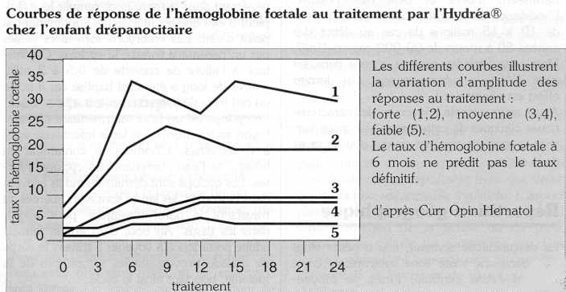

Première maladie génétique africaine, la drépanocytose affecte chaque année des milliers d'enfants. Toujours grave, elle a cependant bénéficié d'importants progrès médicaux qui permettent maintenant à de nombreux malades de mener une vie quasi normale.

Avant d'aborder les nouveaux traitements, parlons des mesures préventives élémentaires :

- Prévention des infections
- Prévention des crises vaso-occlusives (douloureuses)
- Prise en charge de la douleur

## I. Prévention des infections

Avant l'âge de 10 ans c'est la prise régulière de pénicilline orale (Oracilline®) en 2 prises par jour : 250 000 à 500 000 Ul par jour.

Les vaccins sont aussi indispensables :

- diphtérie, tétanos, coqueluche, poliomyélite, rougeole, BCG, hépatite B.
- le vaccin antipneumococcique (Pneumo 23) est indispensable dès l'âge de 2 ans ; un rappel tous les 3 ans est nécessaire. En effet, le drépanocytaire est très sensible au pneumocoque qui provoque souvent chez lui pneumonie, septicémie ou méningite.
- la vaccination contre *Haemophilus* b avant l'âge de 5 ans est aussi souhaitable.

## II. Prévention des crises vaso-occlusives

Elles sont souvent imprévisibles. On sait maintenant que la fatigue, la fièvre, les exercices physiques exagérés, les voyages en avion peuvent les déclencher. A l'inverse, l'hyper hydratation, une vie régulière ont un effet protecteur sur les crises.

### En pratique, 10 règles d'or sont à respecter

1.  Bien se laver le corps et les dents pour éviter les microbes provoquant les infections.
2.  Surveiller sa température, donc avoir constamment à porté de la main un thermomètre.
3.  Si la température est supérieure à 38C, aller vite consulter au dispensaire.
4.  Boire beaucoup d'eau (environ 3 litres/jour pour un adulte).
5.  Eviter les endroits mal aérés, enfumés, l'altitude et les voyages en avion.
6.  Avoir une alimentation saine et variée.
7.  Surveiller la couleur des yeux et des urines (consulter si ces dernières sont trop foncées).
8.  Eviter ce qui peut ralentir ou bloquer la circulation du sang (vêtements trop serrés, jambes croisées).
9.  Consulter régulièrement au dispensaire.
10. Dormir au moins 7 heures/nuit et maîtriser les efforts physiques (attention aux matchs de foot !).

## III. Lutte contre la douleur

La douleur est un problème majeur dans la drépanocytose : dès les premiers mois de vie, le syndrome mains-pieds (gonflement des mains et des pieds) fait beaucoup souffrir les nourrissons. Il faut débuter par le paracétamol à 60 mg par kilo et par jour en 3 prises. L'association à la codéïne (Codenfant®) aux mêmes doses est encore plus efficace (à n'utiliser que chez l'enfant de plus de 1 an). Au dispensaire ou à l'hôpital on utilise le Prodafalgan® I.V. à la dose de 1,5 mg par kilo ( solution reconstituée dans 50 ml de sérum physiologique), le Prodafalgan® peut être renouvelé toutes les 6 heures.

Au stade ultime il faut utiliser la morphine intraveineuse (100 gammas par kilo en bolus (1 mg = 1 ml) à renouveler si nécessaire toutes les 10 minutes sans dépasser 9 bolus en 4 heures.

## IV. Les nouveaux médicaments

La découverte de l'hydroxyurée (Hydrea®) constitue un progrès important dans le traitement de la drépanocytose.

## V. Position du problème

Si la plupart des enfants drépanocytaires souffrent de crises vaso-occlusives douloureuses, ces crises ne surviennent pas pendant les premières semaines de la vie, or, à cet âge l'hémoglobine est de type fœtal.

Il fut aussi remarqué que certains drépanocytaires ayant une persistance de l'hémoglobine foetale (supérieur à 30% de l'hémoglobine totale) avaient peu de crises douloureuses.

Enfin, au laboratoire, on constate que les globules rouges riches en hémoglobine fœtale ne se déforment pas en faucille ou en croissant comme le font habituellement les globules rouges en hypoxie.

Ces trois constatations ont poussé les chercheurs à tester certains médicaments augmentant la production d'hémoglobine fœtale par la moelle osseuse.

L'Hydréa®, produit utilisé contre certains cancers, est capable d'élever l'hémoglobine fœtale chez l'animal. Il agit aussi en renforçant la membrane du globule rouge.

Des essais chez l'adulte drépanocytaire ont mis en évidence une augmentation franche de l'hémoglobine fœtale chez 75% des malades avec une raréfaction des crises douloureuses. Après de nombreux tâtonnements, la dose de 10 à 20 mg par kilo par jour chez l'enfant s'est avérée bien tolérée (pas de chute des globules blancs ni des plaquettes). Sur le plan clinique, dans les 2 tiers des cas les crises douloureuses deviennent très rares (ainsi que les hospitalisations). Malheureusement, la fréquence des infections pulmonaires ou osseuses ne semble pas diminuer.

L'Hydréa ne semble pas mettre à l'abri d'accidents vasculaires cérébraux.

L'élévation de l'hémoglobine fœtale est variable d'un sujet à l'autre et s'apprécie après 3 mois de traitement. On distingue les bons répondeurs atteignant 35% d'hémoglobine fœtale, les moyens et les faibles répondeurs (*voir figure*).

En pratique, on commence par 10 mg par kilo et par jour pendant un mois, on effectue alors une numération formule sanguine. Si celle-ci est normale, on passe à 20 mg par kilo et par jour. Il semble prudent de contrôler la numération formule sanguine tous les trimestres. L'Hydréa® se présente sous forme de gélule à 500 mg: il est possible de regrouper les prises sur 2 à 4 jours pour ne pas avoir à déconditionner les gélules. Par exemple, pour un enfant de 20 kilos qui a besoin de 2,8 g d'hydréa® par semaine, c'est-à-dire pratiquement 6 gélules à 500 mg, il sera prescrit une gélule par jour, 6 jours sur 7.

D'autres médicaments capables d'élever l'hémoglobine foetale sont à l'étude.

**Les transfusions :** elles sont souvent le dernier recours dans le traitement des crises et des infections. Il est bien sûr indispensable de s'assurer de la sécurité virologique du sang transfusé.

*Développement et Santé, n° 150, décembre 2000*
