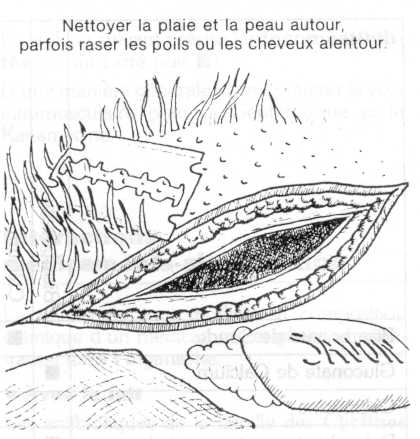
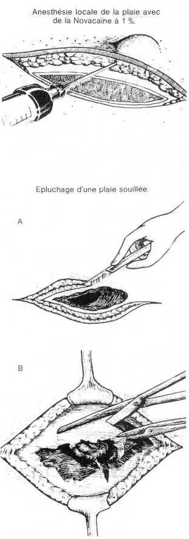

La plaie et la peau environnante seront nettoyées au savon ou au sérum physiologique et détergées à l'alcool ou à l'éther. La plaie peut être brossée avec une brosse stérile pour la débarrasser des fragments de graviers ou de goudrons. Un rasage discret dégagera si besoin la région des poils ou cheveux qui gêneraient l'exploration et la suture.

**A.** Un antiseptique (alcool iodé, mercryl, amonium quaternaire) achève de désinfecter la peau autour de la plaie. Un champ stérile troué est placé, centré sur la plaie. Les plaies souillées de terre seront utilement nettoyées avec de l'eau oxygénée en prévention de la gangrène gazeuse.

**B. Comment explorer une** **plaie**

Avec une pince à disséquer d'une main et une pince Kocher de l'autre, vous écartez les lèvres de la plaie. Ainsi vous pourrez juger de la profondeur de la plaie, vérifier qu'aucun organe profond n'est lésé. Il faut être certain d'avoir bien vu toute la plaie et de l'avoir parfaitement débarrassée de tous les débris et inclusions qu'elle avait pu contenir.

**C. Qu'est-ce que le parage** **d'une plaie**

C'est **enlever** minutieusement tous les tissus sous-cutanés **abîmés.** On arrive en zone saine lorsque le tranchant du ciseau fait saigner nettement du sang rouge.

Pour la peau, par contre, le parage est économique, ne sacrifiant que ce qui est manifestement nécrosé. Tous les lambeaux de vitalité douteuse sont conservés.

Le parage des plaies du visage et des mains sera particulièrement économique pour des raisons esthétiques et fonctionnelles.

**D. Anesthésie locale**

L'anesthésie locale n'est pas indispensable pour une plaie petite, nette, purement cutanée, car dans ce cas les deux piqûres nécessaires à l'anesthésie locale seraient aussi douloureuses que la fine aiguille qui servira à la suture si deux ou trois points suffisent. Si la plaie est plus importante, et surtout si l'exploration s'impose, l'anesthésie locale est alors indispensable et permet de travailler de manière confortable. L'anesthésie se fait en infiltrant les téguments par les berges de la plaie, soit en partant de chacun des deux angles, soit en partant du milieu de chaque berge et en injectant de dedans en dehors. Il faut utiliser de la Xylocaïne à 1% **sans Adrénaline.**

Il faut savoir attendre les quelques minutes nécessaires à l'effet de l'anesthésique.

Certains sujets sont absolument réfractaires à l'anesthésie locale (alcooliques, malades habitués aux antalgiques).

**_Toujours s'assurer_**

**_que_**

**_le blessé est vacciné_**

**_contre le tétanos._**

**E. Un exemple: l****es plaies du cuir chevelu**

Une plaie du cuir chevelu peut être **hémorragique** et entraîner une **perte sanguine** **Importante** pouvant créer un état de choc et nécessiter parfois des transfusions sanguines.

**Technique:**

*   Raser largement les cheveux autour de la plaie.

*   Badigeonner largement avec une solution d'ammonium quaternaire.

*   Isolement du champ opératoire par un champ stérile troué.

*   L'anesthésie locale par les berges de la plaie n'est pas indispensable en cas de plaie minime.

*   Nettoyage soigneux retirant tous les corps étrangers, en particulier les cheveux.

*   Parage large de l'aponévrose épicrânienne, économique pour les berges de la plaie. Ce geste est hémorragique.

Il est inutile d'essayer de faire l'hémostase autrement que par la suture. Simplement, il faut aller vite pour limiter les pertes sanguines.

*   Suture en chargeant toute l'épaisseur des tissus au nylon 00, en serrant suffisamment les noeuds pour assurer l'hémostase.

_Développement et Santé, N°42, décembre 1982_