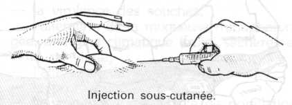

**Quelques rappels sur les injections****Intramusculaires, sous-cutanées et intradermiques**

**par Philippe Reinert***

*Pédiatre, hôpital intercommunal de Créteil.

TRAVAILLER AVEC UN MATERIEL PARFAITEMENT STERILE SI POSSIBLE À USAGE UNIQUE EST LA REGLE D'OR TELLEMENT LE RISQUE DE TRANSMISSION DU VIH, DES HEPATITES B et C AINSI QUE DU PALUDISME EST GRAND

Malgré la banalité de ces gestes, il semble nécessaire de préciser quelques règles.

**I. Injection intramusculaire**

**Indication :** elle permet l'administration facile d'un médicament qui diffusera rapidement dans l'organisme.

**Contre-indication :** troubles de la coagulation, traitement à l'héparine ou aux antivitamines K.

**Matériel:** aiguille longue de six à huit centimètres et de 0,6 à 0,9 millimètre de diamètre, à biseau long.

**Technique :** l'injection se fait dans une masse musculaire épaisse, en dehors d'un trajet de vaisseaux ou de nerfs :

- cadran supéro-exteme de la fesse (pour éviter le nerf sciatique),

- à la face antéro-exteme de la cuisse (couture externe du pantalon),

- à la face externe du bras (deltoïde), seulement si le volume à injecter est inférieur à 3 centimètres cube.

Le choix se fera en fonction de l'état des tissus (éviter les zones infectées ou indurées).

Après désinfection de la peau à l'alcool, l'aiguille **seule de préférence,** est enfoncée **perpendiculairement à la peau** d'un **coup sec.**

Avant d'injecter le produit, s'assurer que l'aiguille n'a pas pénétré un vaisseau en aspirant légèrement avec la seringue.

*   L'injection doit être faite lentement.
*   L'aiguille doit être retirée d'un seul coup.
*   Appliquer au point d'injection un tampon alcoolisé et masser légèrement.

**Il. Injection sous-cutanée**

**Indication:** vaccination, insuline, héparine. Le médicament diffuse ici lentement.

**Contre-indication:** aucune.

**Matériel:** aiguille courte de deux à cinq centimètres de long, et de 0,5 à 0,7 millimètre de diamètre, à biseau long.

**Technique:** elle peut être faite dans toutes les régions où le tissu cellulaire sous-

Cutané est abondant, sans risque de lésion vasculaire ou nerveuse:

- face supéro-externe de la cuisse,

- face externe du bras,

- région sus ou sous-épineuse de l'omoplate.

Faire, entre le pouce et l'index, un pli cutané et enfoncer rapidement l'aiguille à la base du pli, en la maintenant parallèle à la peau, le biseau vers le haut.

*   Aspirer légèrement pour vérifier l'absence de sang dans la seringue.
*   Relâcher la peau et injecter lentement.
*   Retirer l'aiguille d'un coup sec, puis masser légèrement.

**III. Injection intradermique**

**Indication:** test à la tuberculine, BCG, anesthésie intradermique.

**Contre-indication :** aucune.

**Matériel :** aiguille courte à biseau long.

**Technique :** difficile chez le nourrisson. L'injection se fait habituellement à la face antérieure de l'avant-bras. L'aiguille est enfoncée tangentiellement à la peau et doit rester **superficielle,** le biseau vers le haut.

Lors de l'injection, la peau se soulève formant une papule (type peau d'orange) témoignant de la réussite de l'injection intradermique.

Pour l'intradermoréaction à la tuberculine, si une papule n'est pas obtenue, il faut la refaire à un autre endroit.

_Développement et Santé, n°110, avril 1994_