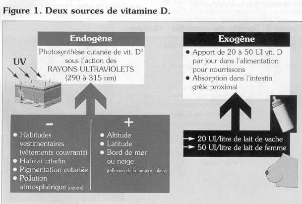
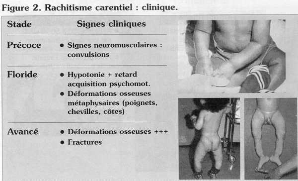
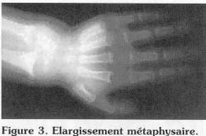

La carence en vitamine D entraîne chez l'enfant de moins de 5 ans, mais aussi chez l'adolescent, des déformations osseuses surtout aux membres inférieurs et, parfois, une hypocalcémie pouvant entraîner des convulsions.

Chez le nourrisson, elle entraîne aussi une hypotonie responsable d'un retard de la marche, voire d'un retard psychomoteur.

Prévenir et traiter le rachitisme est facile et... peu coûteux !

## I. Qu'est-ce que la vitamine D ?

Vitamine ou hormone ? Le calciférol tient une place à part parmi les vitamines puisqu'il peut être :

*   soit produit par l'organisme (= hormone), si les conditions climatiques et sociales sont favorables,
*   ou bien apporté par l'alimentation (= vitamines).

Sous l'action des rayons ultraviolets, la vitamine D est normalement synthétisée sous la peau. On a longtemps cru que le rachitisme n'existait pas dans les pays chauds du fait de l'ensoleillement, **ceci est faux !** Pour différentes raisons :

*   les rayons ultraviolets ont du mal à traverser une peau noire,
*   les nourrissons ont souvent des vêtements couvrante et restent la plupart du temps à l'intérieur des habitations.

Si, de plus, l'alimentation est pauvre en vitamine D, le risque est maximal (_figure_ _1)._

### Rôle de la vitamine D

Elle est indispensable au transport du calcium et du phosphore de l'intestin vers l'os et le système nerveux.

*   Au niveau de l'os, elle permet la minéralisation de l'os en croissance (plus on grandit, plus les besoins en vitamine D sont importants). Sans cette vitamine, les os sont friables (ils se déforment sous le poids du corps et les fractures sont fréquentes).  
*   Au niveau du système nerveux, pour que les cellules nerveuses fonctionnent correctement, elles doivent recevoir un apport régulier en calcium.

La calcémie doit être égale à 100mg/l. En l'absence de vitamine D, le calcium n'est pas absorbé par l'intestin d'où une hypocalcémie entraînant :

*   hypotonie
*   tétanie
*   convulsions.

## Il. Manifestations cliniques du rachitisme

On distingue trois stades _(figure 2)_

### 1. Stade précoce

Ce stade, dit infraclinique, est dominé par les conséquences de l'hypocalcémie :

*   hypotonie,
*   convulsions généralisées chez le nourrisson,
*   tétanie chez les plus grands (R.O.T. vif, excitabilité, troubles du sommeil),
*   Exceptionnellement stridor laryngé (gêne laryngée aiguë) pouvant entraîner la mort.

### 2. Stade floride

#### Les **signes osseux** dominent :

*   élargissement des zones métaphysaires des os longs (poignets, chevilles),
*   chapelet costal : les extrémités des côtes forment un bourrelet à la palpation,
*   craniotabès : la pression du crâne avec un doigt (dans la région pariétale) entraîne une dépression pariétale (indolore !).

Dans les formes graves, le ramollissement des côtes entraîne une diminution de la toux d'où risque d'encombrement bronchique et de surinfection pulmonaire (souvent mortelle).

#### Sur le plan neurologique

Le retard psychomoteur est évident, l'enfant tient à peine assis.

#### Sur le plan radiologique, on note :

*   une déminéralisation diffuse,
*   des fractures spontanées,
*   un élargissement des métaphyses avec aspect en coquetier ou toit de pagode des extrémités _(figure 3)_.

#### Biologie :

    Calcémie basse,  
    Phosphatages alcalines élevées.

### 3. Stade tardif

    Déformations osseuses monstrueuses (genu varum).  
    Petite taille.  
    Convulsions possibles.

## III. Traitement

Malgré l'importance des signes cliniques et radiologiques, le traitement entraîne une guérison spectaculaire.  
Grâce à la vitamine D, à la dose de 5 000 unités par jour, pendant 6 semaines.  
Un supplément en calcium peut être utile chez le nourrisson.  
La seule séquelle connue est, chez la fille, un bassin étroit, source de dystocie (accouchement difficile).

## IV. Prévention

Les besoins sont de 400 à 800 unités de vitamine D par jour. Pour un enfant nourri au sein, le lait maternel contient suffisamment de cette vitamine (du moins si la mère s'expose régulièrement au soleil).

Si l'enfant est au lait artificiel, vérifier si le lait est enrichi en vitamine D, sinon donner à l'enfant, chaque jour de 1 000 à 2 000 unités (Stérogyl® par exemple), tout comme en cas d'allaitement au lait de vache ou de tout autre mammifère.

Il est possible de donner une ampoule de 50 000 unités tous les trois mois.

**ATTENTION:** Il ne faut pas surdoser en vitamine D, il y a alors un risque d'hypercalcémie, source de lésions cérébrales parfois graves.

_Développement et Santé, n° 154, août 2001_