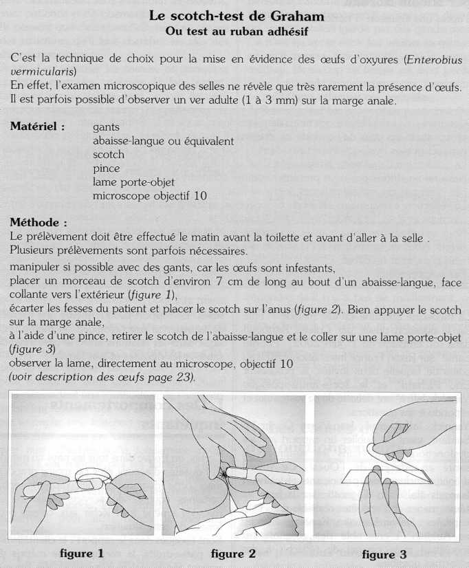

**Aspect des oeufs à l'examen direct de selles étudiées à l'état frais, entre lame et lamelle.**

## I. OEufs d'oxyure _(Enterobius vermicularis)_

Les oeufs d'oxyure sont rarement retrouvés dans les selles.  
Il faut en effet les rechercher au niveau de la marge anale par la technique du scotch-test de Graham.  
Les oeufs mesurent 50 à 60 microns/20 à 30 microns**.**  
Ils sont ovoïdes, asymétriques : l'une des faces est convexe, l'autre presque plane. La coque est épaisse, lisse, transparente, comportant deux membranes.

A la ponte, ils contiennent un embryon replié sur lui-même qui devient vermiforme en quelques heures après son émission.

## II. OEufs de trichocéphale _(Trichuris trichiura)_

Les oeufs mesurent 50 à 60 microns/20 microns  
Ils ont une forme de petit tonneau, la paroi est de couleur foncée, épaisse, régulière, comportant une double enveloppe, l'une externe épaisse et l'autre interne mince, interrompue à chacun des pôles par un bouchon muqueux plus clair.  
Ils contiennent une seule cellule.

_**Oeufs d'oxyure (figure du haut) et de trichocéphale (figure du bas)**_

## III. OEufs d'ascaris _(Ascaris lumbricoides)_

Les oeufs d'ascaris présentent un grand polymorphisme et les formes atypiques sont nombreuses.

### On peut retrouver :

### 1. des oeufs fertiles

Ils sont souvent nombreux. Les oeufs mesurent 45 à 75 microns/35 à 50 microns (les plus typiques mesurent 60 microns/45 microns). Ils sont symétriques, et comportent une coque épaisse et transparente constituée de trois membranes :

*   externe : épaisse, mammelonnée, prenant la couleur des selles (brune en général)
*   moyenne : fine, transparente, chitineuse
*   interne : très épaisse, lisse, incolore

La membrane externe se sépare facilement de la membrane sous-jacente.

Les oeufs ne sont pas embryonnés, ils contiennent une cellule ovulaire n'occupant pas tout l'oeuf, séparée de la coque par un espace en croissant, à chaque pôle de l'oeuf.

### 2. des oeufs infertiles

Ils sont atypiques et leur diagnostic est parfois difficile.  
Les oeufs mesurent 90 à 95 microns/40 à 45 microns (parfois 80 à 105 microns/40 à 55 microns)  
Ils sont plus ou moins ovalaires, parfois franchement difformes, boursouflés.  
La membrane externe est parfois absente, parfois insignifiante, irrégulière avec des mammelons rares ou absents, clairs, peu élevés. Elle est parfois mince, transparente, incolore ou couleur paille.  
La membrane interne est plus ou moins mince. Les oeufs contiennent des granulations très réfringentes, de tailles différentes.

_**Oeufs d'ascaris fertiles et infertiles**_

## IV. OEufs d'ankylostomes _(Ancylostoma duodenale, Necator americanus)_

Incolores, ovoïdes, à coque mince.

### 1. Ankylostoma duodenale

Les oeufs mesurent 60 microns/40 microns.  
La coque est mince, symétrique.  
Les pôles sont arrondis.

Ils sont non embryonnés à la ponte mais contiennent 2 à 4 blastomères au moment de l'émission, qui se multiplient ensuite rapidement.

### 2. Necator americanus

Les oeufs mesurent 70 microns/40 microns.  
Plus allongés, leur coque est très mince, lisse et transparente. Les pôles sont arrondis. Ils contiennent 8 blastomères au moment de la ponte.

## V. OEufs de trichostrongylus

Les oeufs mesurent 70 à 95 microns/40 à 50 microns.  
Ils sont clairs et présentent une coque mince et irrégulière.  
Ils sont asymétriques, très segmentés (16 à 32 blastomères), pouvant être embryonnés.

_**Oeufs d'ankylostomes (haut) et de trichostrongylus (bas)**_

_Développement et Santé, n°159, juin 2002_