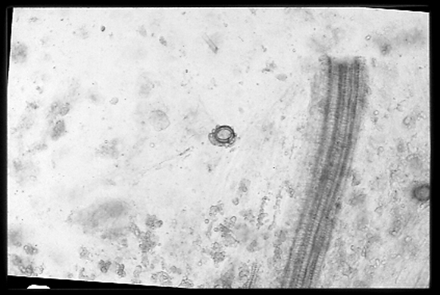
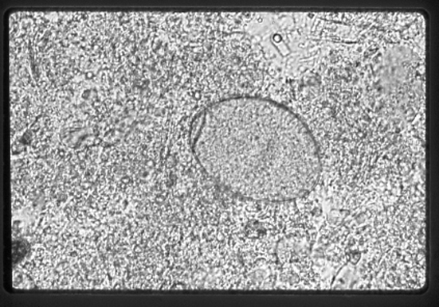
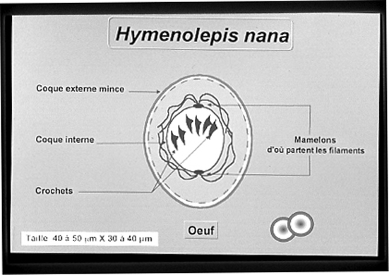
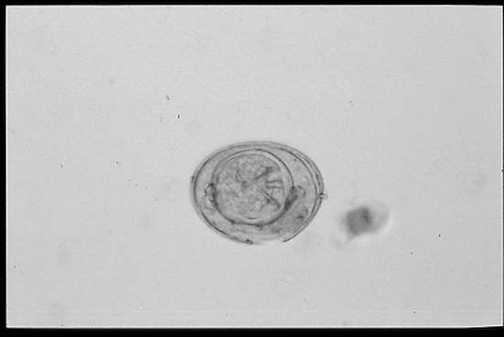

## I. _Tænia saginata_ et _tænia solium_

### Morphologie

Figure 1

### **Oeufs**

Il est pratiquement impossible de différencier les deux espèces.  
Taille : 50 à 60 µm.  
Forme : arrondie.  
Aspect : deux coques :

*   Une coque externe, rarement présente, mince, incolore et albumineuse ;
*   Une coque interne qui délimite l'embryophore; c'est l'œuf de Tænia tel qu'on peut le voir habituellement :
    *   Taille : 30 µm.  
    *   Forme : arrondie ; légèrement ovalaire.  
    *   Couleur : brun foncé.  
    *   Coque : lisse, très épaisse (4 à 5 µm), striée sur sa largeur.  
    *   Contenu :   embryon hexacanthe dans lequel on voit très bien les six crochets.

**Figures 2 et 3 ( gr x 165 et gr x 660) : œufs de Tænia saginata**  
Clichés  Dr.  A.M.  DELUOL 

Technique de Junod sans coloration.  
Les œufs de Tænia saginata peuvent se retrouver dans un examen de selles : la coque externe, incolore, albumineuse, contient de nombreux globules graisseux ; elle entoure, mais de façon irrégulière, l'embryophore qui possède une coque  très  épaisse, striée, contenant l'embryon hexacanthe.

L’œuf mesure  60µm / 50µm, l’embryophore 30µm.  
L’œuf se repère facilement, même au faible grossissement, car la coque de l’embryophore est très foncée. En faisant varier la mise au point du microscope on voit nettement les crochets de l’embryon hexacanthe.

## II. Bothriocéphale (Diphyllobothrium latum)

### Morphologie 

**Figure 4**

###   
Œufs

*   Taille : 70 µm/45 µm.  
*   Forme :  ovoïde.  
*   Couleur : jaune ou brun clair.  
*   Coque :   lisse et mince, avec présence d'un clapet (opercule) peu visible mais qui est souvent ouvert.  
*   Contenu :  une cellule centrale entourée de cellules vitellines.  L'embryon  se  forme  environ trois semaines après la ponte. Les œufs sont retrouvés en grand nombre dans les selles.

**Figures 5 et 6 (gr x 165 et gr x 660) : ****œ****ufs de Bothriocéphale**

Clichés du Dr. A.M. DELUOL  
Examen direct sans coloration  
En général ils sont très nombreux dans une préparation.  
L’œuf mesure 70 µm environ, couleur jaune ou brun clair, forme ovoïde.  
Au plus fort grossissement on voit nettement l’opercule, qui est souvent ouvert.  
A l'intérieur l'œuf contient une cellule centrale, entourée de cellules vitellines qui sont difficilement visibles.  
Il ne faut pas confondre ces œufs avec des œufs de _Paragonimus_ quand ces derniers sont éliminés dans les selles. Ils sont de taille voisine mais la forme est différente ; ils sont moins arrondis, la coque est épaissie à l'opposé de l'opercule et ils sont en général très peu nombreux dans une préparation.

## III. _Hymenolepis nana_

### Morphologie

**Figure 7**

### Œufs

*   Taille : 40 à 50 µm /30 à 40 µm.  
*   Forme : elliptique.  
*   Couleur : transparent.  
*   Aspect : double coque
    *   Coque externe, mince, lisse et hyaline
    *   Coque interne : présence à chaque pôle de deux mamelons d'où partent des filaments enchevêtrés qui sont assez longs et qui se rejoignent au milieu de la coque.  
*   Contenu : embryon hexacanthe.

**Figures 8 et 9 (gr x 165 et gr x 600) : œufs d'_Hymenolepis nana_**

**Figure 8**

 

**Figure 9**

Clichés du Dr. A.M. DELUOL  
Technique de Junod sans coloration  
Sur ces clichés on voit nettement la double coque de l'œuf qui est très transparent. Taille : 40 à 50 µm. Aux deux pôles présence des filaments qui se rejoignent de chaque côté de la cellule centrale. A l'intérieur de cette cellule on voit nettement les crochets de l'embryon hexacanthe.