## I. Entamoeba coli

### 1) Formes végétatives (trophozoïtes)

_**Taille** _: 20 à 30 µm - 40 µm.

_**Mobilité**_ : +; dans les selles, l'amibe se déplace en émettant des pseudopodes courts, un peu transparents qui se forment lentement autour d'elle ; elle bouge peu et fait du "sur place".

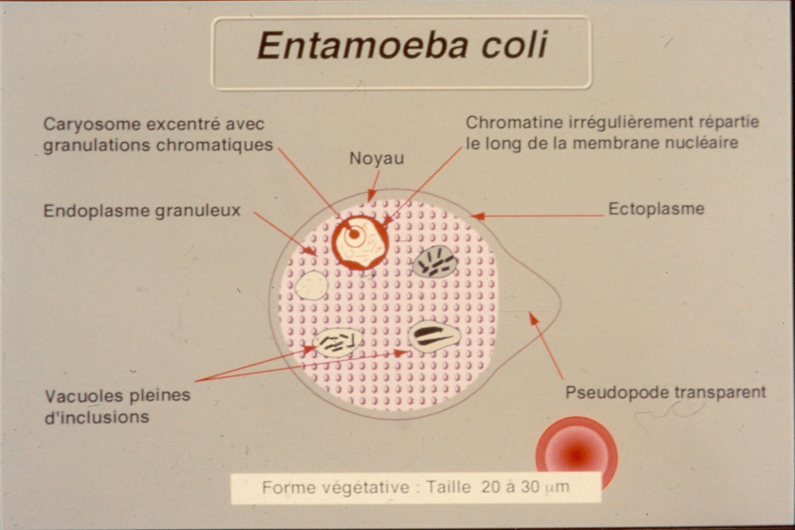

**_Cliché 1_**

**Noyau** : à l'état frais, généralement visible. Taille : 5 à 7 µm.  
Chromatine périphérique irrégulièrement répartie le long de la membrane nucléaire. Caryosome épais, en principe excentré, avec présence de granulations chromatiques autour du caryosome. Très souvent le noyau a l'air "cabossé".

**Cytoplasme** : endoplasme et ectoplasme distincts. Endoplasme plus ou moins granuleux. Présence de grosses vacuoles bourrées d'inclusions (bactéries, levures, etc.).

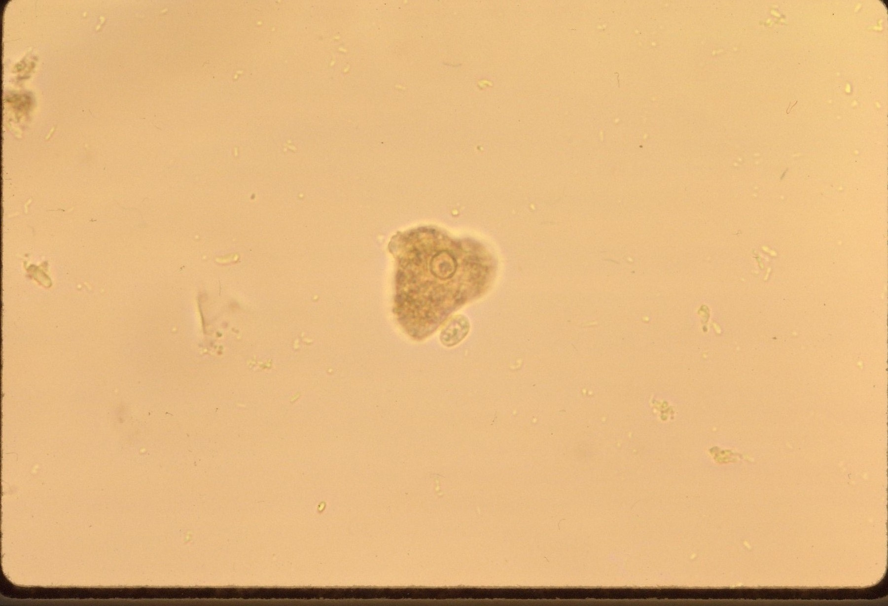

**_Cliché 3 (gr x 660) : Entamoeba coli, forme végétative_**

_Technique de Junod (flottation sur une solution d'iodomercurate de potassium)  
Ce cliché permet de bien visualiser le noyau qui est du genre Entamoeba. Le caryosome est épais et la chromatine périphérique est irrégulièrement répartie autour de la membrane nucléaire._

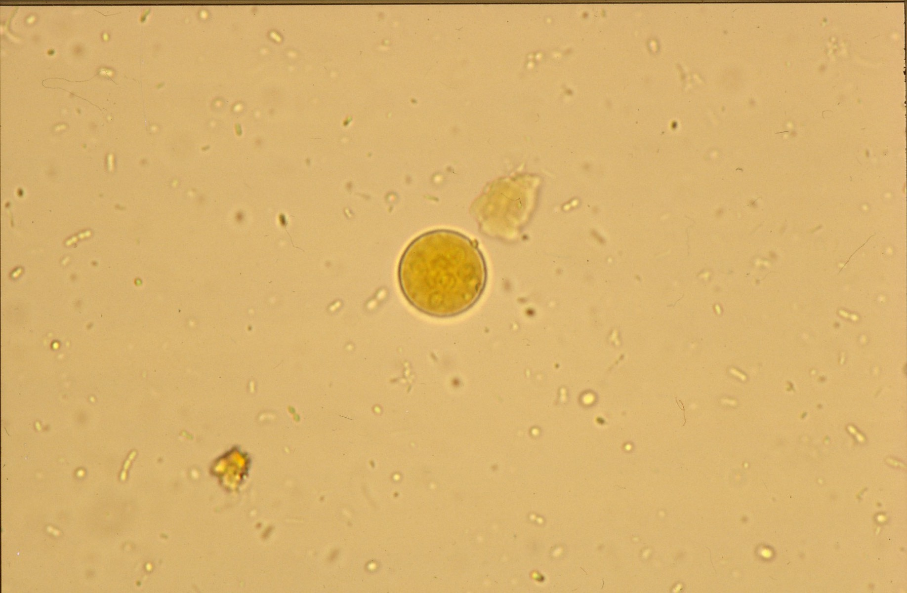

**_Cliché 4 (gr x 660) : Entamoeba coli - kyste._**  
_Technique de Bailenger. Coloration au Lugol.  
Clichés : Dr. A.M. Deluol_

### 2) Kystes

**Taille** : 15 à 20-25 µm en moyenne.  
**Forme** : arrondie ou ovalaire.  
**Contour** : à l'état frais, la coque est nette, marquée de noir.  
**Aspect** : très réfringent.

**Contenu** : de 1 à 8 noyaux.  
Dans la majorité des cas on trouve le kyste mûr à 8 noyaux  
**Cytoplasme** : clair, hyalin réfringent +++  
8 noyaux petits (faire varier la mise au point du microscope pour les distinguer) : chromatine fine, caryosome souvent central mais épais.

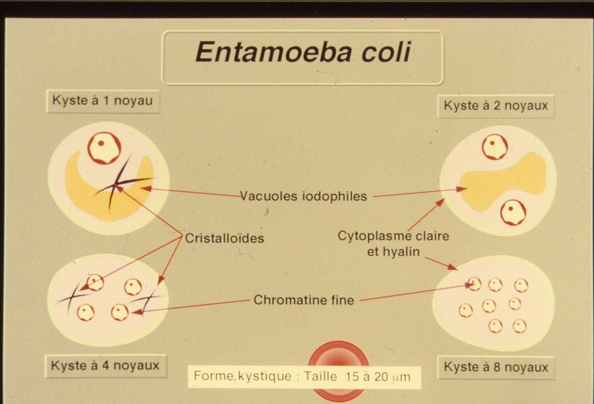

**_Cliché 2_**

##   
II. Entamoeba histolytica

Elle existe sous 2 formes :  
- Entamoeba histolytica minuta/dispar (voir cycle et pouvoir pathogène)  
- Entamoeba histolytica histolytica qui est la forme hématophage.

### 1. Forme _histolytica minuta/dispar_

#### a) Formes végétatives (trophozoïtes)

**Taille** : 12 à 15 µm (peut mesurer jusqu'à 20 ou 25 µm).

**Mobilité** : ++ ; pseudopode hyalin et transparent qui avance dans une direction déterminée.  

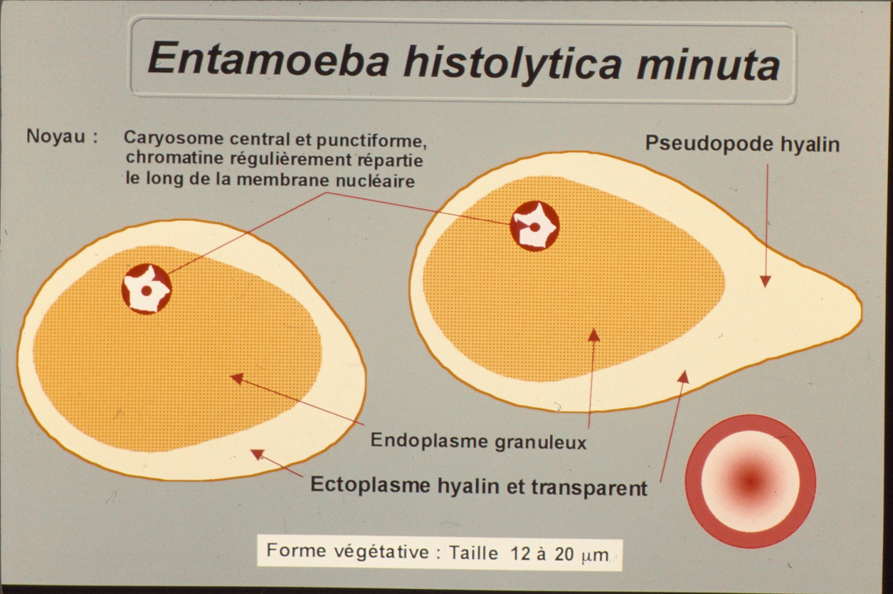

**_Cliché 5_**

_**Cytoplasme**_ :  
Ectoplasme : hyalin et transparent. Endoplasme : finement granuleux.

_**Noyau** :_ à l'état frais : difficilement visible. Taille : 4 à 7 µm.  
Chromatine périphérique régulièrement répartie le long de la membrane nucléaire qui est fine.  
Caryosome punctiforme, en général central.

**b) Kystes**

**_Taille_ **: 12 à 14-15 µm  
**_Forme_ **: arrondie dans la majorité des cas, mais ils peuvent être ovalaires.  
_**Contour**_ : net mais moins épais et moins coloré que dans les kystes d'Entamoeba coli.

_**Aspect**_ : réfringent.  
_**Contenu** :_ dans le cytoplasme, présence irrégulière de cristalloïdes à extrémités arrondies très caractéristiques (chromidium). Noyaux : on distingue 1 à 4 noyaux.  

**_Kyste à 1 noyau_** : gros noyau qui occupe le 1/3 du kyste ; présence d'une vacuole iodophile dans le cytoplasme.

**_Kyste à 2 noyaux_** : petite vacuole iodophile

**Kyste à 4 noyaux :** La vacuole a disparu. Dans le cytoplasme réfringent les noyaux sont difficiles à voir sans coloration.

**_Cliché 6_**

_**Cliché 7 (gr x 660) :**_  
**Entamoeba histolytica minuta/dispar _forme végétative_**  
_MIF coloration. Noyau du genre Entamoeba, régulier avec un caryosome central et punctiforme et une chromatine régulièrement répartie autour de la membrane nucléaire._

_**Cliché 8 (gr x 660)**_ : **Entamoeba histolytica minuta/dispar -_prékyste_**  

_Technique de Junod. Coloration au Lugol. Sur ce cliché on voit une vacuole colorée par le Lugol. Elle est diffuse dans le cytoplasme, se colore faiblement avec le Lugol. Dans ce kyste, en faisant varier la mise au point du microscope, on pourrait voir un noyau du genre Entamoeba. Il ne faut pas confondre ces kystes avec ceux du Pseudolimax butschlii._

_Clichés : Dr. A.M. Deluol_

### 2. Forme histolytica histolytica

C'est la forme hématophage. On la met en évidence dans les selles glairo-sanglantes (crachats rectaux) de la dysenterie amibienne aiguë.

**Morphologie**

_**Taille**_ : entre 12-15 µm et 30-40 µm,

_**Mobilité**_ : ++++; pseudopode hyalin et transparent ; il avance en coulant dans une direction déterminée.

**_Cytoplasme_ :**  
Finement granuleux, contenant des vacuoles de petite taille. Présence d'hématies dans certains trophozoïtes mais pas dans tous ; l'aspect des hématies varie selon le stade de leur digestion.  
L'amibe phagocyte peu de bactéries et de levures.

_**Noyau** :_ Difficile à voir à l'état frais. 3 à 7 ou 8 µm.  
Chromatine régulièrement répartie le long de la membrane nucléaire. Caryosome punctiforme et central.  
Le diagnostic de cette forme se fera essentiellement à l'examen direct.

On doit prélever un échantillon de selles au niveau des glaires dès l'émission des selles. Il faut faire l'examen très rapidement après l'émission des selles car les amibes hématophages sont fragiles, sensibles à la dessiccation et elles meurent rapidement ; elles s'arrondissent, deviennent granuleuses, peuvent se confondre avec les macrophages ; il est alors difficile de faire le diagnostic.

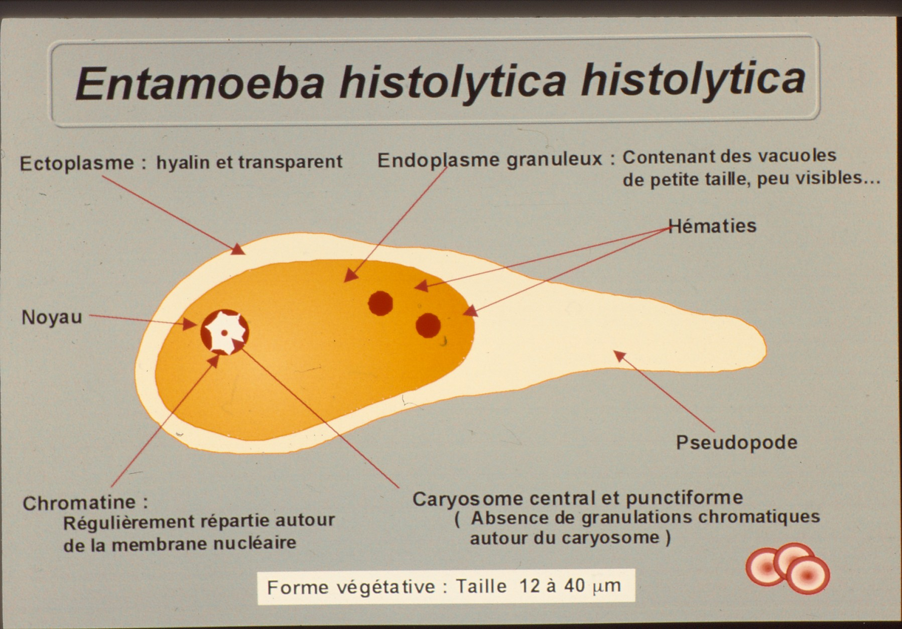

**_Cliché 9_**

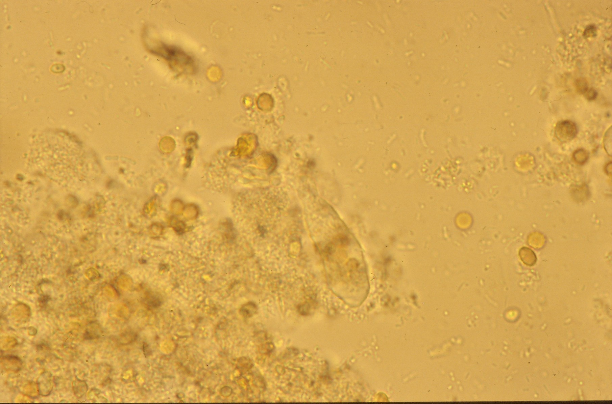

**_Cliché 10 (gr x 660) - Entamoeba histolytica histolytica_**  
_Examen direct sans coloration. L'amibe est au centre du cliché,  
allongée et elle contient des hématies digérées. Elle est très active et  
les pseudopodes qu'elle émet dans une même direction lui permettent  
de traverser le champ du microscope très rapidement._

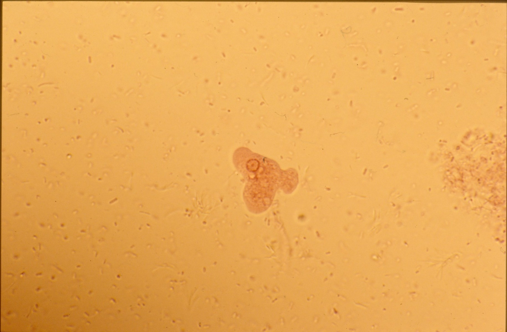

**_Cliché 11 (gr x 660)- Entamoeba histolytica histolytica_**  
_MIF coloration. Sur ce cliché, ce qu'il faut remarquer c'est la netteté et la régularité du noyau ; genre Entamoeba, caryosome central et punctiforme et chromatine régulièrement répartie autour de la membrane nucléaire. Le noyau a l'air d'avoir été tracé avec un compas dont la pointe serait sur le caryosome.  
Clichés : Dr. A.M. Deluol_

## III. Entamoeba hartmanni

**Morphologie**

**a) Formes végétatives**

_**Taille**_ : 5 à 10 µm maximum.

_**Mobilité** _: ++ ; pseudopodes hyalins.

_**Cytoplasme** _: présence de petites vacuoles mais peu d'inclusions.

_**Noyau**_ : difficile à voir à l'état frais ; on distingue une chromatine périphérique épaisse, en amas, avec un caryosome de grande taille en général central.

**_Cliché 12_**

**b) Kystes**

_**Taille** _: 6 à 10 µm maximum.  
_**Forme** _: en général arrondie. Contour : net et réfringent.  
_**Cytoplasme**_ : contient de nombreuses petites vacuoles.  
Kyste mature à 4 noyaux difficiles à voir

##    

_**                                                     Cliché 13**_

## **_ IV. Entamoeba polecki_**

**Morphologie**

**a) Formes végétatives**

_**Taille :** _10 à 25 µm

_**Mobilité :**_ + ; pseudopodes arrondis.

**_Résistanc_e** : en général se lyse vite.

_**Cytoplasme** _: endoplasme et ectoplasme bien distincts ; présence de grosses vacuoles alimentaires remplies d'inclusions.

_**Noyau**_ : peu visible à l'état frais : 3 à 4 µm. Chromatine périphérique fine et régulièrement répartie le long de la membrane nucléaire. Caryosome petit et compact.

**b) Kystes**

A l'état frais :

_**Taille**_ : 10 à 17 µm.  
_**Forme** _: arrondie ou ovalaire ; contour net, réfringent.

_**Cytoplasme**_ : nombreuses petites vacuoles qui se colorent mal à l'iode, nombreux cristalloïdes et inclusions.

_**Noyau**_ : un noyau unique visible à l'état frais. Chromatine périphérique _régulièrement répartie le long de la membrane nucléaire.  
**Caryosome**_ : en général central ; punctiforme.

_**Cliché 14**_

## V. Endolimax nana

**Morphologie**

**a) Formes végétatives**

_**Taille** _: 8 à 10 µm

_**Mobilité** _: + ; pseudopodes nombreux, courts, arrondis, émis tout autour de l'amibe.

_**Résistance**_ : restent mobiles plusieurs heures après l'émission des selles.

_**Cytoplasme**_ : endoplasme et ectoplasme peu différenciés ; présence de petites vacuoles.

_**Noyau** _: non visible à l'état frais. Après coloration : on distingue une membrane nucléaire fine.

_**Caryosome**_ : de grande taille, ovalaire, excentré, qui occupe presque tout le noyau.

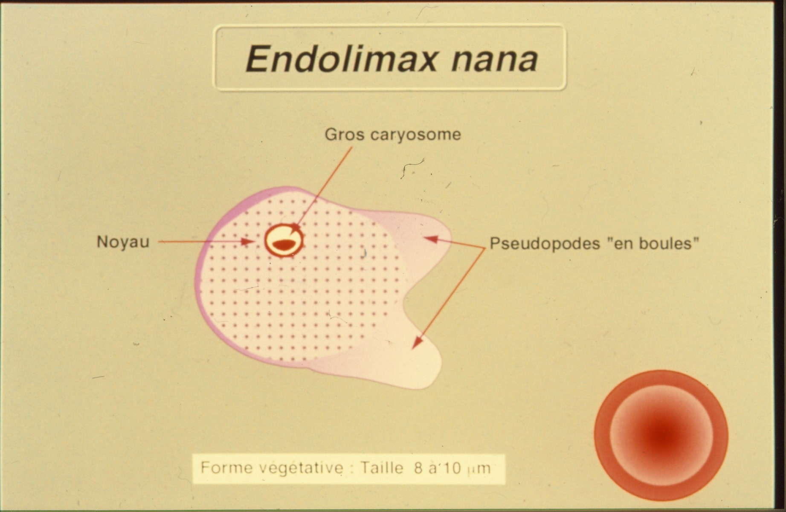

**_Cliché 15_**

**b) Kystes**

_**Taille**_ : 8 à 10 µm.  
_**Forme** _: arrondie, ovoïde ou rectangulaire. Contour : net  
_**Cytoplasme**_ : hyalin, ni vacuole ni cristalloïde.

**_Noyaux_** : on distingue bien les caryosomes très réfringents.  
Les kystes à 3 ou 4 noyaux sont le plus souvent rencontrés; les noyaux sont groupés par 2 aux extrémités du kyste.

_**Cliché 17 (gr x 990) - Endolimax nana.** __**Kystes.**_

_Technique de Junod sans coloration.  
Sur ce cliché on remarque plusieurs petits kystes, réfringents, avec dans leur cytoplasme des petits points noirs qui correspondent aux caryosomes des noyaux. Ces kystes sont ovalaires ou arrondis.  
Cliché Dr. A.M. Deluol_

**_Cliché 16_**

## **_VI. Pseudolimax butschlii_**

**Morphologie**

**a) Formes végétatives**

**_Taille_** : 10 à 15 µm (ou plus).  
_**Mobilité**_ : + ; pseudopodes à base large. Résistance : lyse rapide.

**_Cytoplasme_ **: endoplasme et ectoplasme sont peu différenciés ; nombreuses vacuoles et présence d'inclusions : levures, bactéries.

**_Noyau_ **: Gros et vésiculeux ; membrane périphérique mince ; gros caryosome central arrondi, irrégulier, entouré de granules réfringents.

**_Cliché 18_**

**b) Kystes**

_**Taille** _: 8 à 15 µm.  
_**Forme**_ : toutes les formes peuvent exister : arrondie, ovale, triangulaire, rectangulaire, trapézoïdale.

**Contour :** épais et très réfringent.

**Cytoplasme :** présence d'une vacuole iodophile (+++) dans tous les kystes. Au moment de la lecture au microscope, ajouter à la préparation une goutte de Lugol à 1 ou 2 %.

_**Noyau** _: unique, de grande taille, qui se voit bien à l'état frais. Caryosome de grande taille entouré d'un halo clair et en général excentré.

**_Cliché 19_**

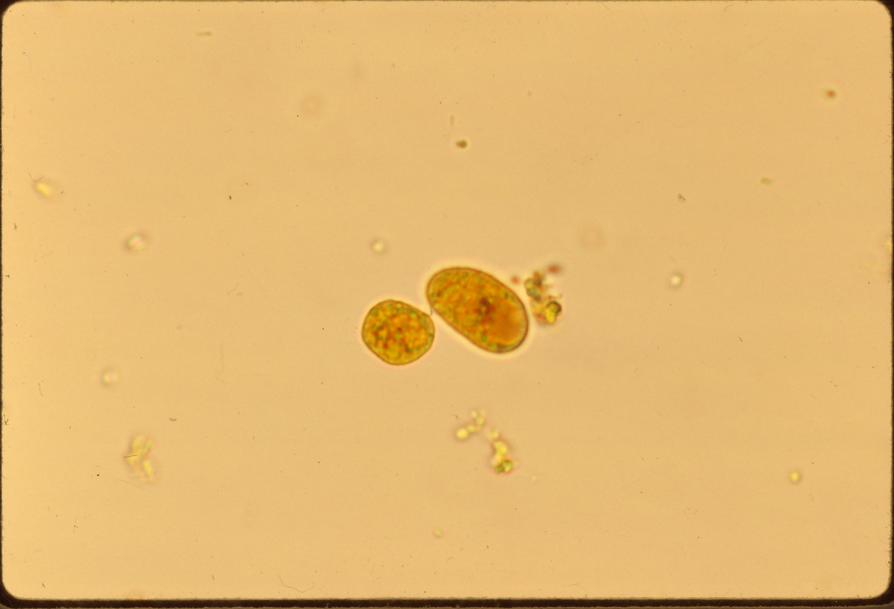

_**Cliché 20 (gr x 660) - Pseudolimax butschlii.** __**Kystes**  
Cliché Dr. A.M. Deluol_

_Technique de Junod. Coloration au Lugol. Les kystes de Pseudolimax sont faciles a reconnaître. De forme et de taille variables ils possèdent un seul noyau (pas toujours visible) et une vacuole bien délimitée dans le cytoplasme et qui se colore en brun acajou avec le Lugol.  
Attention de ne pas confondre ces kystes avec les prékystes d'Entamoeba histolytica minuta / dispar._

##   
**VII. _Dientamoeba fragilis_**

Dientamoeba fragilis est maintenant classée dans les Flagellés, mais le diagnostic différentiel se fait essentiellement avec les amibes.

**Morphologie**

Ne possède pas de forme kystique connue.

**Formes végétatives**

**_Taille :_** 7 à 20 µm.  
_**Mobilité** _:+; pseudopodes courts et nets en aspect de dentelle.  

**_Cytoplasme_ **: vacuoles peu visibles ; granulations fines +++. Nombreuses inclusions (bactéries, levures).  
_**2 noyaux** _: difficilement visibles à l'état frais. Après coloration : membrane nucléaire mince, caryosome central formé de 4 à 5 granules chromatiques.

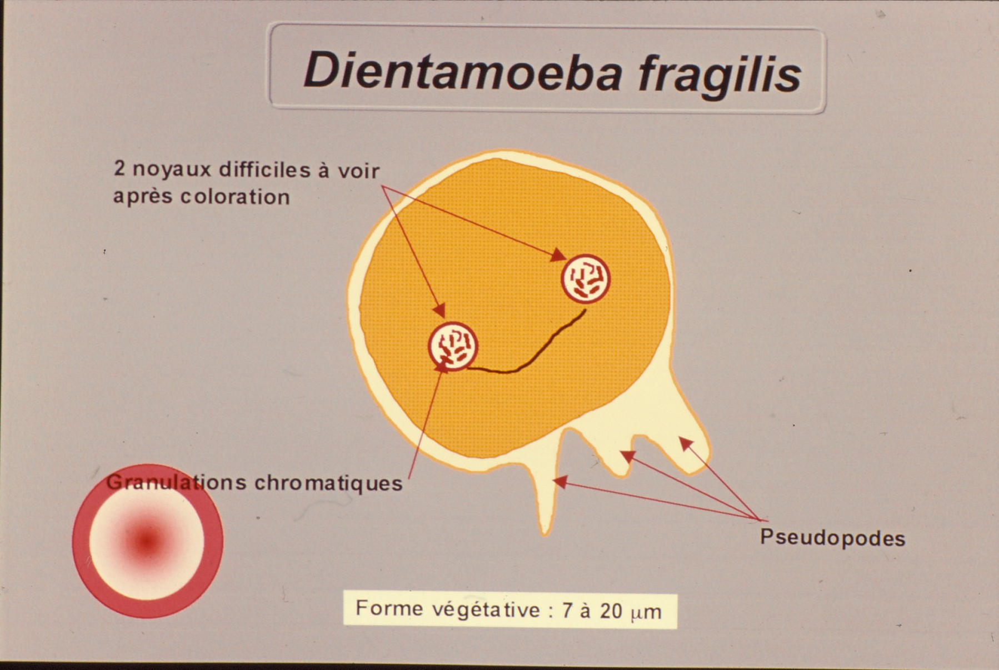

_**Cliché 21**_

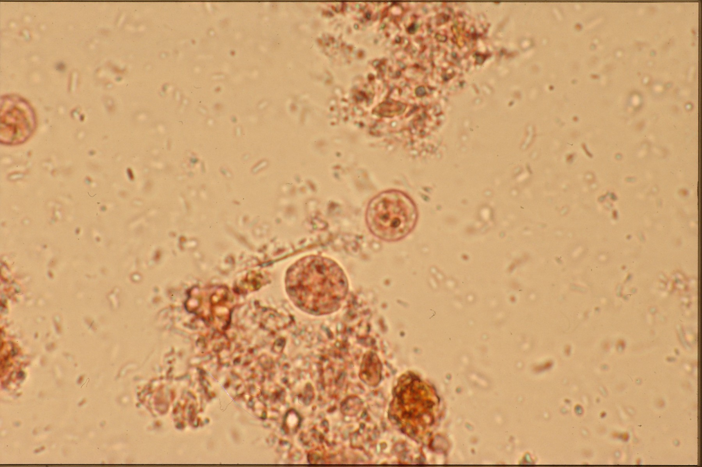

**_Cliché 22 (gr x 660)_ - Dientamoeba fragilis. Formes végétatives**

_Cliché Dr. A.M. Deluol_

_MIF coloration. Sur ce cliché on voit 2 Dientamoeba fragilis, forme arrondie, de taille différente ; en faisant varier la mise au point du microscope on peut voir les 2 noyaux colorés en noir par le MIF._

_Développement et Santé, n°185, 2007_