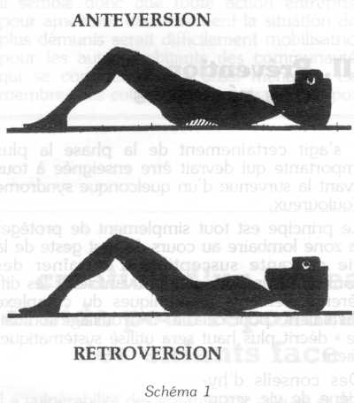
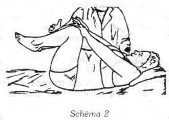
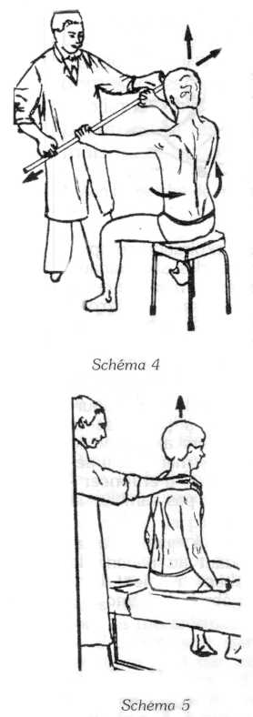
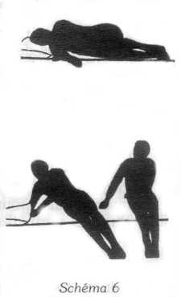
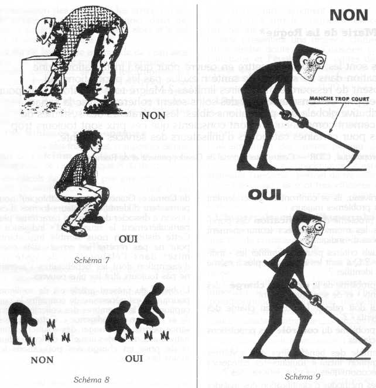

Les lombalgies et les lombo-sciatiques sont des pathologies extrêmement fréquentes contractées aussi bien lors d'activités professionnelles ou domestiques que sportives ; la banalisation de ces syndromes ne doit pas faire oublier l'importance d'une prise en charge rigoureuse adaptée à chaque patient dont les dominantes seront non seulement la lutte contre la douleur mais aussi la prévention des récidives.

## **I. Rappels anatomo-pathologiques**

Le grand nombre de formes cliniques reflète la multiplicité des causes, ces dernières devront être identifiées par le médecin afin d'écarter des cas qui ne sont pas redevables de la kinésithérapie, tels que les lombalgies d'origines tumorales ou gynécologiques.

Cependant, la plupart des lombalgies sont de caractère mécanique et c'est face à ces tableaux que la rééducation prendra toute sa valeur associée à un traitement médical antalgique.

Nous allons traiter de ce type de lombalgie dont les mécanismes les plus fréquents sont :

_- discaux_, soit par dégénérescence des structures, soit par traumatismes répétés ou violents à l'origine d'une hernie du disque venant irriter le ligament commun vertébral postérieur ou la racine nerveuse ;

_- arthrosiques_, touchant plus particulièrement les articulations interapophysaires postérieures des vertèbres dont les ostéophytes secondaires peuvent être responsables du rétrécissement du trou de conjugaison et donc de l'irritation de la racine ;

- secondaires à des _troubles statiques_ tels qu'une hyperlordose ou une scoliose ;

- liés à des _souffrances musculaires ou_ _ligamentaires._

## **II. Traitement**

Il sera toujours réalisé après un bilan détaillé permettant de connaître les circonstances d'apparition des signes cliniques, le mode de vie du patient, mais aussi les différentes particularités (examen morphostatique) et possibilités physiques (exploration de la mobilité) du patient, indispensables pour adapter et orienter précisément le traitement.

*   La douleur sera l'indicateur qui guidera les différentes phases du traitement.

*   La kinésithérapie alternera, dans un premier temps, avec de longues périodes de repos visant la décharge mécanique de la région lombaire.

Malgré le traitement anti-inflammatoire prescrit par le médecin, le patient présente encore, bien souvent, une symptomatologie douloureuse. Il est donc primordial de respecter la position antalgique adoptée par le patient. À ce titre, il sera installé en fonction de celle-ci.

Afin de viser l'antalgie (lutte contre la douleur), le massage sera la technique de choix en raison de ses effets décontracturants ; les manoeuvres devront être douces et lentes de type pressions glissées, accompagnées de légères tractions dans l'axe au niveau lombaire en prenant appui sur les crêtes iliaques de façon à décompresser la zone douloureuse.

Au préalable, des compresses chaudes pourront être appliquées en raison de leur effet sédatif.

La cessation progressive de la douleur permettra la pratique de mobilisations réalisées par le patient mais accompagnées et contrôlées par le kinésithérapeute. Elles viseront la remise en action douce de la région traumatisée ainsi que la prise de conscience par le sujet de ces différentes capacités motrices.

Elles seront pratiquées le patient allongé sur le dos, membres inférieurs fléchis, pieds reposant sur la table ; elles consisteront en des antéversions et des rétroversions du bassin, c'est-à-dire des bascules d'avant en arrière des deux os iliaques sur les têtes fémorales dont la résultante sera, dans le premier cas, une accentuation de la courbure lombaire et, dans le second cas, un comblement de l'espace entre la zone lombaire et la table _(schéma 1)._

Il sera également possible d'effectuer des petites translations de droite à gauche entraînant des inflexions latérales relatives du rachis lombaire. Ou bien encore des rotations de quelques degrés rigoureusement accompagnées par le praticien au niveau des cuisses placées à 90' de flexion, pieds décollés de la table.

En parallèle, toujours en position allongée sur le dos, un travail musculaire sera débuté, visant plus particulièrement les abdominaux et les paravertébraux, pour parvenir à une tonicité suffisante permettant d'obtenir un véritable , corset musculaire , capable de protéger le rachis lombaire. Le principe sera de travailler en plaçant la zone lombaire dans une position correcte, intermédiaire, c'est à dire plaquée contre la table, et de renforcer ainsi la musculature sans qu'il y ait mouvement, c'est-à-dire de façon statique, de manière à éviter tout geste pouvant être générateur de douleur.

Afin de travailler les abdominaux et plus particulièrement les grands droits de l'abdomen, le patient sera placé les membres inférieurs fléchis, les pieds ne reposant pas sur la table, ses mains seront placées sur la face antérieure de ses genoux et il devra ainsi résister à la poussée ascendante de ceux-ci _(schéma 2)._

Cet exercice, de même que tous les autres, devra être réalisé avec une expiration lors de la contraction, tout particulièrement en ce qui concerne les abdominaux dont une des fonctions est de permettre une expiration complète. Pour ce qui est des muscles abdominaux obliques, ils seront travaillés de manière quasi identique, seules les poussées varieront puisque la main droite devra s'appliquer sur le genou gauche et inversement, un léger décollement des épaules sera toléré à condition que la zone lombaire ne bouge pas.

Le travail des paravertébraux lombaires pourra se faire par " diffusion " à partir de la contraction des grands fessiers alors que le patient se trouve sur le dos, membres inférieurs allongés qu'il tentera " d'enfoncer " dans la table en veillant à ne pas cambrer la zone lombaire.

En progression, le passage à quatre pattes sera envisagé en demandant au patient de creuser et de bomber alternativement l'ensemble de sa colonne vertébrale _(schéma 3)._

Puis la position assise sera abordée ; la prise de conscience de la position correcte de la colonne lombaire, c'est à dire une position intermédiaire soulignant la lordose physiologique, sera poursuivie avec comme références la main et les indications du thérapeute. Une fois cette attitude maîtrisée, il sera possible de débuter, toujours de façon statique, le renforcement des groupes musculaires vus précédemment.

Le patient conservant strictement cette position, tendra ses membres supérieurs devant lui en tenant un bâton (ou en joignant les mains), ainsi le thérapeute pourra effectuer des poussées d'une durée de six secondes (suivies d'un repos au moins équivalent) auxquelles le patient devra résister, de bas en haut afin de travailler les grands droits ou bien latéralement afin de cibler plus particulièrement les obliques, à chaque fois le thérapeute devra vérifier la position du rachis lombaire (schéma 4).

Ces mêmes exercices effectués plus rapidement en variant à chaque fois l'origine de la poussée alors que le patient a les yeux fermés auront alors une visée dite proprioceptive, c'est à dire avec l'objectif de développer la vigilance musculaire face à des sollicitations pouvant être nocives.

En ce qui concerne les muscles paravertébraux, ils pourront être sollicités en demandant au patient de se grandir le plus possible sans exagérer ses courbures rachidiennes, en posant éventuellement un sac de sable de 2 kg sur la tête ou bien encore en effectuant des poussées au niveau des épaules _(schéma 5)._

L'évolution logique du traitement amènera la rééducation en station debout, le principe restera celui d'une parfaite maîtrise de la statique lombaire ; pour ceci l'utilisation, dans un premier temps, de plans de référence tels qu'un mur susceptible de donner des informations au patient quant à sa position est possible ; mais l'autonomie de ce dernier sera recherchée en le sevrant progressivement de toute aide, en utilisant éventuellement, de façon transitoire, un miroir pour initier chez lui le réflexe d'autocorrection.

À ce stade, le renforcement se fera plutôt sur le mode dynamique sans pour autant solliciter des mouvements de grande amplitude ; par exemple, le thérapeute pourra se tenir face au patient afin de lui lancer un sac contenant 2 à 3 kg de sable en lui demandant de réceptionner celui-ci en "verrouillant " sa zone lombaire ; préalablement, le patient l'aura correctement placée en co-contractant ses abdominaux et ses paravertébraux et en utilisant ses membres inférieurs comme " amortisseurs " de rotation et de flexion-extension qui d'habitude auraient été "absorbées " par le dos ; le tout en effectuant une apnée en inspiration qui, physiologiquement par la descente du muscle inspirateur principal qu'est le diaphragme, pousse sur les viscères contre la paroi abdominale contractée réalisant ainsi un véritable " caisson " augmentant très largement la résistance de la zone lombaire aux contraintes.

## **III. Prévention des récidives**

Il s'agit certainement de la phase la plus importante qui devrait être enseignée à tous avant la survenue d'un quelconque syndrome douloureux.

Le principe est tout simplement de protéger la zone lombaire au cours de tout geste de la vie courante susceptible d'entraîner des contraintes importantes pouvant léser les différents éléments anatomiques du complexe rachidien ; pour cela le verrouillage lombaire " décrit plus haut sera utilisé systématiquement.

Des conseils d'hygiène de vie seront donnés au patient en ce qui concerne, tout d'abord, la façon de se lever, en se tournant au préalable sur un côté, puis en sortant les jambes du lit en poussant simultanément sur les membres supérieurs utilisant ainsi le principe du balancier permettant à la zone lombaire de ne pas s'infléchir _(schéma 6)._

En ce qui concerne la manière de soulever une charge lourde, en pliant les membres inférieurs et en rapprochant l'objet le plus près possible du corps _(schéma 7)._

Ou bien encore, en ce qui concerne la façon de planter ou de récolter, non pas en restant de longs moments penché en avant membres inférieurs tendus, mais en s'accroupissant ou en se mettant à genoux si ceux-ci le permettent _(schéma 8)._

Pour ce qui est de cultiver, il est indispensable d'utiliser le principe des fentes antéro-postérieures, c'est-à-dire placer une jambe en avant légèrement fléchie et l'autre en arrière tendue permettant de fixer le bassin en légère antéversion et donc de conserver la zone lombaire verrouillée en légère lordose ; ce principe sera employé pour toutes les tâches ménagères ou professionnelles nécessitant une station debout prolongée _(schéma 9)._

**Conclusion**

Les lombalgies ne sont pas une fatalité et pourraient être facilement évitées si ces conseils étaient dispensés de façon préventive, car une fois les éléments anatomiques tels que le disque intervertébral ou le ligament commun vertébral postérieur lésés, le patient reste vulnérable, menacé par une éventuelle récidive ; le proverbe " _il vaut mieux prévenir_ _que guérir_ " prend ici toute sa valeur !

_Développement et Santé, n°120, décembre 1995_