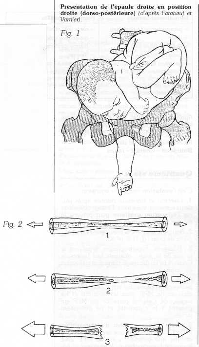
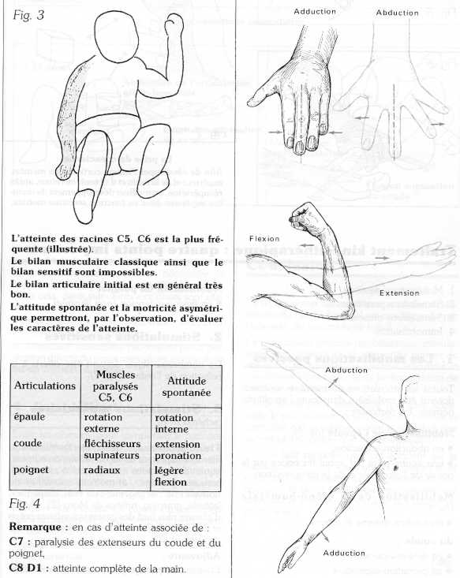
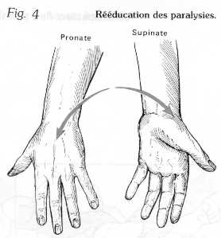
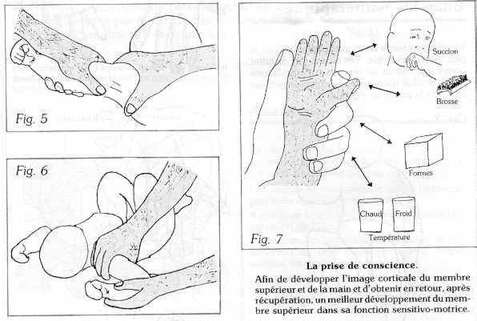
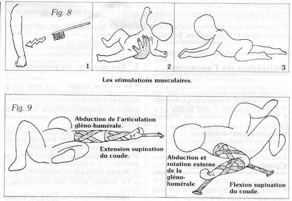

La paralysie obstétricale du plexus brachial est la conséquence d'un traumatisme par étirement des racines nerveuses à leur origine, consécutif à une traction excessive lors de l'accouchement (_fig_. _1)._

## I. Anatomie

Le plexus brachial est constitué par la réunion des rameaux antérieurs des nerfs rachidiens de C4 à D1 (racines du plexus).

Ces racines se réunissent en troncs (primaires puis secondaires) qui émettent :

*   quelques branches collatérales donnant l'innervation de l'épaule,

*   des branches terminales responsables de l'innervation du bras (nerfs circonflexe, radial, médian, musculocutané, cubital).

## II. Physiologie

Trois degrés d'atteinte du système nerveux périphérique :

1.  **L'étirement est faible**, il n'y a pas de lésion anatomique, mais une simple interruption fonctionnelle de la transmission nerveuse. La récupération est totale en quelques jours à quelques semaines.  
2.  Un **traumatisme plus important** lèse l'axone mais laisse intacte la gaine. Le bout distal dégénère. Le bout proximal repousse, guidé par la gaine intacte. Cette repousse peut néanmoins aboutir à la ré-innervation de deux muscles antagonistes (d'action contraire: par exemple le biceps fléchit le bras et le triceps qui l'étend) par un même filet nerveux, créant le phénomène des co-contractions.  
3.  **Étirement majeur**, **rupture** complète. La repousse spontanée n'est plus guidée, la récupération fonctionnelle est très compromise, en dehors d'une chirurgie nerveuse par suture des gaines pour guider la repousse _(fig. 2)._

## III. Bilan kinésithérapique

La prise en charge kinésithérapique doit être la plus précoce possible. Elle a pour but de lutter contre la tendance au blocage des articulations qui se produit spontanément et rapidement au cours de la paralysie _(fig. 3)._

## IV. Traitement kinésithérapique : quatre points importants

1. Mobilisations passives.

2. Stimulations sensitives.

3. Stimulations musculaires.

4. Immobilisation.

### 1. Les mobilisations passives

Toutes les articulations du membre supérieur doivent être mobilisées dans toute l'amplitude permise. En particulier :

#### Mobilisation de l'épaule _(fig. 5)_

*   en abduction-adduction,

*   une contre-prise par appui du pouce sur la pointe de l'omoplate évite la compensation.

#### Mobilisation de la gléno-humérale _(fig. 6)_

*   en rotation externe et interne.

#### Mobilisation du coude

*   en flexion-extension,

*   en pronation-supination.

#### Mobilisation du poignet

*   en flexion-extension (_non_ _illustrée)._

### 2. Stimulations sensitives

De nombreux objets doivent être offerts à la palpation de l'enfant. (_fig. 7)._

### 3. Stimulations musculaires

_(schéma n° 8)_

Il faut d'abord essayer de stimuler les muscles du membre supérieur de façon réflexe ou automatique. Stimulations par brosse à dents (1), caresses, grattage... et motricité spontanée du nouveau-né: dégagement du bras, suspension latérale, grasping, réflexe de Moro (2)... Avant d'obtenir plus tard des gestes volontaires précis et de les diriger par le jeu et la curiosité naturelle de l'enfant (3).

#### Adjuvants :

En cas de paralysie (contraction volontaire impossible), dans l'attente de la récupération de la commande nerveuse, il est nécessaire de conserver les qualités de contractilité du muscle. Pour cela, deux stimulants extérieurs sont utilisables :

*   l'électrothérapie excito-motrice nécessitant un appareillage particulier,

*   contraction musculaire provoquée par la percussion directe du corps musculaire avec le doigt ou un marteau à réflexe.

### 4. Immobilisations (_schéma n° 9_)

Entre les séances, pour compenser le maintien d'une attitude spontanée, on doit immobilier le membre supérieur en position opposée. L'utilisation de petites bandes élastiques permet une immobilisation relative de l'épaule, du coude et du poignet, par épinglage sur le drap du lit.

Pendant que l'enfant est calme, on pratiquera des alternances de positionnement permanent en alternance de :

*   abduction rotation interne puis externe de la gléno-humérale,

*   flexion-extension et supination du coude.

## Conclusion

La répercussion nerveuse des paralysies obstétricales du plexus brachial est conditionnée par l'intensité du traumatisme initial.

La rééducation précoce (mobilisations, stimulations, immobilisations et adjuvants) permet de conserver les qualités du système articulaire et musculaire, dans l'attente de la récupération de la commande nerveuse.

Cette rééducation préventive doit être appliquée le plus souvent possible par les parents et contrôlée par le soignant dont le rôle doit être autant pédagogique que thérapeutique.

Mais il faut rappeler que cet accident est la conséquence d'un traumatisme obstétrical et que c'est l'amélioration des conditions d'accouchement et de la qualité des manoeuvres qui constitue la prévention primaire des paralysies obstétricales.

_Développement et Santé, n°84, décembre 1989_