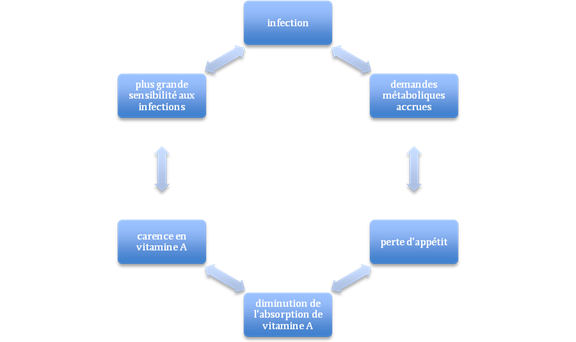

## I. Effets de la vitamine A

### 1. Rôle dans la vision

Elle a un rôle important dans la vision. Le rétinal, dérivé du rétinol, se combine à la rhodopsine dans les cellules en bâtonnets de la rétine. Ce composé, très sensible à la lumière, se scinde en deux en libérant de l’énergie qui va stimuler les terminaisons nerveuses et envoyer l’information aux centres optiques du cerveau. C’est pourquoi l’un des premiers signes de carence en vitamine A est une mauvaise vision si l’éclairage est faible.

### 2. Rôle dans la croissance

La carence entraîne une perte d’appétit, de poids et un ralentissement de la croissance.

### 3. Effets cutanéo-muqueux

Une carence en vitamine A conduit à une surcharge en kératine dans les tissus cutanéo-muqueux avec une altération de leur fonctionnalité. Si la carence devient importante, les lésions sont irréversibles, elles atteignent ainsi les conjonctives de l’œil puis la cornée, expliquant les lésions observées.

### 4. Carence et infections

Sur le plan infectieux : les altérations de la peau et des muqueuses augmentent la sensibilité aux infections. De plus, on note une baisse de la compétence des lymphocytes T.

## II. Métabolisme de la vitamine A

La vitamine A est stockée dans le foie, qui contient 90 % de la quantité totale de l’organisme. De 30 à 60 % de la quantité ingérée chaque jour sont mis en réserve dans le foie, puis la vitamine A est libérée en fonction des besoins de l’organisme.  
Cela explique pourquoi les signes cliniques de carence n’apparaissent que longtemps après un régime déficitaire (lorsque les réserves sont épuisées).

Certaines périodes de la vie mobilisent davantage la vitamine A : les enfants, tout particulièrement au moment du sevrage et les femmes enceintes et allaitantes sont des populations à plus fort risque de carence en raison d’un accroissement des besoins, difficilement compensés par l’alimentation quotidienne

Certains facteurs influent sur cette carence : sociaux, économiques, culturels, éducatifs et environnementaux. Une mauvaise promotion de l’allaitement maternel pendant les 6 premiers mois avec nécessité impérative de mettre l’enfant au sein avant la première heure de vie, les diarrhées et les parasitoses intestinales entraînent une réduction  de l’absorption de la vitamine A alors qu’en raison des risques infectieux, les besoins sont être accrus et les réserves hépatiques s’effondrent donc plus vite.

## III. Clinique de la carence en vitamine A

### 1. Les signes

Susceptibilité aux infections des enfants de 6 mois à 59 mois : la prévention de la carence en Tanzanie et en Afrique du Sud a permis de réduire de 50 % la mortalité due à la rougeole  
L’apport de vitamine A réduit la mortalité maternelle et améliore la correction de la carence en fer lors de la supplémentation en fer.

#### Xérophtalmie :

*   altération précoce de l’adaptation à l’obscurité : cécité nocturne, héméralopie,
*   cécité par atrophie de la conjonctive bulbaire.

Le déficit en vitamine A est progressif, son grand danger est qu’il reste longtemps asymptomatique. Lorsque les premiers signes cliniques ophtalmologiques apparaissent, le déficit est déjà profond, les signes étant partiellement réversibles selon le stade si la carence est corrigée. En revanche, à ce stade, l’immunité de l’enfant est diminuée et toute maladie intercurrente peut avoir des répercussions gravissimes (allant jusqu’au décès).

### 2. Comment faire un diagnostic précoce  
de carence en vitamine A

A un stade précoce, l’œil de l’enfant semble encore normal et le diagnostic ne peut être fait si la carence n’est pas recherchée par l’interrogatoire. Des questions simples posées à la mère peuvent orienter vers ce diagnostic :

*   La mère a-t-elle remarqué que son enfant trébuche ou se cogne dans l’obscurité ou au crépuscule ?
*   De tels signes sont-ils apparus récemment  ?
*   S’il s’est blessé récemment, à quel moment de la journée est survenu l’accident ?
*   Lors du repas familial le soir, si l’éclairage est faible, a-t-il du mal à trouver sa nourriture ?

De tels signes doivent d’emblée alerter et conduire à la mise en place d’une supplémentation en vitamine A.

De façon systématique, il faut également demander à la mère si son enfant a souvent les yeux rouges, s’il se les frotte (prurit, témoin de la sécheresse oculaire), a-t-il souvent les yeux fermés, comme s’il voulait les protéger ?

Il faut également :

*   demander à la mère si, pendant sa grossesse, il lui a été donné une supplémentation en vitamine A.  
*   faire une enquête alimentaire pour rechercher une insuffisante d’apport. 

Il faut toujours regarder les yeux d’un enfant.

Au stade de début, on recherche la constitution de tache de Bitot : c’est une modification du blanc de l’œil.

Puis apparaissent des lésions de la partie foncée de l’œil, c’est-à-dire la cornée : aspect trouble, puis blanchiment de la cornée avec ulcération.

<table>

<tbody>

<tr>

<td>

</td>

<td>

</td>

</tr>

</tbody>

</table>

Parallèlement, il faut rechercher des maladies associées, témoignant de la carence en vitamine A : dénutrition, infections fréquentes (rougeole+++), diarrhées, retard de croissance.  
Dans toutes ces situations, il faut agir très rapidement, car cette carence peut conduire à une cécité irréversible.

### 3. Conduite à tenir

Un apport en vitamine A est essentiel, les conditions d’administration sont résumées dans le tableau suivant.

<table>

<tbody>

<tr>

<td style="width: 138px; ">

Maladie 

</td>

<td style="width: 149px; ">Posologie per os :  
palmitate de rétinol </td>

<td style="width: 148px; ">Fréquence  
d’administration</td>

</tr>

<tr>

<td style="width: 138px; ">Xérophtalmie</td>

<td style="width: 149px; ">< 6mois : 50 000 U  
6-12mois : 100 000 U  
> 12mois : 200 000 U</td>

<td style="width: 148px; ">J0, J1, J14 à J28</td>

</tr>

<tr>

<td style="width: 138px; ">Rougeole en zone de carence en vitamine A endémique </td>

<td style="width: 149px; ">< 12mois : 100 000 U  
> 12mois : 200 000 U</td>

<td style="width: 148px; ">J0, J1</td>

</tr>

<tr>

<td style="width: 138px; ">Malnutrition sévère</td>

<td style="width: 149px; ">< 12mois : 100 000 U  
> 12mois : 200 000 U</td>

<td style="width: 148px; ">Dès la prise en charge, une seconde dose si l’état s’aggrave</td>

</tr>

<tr>

<td style="width: 138px; ">Diarrhée chronique</td>

<td style="width: 149px; ">< 12 mois : 100 000 U  
> 12mois :200 000 U</td>

<td style="width: 148px; ">Une fois par épisode, un mois au moins entre chaque prise</td>

</tr>

</tbody>

</table>

### 4. Prévention

#### Conseils nutritionnels

La prévention repose avant tout sur des conseils nutritionnels adaptés : adopter une alimentation riche en vitamine A :

*   Le rétinol est présent à l’état naturel dans les produits laitiers, le foie et les abats.  
*   Les précurseurs de la vitamine A sont retrouvés dans les végétaux : carottes, huile de palme rouge, patate douce à chair orangée, mangue, papaye, feuilles vertes.

En Afrique, 70 à 90 % de la vitamine alimentaire provient de cet apport, mais l’absorption est médiocre par rapport à celle du rétinol (20 à 50 % comparé à une absorption de 80 % pour le rétinol).

#### Particularité de la femme enceinte 

Des études de supplémentation au cours de la grossesse dans des pays où la carence en vitamine A est endémique ont permis de mettre en évidence plusieurs points.

**Au Népal**  
Une étude a porté sur la supplémentation en vitamine A en cours de grossesse et son action sur la mortalité maternelle dans les 12 semaines du post-partum :

<table>

<tbody>

<tr>

<td style="width: 151px; ">Supplémentation</td>

<td style="width: 145px;">% diminution de la  
mortalité maternelle</td>

</tr>

<tr>

<td style="width: 151px; ">Vitamine A</td>

<td class="rtecenter" style="width: 145px;">40 %</td>

</tr>

<tr>

<td style="width: 151px; ">Bêta-carotène</td>

<td class="rtecenter" style="width: 145px;">50 %</td>

</tr>

</tbody>

</table>

Soit, en combinant ces résultats, une diminution de 44% par rapport au groupe sans supplémentation. Parallèlement, il a été également noté une diminution significative de l’héméralopie chez ces femmes enceintes. En revanche, il n’a pas été observé d’amélioration du taux de survie des fœtus.

**En Indonésie**  
Une étude a également permis de mettre en évidence le rôle de la vitamine A dans la prévention des anémies chez la femme enceinte (si Hb < 11 g/dl).

<table>

<tbody>

<tr>

<td style="width: 265px; ">Supplémentation</td>

<td style="width: 116px;">% de femmes  
non anémiées</td>

</tr>

<tr>

<td style="width: 265px; ">Pas de supplémentation : groupe placebo</td>

<td class="rtecenter" style="width: 116px;">16 %</td>

</tr>

<tr>

<td style="width: 265px; ">Vitamine A</td>

<td class="rtecenter" style="width: 116px;">35 %</td>

</tr>

<tr>

<td style="width: 265px; ">Fer</td>

<td class="rtecenter" style="width: 116px;">68 %</td>

</tr>

<tr>

<td class="rteleft" style="width: 265px; ">Vitamine A + fer</td>

<td class="rtecenter" style="width: 116px;">97 %</td>

</tr>

</tbody>

</table>

Il en ressort qu’il est fondamental de supplémenter à la fois en fer et en vitamine A en cas de risque de carence, mais il n’y a pas encore de recommandations officielles.