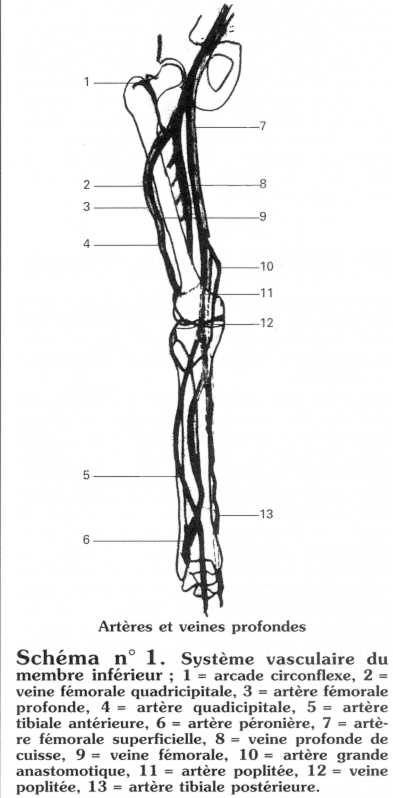
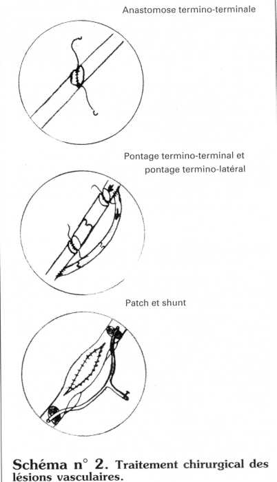
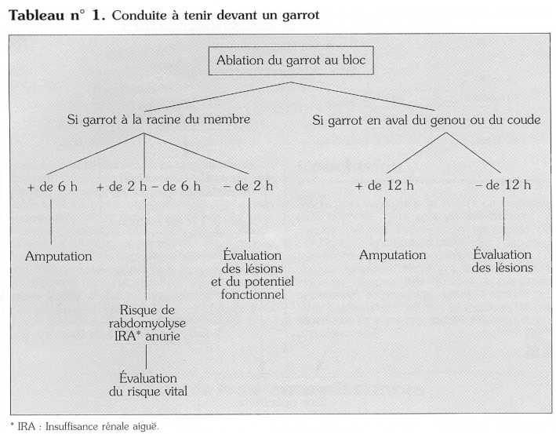
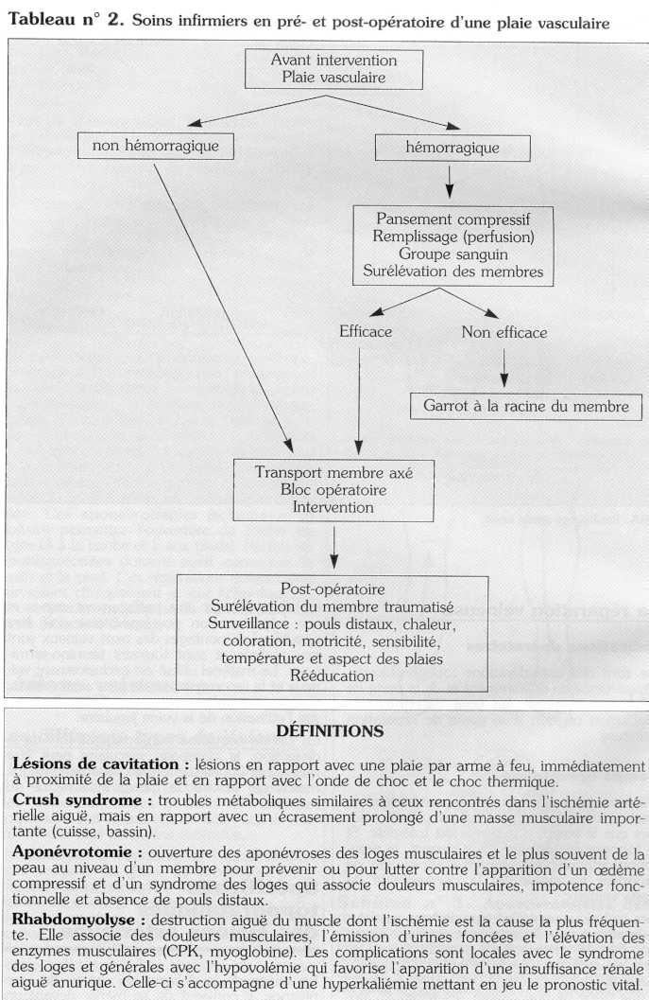

**Deux tableaux doivent être individualisés :**

*   _Le délabrement de membre_ _est isolé et_ _le pronostic fonctionnel est au premier plan_. Si le délabrement et l'ischémie de membre sont notables, le pronostic vital peut progressivement être mis en jeu et il ne faut pas laisser passer l'heure de l'amputation, au terme d'une évaluation régulière. Le pronostic fonctionnel est lié lui-même à l'importance des lésions locales associées (nerfs, peau, muscles) qui peuvent aussi conduire à une amputation.
*   _Le délabrement est associé à_ un _polytraumatisme_ : l'atteinte vasculaire doit être reconnue, traitée et le degré d'urgence doit être apprécié en fonction de l'atteinte des autres organes (crâne, thorax, abdomen) mettant en jeu le pronostic vital.

**Mécanismes**

Les plaies de guerre ont permis de se forger une bonne expérience des délabrements de membre. En dehors de circonstances assimilables à la guerre (attentat, explosion), il en est de multiples qui peuvent être pourvoyeuses de délabrement : les accidents de " chasse " (par " fusil à pompe " ou par plombs de chasse), les accidents de la voie publique (motocycliste, piéton, automobiliste), les accidents du travail ou équivalent (écrasement par rouleau compresseur, par compacteur par roue de chemin de fer...) .

## I. Lésions artérielles

### 1. Les différents types de lésions

L'artère comprend trois tuniques : interne ou intima, moyenne ou média, externe. Les lésions artérielles rencontrées peuvent être uniques ou multiples, franches ou contuses. La rupture des trois tuniques : partielle ou totale est responsable d'une hémorragie extériorisée, d'un hématome pulsatile ou d'une thrombose avec rétraction des extrémités. La rupture intimale, source de thrombose secondaire, se rencontre le plus souvent dans les chocs directs ou contusions. La rupture intimo-médiale (ou sous-adventitielle) responsable d'une dissection intramédiale avec thrombose immédiate ou sténose secondaire, ou d'anévrisme post-traumatique avec risque de rupture se rencontre dans les décélérations brutales (gros vaisseaux), dans les élongations, ou dans les lésions de cavitation. Les autres lésions artérielles rencontrées sont la fistule artérioveineuse immédiate ou secondaire avec plaies transfixiantes de l'artère et de la veine, les embolies artérielles par corps étranger ou thrombus, le spasme artériel, d'autant plus que le sujet est jeune.

### 2. Les différents tableaux cliniques

La lésion artérielle au cours des délabrements de membres peut être évidente devant une section ou un arrachement complet ou encore devant une ischémie aiguë sensitivo-motrice profonde.

Beaucoup plus souvent la lésion artérielle est plus discrète, ou est dominée par un tableau général grave, ce qui implique de la rechercher systématiquement devant tout traumatisme délabrant de membre et, plus particulièrement, dans certains types de lésions ostéo-articulaires (fractures du fémur, luxation antérieure du coude ou du genou, fractures multiples avec contusion appuyée d'un segment de membre ... ), ou chaque fois qu'existe une anomalie de l'examen vasculaire persistant après réalignement des fragments osseux.

La clinique est parfois prise en défaut : tarissement quasi instantané d'une plaie ayant initialement saigné en jet (du fait du spasme), pouls présents en aval de lésions artérielles.

### 3. La durée de l'ischémie

La durée de l'ischémie tolérable pour un membre ne peut se résumer au dogme des 6 heures. Elle n'est pas toujours complète et parfois elle évolue dans le temps. Le niveau de la zone ischémique conditionne également la durée de la tolérance : au niveau du pied où il n'y a pratiquement pas de masse musculaire, des sauvetages ont pu être réalisés après 24 à 48 heures d'ischémie aiguë, au prix de séquelles neurologiques périphériques.

Par contre, si le niveau supérieur de l'ischémie aiguë est crural, au-delà de 6 à 12 heures, la revascularisation provoquera un oedème musculaire et une rhabdomyolyse majeure, d'autant plus importante que l'ischémie a été profonde et prolongée et la revascularisation efficace. Dans ce cas, les aponévrotomies sont indispensables pour favoriser la revascularisation distale, mais elles majorent la rhabdomyolyse. L'insuffisance rénale aiguë est parfois inévitable, qui impose l'hémodialyse. Dans un tel contexte, avant l'apparition d'une défaillance multiviscérale, ou d'un problème septique incontrôlable, il faut savoir préférer l'amputation surtout en l'absence complète d'espoir fonctionnel.

### 4. La place des examens complémentaires : **écho-doppler, artériographie**

Dans la prise en charge en urgence des délabrements de membres, les données de l'examen périphérique au doppler portable peuvent être précieuses : s'il existe un flux artériel pulsé à l'extrémité, même en l'absence de pouls palpable, il n'y a pas _a priori_ d'extrême urgence à la revascularisation ou à l'aponévrotomie. Dans le cas contraire avec une absence complète de flux audible, le temps est compté pour la tolérance des muscles et des nerfs à l'ischémie complète, et l'artériographie d'urgence s'impose afin d'aboutir le plus rapidement possible au geste nécessaire de restauration artérielle et/ou d'aponévrotomie.

L'artériographie est l'examen clé, mais sa réalisation ne doit pas retarder la prise en charge chirurgicale et peut le plus souvent être faite au bloc opératoire. Elle permet de mettre en évidence le siège de l'arrêt, apprécie le lit d'aval, recherche des lésions associées.

En l'absence d'artériographie et de possibilité de cliché artériel au bloc opératoire, l'abord premier selon le contexte hémorragique ou non peut être au niveau de la zone lésionnelle ou en amont de celle-ci afin de réaliser un clampage premier. Au moindre doute, il convient de décider rapidement de la réalisation d'un pontage veineux " shuntant " la zone suspecte.

### 5. La réparation artérielle

#### a. Indications opératoires

Le plus souvent, un geste chirurgical d'hémostase et/ou de reconstruction artérielle ou veineuse est réalisé, dans un contexte d'urgence hémorragique ou d'ischémie sévère. Les conditions locales, le type et la topographie des lésions déterminent les techniques de réparation. Parfois, lorsque le pronostic vital à court ou à moyen terme est en jeu, ou lorsque les conditions locales ou les lésions nerveuses sont trop importantes, il faut savoir réaliser une simple ligature, conduisant le plus souvent à l'amputation.

#### b. Temps opératoires

*   _Lors de l'installation_, les deux membres inférieurs seront systématiquement préparés (possibilité de prélèvement du greffon saphène interne opposé ) et mis dans le champ opératoire. Avant l'ablation d'un garrot, les anesthésistes sont sensibilisés à la nécessité d'un bon remplissage vasculaire (macromolécules ou sang). La récupération sanguine est réalisée dès que cela est possible. Une antibiothérapie à large spectre est instaurée et la prévention antitétanique réalisée.
*   _Dans un premier temps_, il est réalisé un parage _a minima_, et surtout le bilan lésionnel artériel, nerveux et osseux est établi. L'artériographie sur table, si elle n'a pu être réalisée préalablement, est réalisée. En cas de lésions ostéo-articulaires associées à des lésions vasculaires, le premier temps doit toujours être un temps de réduction. Dès lors l'état vasculaire du membre est réévalué, et le plus souvent le second temps chirurgical consiste en la fixation des foyers de fractures. Le geste orthopédique doit être rapide, et laisser la place à l'abord artériel. Mais en cas d'ischémie sévère, de retard de prise en charge, de nécessité de geste associé (abdomino-thoracique ou neurochirurgical) ou de geste orthopédique complexe, la mise en place préalable d'un shunt peut s'imposer.

_Le_ _traitement chirurgical (schéma n° 2)_ respecte les impératifs habituels : résection des zones contuses, suture en zone saine, réparation directe avec ou sans patch, selon la lésion et le diamètre du vaisseau ; en cas de perte de substance, revascularisation par l'intermédiaire d'un greffon (saphène interne), préservation au maximum des collatérales, pontage en position plutôt anatomique qu'extra-anatomique, sauf défaut de couverture. La nécessité d'une héparinothérapie per-opératoire est discutée (habituellement à la dose de 1/2 mg/kg) et devra de toute façon être adaptée en fonction des lésions associées. La suture directe sur plaie franche n'est qu'exceptionnellement possible et est pourvoyeuse de sténose et de rupture secondaire. Une résection avec suture termino-terminale est de réalisation plus fréquente mais la perte de substance artérielle ne peut être que limitée (< 3 cm) et la suture doit se faire sans traction. En cas de lésions complexes ou de perte de substance artérielle importante, un pontage est réalisé, le plus souvent au moyen d'un segment de veine saphène interne inversée. Le choix de la saphène à utiliser doit être la saphène homolatérale si celle-ci a été interrompue par le traumatisme et s'il reste un segment utilisable suffisamment long ; dans le cas contraire, la saphène controlatérale est utilisée. La préservation de principe de la saphène interne controlatérale permet la réalisation facile d'un éventuel deuxième temp vasculaire. Parfois, les veines du bras sont utilisables (surtout la veine radio-céphalique) parfois seule la veine jugulaire a le diamètre suffisant.

*   _En fin d'intervention,_ une artériographie de contrôle sur table doit être impérativement réalisée pour dépister une malfaçon, vérifier la progression normale du produit de contraste jusqu'à l'extrémité.

La couverture des segments vasculaires est obligatoire, et doit être immédiate si possible. En effet, une artère, une veine ou un pontage exposé, peut s'éroder et a beaucoup plus de risque de se thromboser.

<table>

<thead>

<tr>

<th scope="col">Principes de toute reconstruction artérielle</th>

</tr>

</thead>

<tbody>

<tr>

<td><ul><li>Soin dans la préparation du greffon saphène interne</li><li>Calcul de la longueur du pontage</li><li>Prévention des "twists" et des compressions dans le trajet</li><li>Héparinisation directe d'amont et d'aval</li><li>Flush avant déclampage</li></ul></td>

</tr>

</tbody>

</table>

### 6. Surveillance post-opératoire

Sur artère saine, une héparinisation post-opératoire peut être instaurée, mais uniquement en l'absence de risque hémorragique. Après revascularisation, la fonction rénale est surveillée, d'autant que l'ischémie peut se doubler d'un " crush syndrome ". L'indication d'une aponévrotomie s'impose devant tout oedème compressif, qu'un geste de revascularisation ait été effectué ou non. Si la revascularisation a été tardive, elle est réalisée d'emblée. Ces aponévrotomies (_schéma_ _n° 3)_ doivent permettre l'ouverture de toutes les loges (3 à la jambe et 2 aux pieds). Parfois les aponévrotomies doivent aussi concerner la main et le pied. Ces réparations doivent être surveillées cliniquement et par écho-doppler, à un rythme variable selon l'ancienneté du geste (6 mois à 3 ans).

## II. Lésions veineuses

### 1. Les différents types de lésions

La paroi veineuse est constituée comme l'artère de trois tuniques qui peuvent présenter des lésions similaires à celles des artères conduisant soit à une hémorragie, soit à une thrombose plus ou moins extensive.

On distingue la contusion et l'arrachement, pour lesquels un geste de réparation n'est effectué qu'extrêmement rarement, car ces lésions imposent la réalisation d'un long pontage avec un risque majeur de thrombose. La section ou la plaie plus ou moins franche d'une veine de bon calibre constitue une bonne indication à une tentative de réparation, par patch, résection anastomose ou pontage.

### 2. La réparation veineuse

#### a. Indications opératoires

Ce sont des considérations topographiques, l'importance du délabrement et de la perte de substance veineuse qui vont déterminer la réalisation ou non d'un geste de réparation veineuse.

#### b. Temps opératoires

Comme pour les réparations artérielles, la fixation osseuse est réalisée en priorité, dès lors que le temps d'ischémie est tolérable. Si la topographie des lésions le permet, la réparation artérielle est réalisée d'abord afin de favoriser au maximum la perméabilité du geste veineux.

Les techniques chirurgicales de base sont les mêmes que pour les artères, mais plus souvent que pour les artères, il est possible de réaliser une anastomose directe. Pour être fonctionnelle, une telle réparation doit siéger au niveau d'une veine de bon calibre, les zones anastomotiques doivent être parfaitement saines et une héparinisation postopératoire doit être possible. Les pontages des axes veineux sont peu réalisés et sont toujours termino-terminaux. Le matériel utilisé est exclusivement veineux et la reconstruction de gros axes veineux (iliaque, fémorale commune, axillaire ... ) nécessite l'utilisation de la veine jugulaire.

En cas de problème hémorragique lors de la dissection, le clampage vasculaire peut être réalisé par la mise en place d'une bande d'Esmarch qui servira de garrot à la racine du membre.

## III. Spécificités topographiques des lésions artérielles

En raison de la richesse du réseau de suppléance, il convient de se méfier devant un tableau d'ischémie modérée tant au niveau du membre supérieur (lésions sous-clavières, axillaires, humérales, anté-brachiales) qu'au niveau du membre inférieur (lésions fémorales communes et superficielles, fémorales profondes, poplitées, sous-poplitées). En cas de lésion proximale, la réparation ne s'impose qu'en cas d'hémorragie ou d'ischémie. En cas de lésion distale, on s'attache à rétablir un flux correct dans l'un des axes, parmi les deux axes (radial et cubital) du membre supérieur en privilégiant l'axe radial et parmi les trois axes (péronier, tibial postérieur et tibial antérieur) du membre inférieur.

## Conclusion

Sur le plan vasculaire, le succès du sauvetage d'un membre ayant subi un délabrement est conditionné par l'application rigoureuse des principes de la chirurgie vasculaire : dépistage très précoce de la lésion vasculaire et de l'ischémie tissulaire, reconstruction artérielle et veineuse chaque fois qu'elles apparaissent nécessaires et possibles. Enfin, il faudra préférer l'attitude qui permet le meilleur taux de sauvetage de membre, sans compromettre le pronostic vital.

_Développement et Santé, n° 136, août 1998_