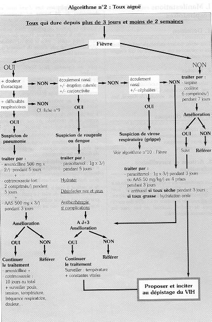
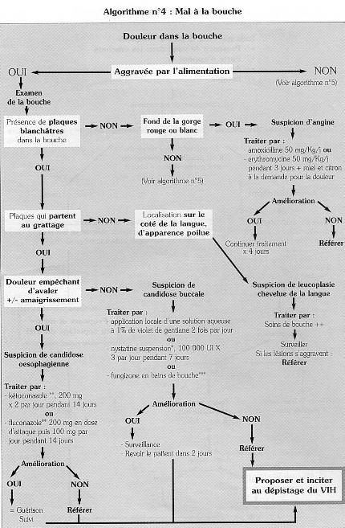
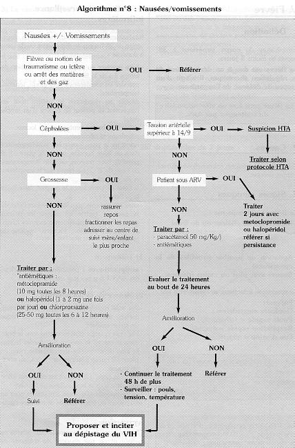
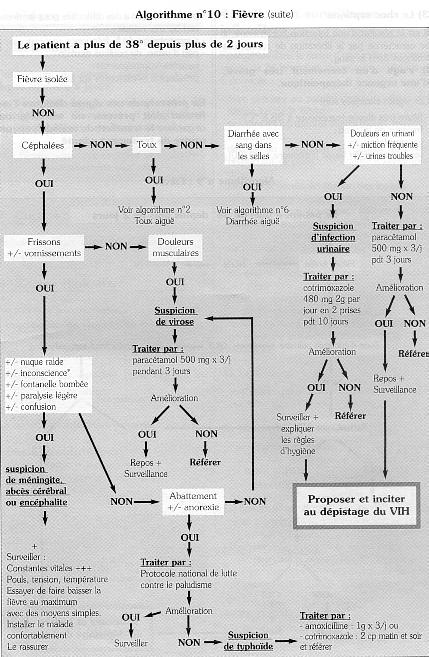
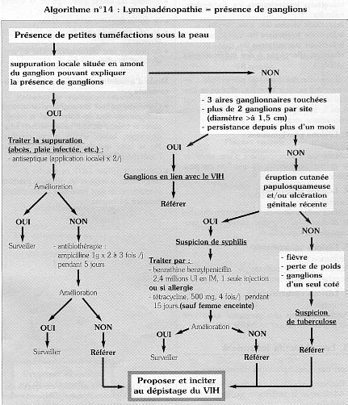
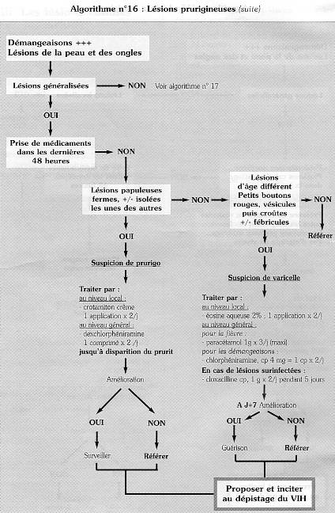
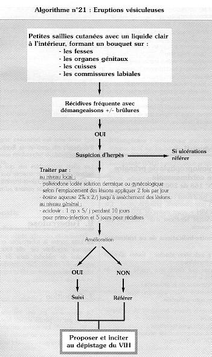

## I. Manifestations respiratoires

### 1. Définition

Toux et/ou douleur thoracique et/ou difficultés respiratoires qui persistent ou qui s'aggravent malgré les traitements habituels.

### 2. Causes

*   infections (exemples : tuberculose, pneumonie, pneumocystose, CMV...),
*   cancers (exemples : sarcome de Kaposi, lymphome).

### **3. Signes cliniques**

*   toux chronique,
*   difficultés respiratoires,
*   douleurs thoraciques,
*   expectorations.

### 4. Actions et surveillance infirmières

Les manifestations respiratoires (toux, douleur thoracique, difficultés respiratoires) sont angoissantes pour le patient. C'est pourquoi, il faut rassurer le malade et lui offrir des conditions de confort maximal en lien avec les ressources disponibles.

Les objectifs infirmiers lors d'une mise en observation de 24 heures au dispensaire ou d'une prise en charge à domicile sont :

*   Installer le patient en position demi assise, c'est-à-dire le buste surélevé. Placer des coussins, draps roulés... sous le dos du malade. (Attention de ne pas utiliser de moyens qui pourraient blesser le patient).  
*   Mettre à disposition du patient un récipient avec un couvercle dans lequel il pourra cracher.  
*   Si la personne est alitée, l'aider à se mobiliser dans le lit, s'asseoir, se retourner... cela améliorera le drainage pulmonaire.  
*   Apprendre au patient à respirer profondément et à expectorer.  
*   Il est possible de comprimer légèrement le thorax de la personne en cas de douleur intense lors des épisodes de toux.  
*   Penser à bien aérer les pièces.  
*   Conseiller au patient de boire de l'eau pure et des boissons chaudes qui permettront de fluidifier les sécrétions.  
*   Pratiquer des inhalations avec de la vapeur d'eau chaude (récipient d'eau chaude bouillie+linge propre sur la tête du malade) pour fluidifier les crachats épais.  
*   Si le patient a mal à la gorge pressez un citron et ajoutez-y du miel. Le patient pourra prendre une grande cuillère de ce mélange aussi souvent que cela est nécessaire.

## II. Candidose buccale

*Comment prendre la nystatine en suspension ? Mettre la nystatine suspension dans la bouche et la garder quelques minutes avant de I'avaler. Ne rien manger ni boire pendant 20 minutes après avoir pris la nystatine.  
*On peut remplacer la nystatine suspension par la nystatine ovules gynéco à 100 000 UI : laisser fondre dans la bouche 3 à 5 ovules/j.  
** Kétoconazole et fluconazole sont contre-indiqués en cas de suspicion de grossesse, de prise d'an ti-tuberculeux ou d'ARV.  
***Préparation de la fungizone pour bain de bouche : mettre un flacon de suspension de fungizone dans un flacon de 500 ml d'eau bicarbonatée à 14 p. 1000.

### Actions et surveillance infirmières

**Dans le but d'améliorer le confort du patient :**

*   mettre en oeuvre le traitement prescrit ;
*   conseiller une alimentation équilibrée, semi liquide ;
*   demander au patient de ne pas consommer de boissons gazeuses ni alcoolisées ;
*   le patient peut mastiquer des petits morceaux de mangue verte, de kiwi ou de papaye verte qui peuvent soulager la douleur et la gêne ;
*   nettoyer délicatement la langue et les gencives avec une compresse enroulée sur une tige imbibée d'eau tiède ;
*   possibilité de faire des bains de bouches à l'eau citronnée après les repas et au moment du coucher ou bains de bouche avec eau tiède + une pincée de sel, (attendre au moins 1 heure pour faire des bains de bouche après la prise de nystatine).

<table>

<tbody>

<tr>

<td>

Surveiller la courbe de poids

Les lésions de la bouche sont souvent très douloureuses et empêchent le patient de s'alimenter correctement.

Avoir recours à un traitement antalgique pour calmer la douleur :

paracétamol 50 mg/ kg/j x 3 ou AAS 500 mg x 3/ j  si douleur

</td>

</tr>

</tbody>

</table>

<table>

<tbody>

<tr>

<td>

Remarque générale

Il faut toujours examiner la bouche de vos patients car de nombreuses lésions buccales sont évocatrices de l'infection à VIH.

</td>

</tr>

</tbody>

</table>

## III. Diarrhée

### 1. Définition

*   **- Diarrhée aiguë** : au moins trois selles liquides par jour, pendant plus de deux jours.  
*   - **Diarrhée chronique** : au moins 3 selles liquides par jour, pendant plus d'un mois.

Elle est responsable d'une **dégradation physique** importante et a un impact sur la vie sociale.

Elle entraîne :

*   _dénutrition ;_
*   _déshydratation ;_
*   _dépendance physique_
*   _grabatisation._

**La diarrhée touche 60 % des personnes séropositives**, elle est souvent accompagnée de nausées/vomissements, de crampes abdominales, de flatulence, et d'amaigrissement.

### 2. Causes

Elles sont nombreuses : infections, sarcome de Kaposi, VIH, traitements antirétroviraux...

### 3. Actions et surveillance

*   Préciser le **nombre** de selles par jour et la date de début des troubles.  
*   Regarder l'**aspect** des selles : liquides, molles, présence de sang, de glaires.  
*   Relever les constantes : température, pouls, tension.  
*   Peser la personne et suivre la courbe de poids.

_Lorsque l'infirmier à la possibilité de garder la personne pendant 24 h en observation :_

*   **Faire un bilan entrée/sortie**. Tracer sur une feuille deux colonnes. Dans la première colonne marquer tout ce que le patient boit (quantité ml) : eau, jus, soupe, SRO...+ perfusion et dans la deuxième colonne noter tous ce qui sort du patient : urines, selles... (quantité ml). Le recueil des informations se fait sur 12h, ou mieux sur 24 h.

**Ex.** 1e colonne = entrée : 150 + 200 + 100+ 500 = 950 ml

2 e colonne = sortie : 300 + 100 + 200 + 150 + 250 = 1000 ml

*   Il faut que les deux chiffres entrée/sortie soient proches, cela prouve un bon équilibre entre les apports et l'élimination. En cas de problème dans le bilan entrée/sortie = référer.

Le risque majeur est la déshydratation. Il faut donc évaluer les signes de déshydratation

### 4. Signes cliniques de la déshydratation

**Déshydratation modérée**

*   Perte de poids entre **5 à 10 %**
*   La personne a soif
*   Elle présente **un pli cutané qui s'efface**
*   Elle **respire plus vite**
*   Elle **somnole** ou s'**agite**
*   Elle **urine moins**, ses urines sont **foncées**
*   Elle peut avoir les **yeux enfoncés**
*   **La langue est sèche**

**Déshydratation sévère**

*   Perte de poids égale ou supérieur à 10 %
*   La personne est angoissée, elle a froid ou elle est apathique, plus ou moins inconsciente
*   Son pouls est irrégulier (rapide, il est difficile à prendre)
*   Sa bouche est très sèche
*   Le pli cutané est très important et persiste plusieurs minutes
*   Elle n'urine plus

<table>

<tbody>

<tr>

<td colspan="2">Une fois les signes reconnus, il faut agir vite et commencer une réhydratation.</td>

</tr>

<tr>

<td>Réhydratation par la bouche</td>

<td style="width: 242px;">  
Réhydratation par voie veineuse</td>

</tr>

<tr>

<td>SRO  
(sels de réhydratation par voie orale)</td>

<td style="width: 242px;">Colloide  
ou  
Ringer lactate</td>

</tr>

<tr>

<td>Si vous disposez de sachets de sachets de SRO déjà prêts

• diluer 1 sachet dans un litre d'eau pure

• donner à boire des petites quantités, fréquemment

• à partir de 15 ans faire boire de 2 à 4 1 par 24 heures.

• conseiller à la personne de boire de l'eau propre

Si vous n'avez pas de SRO en sachet

Préparer la SRO vous-même : verser dans un litre d'eau pure :

• 1/2 cuillère à café de sel (3,5 g)

• 4 cuillères à soupe de sucre (40 g)

pour compenser la perte en potassium :

• manger des bananes

• boire du lait de coco

• boire des sodas (quantités modérées après avoir enlevé le gaz)

PS : Si la réhydratation entraîne des vomissements, elle peut être conduite par sonde naso-gastrique

</td>

<td style="width: 242px;">

A défaut solutés salins.

• 100 ml/kg en 3 heures

• commencer rapidement 30 ml/kg les 30 premières minutes puis ralentir

• 200 ml/kg les 24 premières heures</td>

</tr>

</tbody>

</table>

Evaluer régulièrement l'état général du malade. Les signes cliniques doivent s'améliorer.  
**Si on ne constate pas d'amélioration -> Référer**

### 5. Conseils sur l'hygiène et la diététique pour un patient atteint de diarrhée

Le patient **doit continuer a s'alimenter.** L'infirmier doit l'**aider**.

*   Le malade doit manger des aliments, **hypercaloriques, par exemple, soupe de riz** (eau de cuisson), **carotte cuite, manioc, bananes**...  
*   Le patient peut boire du soda à base de cola auquel on aura retiré les bulles en remuant avec une cuillère.  
*   Il faut dire au malade de **bien se laver les mains** après chaque diarrhée et avant de manger.  
*   Les fesses et l'anus du malade doivent rester propres et secs.  
*   Si absence de gants, se protéger les mains avec un sac en plastique et pour attraper les objets souillés, utiliser des grandes feuilles d'arbre (bananier...) puis les jeter dans un endroit prévu à cet effet ou les brûler. Si elle est souillée la literie sera changée et nettoyée en respectant les rèqles d'hyqiène.  
*   Les endroits tachés de sang, de selles ou de tout autre liquide biologique devront être nettoyés à l'eau de Javel ou un produit similaire.

**ATTENTION**

**Eviter les fruits, les légumes crus, les produits laitiers, les aliments épicés, le café, l'alcool, le tabac.**

### 6. Traitement médicamenteux de la diarrhée

**Ralentisseurs du transit : traitement des diarrhées chez le patient VIH+**

*   lopéramide : gélule de 2 mg (1 à 4 gélules par jour)
*   diphénoxylate : comprimés de 2.5 mg (2 à 6 comprimés par jour).

**Pour les douleurs abdominales** : en lien avec les coliques, donner de la codéine 30 mg toutes les 4 heures ou hyoscine 10 mg x3/j

**Surveillance des effets secondaires : attention à,**

*   somnolence
*   bouche sèche.

## IV. Nausées/Vomissements

### 1. Définition

Vomissement = rejet actif du contenu gastrique par la bouche.

### 2. Causes

Multiples : traitements médicamenteux (ARV), infections, lésions de l'appareil digestif...

### 3. Actions et surveillance en soins infirmiers

Dans le cadre d'une mise en observation de 24 heures au dispensaire ou de soins réalisés à domicile :

*   Installer le malade dans une position confortable.  
*   Lui fournir un récipient propre avec un couvercle dans lequel il pourra vomir le cas échéant.  
*   S'assurer de la bonne hydratation du malade.  
*   Etre attentif aux signes cliniques de la déshydratation.  
*   Proposer un soin de bouche avec de l'eau fraîche après chaque vomissement.  
*   Préférer les boissons fraîches, eau, jus de fruit...  
*   Faire boire lentement et fréquemment, en petites quantités.  
*   Demander au patient quels sont les aliments à son goût (et disponibles localement).  
*   Fractionner les repas en petites quantités, plusieurs fois par jour.  
*   Ne pas forcer le malade à manger.  
*   Aider le malade à s'assoir avant le repas et lui dire d'attendre environ une heure avant de se recoucher.  
*   Eviter que le patient ne se retrouve en présence d'odeurs fortes (ex : cuisine...).  
*   Le gingembre peut être utilisé en tisane car il a une action bénéfique sur les troubles intestinaux **sauf chez les patients cachectiques** (Cf. troubles neurologiques) et ceux présentant une **occlusion intestinale**.  
*   Faire sentir au patient une orange fraîche ou le zeste d'un citron peut aider à faire passer la nausée.

### 4. Traitement médicamenteux

Il repose sur les **ANTIEMETIQUES :**

*   métoclopramide (10 mg toutes les 8 heures)

Si pas efficace

*   halopéridol (1 à 2 mg une fois par jour)

ou

*   chlorpromazine (25-50 mg toutes les 6 à 12 heures)

## V. Fièvre

### 1. Définition

Température du **corps supérieur** à 38° depuis au moins 3 jours.  
**La fièvre est due à un dérèglement de la régulation thermique, il s'agit d'un moyen de défense de l'organisme.**  
La fièvre peut être un effet secondaire du traitement par ARV.

### 2. Causes

Paludisme, tuberculose, salmonellose, viroses, grippe, dengue...

### 3. Signes cliniques

**La fièvre s'accompagne :**

*   **Impression de chaleur ou de froid**

**_===> "Corps chaud"_**

*   **Agitation ou apathie (troubles de la conscience)**
*   **Sueurs avec plus ou moins frissons...**

**Le syndrome infectieux se caractérise par :**

*   **Fatigue ;**
*   **Douleurs musculaires ;**
*   **Pouls rapide =** tachycardie;
*   **Respiration rapide =** dyspnée;
*   **Peu d'urine =** oligurie.

<table>

<tbody>

<tr>

<td style="width: 318px;" valign="top">Les valeurs normales pour le pouls</td>

<td style="width: 100px;" valign="top">Sur 1mn</td>

</tr>

<tr>

<td style="width: 318px;" valign="top">nouveau-né</td>

<td style="width: 100px;" valign="top">130 à 150</td>

</tr>

<tr>

<td style="width: 318px;" valign="top">enfant de 1 an</td>

<td style="width: 100px;" valign="top">100</td>

</tr>

<tr>

<td style="width: 318px;" valign="top">adulte</td>

<td style="width: 100px;" valign="top">de 60 à 80</td>

</tr>

</tbody>

</table>

La fréquence respiratoire normale d'un adulte est de 15 à 20 mouvements par minute et plus rapide chez enfant (20 à 25).

### 4. Actions et surveillance infirmières

Réalisables dans le cadre d'une mise en observation de 24 heures au dispensaire ou de soins à domicile :

*   faire préciser au patient depuis combien de temps il a de la fièvre.  
*   prendre les constantes vitales (pouls, tension, température).  
*   dévêtir au maximum le patient tout en respectant sa pudeur (le couvrir d'un simple drap)
*   veiller à la bonne ventilation des locaux.  
*   réhydrater si nécessaire.  
*   rafraîchir la peau (exemple : enveloppement dans un linge humide, vessie de glace...), si possible faire prendre un bain (température de l'eau de 2°C plus basse que la température du patient).  
*   si l'état de conscience le permet, faire boire le patient +++.  
*   chez les patients couchés surveiller l'état de la peau et mettre en oeuvre les actions préventives de l'apparition d'escarres (changements de position, frictions, hygiène de la peau).

#### 1) Traitement

**Antipyrétiques** : paracétamol 50 mg/kg/j ou AAS 1,5 g par jour en 3 prises.

#### 2) Mesure de la température

*   Par voie rectale (thermomètre dans l'anus), mesure très fiable mais à éviter car risque de lésion anale.  
*   Par voie cutanée (thermomètre sous le bras, dans le creux), le patient doit garder le bras le long du corps. Le thermomètre reste en place 10 mn et il faut ajouter 0.5°C au résultat trouvé.  
*   Par voie orale si le patient est conscient (thermomètre sous la langue, bouche fermée).

Les thermomètres doivent être utilisés pour un seul patient ou être nettoyés de manière rigoureuse.

**ATTENTION :**  
Choisir le mode de mesure le plus adapté au patient et ne pas changer de méthode de mesure.

#### 3) Le choc septique

Il est le résultat d'une infection bactérienne, il se caractérise par la libération de substances toxiques dans le sang.

**Il s'agit d'un événement très grave, d'une urgence thérapeutique.**

Les signes cliniques sont :

*   fièvre très élevée (supérieure à 38.5 ° C;
*   froideur de la peau ;
*   veines plates ;
*   tension artérielle basse (inférieure à 90/50) ;
*   pouls faible (on a des difficultés pour le mesurer) ou très rapide ;
*   augmentation de la fréquence respiratoire ;
*   peu d'urine, de couleur marron ;
*   nausées/vomissements ;
*   présence d'hématomes sur le corps.

**En présence de ces signes cliniques l'infirmier doit prévenir un médecin ou organiser le transfert du malade vers un centre de traitement adapté.**

  

* En cas d'inconscience, c'est-à-dire face à un malade ne répondant pas à des ordres simples :

*   placer le patient sur le coté (position latérale de sécurité),
*   libérer les voies aériennes,
*   surveiller les constantes vitales : pouls, tension, fréquence respiratoire toutes les 5 minutes.

** Si suspicion de dengue (mêmes signes que grippe) ne pas utiliser l'AAS mais le paracétamol.

## VI. Céphalées = maux de tête = douleurs à la tête

### 1. Définition

Maux de tête sévères ou persistants dont l'intensité augmente de manière croissante et/ou qui ne cèdent pas aux antalgiques habituels.

**Face à un patient qui se plaint de céphalées, l'infirmier doit rechercher des signes associés :**

*   signes neurologiques (troubles de la conscience, paralysie, convulsions...)
*   fièvre (> 38°C)
*   vomissements...

### 2. Causes

Infectieuses, traumatiques, locales...

### 3. Classification

Les maux de tête peuvent être classés de la manière suivante afin d'orienter l'infirmier vers une cause probable :

#### 1- Maux de tête aigus et inhabituels (souvent associés à des signes méningés ou à des écoulements de nez...)

#### 2- Maux de tête aigus et récidivants (type migraine)

_Signes cliniques :_

*   douleur intense (pulsatile), unilatérale,
*   nausées,
*   troubles visuels (le patient craint la lumière),
*   la douleur est calmée par le repos et le sommeil et a contrario aggravée par l'activité.

#### 3- Maux de tête chroniques

Il s'agit de douleurs à la tête qui durnte depuis plus de 2 semaines.

### 4. L'importance du recueil de données

En ce qui concerne les maux de tête, l'infirmier doit s'attacher à recueuillir un maximum d'informations sur les circonstances d'apparition des douleurs, leur intensité et leur siège.

**Intensité de la douleur :**  
L'intensité peut être jugée sur : les pleurs, les attitudes antalgiques (ex. le patient se cache de la lumière, il se roule en boule dans son lit, se tient la tête entre les mains...), l'arrêt des activités quotidiennes...

**La localisation :**  
Points douloureux, douleur diffuse, en casque...

**A quel moment de la journée les douleurs surviennent-elles ?**  
Matin, fin de journée, nuit.

**Signes cliniques associés ?**  
Troubles de la conscience, convulsions, nausées, vomissements, fièvre...

<table>

<tbody>

<tr>

<td>

Signes cliniques de l'hypertension intracrânienne :

    Douleurs à la tête matinales  
    Nausées

La douleur est soulagée par les vomissements et aggravée par les efforts.</td>

</tr>

</tbody>

</table>

### 4. Actions et surveillance infirmières

**Mise en observation au dispensaire pendant 1 jour**

*   Allonger le patient dans un endroit calme.  
*   Prendre la tension, le pouls, la température. **Rappel** une tension supérieure à 140/90 = hypertension artérielle
*   Chercher des signes associés.  
*   Rassurer le patient.  
*   Calmer la douleur avec des antalgiques paracétamol : 500 mg x 3/j au maximum 3 jours.  
*   Evaluer l'efficacité du traitement antalgique en observant les attitudes du patient et en le questionnant.

## **VII. Ganglions et lymphadénopathie**

### 1. Définition

**Augmentation du volume d'un ou plusieurs ganglions lymphatiques**

Le système lymphatique est composé :

*   de ganglions lymphatiques qui sont présents pour défendre l'organisme contre les maladies et,
*   de la lymphe qui transporte les anticorps et les globules blancs.

### 2. Localisation de ces ganglions

La plupart des ganglions se trouvent :

*   **dans le cou,**
*   **sous le bras (au niveau des aisselles)** **= creux axillaire,**
*   **au niveau du pli de l'aine** **= creux inguinal.**

## VIII. Les lésions cutanés associés au VIH

("Guide pour la prise en charge clinique de l'infection à VIH chez l'adulte", OMS, décembre 1991, (programme de lutte contre le sida).

### 1. Définition

Ensemble des pathologies au niveau de la peau et des muqueuses.

### 2. Causes

*   **infections bactériennes** (ex. furonculose, folliculite...),
*   **infections virales** (ex. zona, herpès...),
*   **infections fongiques** (ex. candidose...),
*   **infections parasitaires** (ex. gale...),
*   **réaction allergique à des médicaments** (ARV...).

L'observation des lésions est primordiale. L'infirmier doit pouvoir les reconnaître en se fondant sur leur aspect et leur localisation. Il s'agit là de toutes lésions non provoquées par un traumatisme récent.

#### 1. Lésions prurigineuses

_Définition :_  
Lésions qui s'accompagnent d'une envie de se gratter permanente et que l'on ne peut réfréner.

#### 2. Lésions suppurées

_Définition :_  
Lésions inflammatoires, tuméfactions chaudes et douloureuses d'origine microbienne évoluant vers la suppuration.

#### 3. Lésions squameuses

_Définition :_  
Squame : petite pellicule de peau qui se détache +/- facilement.

#### 4. Lésions vésiculeuses

_Définition :_  
Petites élévations plus ou moins sphériques sur la peau contenant un liquide clair.

### 3. Les objectifs infirmiers

_Lors des consultations au dispensaire :_

*   Réaliser des soins adaptés aux lésions ;
*   Administrer le traitement en lien avec la pathologie ;
*   Observer l'évolution des lésions, noter les éléments significatifs.

_Si le patient est gardé en observation pendant 24 heures :_

*   Favoriser la bonne hygiène corporelle du patient ;
*   Prévenir l'apparition d'escarres si le patient est alité.

_Dans le cadre de l'éducation à la santé_

*   Conseiller au malade :
    *   d'utiliser du savon doux lors de la toilette quotidienne ;
    *   de porter des vêtements en coton ;
    *   de nettoyer et de désinfecter la literie régulièrement ;
    *   de préférer une alimentation riche en protéines et en vitamines A et E.

**Mode d'administration de certains médicaments :**

*   _Comment utiliser Benzochloryl solution ?_ Badigeonner tout le corps sauf le visage après la toilette du soir, laisser sécher, rebadigeonner, laisser sécher et se coucher. Ne se laver que le soir suivant. Répéter l'opération 2 semaines après.  
*   _Comment utiliser DDT en poudre ?_ Saupoudrer le linge et les draps de produits et enfermer le tout dans une caisse propre pendant 24 heures.

_Développement et Santé, n°181, 2006_