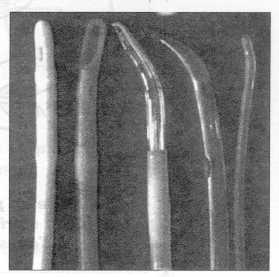
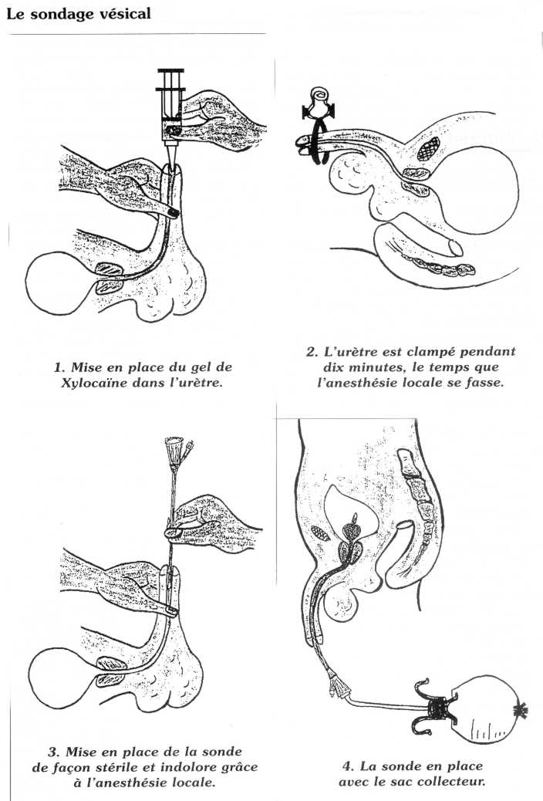
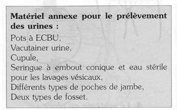
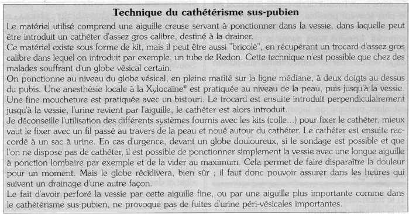

## I. Matériel

### 1. Les sondes

Voici les types de sondes et leurs principales caractéristiques.

- La **sonde de Foley :** dans le service, nous employons le modèle en silicone pur, car elle est ainsi mieux tolérée (environ six semaines), plus facile à introduire car plus rigide et, par ses propriétés antiadhésives, elle réduit au minimum les dépôts et agrégats.

- La **sonde Hematuria** ou de **CouveIaire** elle est en latex siliconé avec un fil nylon l'entourant sur toute sa longueur, ce qui la rend incollable. On l'utilise surtout pour le drainage de caillots sanguins. Elle est parfois plus difficile à placer car son extrémité est plus souple et franchit moins bien les obstacles.

- La **sonde de Dufour** est béquillée, ce qui permet le passage des obstacles naturels, parfois même le franchissement de petite sténose de l'urètre. En Néoplex rigide, on ne peut l'utiliser de façon prolongée par risque d'érosion des muqueuses.

- La **sonde de Marion** ne possède pas de ballonnets et nous l'utilisons pour la réduction de petite sténose de l'urètre.

- La **sonde à double courant** est, elle aussi, en Néoplex et possède un canal de rinçage permettant une évacuation régulière des caillots et un nettoyage constant de la vessie. Elle est surtout utilisée après certaines interventions ou en cas d'hématurie importante.

- Les autres sondes employées sont celles de **Mercier.** Béquillées ou non, en PVC, elles servent aux autosondages ou aux instillations intra-vésicales, c'est-à-dire que leur usage est temporaire.

Le choix de la sonde est souvent fait par le médecin, mais en son absence et en cas de rétention, nous utilisons les sondes de Foley en silicone pur. Assez rigides pour passer les obstacles naturels, elles sont aussi assez souples pour éviter les fausses routes.

Si cette sonde ne passe pas, cela veut dire qu'il y a un problème. Il faut alors contacter le médecin qui posera une sonde de Dufour ou un cathéter sus-pubien.

**Le choix de la charrière,** c'est-à-dire du calibre de la sonde (en sachant que 1 CH = 1/3 de mm de diamètre), est de 16 à 20 CH chez l'homme (environ 6 mm), et de 20 CH chez la femme. Un calibre plus fin et le drainage est imparfait, un calibre plus gros et la sonde risque de ne pas passer ou son passage d'être douloureux.

**Le volume du ballonnet** est variable suivant le type de sonde, mais il faut savoir que chaque sonde a une charrière et une contenance de ballonnet. Ces données sont inscrites sur la sonde et sur son emballage.

**La longueur des sondes** est de 40 à 45 centimètres pour les hommes, et de 22 centimètres pour les femmes. Nous n'utilisons que des sondes hommes.

**Le coût** étant aussi un facteur à prendre en compte dans le choix. Il faut savoir qu'une sonde en silicone provoque moins d'infection, moins de risque de sténose ou d'érosion de l'urètre, donc au total présente un moindre coût.

**A savoir :** des sondes conservées dans un sondier et stérilisées au gaz (type aldhylène) doivent obligatoirement être rincées avec de l'eau stérile car les vapeurs de formol sont très corrosives et risquent d'entraîner des sténoses de l'ensemble de l'urètre.

### 2. Autre matériel

Il faut savoir qu'un sondage vésical doit être un acte stérile, atraumatique et non douloureux. Pour qu'il soit non douloureux, il faut pratiquer, chez l'homme, une anesthésie locale à l'aide du gel de xylocaïne stérile qui diminue le spasme du sphincter urétral lors de l'introduction de la sonde. Celui-ci est maintenu dix minutes dans l'urètre par une pince à verge ou à l'aide des doigts.

Pour qu'il soit **atraumatique**, il faut employer la bonne technique et le bon matériel.

Pour qu'il soit **stérile**, il faut préparer une table avec des gants stériles, des champs stériles troués et non troués, des compresses, seringue, cupule et sonde stérile.

L'huile de paraffine existe sur le marché en ampoule unitaire stérile qui permet une lubrification parfaite des sondes. Les flacons d'un litre sont à proscrire.

Pour le recueil des urines, nous utilisons des résibacs non standards, mais de type Bioser SM 102, car ils permettent de ne jamais séparer le système poche-sonde et, de plus, on peut les vidanger. Le tuyau est rigide et de grosse section, évitant plis et coudes. Il existe un système antireflux et un site de prélèvement. Ils peuvent, sans problème, se conserver dix à quinze jours sans être changés. Le coût est, par contre, bien supérieur. Ce système paraît plus cher mais il est clos, vidangeable, possède un système antireflux et un site de prélèvement, ce qui diminue le risque infectieux.

**Pour conclure,** nous dirons que le sondage est un acte stérile, que le choix de la sonde en première intention est une sonde de Foley en silicone pur de Charrière 18, que celle-ci doit être huilée jusqu'à la garde, et que le sondage doit être précédé, chez l'homme, d'une anesthésie locale.

Après avoir décrit le matériel nécessaire, nous envisageons la technique proprement dite.

## Il. Technique

### 1. Anesthésie locale chez l'homme

Mettre des gants non stériles et pratiquer une petite toilette minutieuse au Dakin.  
Injecter doucement le gel de xylocaïne et placer le clamp pénien (ou comprimer le gland entre deux doigts).

### 2. Le sondage vésical

Installer le malade (s'il s'agit d'une femme, l'installer en position gynécologique et prévoir un bon éclairage). Expliquer le soin au patient.

- Placer un haricot entre les jambes.
- Prévoir une aide.
- Mettre les gants stériles pour préparation de la table.
- Faire enlever le clamp pénien.
- Faire une petite toilette stérile à l'aide de compresses stériles et de Dakin. Laisser le gland entre deux compresses stériles.
- Poser le champ troué.
- Lubrifier la sonde largement sur toute sa longueur.
- Introduire la sonde dans l'urètre doucement, sans forcer.
- Pour l'homme, il faut bien tirer la verge vers le haut.
- Pousser la sonde au-delà de la longueur normale, gonfler le ballonnet à la contenance voulue (le volume est inscrit sur la sonde).
- Une fois le ballonnet gonflé, tirer sur la sonde jusqu'à ce qu'elle se bloque sur le col vésical.
- Vérifier l'écoulement de l'urine.
- Connecter le sac collecteur.
- Recalotter le pénis.

*Développement et Santé, n°158, avril 2002*
