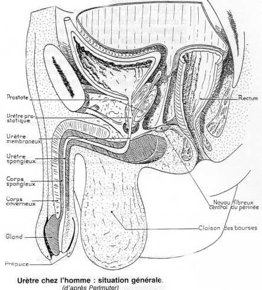
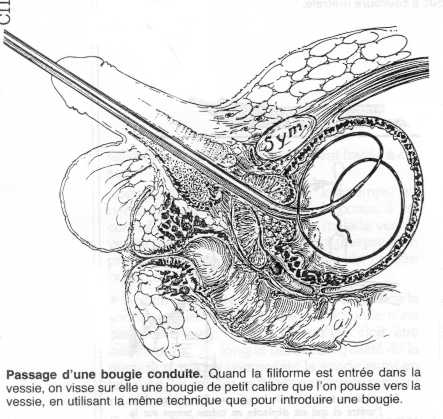
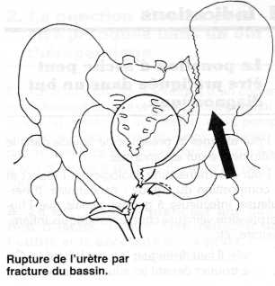

Les rétrécissements (ou sténoses) de l'urètre sont fréquents en Afrique. L'inconfort et les complications parfois redoutables qu'ils provoquent justifient qu'on les étudie afin de prévenir leur apparition en traitant tôt et bien les urétrites et en évitant les traumatismes de l'urètre (sondage intempestif).

Leur traitement demande expérience et délicatesse dans les gestes, et une surveillance régulière car la récidive est fréquente.

## **I. L'urètre : rappel anatomique**

Nous ne parlerons que de l'urètre de l'homme, en effet, l'urètre féminin est beaucoup plus court et la séparation existant entre le système génital et urinaire chez la femme explique que les sténoses de l'urètre soient exceptionnelles chez elle car les maladies vénériennes ne touchent que le vagin.

L'urètre est le canal qui s'étend de la vessie jusqu'à l'extrémité du gland, il permet l'évacuation des urines vers l'extérieur.

### **1. Les différentes parties** **de l'urètre**

On distingue plusieurs portions de l'urètre :

**a. L'urètre prostatique**

Il commence au col de la vessie et traverse la prostate. Cette portion de l'urètre n'est que rarement le siège d'un rétrécissement, mais elle se trouve comprimée lorsque la prostate grossit (adénome, cancer prostatique).

**b. L'urètre membraneux**

Il lui fait suite, c'est la portion d'urètre qui est enfoncée au sein du sphincter strié. C'est la zone la plus souvent atteinte lors des déchirures de l'urètre par fracture du bassin.

**c. L'urètre bulbaire**

C'est une zone large mais angulée qui fait la jonction entre l'urètre pénien et l'urètre membraneux, l'urètre décrit à ce niveau un coude de pratiquement 90° que la traction forte sur la verge arrive à effacer en partie (c'est cette manoeuvre que l'on effectue lors des sondages).

Cette zone est souvent blessée lors des " fausses routes " des sondes urinaires trop dures, trop rigides et posées trop brutalement. La sonde en effet continue tout droit, au lieu de prendre l'angle bulbaire. C'est ce qui explique que les sondes béquillées passent souvent mieux, car leur angulation s'adapte à l'angle bulbaire).

**d. L'urètre pénien**

C'est la portion d'urètre qui parcourt le pénis. La portion postérieure ou périnéale est relativement fixe et peut se trouver traumatisée lors des chutes à califourchon (chute brutale à cheval sur une poutre ou une selle de bicyclette, fréquent chez l'enfant). Il est palpable entre les deux bourses profondément. La portion antérieure est contenue dans toute la partie externe de la verge et est facilement palpable. Tout l'urètre pénien est particulièrement sensible aux infections : infection vénérienne (Ménorragie), ou provoquée par des sondes. Ces infections se compliquent alors souvent de sténose.

**e. Le méat urétral**

C'est l'ouverture de l'urètre au sommet du gland. Il est souvent le siège de rétrécissement secondaire à la présence des sondes urinaires.

Dans les livres, on fait souvent la distinction entre urètre postérieur et urètre antérieur : l'urètre postérieur est constitué de l'urètre prostatique et membraneux; l'urètre antérieur correspond à l'urètre bulbaire, périnéal et pénien.

### **2. Fonctionnement de l'urètre**

Une longue portion d'urètre (quinze à vingt centimètres) se trouve située sous le sphincter strié, ce qui explique que toute une zone n'est pas contrôlable après la miction et se vide d'elle-même, ceci provoque le phénomène des gouttes " retardataires ". Quand l'homme va finir d'uriner, il faut qu'il attende que le volume d'urine situé sous son sphincter s'écoule spontanément. De même, tout saignement urétral dont l'origine est située sous le sphincter s'évacue tout seul par le méat urétral sans que le malade puisse le retenir, c'est une **urétrorragie** (qui se distingue donc de l'hématurie, sang dans les urines, qui, elle, peut être contrôlée).

**Il.** **Signes cliniques**

**Signes fonctionnels**

Un malade souffrant de sténose de l'urètre présente les signes fonctionnels suivants :

**a. Dysude :** La miction est difficile, il faut attendre avant que l'urine s'écoule, elle coule lentement avec un jet faible, le malade est obligé de pousser pour uriner, lorsqu'il a fini, des gouttes continuent malgré lui à s'écouler et il n'a pas l'impression d'avoir bien vidé sa vessie.

**b. Pollakiurie :** Le malade urine fréquemment, toutes les heures le jour et plusieurs fois la nuit, car il urine peu à la fois.

**c. Le Jet** est modifié, faible, sans force et souvent bifide (partagé en deux) ou en arrosoir.

**d.** Lorsque l'infection existe, la miction peut être douloureuse.

Devant ces signes, il faut penser à la sténose de l'urètre et rechercher des **antécédents** de maladie ayant pu la provoquer.

## **III.Examens complémentaires**

### **1. L'urétrographie**

Lorsque les examens radiologiques sont possibles, il faut essayer d'obtenir des radios de l'urètre (urétrographie) qui peuvent être obtenues de trois façons différentes :

**a.** cliché mictionnel lors d'une urographie intraveineuse. Lorsque la vessie est pleine en fin d'UIV, on demande au malade d'uriner et on prend les clichés pendant la miction (incidence 3/4).

**b.** urétrographie rétrograde : c'est la plus souvent utilisée. On injecte directement dans l'urètre à la seringue le produit de contraste. Mais cet examen est traumatisant, il peut surinfecter les urines et il n'est pas rare que dans les heures qui suivent, le malade ait de la fièvre et se mette en rétention.

**c.** urétrographie obtenue par cystographie sus-pubienne: si un cathéter sus-pubien a été mis en place, on peut remplir la vessie avec du produit de contraste par cette voie et prendre des clichés, lorsque le malade a envie d'uriner.

L'interprétation des clichés doit tenir compte de l'image physiologique de rétrécissement situé au niveau de l'urètre membraneux et due à la contraction du sphincter strié, surtout lorsqu'il s'agit d'une urétrographie rétrograde toujours douloureuse et qui force le passage contre la volonté du patient, ce qui provoque toujours un spasme de cette région.

### **2. L'urétroscopie**

Certains hôpitaux peuvent être équipés d'un cystoscope qui permet de regarder directement dans l'urètre et de voir la sténose.

### **3. Le sondage**

Le plus souvent on est démuni de ces examens, et l'existence de la sténose est suspectée quand le sondage effectué pour rétention est un échec, on fait fausse route.

Toutes les tentatives de sondage doivent donc être douces et s'arrêter en cas d'échec pour ne pas provoquer de lésions plus graves.

## **IV. Les causes des** **rétrécissements de l'urètre**

Toute lésion de l'urètre risque de laisser une cicatrice rétractile. Cette cicatrice, située sur un canal aussi fin que l'urètre, peut donc en réduire le calibre et provoquer une sténose. Ces sténoses peuvent survenir quelques jours après la lésion ou même des mois ou des années après. Tout traitement de la sténose (dilatation, urétrotomie, chirurgie) va en fait provoquer une autre cicatrice que l'on espère de meilleur calibre mais qui peut aussi entraîner une autre sténose, d'où la nécessité absolue de surveiller régulièrement tout malade traité pour sténose de l'urètre, car il peut toujours présenter une récidive dont le traitement sera d'autant plus facile qu'elle est dépistée tôt.

### **1.** **Les urétrites**

Les infections de l'urètre sont le plus souvent vénériennes, contractées lors de rapport sexuel avec une personne déjà infectée. Les germes le plus souvent responsables sont les gonocoques, l'urétrite à gonocoque s'appelle aussi blénorragie, gonococcie ou chaude pisse.

On trouve aussi des germes tels que : colibacilles, klebsielles, streptocoques. De plus en plus souvent on incrimine le **Chlamydia,** responsable d'une urétrite moins bruyante que la blénorragie mais qui peut durer très longtemps, tant qu'elle n'a pas été traitée spécifiquement par les cyclines ou l'érythromycine. Un parasite est aussi de plus en plus souvent retrouvé : le **trichomonas** que l'on traite par le Flagyl® et ses dérivés.

Si une urétrite n'est pas traitée rapidement, les lésions inflammatoires qu'elle entraîne peuvent alors provoquer des sténoses dont le siège le plus fréquent est l'urètre pénien ou bulbaire, soit sous forme d'une sténose courte et unique, soit de sténoses étagées en chapelet. Ces lésions sont aggravées par les manoeuvres traumatiques telles que : instillation intra-urétrale de produits irritants ou manoeuvres instrumentales intra-urétrales (sondage, passage de béniqué) qui n'ont pas leur place dans le traitement de 1'urétiite à sa phase aiguë.

### **2. Les traumatismes**

Ils peuvent être :

**1.** **Externes**

Ils se manifestent par une douleur violente, une urétrorragie, parfois une rétention aiguë (par réflex ou rupture complète). Les circonstances peuvent être :

*   Les chutes à cheval sur un plan dur (clôture, poutre, branche, vélo).

*   Un coup ou fausse manoeuvre au cours du coït sur verge en érection où une intervention chirurgicale rapide est souhaitable.

*   Les fractures du bassin, avec hématome périnéal où l'importance des lésions associées peut masquer la rupture urétrale.

Toute crainte de rupture urétrale interdit la pose d'une sonde, et au cas où le malade n'urine pas spontanément, impose l'installation d'un cathéter sus-pubien à garder ouvert plusieurs jours.

**2. Internes** par sonde ou manoeuvre instrumentale :

**a.** Une sonde peut être à l'origine d'une sténose :

*   Soit en provoquant une plaie par fausse route au niveau de l'urètre bulbaire.

*   Soit en provoquant une lacération de la muqueuse lorsque le ballonnet est gonflé brutalement dans l'urètre et non dans la vessie. Ce gonflement du ballonnet est alors très douloureux si la sonde n'est pas poussée à la longueur habituelle et elle draine mal.

*   Soit en lésant l'urètre à cause d'un calibre trop gros. Il faut éviter le sondage chez le petit garçon et lui préférer le cathétérisme sus-pubien, car souvent le calibre des sondes est inadapté à la taille de son urètre particulièrement fragile à cet âge.

Lorsqu'un sondage doit durer longtemps, en particulier sur un malade dans le coma, il est conseillé de rabattre la verge du malade vers le ventre pour éviter les escarres dus à une pression prolongée de la sonde au niveau de l'urètre bulbaire.

*   Soit en provoquant une infection autour de la sonde, ceci est fréquent quand une sonde n'est pas posée avec asepsie ou qu'elle doit être laissée pour une longue durée. La qualité de la matière plastique composant la sonde entre en jeu aussi, les sondes revêtues de silicone seraient mieux tolérées.

Ce type d'infection d'une sonde provoque des sténoses étagées et étendues sur tout l'urètre pénien (sténose moniliforme), ou unique. La localisation méatique ou rétro-méatique est aussi fréquente, on peut la craindre lorsque la sonde a entraîné une inflammation visible du méat (sonde de trop gros calibre).

*   Soit en provoquant une urétrite chimique lorsqu'elle a été stérilisée par un produit irritant et que l'on a pas pris la précaution de bien la rincer à l'eau stérile avant sa mise en place.

*   Soit en blessant l'urètre lorsqu'elle est arrachée avec son ballonnet gonflé lors d'un faux mouvement ou par le malade lui-même.

Ces sténoses secondaires à la pose d'une sonde urinaire peuvent survenir même des années après le sondage, il faudra donc soigneusement retrouver cette notion à l'interrogatoire. Ceci explique qu'il faut soigneusement peser l'indication de la pose d'une sonde urinaire, ne pas en faire un geste systématique (bien des malades pourraient en fait s'en passer) et le pratiquer avec douceur, aseptie et avec un matériel correct (sondes de calibre adapté).

**b. Le passage des béniqués** (sondes métalliques courbes et rigides de calibre croissant) développe un bras de levier très puissant qui peut conduire à une fausse route sanglante. Ces instruments ne doivent donc être manipulés qu'avec douceur et précaution, par des mains expertes et habituées à ce geste et sur un malade à la sténose connue. Si, dans ces conditions, ils guérissent le malade, mal utilisés, ils provoquent trop souvent la catastrophe.

**c. L'endoscopie** et surtout la résection endoscopique de la prostate, de plus en plus pratiquées dans les hôpitaux bien équipés, provoquent parfois des sténoses (appareil de gros calibre, manipulation prolongée, chaleur du bistouri électrique). Lorsqu'un malade ayant subi ce type de chirurgie présente à nouveau une dysurie (difficulté pour uriner), il faut suspecter la survenue d'une sténose.

**d. Les instillations intra-urétrales** de divers produits réputés antiseptiques et injectés pour des symptômes n'ayant souvent rien à voir avec l'urètre sont à formellement déconseiller.

De cette longue liste, il faut retenir que l'urètre est un canal délicat et fragile, sensible à toute agression et que trop souvent l'agresseur est le personnel soignant.

## **V. Les complications**

Le plus souvent, la sténose de l'urètre gêne le libre écoulement des urines et provoque un inconfort plus ou moins important (dysurie). Mais parfois, des complications plus graves surviennent par accentuation de la sténose ou infection urinaire associée.

### **1. La rétention complète** **ou aiguë d'urine**

C'est souvent la circonstance révélatrice de la sténose. Elle succède à une longue période de dysurie et de pollakiurie (envie fréquente d'uriner). Avant tout geste de sondage, surtout s'il s'agit d'un malade jeune, on doit s'informer des antécédents afin de ne pas sonder par voie urétrale et si la sténose est suspectée. Dans ce cas, il faut d'emblée pratiquer un cathétérisme sus-pubien.

### **2. La rétention chronique**

En dehors de la rétention complète, la sténose entraîne une accumulation de l'urine au-dessus de son niveau (stase). Cette stase va pouvoir progressivement distendre la vessie, les urtères et les cavités rénales (hydronéphrose). Elle se surinfecte très facilement et l'infection urinaire conduit rarement à un phlegmon péri-urétral, mais plus souvent à une diffusion des germes jusqu'au rein (pyélonéphrite) ou au-delà (septicémie). L'association de distension et de surinfection des cavités rénales évolue spontanément vers la destruction progressive des reins (insuffisance rénale) et la mort. La stase et l'infection favorisent aussi la formation de calculs.

## **VI. Le traitement**

Après tout traitement la sténose peut récidiver et ces malades doivent donc être surveillés périodiquement

### **1. La dilatation de la sténose**

C'est le traitement le plus simple, efficace mais aveugle, il demande beaucoup de délicatesse

sous peine de provoquer des lésions plus graves. Il peut être pratiqué sous simple anesthésie locale par du gel de xylocaïne injecté dans l'urètre et laissé en place une dizaine de minutes. Il ne doit être proposé que si on est certain qu'il existe une sténose.

**a.** **Dilatation à la bougie**

Des sondes souples droites ou béquillées, de calibre croissant existent, permettant de dilater peu à peu la sténose, le plus délicat étant de passer la première à travers la sténose sans faire fausse route.

**b. Dilatation aux béniqués**

Il s'agit d'un jeu de bougies métalliques béquillées de calibre croissant. Bien maniés, ils sont fort utiles, mais la force déployée par cet instrument est très importante et sans expérience, on risque de provoquer de gros dégâts.

**c. Dilatation avec des sondes** **filiformes**

C'est la moins traumatisante et la plus précise des méthodes aveugles... mais elle nécessite de posséder le minimum de matériel constitué par des bougies très fines et de différentes formes pouvant ainsi traverser la sténose. Leur bout est muni d'un pas de vis qui permet d'adapter à leur extrémité des bougies (bougies de Philipe) de calibre croissant. L'intérêt étant qu'au cours de manoeuvres de changement de sonde, la bougie filiforme reste en place à travers la sténose, ce qui évite les incidents, toujours possibles de fausse route avec les autres méthodes à chaque fois que l'on change de sonde.

### **2. L'urétrotomie**

Elle n'est possible qu'à l'hôpital car elle nécessite le matériel adéquat.

**a. Urétrotomie aveugle**

Des instruments métalliques munis de lame peuvent être introduits dans la sténose et, une fois en place, fendre cette sténose : urétrotome d'Otis ou de Maisoneuve.

**b. Urétrotomie endoscopique**

C'est la méthode de choix la plus précise et la plus souvent utilisée dans les hôpitaux qui sont équipés d'un cystoscope permettant de voir directement la sténose et de la fendre alors en toute sécurité grâce à une petite lame de bistouri actionnée par l'appareil.

Il faut ensuite laisser quelques jours dans l'urètre une sonde et donner des antibiotiques car il est fréquent que ces manoeuvres entraînent de la fièvre. Certains préconisent de laisser la sonde trois à cinq semaines afin d'obtenir un meilleur modelage de la cicatrisation de l'urètre.

### **3. Les urétroplasties**

Pour les sténoses étendues et récidivantes, il existe des interventions chirurgicales correctrices (urétroplasties). Ces interventions sont délicates et demandent beaucoup d'expérience.

### **4. Cas particuliers**

**a.** En cas de sténose rétro-méatique ou méatique, la récidive est fréquente, mais elle siège sur le premier centimètre de l'urètre. Le malade peut donc facilement dilater lui-même régulièrement cette zone avec une bougie ou un auto-dilatateur (petite bougie conique dont le calibre est donc croissant au fur et à mesure qu'on l'introduit).

**b.** Le résultat de la dilatation peut être aussi entretenu par le malade lui-même par la dilatation hydraulique d'une miction contrariée. On demande, plusieurs jours après la dilatation pour ne pas provoquer d'infection péri-urétrale, au malade de se pincer le gland lorsqu'il est entrain d'uriner. L'urine fait donc ainsi une hyperpression dans l'urètre et dilate la sténose.

### **5.** **En cas de rétention**

Il faut toujours suspecter, comme cause de la rétention, la sténose de l'urètre; en rechercher rapidement les signes par l'interrogatoire et les antécédents évocateurs. Dans ce cas, où la moindre difficulté au cours d'un sondage, il faut pratiquer un cathétérisme sus-pubien :

Petit tuyau introduit au moyen d'une aiguille à l'intérieur de la vessie en ponctionnant le globe vésical au travers de la paroi abdominale en piquant au-dessus la symphyse pubienne sur la ligne médiane, en pleine matité.

## **VII. Prévention**

La sténose de l'urètre constitue donc une maladie très invalidante pour les malades et parfois redoutable. Il faut donc essayer de la prévenir de la façon suivante.

**1.** Traiter tôt les urétrites vénériennes, le plus souvent gonococciques. De nombreux antibiotiques sont efficaces.

**2.** Ne pas poser de sonde vésicale inutilement.

**3.** Sonder de façon aseptique et douce avec du matériel de bonne qualité, bien rincer s'il a séjourné dans un produit irritant.

**4.** Si on suspecte une rupture de l'urètre lors d'un traumatisme du bassin et que survient une rétention, ne pas sonder mais mettre un cathéter sus-pubien.

_Développement et Santé, N°81, juin 1989_