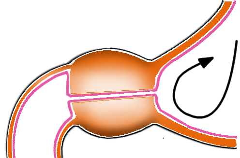
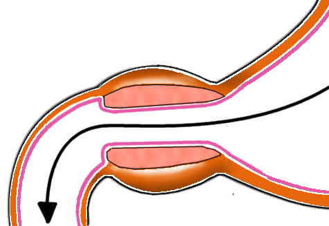
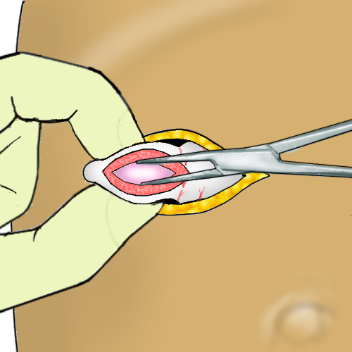

La sténose hypertrophique du pylore touche le nourrisson, entre 3 et 6 semaines. Sa fréquence est évaluée à 5/1000, avec une nette prédominance pour le garçon (4/1).

Considérée comme plus rare en Afrique, une publication récente de Tanzanie a rapporté 102 cas en 5 ans !  
Non diagnostiquée, non opérée, elle conduit toujours à la mort par obstruction totale du transit digestif.  
L’intervention - pylorotomie extra-muqueuse - entraîne une guérison complète en quelques jours.  
Son diagnostic est essentiellement clinique, aidé par l’échographie.

## Quand y penser ?

C’est un beau nourrisson, au poids de naissance souvent élevé, qui n’a posé aucun problème d’alimentation, jusqu’au jour où apparaissent des vomissements isolés. Le bébé est affamé et se jette sur le sein pour vomir brutalement au bout de quelques minutes.  
Cette symptomatologie s’intensifie de jour en jour, les selles deviennent plus rares, et si le diagnostic est retardé, apparaissent une perte de poids et une déshydratation.

## L’examen

L'examen doit :  
− rechercher les signes de déshydratation : pli cutané, fontanelle dépressible, sécheresse buccale, et  
− mesurer avec rigueur la perte de poids.

On peut **palper l’olive pylorique**, sous le sternum et voir des ondulations péristaltiques à jour frisant sur la paroi abdominale.  
Il faut alors, sans tarder, mettre en route la **réhydratation intraveineuse** et transférer l’enfant vers une équipe chirurgicale.  
Une **échographie** mettra en évidence une hypertrophie du muscle pylorique : une épaisseur transversale supérieure à 4 mm, et une longueur supérieure à 15 mm.  
L’alimentation orale est arrêtée et une sonde d’aspiration gastrique mise en place.

## Le traitement

Le traitement chirurgical est une pylorotomie extramuqueuse, effectuée sous anesthésie générale par une petite laparotomie de l'hypochondre droit (ou laparoscopie dans un centre équipé et entraîné). Elle consiste en une dissociation douce et progressive, à la pince, de "l'olive" musculaire hypertrophiée en respectant la muqueuse.

Une brèche muqueuse accidentelle n’est pas un drame si elle est suturée immédiatement, évitant ainsi une péritonite. A contrario, une section incomplète du muscle pylorique peut faire persister un obstacle partiel, nécessitant parfois une reintervention.

## Après l'intervention

La réalimentation doit être reprise dès le réveil avec des liquides.  
En 2 à 3 jours, le nourrisson reprend ses rations habituelles, avec reprise rapide du poids.  
Les seules complications sont infectieuses locales, mise à part l’incision incomplète.

## Au total

La sténose hypertrophique du pylore, dont l’étiologie est mystérieuse - génétique, environnementale, infectieuse -, doit être vite diagnostiquée et opérée ; son diagnostic est avant tout clinique.
