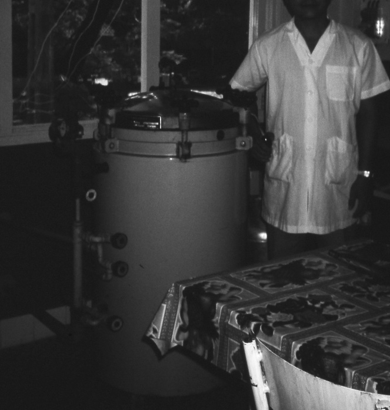
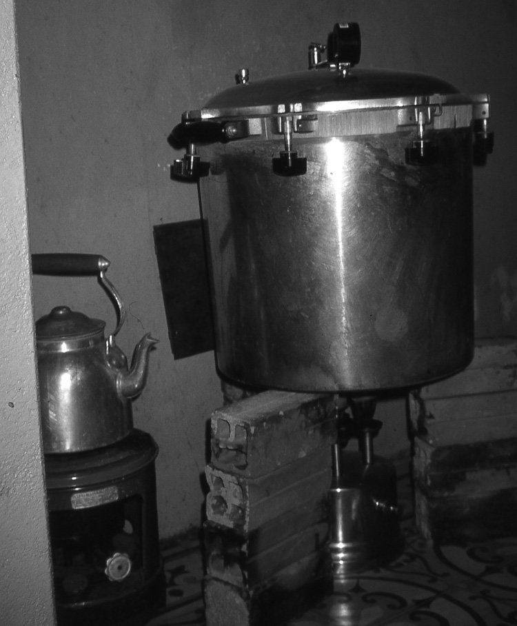
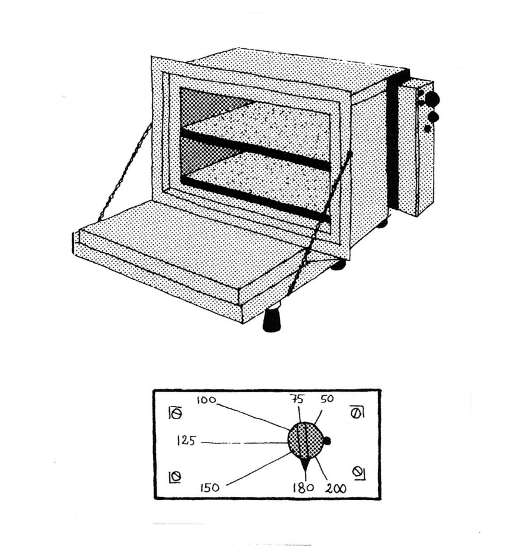
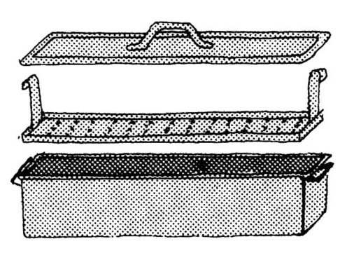
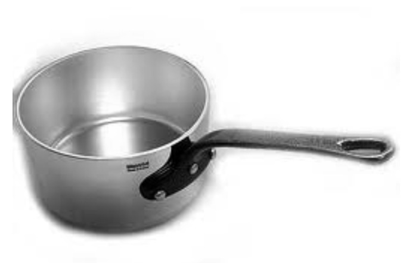

La stérilisation est l’opération que doit subir un produit ou un objet pour devenir stérile, c’est-à-dire exempt de tous les micro-organismes qu’il contient ou supporte. 
La stérilisation est indispensable pour tous les instruments médicaux utilisés pour des actes où il y a effraction de la peau et des tissus : seringues, aiguilles, matériel chirurgical, matériel de soins dentaires… 
La stérilisation doit être effectuée par la chaleur, selon des protocoles écrits, validés, respectés et contrôlés. 
Contrairement à la désinfection et à la décontamination, ce résultat est durable, à condition que le matériel soit conservé en état de stérilité.

## I. Décontamination et nettoyage

Il est indispensable de nettoyer par brossage tous les instruments avant de les stériliser afin d’éliminer les substances organiques qu’ils peuvent comporter : pus, écoulements et épanchements infectés, sang. Avant ce nettoyage, tous les instruments doivent être plongés pendant 30 minutes dans un désinfectant chimique (par exemple : solution d’hypochlorite de sodium à 1 % de chlore actif ) afin de les décontaminer pour ensuite obtenir une meilleure stérilisation et en même temps protéger de la contamination (HIV, hépatites, autres…) les personnes chargées des manipulations  
du matériel.

## II. Méthodes de stérilisation

### 1. Stérilisation par la vapeur d’eau

La stérilisation par la vapeur d’eau, à l’autoclave est la méthode de choix pour tous les instruments médicaux réutilisables. C’est la méthode de référence en milieu hospitalier.  
Elle s’effectue à 121° C, sous une pression de 1 atmosphère, et doit durer au moins 20 minutes. En l’absence d’autoclave, qui est un matériel onéreux,  
il est possible d’utiliser un autocuiseur (type OMS), modifié selon les directives de l’OMS, et qui a l’avantage d’être moins coûteux.

On doit toujours stériliser à la vapeur d’eau ce qui peut l’être, en particulier :

*   Textiles, pansements (tissés et non tissés)
*   Instruments chirurgicaux en acier inox
*   Verrerie
*   Caoutchouc

On doit vérifier le bon déroulement du cycle. Des témoins de stérilisation doivent être ajoutés au matériel à chaque cycle. Le bon fonctionnement de l’autoclave doit être contrôlé chaque année, pour la qualité des opérations et la sécurité des utilisateurs.

**Autoclave**

### 

### Autocuiseur

### 2. Stérilisation par la chaleur sèche

Elle se pratique dans un stérilisateur à air chaud, le Poupinel. En l’absence de Poupinel, on peut utiliser un four électrique domestique, (qui sera réservé à cette fonction) en s’assurant que les normes sont bien respectées : 1 heure à 180° C, ou 2 heures à 170° C.  
Cette méthode sera réservée au matériel thermorésistant risquant d’être altéré en présence de vapeur d’eau :

*   Instruments nickelés, chromés
*   Instruments en acier non inoxydable
*   Verrerie résistante à la chaleur.

Cette méthode est contre-indiquée pour :

*   Instruments en acier inoxydable
*   Compresses
*   Liquides.

A chaque opération, il convient de vérifier le bon déroulement du protocole : températures atteintes, au moyen de témoins de stérilisation ajoutés au matériel, et durée de l’opération.

### 3. Oxyde d’éthylène

Méthode appropriée pour la stérilisation du matériel ne résistant pas à la chaleur ou contenant des composés électroniques. Le temps de contact nécessaire dépend de la température, du degré d’humidité et de la concentration en gaz, il varie de 12 à 24 heures.  
Le gaz doit pouvoir pénétrer et atteindre toutes les surfaces du matériel à stériliser. Il s’agit d’un gaz toxique, les protocoles sont réglés par des normes strictes pour assurer la sécurité du matériel et des personnels.  
Ce type de stérilisation, utilisé notamment pour les tubulures, nécessite un matériel spécifique.

### 4. Autres méthodes

Nous citerons seulement ici les modes de stérilisation au gaz plasma (basse température 45° C, et peroxyde d’hydrogène), ou par les rayons gamma. Nécessitant un matériel lourd et coûteux, ils ne sont pas adaptés aux structures de soins.

#### Désinfection poussée par ébullition

Lorsque l’on ne dispose pas des matériels précédents, on peut effectuer une désinfection poussée en faisant bouillir les instruments et les seringues pendant 20 minutes au moins.  
**Cette méthode n’est pas préconisée dans les procédures standard, elle ne doit être employée que lorsqu’aucune autre solution n’est possible.**

    

#### Désinfection poussée par immersion dans un produit chimique

Bien que plusieurs désinfectants aient une action inactivante vis-à-vis des bactéries et des virus, **la désinfection chimique ne doit pas être pratiquée pour les seringues, les aiguilles et les instruments qui perforent la peau au cours d’actes effractifs**.

En effet, les désinfectants chimiques ne sont pas alors assez fiables, car ils risquent d’être inactivés par le sang et les autres matières organiques. Même préparés avec soin, ils risquent de perdre rapidement leur activité dans une atmosphère ambiante chaude.

## III. Conditionnement

Dès le nettoyage et la décontamination, le matériel doit être conditionné de façon à :

*   maintenir le niveau de contamination le plus bas avant stérilisation,
*   permettre le contact avec l’agent stérilisant (il doit être adapté à chaque méthode),
*   assurer après stérilisation le maintien de l’état stérile jusqu’à l’emploi et l’extraction dans des conditions aseptiques.

Le conditionnement dépend des moyens que l’on possède et du type de matériel : containers, boîtes métalliques, emballages plastiques avec soudeuse, papier filtre, verrerie avec bouchons fabriqués avec des compresses et du coton cardé…

#### Remarque

Les seuls agents infectieux pour lesquels les normes que nous avons indiquées ici ne conviennent pas sont les prions ou Agents Transmissibles Non Conventionnels (ATNC), responsables de la maladie de Creutzfeldt-Jacob et qui résistent aux conditions habituelles d’inactivation. Ils nécessitent une heure de trempage dans une solution de soude N suivie d’un autoclavage à 134° C durant dix huit minutes.

## IV. Stérilisation centrale

La tendance actuelle dans les hôpitaux est de regrouper tous les sites de stérilisation sous forme d’une stérilisation centrale, sous la responsabilité d’un pharmacien. Une telle structure permet une homogénéité de fonctionnement, avec des procédures établies pour chaque étape subie par le matériel, une traçabilité et la mise en place d’un système d’assurance qualité.