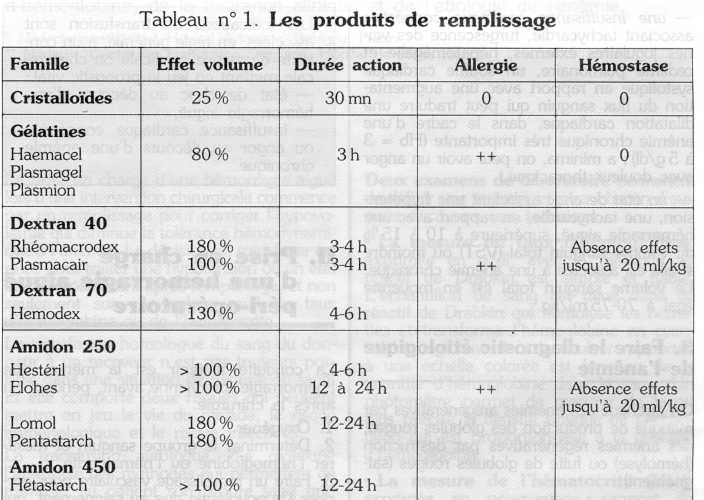
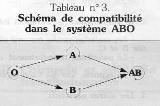
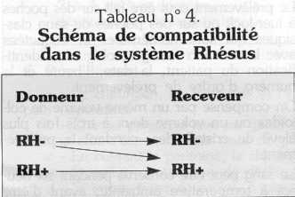
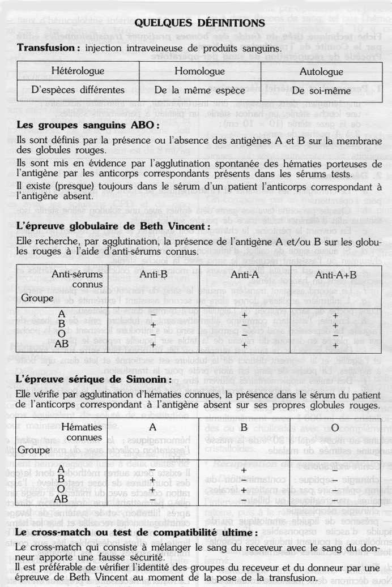

La décision de transfuser un patient présentant une anémie est une attitude raisonnée au cas par cas, en tenant compte de la baisse du taux d'hémoglobine, de la tolérance clinique et de l'étiologie de l'anémie.

La prise en charge d'une hémorragie aiguë lors d'une intervention chirurgicale commence par un remplissage pour corriger l'hypovolémie qui diminue la tolérance hémodynamique à l'anémie. La décision de transfuser est prise pour traiter une hypotension ou un état de choc persistant après remplissage, et non seulement sur une valeur seuil du taux d'hémoglobine ou de l'hématocrite.

La transfusion homologue du sang du donneur à un receveur n'est pas toujours possible dans une situation de pénurie de sang. Et elle comporte deux risques qui peuvent mettre en jeu la vie du malade, le risque immunologique et le risque infectieux.

La transfusion autologue, qui regroupe l'ensemble des méthodes qui permettent de transfuser au patient son propre sang prélevé avant ou récupéré pendant l'intervention chirurgicale, a pour avantage d'économiser les réserves de sang homologue et de réduire le risque transfusionnel. La transfusion autologue différée en chirurgie réglée exige une logistique avec une chaîne du froid et une planification des programmes opératoires. La transfusion autologue péri-opératoire peut être appliquée dans des conditions de travail plus précaires par le personnel médical et para-médical avec l'hémodilution pré-opératoire immédiate et, de façon plus exceptionnelle, la récupération de sang per-opératoire.

## **I. Conduite à tenir devant un patient anémique**

### **1. Faire le diagnostic de l'anémie**

L'anémie se définit par la baisse du taux d'hémoglobine (Hb), pigment du globule rouge qui transporte l'oxygène dans le sang, au-dessous de valeurs physiologiques:

- 13 g/dl chez l'homme adulte

- 12 g/dl chez la femme

- 14 g/dl chez le nouveau-né

**Deux examens de laboratoire** permettent de définir une anémie, et pour chacun d'eux nous décrivons une technique.

*   **La mesure du taux d'hémoglobine,** exprimée en g/dI, avec la méthode au réactif de Drabkin est simple et fiable. L'échantillon de sang est dilué dans du réactif de Drabkin qui hémolyse les hématies et transforme l'hémoglobine en cyanméthémoglobine dont la couleur rapportée à une échelle colorée est fonction de la quantité d'hémoglobine dans le sang. Un photomètre permet de mesurer de façon plus précise la densité optique de l'échantillon qui est proportionnelle à la quantité d'hémoglobine.

*   **La mesure de l'hématocrite (Hte),** exprimée en pourcentage, rapport du volume de globules rouges sur le volume de sang total, est faite avec un appareil à micro-hématocrite, plus pratique et plus rapide qu'un appareil à macro-hématocrite.

Le sang prélevé, au bout du doigt, sur des microtubes héparinés est centrifugé trois minutes et le pourcentage de globules rouges est évalué sur un abaque gradué inclus dans l'appareil.

<table>

<tbody>

<tr>

<td valign="top">

À partir de l'hématocrite, on peut estimer la valeur du taux d'hémoglobine par la formule:

hémoglobine = hématocrite x 0,3

</td>

</tr>

</tbody>

</table>

### **2. Apprécier la tolérance clinique** **de l'anémie**

*   **Anémie bien tolérée:** les principaux signes sont la pâleur cutanéo-muqueuse, la fatigue qui peut s'accompagner de vertiges et de lipothymies. En cas d'anémie chronique, la symptomatologie peut se limiter à un essoufflement et des palpitations à l'effort.

*   **Anémie mal tolérée** associée à un contexte d'urgence médicale ou chirurgicale, avec :

_- une insuffisance cardiaque congestive_ associant tachycardie, turgescence des veines jugulaires externes, hépatomégalie et oedème pulmonaire, un souffle cardiaque systolique en rapport avec une augmentation du flux sanguin qui peut traduire une dilatation cardiaque, dans le cadre d'une anémie chronique très importante (Hb = 3 à 5 g/dl) ; a minima, on peut avoir un angor avec douleur thoracique;

_- un état de choc_ associant une hypotension, une tachycardie, en rapport avec une hémorragie aiguë, supérieure à 10 à 15% du volume sanguin total (VST) ou moindre si elle est associée à une anémie chronique. Le volume sanguin total est en moyenne égal à 70-75ml/kg.

### **3. Faire le diagnostic étiologique** **de l'anémie**

On distingue des anémies arégénératives par manque de production des globules rouges, des anémies régénératives par destruction (hémolyse) ou fuite de globules rouges (saignement).

Les anémies les plus fréquemment rencontrées sont :

*   **les anémies arégénératives par** **carence** en fer et en acide folique, d'origine alimentaire, aggravées par l'ingestion de terre et de thé ;

*   **les anémies hémolytiques, héréditaires** par anomalie _congénitale_ des globules rouges (drépanocytose, thalassémie, déficit en GPD), _infectieuses_ au cours du palu_disme, immunologiques_ lors des accidents transfusionnels, en particulier dans le groupe ABO;

*   **les anémies par saignement aigu** lors d'un traumatisme, d'une chirurgie ou chronique lors de maladies parasitaires (ankylostomiase), de lésions du tube digestif (Ulcère, hémorroïdes), et chez la femme en période d'activité génitale.

### **4. Traiter l'anémie**

La plupart des anémies sont susceptibles d'être corrigées par un traitement médical. La décision de transfuser un patient anémique est une attitude raisonnée au cas par cas qui tient compte de la tolérance clinique, de l'étiologie de l'anémie, du terrain (âge, pathologie) et de la chirurgie éventuelle.

<table>

<tbody>

<tr>

<td valign="top">

Les indications de transfusion sont associées, en règle générale, à un contexte d'urgence médicale ou chirurgicale mettant en jeu le pronostic vital:

- état de choc au décours d'une hémorragie aiguë,

- insuffisance cardiaque congestive ou angor au décours d'une anémie chronique.

</td>

</tr>

</tbody>

</table>

## **II.** **Prise en charge d'une hémorragie aiguë** **péri-operatoire**

La conduite à tenir est la même, que l'hémorragie intervienne avant, pendant ou après la chirurgie.

1. Oxygéner

2. Déterminer le groupe sanguin et mesurer l'hémoglobine ou l'hématocrite

3. Faire un remplissage vasculaire pour corriger l'hypovolémie due au saignement, qui diminue la tolérance hémodynamique à l'anémie par une perfusion de _cristalloïdes_ ou de _colloïdes de synthèse_ (gélatines, dextrans, amidons) qui augmentent le volume sanguin total (effet volume) avant de diffuser du secteur intra-vasculaire vers le secteur extra-vasculaire.

Les solutés de remplissage ont un effet volume immédiat et une durée d'action variable. Pour les cristalloïdes _(ringer lactate,_ _sérum salé à 0,99%),_ le volume à perfuser est trois à quatre fois le volume de sang perdu et la durée d'action est de trente minutes. Pour les gélatines _(haemacel, plasmagel, plasmion),_ le volume à perfuser est de 1,2 fois le volume de sang perdu et la durée d'action de trois heures. Pour les dextrans _(dextran 40, dextran_ 70) et amidons _(amidons 450 et amidons 250),_ l'effet volume est supérieur ou égal au volume perfusé, qui ne doit pas dépasser 20 ml/kg, et la durée d'action est variable, de trois heures à vingt-quatre heures, selon les produits _(tableau 1)._

Les colloïdes de synthèse peuvent entraîner des réactions allergiques, une modification de l'hémostase, une altération de la fonction rénale.

Les solutés nutritifs (glucose) n'ont pas d'effet volume car ils diffusent immédiatement hors des vaisseaux. On ne doit pas les utiliser pour faire un remplissage vasculaire.

**Transfuser si l'indication est** **absolue**

La décision de transfuser est prise pour traiter une hypotension ou un état de choc et non pas uniquement sur une valeur seuil d'hémoglobine:

- au-dessus de 10 g/dI, la transfusion est très rarement nécessaire,

- en dessous de 7 g/dI, la décision de transfuser repose sur l'examen clinique après remplissage; la tolérance en pays d'endémie palustre, en particulier, est souvent bonne à 6 g/dI.

La transfusion d'un adulte nécessite au moins deux culots pour être efficace. La transfusion d'un enfant nécessite habituellement un volume de 20 ml/kg de sang total.

La quantité d'hémoglobine apportée par un culot globulaire (CG) est donnée par la formule:

(VST x Hte) +

(volume CG x Hte CG) =  
volume final x Hte final  
avec VST (ml) = poids (kg) x 70

<table>

<tbody>

<tr>

<td valign="top">

En moyenne,

pour un patient de 60 kg

1 culot globulaire (Hte = 70%)

amène 1 g Hb

ou augmente l'Hte de 3 %

</td>

</tr>

</tbody>

</table>

## **III. Chirurgie et stratégie transfusionnelle**

### **1. Examen préopératoire**

*   Rechercher les manifestations cliniques d'une anémie.

*   Déterminer le groupe sanguin et le taux d'hémoglobine ou d'hématocrite est la règle avant toute chirurgie à l'exception de la chirurgie mineure.

### **2. Préparation de l'opéré**

Corriger une anémie en ramenant l'hémoglobine à 10 g/dl avant l'intervention par le traitement étiologique. La transfusion préopératoire doit être exceptionnelle en dehors d'un contexte d'urgence.

Dans le cas d'une drépanocytose homozygote diagnostiquée par une électrophorèse de l'hémoglobine, la conduite péri-opératoire est codifiée. Une transfusion préopératoire amènera le taux de HbS en dessous d'un seuil de sécurité fixé à 40 % pour la chirurgie comportant un risque hypoxique modéré et à 25 % pour une chirurgie à risque hypoxique majeur, une chirurgie en urgence ou chez un patient en mauvais état général.

### **3. Choix d'une stratégie** **transfusionnelle**

La transfusion homologue du sang d'un donneur à un receveur expose aux risques de contamination massive par le virus du _Sida_ et d'accidents transfusionnels (2, 3, 4) infectieux et immunologiques qui peuvent mettre en jeu la vie du malade, et ne doit être pratiquée que si l'indication est absolue _(tableau 2)._

Des stratégies d'économies de sang en chirurgie permettent de limiter les indications de transfusion homologue:

_- le remplissage vasculaire_ par des cristalIoïdes ou des colloïdes permet la suppression des transfusions pratiquées pour des hémorragies mineures,

_- la transfusion autologue_ qui regroupe l'ensemble des procédés qui permettent de rendre au patient son sang récupéré avant, pendant et après l'intervention chirurgicale, a pour avantages d'économiser les ressources en sang homologue et de réduire le risque transfusionnel.

*   **La transfusion homologue**

_a. Indications :_

_En urgence,_ une transfusion doit être envisagée si l'hémoglobine est inférieure à 8 g

et si un saignement est prévu. Il importe d'être moins exigeant chez un patient à risques (mauvais état général, infection, polytraumatisé à risque hémorragique per- ou postopératoire), où le seuil transfusionnel doit être proche de 10 g/dI.

_En cas de chirurgie réglée,_ une transfusion en per- ou postopératoire doit être envisagée si la perte sanguine prévue est supérieure à 15 ml/kg chez l'adulte ou à 7 ml/kg chez l'enfant.

Un taux d'hémoglobine supérieur à 7 g/dl en per- et postopératoire peut être toléré à condition de tenir plus compte des signes cardiovasculaires (pouls, pression artérielle et diurèse) que du taux d'hémoglobine.

_b. Technique:_

Déterminer le groupe sanguin dans les deux systèmes ABO et Rh en faisant une double détermination et établir un document écrit.

*   Le groupage ABO se fait par le test globulaire de Beth-Vincent avec des sérums anti-A, anti-B, (anti-AB), dont la durée de validité doit être respectée et qui doivent être conservés à 4°.

L'épreuve sérique de Simonin, non obligatoire, se fait avec des hématies témoins A, B, (O) et vérifie le groupe en observant la présence d'anticorps correspondant aux antigènes absents.

Toute discordance entre les deux épreuves empêche une conclusion de groupe et il faudra transfuser en sang du groupe 0, appelé groupe "donneur universel", que l'on peut donner à tous les autres groupes comme le résume le schéma de compatibilité dans le système ABO _(tableau 3)._

Le groupe 0, dit "donneur universel" peut être transfusé à tous les autres groupes.

Le groupe AB, dit " receveur universel " peut recevoir du sang de tous les autres groupes.

Le groupe rhésus se fait avec un sérum anti-D, si possible salin car actif sans artifice. Les conditions de réaction doivent être respectées, certains réactifs agissant à une température de 37°, d'autres à température ambiante. Il est accompagné d'un témoin de réaction qui doit être négatif.

S'il y a agglutination, le groupe est Rh+, s'il n'y a pas agglutination, il est Rh-. Un patient Rh+ peut être transfusé en sang Rh- ou Rh+ _(tableau 4)._ Si le témoin de réaction est positif, il faut transfuser en Rh-.

En urgence, un individu RH(-) qui n'a jamais été perfusé peut être transfusé en RH (+) sans risque d'accident. E faut éliminer tout antécédent de grossesse.

En l'absence de sang Rh-, un(e) malade Rh- qui n'a jamais été transfusée) et qui n'a pas d'antécédent de grossesse, peut être transfusée) sans risque d'accident immédiat, mais ce risque existe pour la prochaine transfusion. Il faut l'éviter au maximum chez la femme de moins de quarante ans.

*   Le double contrôle et les documents écrits (carte de groupe et cahier des receveurs) sont indispensables :

Le premier groupage doit être contrôlé par un deuxième groupage en utilisant un lot de réactifs différents.

S'il y a concordance entre les deux groupages, le groupe est rendu avec un document écrit, la carte de groupe remise au malade. Au niveau du centre de transfusion, l'identité complète et les résultats du double groupage du receveur, les numéros et les groupes des flacons perfusés sont notés sur le cahier des receveurs (archivage chronologique).

*   Vérifier, au lit du malade conscient, la concordance entre :

- l'identité du malade et sa carte de groupe

- regroupe indiqué sur la carte du malade et celui indiqué sur la poche de sang.

*   Faire un contrôle ultime au moment de la pose de la transfusion.

_- le contrôle ultime_ du groupe ABO du patient et du produit à transfuser par des sérums test anti-A, anti-B (test de BethVincent), permet de vérifier que le malade et la poche à transfuser sont du même groupe ou à défaut de groupes compatibles _(tableau 3)._

_- le cross-match,_ en l'absence de sérum-test, est possible en mélangeant le sérum du receveur et les hématies du donneur. Il est dangereux, en mélangeant le sang total du donneur et du receveur avec des risques de faux négatifs, car trop d'hématies peuvent masquer une agglutination ou de faux positifs liés à la présence de caillots ou d'agglutinines froides.

*   Poser la transfusion, en utilisant une tubulure à sang :

Régler le débit lentement pendant cinq minutes puis adapter selon le saignement ou la prescription si aucun effet néfaste n'a été observé. Dans tous les cas, un culot globulaire doit passer en moins de trois heures.

Le moindre incident ou accident transfusionnel implique l'arrêt de la transfusion en gardant une voie veineuse _(tableau 2)._

*   **Transfusion autologue**

On distingue :

- la transfusion autologue différée ou prélèvement de sang pré-opératoire, ou dons programmés.

- la transfusion autologue péri-opératoire de sang obtenu dans le cadre d'une hémodilution pré-opératoire immédiate ou d'une récupération de sang per-opératoire.

**_Transfusion autologue différée_**

**a. Définition :**

Cette technique consiste à prélever le sang du patient dans les semaines qui précèdent l'intervention et à le lui retransfuser en per ou post-opératoire.Elle exige une logistique avec une chaîne du froid pour conserver le sang.

_b. Indications:_

- tout acte chirurgical programmé dont les pertes sanguines sont évaluées à plus de 1000 ml et font prévoir une transfusion. chirurgie prostatique, arthroplastie, cure d'anévrisme, splénectomie, placenta praevia,

- rareté sans homologue,

- refus d'une transfusion homologue (témoins de Jéhovah).

_c. Contre-indications:_

- taux d'hémoglobine inférieur à 11 g/dl qui peut être abaissé à 10 g,

- pathologie infectieuse évolutive,

- pathologie cardiovasculaire instable (HTA, angor).

_d. Technique:_

Les prélèvements se font au rythme de un par semaine avec un délai minimum de cinq jours entre deux prélèvements, et d'au moins trois jours entre le dernier prélèvement et l'intervention. Le taux d'hémoglobine doit être supérieur à 10 g/dl avant chaque prélèvement. Chaque prélèvement est de 8 ml/kg maximum.

Le nombre d'unités de sang recueillies est compris entre trois et cinq par patient, la durée de conservation étant de trois semaines avec les solutions CPD et de cinq semaines avec les solutions contenant de l'adénine. Les poches sont numérotées et étiquetées avec la mention "sang autologue ", l'identification du patient et du service d'hospitalisation, les dates de prélèvement, de préemption et d'intervention.

Le groupage ABO du patient au minimum est nécessaire et toute poche doit porter le nom du patient.

Une supplémentation en fer est faite pendant toute la durée des prélèvements et en postopératoire.

*   **_Hémodilution normovolémique préopératoire_**

_a. Définition :_

Cette technique consiste à prélever le sang du patient immédiatement avant l'intervention et à le remplacer par un volume au moins équivalent de soluté de substitution pour maintenir la volémie.

_b. Indications:_

Toute la chirurgie réglée ou urgente, modérément hémorragique (une à deux unités de sang).

_c. Contre-indications:_

- taux d'hémoglobine inférieur à 12 g/dI,

- pathologie infectieuse évolutive,

- pathologie cardio-vasculaire instable (HTA, angor).

_d Technique:_

L'hémodilution normovolémique est faite avant ou après l'induction de l'anesthésie. On détermine la quantité de sang à prélever en fonction du poids du patient et de son hématocrite pré-opératoire. On prélève un à deux flacons de sang, tel que l'hémoglobine final soit supérieur à 10 g ou l'hématocrite final supérieur à 30%

Le calcul du volume de sang à prélever est donné par la formule suivante:

Volume à prélever =

VST x (Hte initial - Hte désiré)  
Hte initial avec VST (ml) =  
poids (kg) x 70

Le prélèvement peut être fait sur des poches à luer-lock ou sur des poches de sang classiques qui sont numérotées et étiquetées avec la mention " sang autologue ", l'identification du patient, la date, l'heure et le numéro d'ordre de prélèvement.

On compense par un même volume de colIoïdes ou un volume deux à trois fois plus élevé de cristalloïdes, pendant le prélèvement.

Le sang peut être conservé pendant six heures à température ambiante, avant d'être retransfusé dans l'ordre inverse du prélèvement, pour compenser les pertes sanguines. Le sang est restitué en fin d'intervention pour rétablir un hématocrite entre 30 et 35 %, ou plus tôt si le saignement est trop important, s'accompagnant d'une hypotension ou d'une baisse de l'hématocrite en-dessous de 25 %.

Prenons le cas d'un patient de 60 kg ayant un hématocrite initial à 40 % que l'on veut ajuster à un hématocrite final à 30 %. Le volume de sang à prélever, calculé en utilisant la formule ci-dessus: 60-70) (0,4-0,3)/0,4 est égal à 1 050 ml soit deux culots de sang total que l'on compense simultanément avec 1 000 ml de cristalloïdes ou de cholloïdes avec un complément de remplissage d'environ deux titres pour les cristalloïdes.

*   **_Récupération du sang per-opératoire_**

_a. Définition :_

Cette technique consiste à recueillir pendant l'intervention le sang dans le champ opératoire, puis à le réinjecter ensuite au même patient après infiltration.

_b. Indications:_

- traumatisme abdominal ou thoracique fermé,

- hémorragie intra-cavitaire datant de moins de trois heures,

- chirurgie aseptique avec saignement d'un volume au moins égal à 20 % de la masse sanguine estimée du malade.

_c. Contre-indications:_

- chirurgie septique: contamination du champ opératoire par des matières fécales, urinaires, pancréatiques ou biliaires,

- chirurgie néoplasique,

- présence de liquide amniotique ou de liquide d'ascite responsables d'accidents embouques et pouvant induire des coagulations intra-vasculaires disséminées.

_d. Technique:_

Nous décrirons deux méthodes courantes de récupération per-opératoire des pertes hémorragiques ; _la filtration sur gaze et_ _l'aspiration collecte avec du matériel réutilisable._

Il existe deux autres méthodes dont le coût des fournitures de base reste élevé. l'aspiration collecte avec du matériel à usage unique, permettant une transfusion directe après filtration, et le système de lavage-centrifugation qui recueille et lave les hématies avant qu'elles soient retransfusées et limite les effets indésirables liés aux contaminants aspirés avec les hématies.

_- **La filtration sur gaze**_

Le matériel nécessaire à préparer en kit stérile comprend: un flacon en verre stérile contenant un anticoagulant (citrate ou ACD) et muni d'un bouchon stérile, une louche et un haricot stérile.

Le sang est recueilli par le chirurgien au moyen d'une louche dans un haricot contenant l'anticoagulant venant du flacon, puis filtré à travers quatre à six épaisseurs de gaze stérile dans le flacon en verre stérile. Le flacon est hermétiquement fermé au moyen d'un bouchon. Le sang est retransfusé en plaçant un filtre classique sur la tubulure. Une fiche technique tirée du _Guide des_ _bonnes pratiques transfusionnelles,_ édité par le Comité de Transfusion du Kenya _(tableau 5),_ propose un protocole.

**_- L'aspiration-collecte_**

Le matériel nécessaire à préparer en kit stérile comprend deux flacons en verre munis de bouchons, dont l'un muni d'un bouchon à deux sorties contient un anticoagulant, un tuyau d'aspiration et un entonnoir.

Le sang est aspiré au moyen du tuyau d'aspiration solidarisé à un flacon stérile contenant un anticoagulant (citrate ou ACD) et fermé par un bouchon à deux sorties dont la deuxième sortie est reliée au vide chirurgical, dont la dépression doit être la plus basse possible (100 mmHg au maximum) pour limiter le plus possible l'hémolyse.

Le sang recueilli dans ce flacon est porté dans un deuxième flacon après filtration à travers quatre à six épaisseurs de gaze stérile placées dans un entonnoir. Le flacon est hermétiquement fermé au moyen du bouchon. Le sang est retransfusé en utilisant un filtre classique, une tubulure à sang et une prise d'air.

_e. En cas de doute sur l'utilité d'une récupération de sang per-opératoire,_ soit que le volume ne soit pas suffisant, soit que le caractère aseptique ne soit pas certain, il est possible de procéder en deux temps, en recueillant d'abord les pertes dans un réservoir et en décidant ultérieurement de leur destruction ou de leur réinjection, en respectant le délai de six heures entre le recueil et la transfusion.

## **IV. Conclusion**

*   _Le respect des indications transfusionnelles_ en fonction, de la tolérance clinique à l'anémie du patient et du type de chirurgie,

*   _le choix d'une stratégie transfusionnelle_ _privilégiant les techniques d'économie de_ _sang_ par rapport à la transfusion homologue remplissage vasculaire et transfusion autologue, ont pour but d'améliorer la sécurité du patient en réduisant le risque d'accidents transfusionnels immunologiques et infectieux.

_Développement et Santé, n°113, octobre 1994_