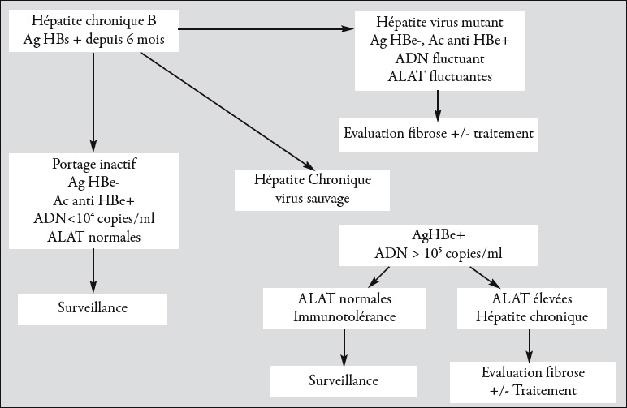
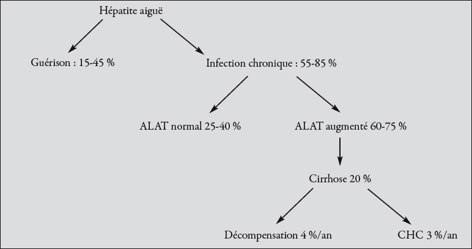

Nous n’envisagerons dans cet article que les situations d’infections chroniques par VHB et VHC non traitées.

## I. Surveillance d’une hépatite chronique B non traitée

La  forme  chronique  de  l’infection  par  le  VHB  est définie  par  la  persistance  de  l’AgHbs  6  mois  après le début de l’hépatite aiguë.  
Le risque de développer une infection chronique est d’autant plus élevé que la période d’infection survient tôt dans la vie (1-2) .  
Ainsi, en cas d’infection périnatale par transmission materno-foetale  et  au  cours  de  la  petite  enfance, mode  prédominant  de  transmission  du  VHB  en Afrique sub-saharienne et particulièrement au Mali, les  taux de passage à la chronicité  sont  supérieurs à 90 %. En revanche, chez l’adulte, le risque de passage à la chronicité est de 5 %. Ceci explique la forte prévalence de l’infection par le VHB dans la plupart des pays d’Afrique sub-saharienne où les programmes de  vaccination  contre  le  VHB  à  la  naissance  sont inexistants ou mal appliqués : cas du Mali où la vaccination contre le VHB est intégrée dans le PEV (Programme Elargi de Vaccination). Cependant, il s’agit d’un vaccin polyvalent composé de vaccins contre le tétanos, la diphtérie, la poliomyélite, la coqueluche, la méningite et l’hépatite B. Ce vaccin polyvalent n’est administré qu’à partir du 45 ème jour après la naissance, ce qui implique que de nombreux nouveau-nés peuvent être contaminés avant le délai de 45 jours.

Quatre  profils  clinico-biologiques  successifs  sont classiquement reconnus dans l’évolution de l’hépatite chronique : la tolérance immunitaire, l’hépatite chronique  active  ou  phase  nécrotico inflammatoire,  le portage chronique inactif et la phase d’élimination de l’AgHbs.

Ces différentes phases se distinguent par l’importance de la réponse immunitaire et la sévérité de l’atteinte hépatique (3-4).

<table>
<caption>Tableau 1 : résumé des différentes phases de l'histoire naturelle de l'infection par le VHB</caption>

<tbody>

<tr>

<td style="width: 136px; ">

Tolérance immune

</td>

<td style="width: 135px; ">

Ag HBe +

ADN VHB +++

</td>

<td style="width: 167px; ">

ALAT:N

Biopsie : pasd'hépatite chronique

</td>

</tr>

<tr>

<td style="width: 136px; ">

Rupture de la tolérance : phase de clairance immune

</td>

<td style="width: 135px; ">

Ag Hbe +

ADN VHB +

</td>

<td style="width: 167px; ">

ALAT élevées

Biopsie : hépatite chronique

</td>

</tr>

<tr>

<td style="width: 136px; ">

Portage inactif

</td>

<td style="width: 135px; ">

Ag HBe -

Ac anti HBe +

ADN VHB < 104 copies/ml

</td>

<td style="width: 167px; ">

ALAT : N

Rémission histologique

</td>

</tr>

<tr>

<td style="width: 136px; ">Clairance de l'AgHBs</td>

<td style="width: 135px; ">

Ag HBs -

Ac anti-HBc +

Ac anti-HBs +/-

PCR VHB +

</td>

<td style="width: 167px; ">

ALAT : N

Guérision clinique

ou ALAT élevées

Infection occulte

</td>

</tr>

</tbody>

</table>

### 1. Phase d'immunotolérance

C’est le premier stade d’une infection à VHB sauvage. Il correspond à une situation de tolérance immunitaire marquée par une réplication virale très intense et une faible agressivité hépatique (5-6).  
A ce stade, l’AgHbs est positif, associé à l’anticorps anti HBc et à l’AgHbe. Le taux des transaminases est minimal ou proche de la valeur minimale, et l’ADN du VHB est fortement ou très fortement positif.  
Les enfants africains qui ont acquis le virus par transmission périnatale ont une phase d’immunotolérance qui peut durer de 10 à 30 ans.  
A cette phase, l’examen clinique est le plus souvent normal.  
Ces patients doivent être surveillés tous les 3 à 6 mois avec un bilan biochimique (transaminases) et virologique  (ADN  du  VHB,  AgHbe,  Ac  anti  Hbe).  Le suivi du taux d’ADN du VHB doit être quantitatif, utilisant un test sensible comme la PCR quantitative (seuil ‹ 1500 UI/mL) où très sensible PCR à temps réel (seuil ‹1000 UI/mL) et éventuellement histologique (PBH ou marqueurs indirects sériques de fibrose  :  Fibromètre  VHB  ou  Fibrotest)  physique, élastométrie impulsionnelle ou Fibroscan).  
Il faut dépister et vacciner l’ensemble de l’entourage familial d’un sujet en phase d’immunotolérance qui est particulièrement contagieux.

**Tableau : conduite à tenir en cas d'hépatite chronique B**

### 2. Portage inactif du VHB

Il est défini par un AgHbs positif, un AgHBe négatif, des  Ac  anti-HBc  et  anti-HBe  positifs,  un  taux  de transaminases strictement normal à tous les examens, un taux d’ADN VHB bas (< 2000 UI/mL) ou indétectable et un foie histologiquement normal (5).  
Le diagnostic différentiel du portage inactif du VHB est l’infection à virus B mutant (AgHBe négatif ) qui se caractérise par une fluctuation du taux des transaminases (souvent normal par période) et une faible multiplication virale, parfois indétectable. Il faut avoir recours à une technique sensible telle que la PCR quantitative pour différencier les sujets porteurs inactifs du VHB de ceux qui ont une hépatite chronique à virus B mutant (7). La surveillance du taux de transaminases et de  l’ADN VHB  (à 3 reprises) pendant la première année est indispensable pour affirmer le portage inactif (8) .  
Dans cette situation également, l’examen clinique est le plus souvent normal. Ces patients doivent être surveillés tous les 3 à 6 mois à l’aide d’un bilan biochimique (transaminases), virologique (ADN-VHB, AgHBe, Ac anti-HBe) et éventuellement  histologique  (PBH  ou  marqueurs  indirects sériques) ou physique : Fibroscan, surtout en cas d’hépatite chronique virus B mutant avec fluctuation de l’ADN et des transaminases.  
Le risque d’hépatocarcinome est exceptionnel à cette phase (6-9-10-11) . Par conséquent, la surveillance échographique tous les 6 mois paraît exagérée et coûteuse, surtout  dans  les  pays  émergents  (Afrique  sub-saharienne).  
Le risque de réactivation virale est aussi une compli-cation à craindre car elle peut parfois être fatale (12) .  
Il  convient  là aussi de vacciner l’entourage familial après vérification du statut sérologique.

## II. Surveillance de l’infection chronique à VHC non traitée

L’infection  chronique  par  le  VHC  est  une  cause majeure de cirrhose et de CHC dans le monde avec environ 170 millions de personnes atteintes d’hépatite chronique C.  
Les patients infectés par le VHC sont identifiés par la  détection  de  l’Ac  anti-VHC,  et  l’infection  chronique est attestée par la présence de l’ARN du VHC dans le sérum.

### 1. Histoire naturelle de l'hépatite C

### 2.  Hépatite chronique C à transaminases normales

(Ac anti-VHC positif et ARN VHC positif par PCR qualitatif ).  
L’examen clinique est le plus souvent normal. Cependant,  il  faut  rechercher  une  comorbidité (âge de contamination, obésité, consommation d’alcool). Ces patients doivent être surveillés à l’aide d’un bilan biochimique (transaminases : ALAT) qui peut fluctuer en cas d’hépatite chronique C. La normalité de l’ALAT s’affirme sur au moins 3 dosages consécutifs, pendant 6 mois.

**La surveillance comporte :**

- Dosage des ALAT, NFS, plaquettes, bilan hépatique complet et hémostase : TP).
- Génotypage du VHC.
- Du fait de l’absence de corrélation entre le degré d’augmentation  de  l’activité  des  aminotransférases et celui des lésions histologiques (13). La réalisation d’une ponction biopsie du foie (5) ou les marqueurs sériques de fibrose (Fibrotest) ou physiques (Fibroscan) peuvent être recommandés.
- Echographie abdominale (à la recherche de signes indirects de cirrhose).

### 3. Hépatite chronique minime

En   l’absence de maladie hépatique évoluée, les patients atteints d’hépatite C  chronique sont habituellement asymptomatiques.

**La surveillance comporte :**

- Recherche des manifestations extra-hépatiques symptomatiques (cryoglobulinémie  mixte,  neuropathies   périphériques,  asthénie, syndrome sec, arthralgies, myalgies) et d’une comorbidité.
- Dosage des ALAT, NFS, plaquettes, bilan hépatique complet et hémostase : TP.
- Génotypage du VHC.
- Echographie abdominale.
- PBH ou marqueurs sériques de fibrose (Fibrotest) ou  physiques  (Fibroscan).  Dans le cas de l’hépatite chronique minime PBH≤ A1F1 du score METAVIR. 

Ainsi, au terme de ce premier bilan, le patient n’a pas de lésion ou des lésions minimes à la biopsie hépatique. Le risque évolutif est faible. On pourrait proposer tous les 6 mois un examen clinique à la recherche d’une co-morbidité et des manifestations extra-hépatiques de l’hépatite C, ainsi que le  dosage  des  transaminases.  L’évaluation  histologique par marqueurs sériques et/ou Fibroscan tous les 2 à 3 ans et PBH tous les 5 ans.

## Conclusion

Les phases d’immunotolérance et de portage inactif au cours de l’infection chronique par le virus de l’hépatite B ne nécessitent pas de traitement. Cependant, il est utile de surveiller le taux de transaminases et l’ADN du VHB par une méthode de PCR quantitative environ tous les 3 à 6 mois. Une histologie hépatique ou un marqueur sérique de fibrose et/ou le fibroscan sont nécessaires dès que l’on observe une ascension des transaminases ou une augmentation de l’ADN du VHB.  
La surveillance à 3 reprises pendant un an du taux des transaminases et de l’ADN viral par PCR quanti-tative permet le diagnostic différentiel entre portage inactif et hépatite chronique à virus B mutant ou la réactivation.   
En cas d’hépatite chronique C à transaminases normales ou d’hépatite chronique minime, la surveillance repose sur un examen clinique et un dosage semestriel des transaminases. L’évaluation histologique biou triennale par marqueurs sériques et/ou fribroscan, enfin la PBH tous les 5 ans.

*Références*

1.  Lai CL, Yuen MF. The natural history and treatment of chronic  hepatitis  B  :  a  critical  evaluation  of  standard treatment criteria and end points. Ann Intern Med 2007; 174 : 58-61
2.  Zoulim F, Kay A, Merle P, trepo C. Virologie de l’hépatite B. In : Hépatologie. Volume III. Paris : Elsevier, 2007 : 7-015-B-030.
3.  Lok AS, McMahon BJ. Chronic hepatitus B. Hepatology 2001 ; 34 : 1225-41.
4.  Lok AS, Heathcote EJ, Hoofnagle JH. Management of hepatitis B : 2000-Summary of a workshop. Gastroenterology 2001 ; 120 :1828-53.
5.  Ganem D, Prince AM. Hepatitis B virus infection natu rel history and clinical. New Engl J Med, 2004 ; 350 : 1118-29.
6.  De Franchis R, Meucci G, Vecchi M et al. The natural history of asymptomatic hepatitis B surface antigen carriers. Ann Intern Med 1993 ; 118 :191-4.
7.  Schalm SW. Heathcote J Cianciara J et al. Lamivudine and alpha interferon combination treatment of patients with chronics hepatitis B infections randomized trial. Gut 2000 ; 46 :562-8.
8.  Valla D.  EASL  International  Consensus  Conference Statement on hepatitis B, J Hepatol 2003 ; 38 :533-40.
9.  Bruix J, Sherman M.  Management  of  hepatocellular carcinoma. Hepatology 2005 ; 42 :1208-36.
10. Hsu YS, Chien RN, Ych CT, Sheen IS. Chiou hy, Chu CM, et al. Long term outcome after spontaneous HBc ag seroconversion in patients with chronic hepatitis B. Hepatology 2002 ; 35 : 1522-27.
11. Manno N, Camma C Schepis F et al. Natural history of chronic HBV carriers in northern Italy : morbidity and mortality after 30 years. Gastroenterology 2004 ; 127 : 756-63.
12. Nakamura Y Motokura T, Fujita A et al. Severe hepatitis related to chemotherapy in hepatitis B virus carries with hematologic malignancies. Cancers 1996 ; 2210-5.
13. Saadeh S. Cammel G. Carey WD. Younossi Z. Barnes D. Easley K. The role of liver biopsy in chronic hepatitis C. Hepatology 2001;33: 196-200.
