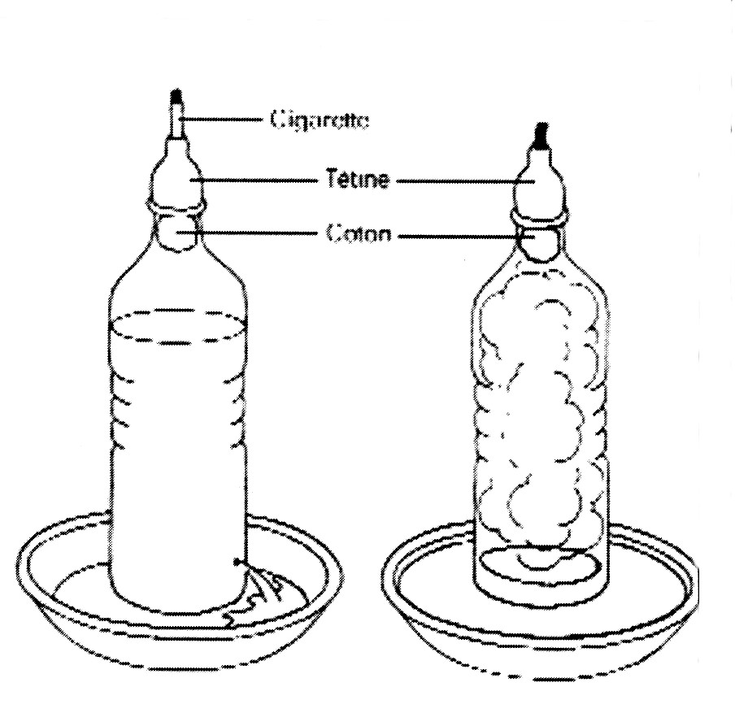

Si tout le monde connaît le rôle majeur du tabac dans la genèse de certains cancers, celui du poumon surtout, mais aussi de la sphère ORL, de la vessie - sans oublier d'autres pathologies : hypertension artérielle, ulcère gastro-duodénal, artérite, etc. - les conséquences du tabagisme passif, en particulier chez le jeune enfant, sont aussi insidieuses que dramatiques. Ainsi, la fumée dégagée par l'extrémité de la cigarette est plus polluante que la fumée inhalée parce que plus riche en goudrons, en oxyde de carbone, en ammoniaque et en substances cancérigènes.

Le séjour dans une pièce enfumée pendant quelques heures équivaut à l'inhalation de cinq cigarettes par jour, ce qui augmente considérablement le risque de cancer du poumon 30 ans plus tard.
## Tabac et grossesse

L'inhalation de la fumée de tabac est toxique dès le début de la grossesse.

Parmi les risques, confirmés par de nombreuses études, citons :

*   les avortements spontanés,
*   la prématurité,
*   le faible poids de naissance (- 5 % du poids de nais­sance attendu) si la femme enceinte est exposée au tabac (et a fortiori si elle fume elle-même !).

Les toxines du tabac pénètrent dans la circulation foetale, intoxiqucant les ovocytes, et peuvent alors provoquer des mutations génétiques responsables non seulement de malformations telles que les becs de lièvre, mais aussi, plus tard, de leucémies et de cancers du système nerveux central.

## Tabac et enfants

Les études récentes ont montré que, après la nais­sance, le tabagisme passif multipliait par deux les risques de mort subite du nourrisson.

Sur les voies respiratoires, il augmente le risque d'infections bactériennes (pneumonies à pneumo­coque surtout), de bronchites et d'otites. Concernant l'asthme, qui touche maintenant 20 % des enfants dans le monde, il aggrave les crises qui deviennent plus résistantes au traitement.

## Au total

Le tabagisme passif augmente la mortalité à tous les âges de la vie. Malheureusement, en Afrique, si l'OMS estimait, en 2000, que 29 % des hommes fumaient (et seulement 7 % des femmes), des études conduites en Algérie et en Namibie indi­quaient que 50 % des enfants de moins de 5 ans étaient victimes du tabagisme passif. La même année, selon l'OMS, 200000 morts étaient attribuées au tabac dans la seule Afrique.

Qu'en est- il en 2009 ? L'industrie du tabac, fuyant les règles de plus en plus contraignantes des pays industrialisés, cherche des terres plus favorables : ce sont, bien sûr, les pays en développement et en premier lieu l'Afrique.

En 2008, nous ne disposons que de données partielles, mais le chiffre des ventes de cigarettes en Afrique ayant doublé depuis 2000, le pire est à craindre !

Il faut donc bien faire comprendre aux parents que le tabagisme passif dont sont victimes les enfants débute avant la naissance et avant la grossesse. Selon l'OMS, il n'existe pas de niveau inoffensif d'exposition à la fumée de tabac, dont l'action toxique est immédiate.

Il est évident que les taux les plus élevés seront trou­vés à l'intérieur des inaisons : cela signifie que, même si la cigarette est conviviale, les parents, par exemple, ne doivent pas tolérer qu'un visiteur ami continue à fumer devant une femme enceinte ou un enfant. De plus, dans les cases, les fumées du foyer sont un facteur supplémentaire d'aggravation de l'asthme et de toutes les insuffisances respiratoires chroniques. Il y a peu de temps, les mesures draconiennes des USA et des pays scandinaves faisaient sourire beau­coup de Français, mais l'amélioration spectaculaire de la santé des enfants observée dans ces pays - diminution des pneumopathies, des otites et des asthmes graves, meilleur sommeil chez le nourris­son.. - nous prouve que l'intransigeance est payante. Alors, amis infirmiers, à vous d'être convaincants, et... bon courage !

Commençons par convaincre dès l'école : de simples tests, comme celui du FUMEUR ARTIFI­CIEL, réalisé avec une bouteille d'eau, du coton et. .. une cigarette, sont fortement dissuasifs _(voir encadré)_. Nous devons tout faire pour lutter contre le tabagisme passif qui « nuit gravement à la santé » de tous ceux qui le subissent...

### **Facile à réaliser : le fumeur artificiel***

_* Schéma proposé par le Comité Français d'Education pour la Santé et destiné aux élèves de CM 1 et CM 2. Comité National contre le Tabagisme : 68, boulevard Saint-Michel 75006 Paris._

L'éducation sanitaire implique d'être aisément compréhensible, en particulier par les populations défavorisées sur le plan culturel, sans toutefois tomber dans les défauts de la propagande. La lutte antitabac est et deviendra une action prioritaire.

L'exemple suivant peut illustrer de façon concrète l'effet "salissant" et nocif d'une cigarette fumée.

#### Le fumeur artificiel

*   Prenez une bouteille en plastique.
*   Remplissez-la d'eau aux 3/4.
*   Introduisez du coton hydrophile dans le goulot jusqu'à 1 cm de la partie supérieure en évitant d'atteindre l'eau.
*   Prenez une tétine ou un doigt de gant de caout­chouc (facile à se procurer en pharmacie).
*   Percez-le de façon à pouvoir y introduire la base d'une cigarette.
*   Fixez le doigt de gant autour du goulot.
*   Enfoncez la base de la cigarette à la partie supé­rieure du doigt de gant sur une longueur de 1 cm.
*   Placez la bouteille dans la cuvette.
*   Allumez la cigarette.
*   Percez la bouteille à sa partie inférieure au moyen d'un bon canif, effectuez un léger mou­vement de torsion pour régler le débit.
*   La diminution de pression due à l'écoulement de l'eau provoquera l'aspiration de la fumée et assurera la combustion de la cigarette.
*   Après son passage à travers le coton hydrophile (qu'elle teintera en brun), la fumée viendra occu­per le volume libéré. Il restera à montrer aux élèves l'état du coton, coloré et poisseux, image de ce qui se passe dans les poumons du fumeur.

_Développement et Santé, n°194, 2009_