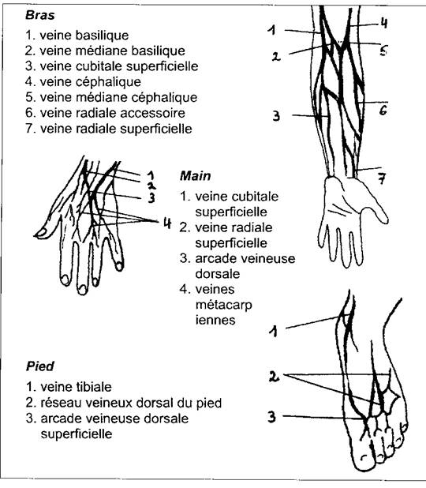

La ponction veineuse permettant un prélèvement de sang est un acte quotidien indispensable pour rechercher une anomalie sanguine ; c'est aussi le premier temps du traitement d'urgence qu'est l'administration intra-veineuse d'un médi­cament. Ce geste ne souffre pas la médiocrité.

## I. Matériel

**Il nécessite :**

*   Un garrot propre.  
*   Une aiguille fine à biseau court, stérile et à usage unique, et un dispositif de prélèvement veineux **stérile et à usage unique**.  
*   Ou mieux : un système de prélèvement sous vide avec tube sous vide,aiguille adaptée à biseau court et corps de pompe appelé aussi tulipe. Ce corps de pompe peut être réutilisé après nettoyage à l'eau et au savon.

**Le prélèvement à la seringue doit être prohibé**

*   Des compresses.  
*   Les tubes spécifiques destinés à tel ou tel type d'examen (NFS, sérologie, coagulation etc.).  
*   Un portoir ou équivalent pour poser les tubes.  
*   Du sparadrap ou pansement.  
*   Un essuie-main pour mettre sous le bras du patient.  
*   Une chaise et une table ou un fauteuil de prélèvement pour le patient ainsi qu'un autre siège pour le soignant.  
*   Un nettoyant de surface (s'assurer de la décontamination des surfaces de travail).

## II. Technique de ponction

*   Installer le patient en décubitus dorsal, ou assis le bras reposant sur une surface dure **jamais debout** (car risque de malaise).  
*   Se laver les mains soigneusement et mettre des gants si possible.  
*   Rassurer le malade, et lui expliquer la raison de ce prélèvement++
*   Choisir une veine de gros calibre afin de minimiser l'irritation de la veine ; le meilleur choix est une veine du membre supérieur (voir schéma).  
    *   veine céphalique,
    *   veine basilique,
    *   veine cubitale,
    *   veine radiale,
    *   veine dorsale de la main (douloureux),
    *   veine dorsale du pied (douloureux).

**Sites des prélèvements IV**

*   Pour les enfants, il peut être nécessaire de faire appel à d'autres veines ou artères.  
*   S'assurer que la peau est saine ; ne pas choi­sir un endroit ou la peau est lésée.  
*   Appliquer le garrot pour faire gonfler la veine en le serrant modérément (pour éviter les risques d'hémolyse).  
*   Placer un essuie-main sous le bras pour faire mieux ressortir l'endroit de la ponction.  
*   Si la veine n'apparaît pas, demander au patient de serrer et de desserrer le poing, puis de le tenir fermé le moins longtemps possible (car risque d'hyperkaliémie).  
*   Désinfecter l'endroit de la ponction veineuse.  
*   Stabiliser la veine en tendant légèrement la peau au moyen du pouce gauche (si vous êtes droitier !) en posant le pouce à quelques centimètres en dessous du point de ponction en vue de l'introduction de l'aiguille.  
*   Tenir l'aiguille avec un angle de 30°, le biseau de l'aiguille tourné vers le haut.  
*   Piquer à 1 centimètre au dessous de la saillie veineuse (pour certains dans le sens de la circulation veineuse ?).  
*   Faire pénétrer l'aiguille dans la veine et véri­fier l'existence d'un reflux de sang prouvant la présence de l'aiguille dans la veine.  
*   Desserrer le garrot.  
*   Si l'on dispose d'un corps de pompe(tulipe) avec des tubes adaptés sous vide,tenir ferme­ment le corps de pompe d'une main et adap­ter successivement chaque tube avec l'autre main en respectant l'ordre selon l'anticoagu­lant et en agitant doucement les tubes pour bien mélanger le sang et l'anticoagulant.  
*   Dans le cas contraire, remplir chaque tube et le disposer sur le portoir : ils seront rebou­chés et agités dès la fin de la ponction.  
*   Oter l'aiguille avec le dernier tube puis com­primer quelques minutes avec une compresse stérile enduite éventuellement d'une solution antiseptique, en s'aidant si possible du patient.

**

**

*   Si le prélèvement n'a pas été directement effectué dans les tubes transvaser l'échan­tillon de sang rapidement dans les flacons destinés à tel ou tel examen **sans attendre** car risque de coagulation.  
*   Assurer une bonne identification des tubes immédiatement (nom, prénom, numéro de prise en charge) car la moitié des erreurs se produisent lors du prélèvement, la nature des analyses à effectuer.  
*   Noter la date, l'heure et le motif du prélève­ment dans le dossier du malade, ou le registre de consultation ou d'hospitalisation.  
*   Enfin s'assurer qu'il n'y a pas de saignement ou d'hématome au lieu du prélèvement : si oui effectuer un pansement compressif (pen­dant 1/4 d'heure en s'aidant de la participa­tion du patient).  
*   Jeter l'aiguille sans recapuchoner dans un conteneur spécifique.  
*   Apporter le plus rapidement les prélève­ments au laboratoire.  
*   Si l'antiseptique utilisé est à base d'iode, bien le retirer pour éviter toute réaction aller­gique.

**Si les veines sont difficiles à trouver, tout particulièrement si elles sont colla­bées en cas de choc, placer des com­presses très chaudes pendant quelques minutes. Ce procédé est efficace car la chaleur fait dilater les vaisseaux san­guins.**

Développement et Santé, n°183, 2006