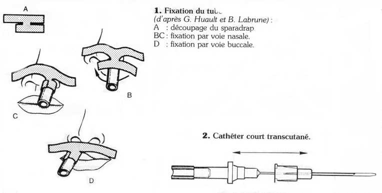
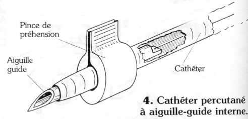

Faire le choix d'une technique de réhydratation est un acte thérapeutique; ce geste implique que les avantages pour le petit patient soient supérieurs aux inconvénients qu'il faudra donc savoir évaluer préalablement.

On peut schématiquement considérer deux grands groupes:

## **A. La déshydratation légère ou modérée**

La perte de poids est inférieure à 10 % ; cette situation n'entraîne pas ou peu de signes cliniques, en particulier, il n'y a pas de pli cutané.

### **1. La réhydratation par voie orale (RVO)**

La solution de réhydratation orale (SRO) proposée par l'OMS comprend pour un litre d'eau : chlorure de sodium 3,50 g, bicarbonate 2,50 g, chlorure de potassium 1,50 g, glucose 20 g. Elle doit être renouvelée toutes les douze à vingt quatre heures; l'eau doit être préalablement bouillie mais la solution elle-même ne doit pas être portée à ébullition.

**Modalités pratiques:** sous surveillance au centre de soins pendant les quatre à six premières heures du traitement, on apportera à l'enfant: 50 ml à 100 ml/kg de solution, à intervalles très rapprochés de cinq à dix minutes, et par petites quantités (cuiller à café).

Au terme de cette période, le refus de l'enfant, des vomissements répétés, l'aggravation de la perte de poids ou l'apparition des signes cliniques nets de déshydratation doivent faire abandonner la RVO pour une autre technique.

En revanche, si l'enfant prend du poids et si son état s'améliore, la RVO peut alors être poursuivie à domicile sur la base d'un total de 100 à 200 ml/kg/24 heures dans la mesure où les parents sont attentifs aux contre-indications simples précédentes.

## **II. La voie naso-gastrique**

**Matériel:** une sonde en plastique ou en caoutchouc; son diamètre interne de 1,3 mm à 3,9 mm (calibre 4 à 12) ; sa longueur est de 40, 50 ou 125 cm; une seringue de 10 ou 20 ml adaptable; un stéthoscope et des flacons de SRO.

**Technique:** la longueur de tube à prévoir pour atteindre l'intérieur de l'estomac est égale à la distance comprise entre la pointe du nez et l'ombilic de l'enfant. Il faut s'assurer que son extrémité est bien dans l'estomac, non dans les poumons: pour cela l'auscultation de la région gastrique révèle un bruit de gargouillement lors de la pénétration d'air introduit à l'aide de la seringue; on examinera également la cavité buccale afin de vérifier que la sonde n'y est pas enroulée. Une fois en place, la fixation se fait en " moustache " sur la lèvre supérieure et non sur la narine (_schéma n° 1)._

**Modalités pratiques:** préconisée chez les enfants qui vomissent constamment ou qui refusent de boire; un système de tubulure à perfusion peut être fixé à la sonde et relié à la solution de réhydratation, évitant les injections à la seringue souvent trop rapides. On administre 100 ml/kg pendant les six premières heures fractionnés en douze gavages continus d'une demi-heure chacun. **Mêmes contre-indications que la RVO.**

### **B. La déshydratation importante ou sévère**

Ce groupe comprend les enfants dont la perte de poids est supérieure ou égale à 10 %, et ceux qui n'ont pas répondu aux techniques précédentes.

Le pli cutané est franc et des signes de gravité (collapsus ou troubles de la conscience) apparaissent lorsque la perte de poids est supérieure ou égale à 15 %. La perfusion intraveineuse (PIV) est ici obligatoire; elle nécessite **dans** **tous les cas** une désinfection large et soigneuse de la peau avec un antiseptique puissant.

On distingue deux catégories de techniques:

*   l'abord veineux périphérique de pratique courante,

*   et l'abord veineux face aux situations d'urgence où le pronostic vital est engagé.

## **I. L'abord veineux périphérique de pratique courante**

### **1. Matériel et mise en place**

Il est à usage unique et de deux types:

**a. l'épicrânienne :** les calibres utilisés vont de 27 Gauge (4/10° mm de diamètre) à 19 Gauge (11/10° mm); la longueur moyenne de l'aiguille est de 15 mm.

**b. le cathéter transcutané** _(schéma 2):_ l'aiguille-guide métallique interne dépasse le cathéter externe à son extrémité distale ; les calibres utilisés vont de 24 Gauge (56/100° mm) à 16 Gauge (165/1000° mm) ; lorsqu'on est dans la veine, le sang reflue à l'intérieur du cathéter; on fait alors glisser celui-ci le long de l'aiguille-guide puis on enlève celle-ci ; il est nécessaire de laisser le sang refluer pour purger toute trace d'air; son utilisation nécessite une veine de plus gros calibre que l'épicrânienne, mais il est bien toléré et sa longévité est supérieure.

### **2. Fixation**

Il est important de ne pas laisser le matériel mis en place coulisser à travers l'orifice cutané: les germes de surface pénètrent alors directement dans la circulation, source d'infection ; la fixation est effectuée à l'aide de deux sparadraps _(schéma n° 3)_ qui ne doivent pas cacher le trajet.

L'immobilisation du membre concerné se fait sur une planchette à l'aide de bandes élastiques ou de sparadrap en évitant de faire le tour complet de la circonférence du membre: ceci entraîne un effet de garrot.

L'immobilisation de la tête est plus difficile: la bande élastique fixant celle-ci est attachée sur les parties fixes du lit.

### **3. Le choix des veines**

*   Les veines superficielles du membre supérieur: dos de la main, avant-bras, en règle bien visible; il faut éviter autant que possible les veines des plis de flexion où l'immobilisation est difficile.

*   Les veines superficielles du membre inférieur: dos du pied, saphène externe et interne; moins souvent utilisées en raison des risques accrus de souillure dus à la proximité des sphincters.

*   Les voies épicrâniennes sont des veines de choix dans les premiers mois de la vie: elles deviennent de moins en moins apparentes et plus difficiles à ponctionner avec l'âge.

*   La veine jugulaire externe est le plus gros tronc veineux superficiel visible chez le nourrisson et chez l'enfant.

Pour l'aborder, l'installation de l'enfant doit être parfaite: épaules soulevées par un billot, tête franchement tournée du côté opposé à la ponction, plan du cou horizontal dans le prolongement du tronc, l'opérateur se place à la tête du patient. Les repères sont pris avec la main gauche: pouce sur la saillie mastoïdienne, médius dans la fourchette sternale, index à mi-chemin de ces deux premiers repères sur le pouls carotidien. L'aiguille est introduite en dehors de l'index à 450 sur le plan du cou, et poussée de un à deux cm, en visant le mamelon droit. Le reflux de sang est souvent immédiat, parfois ce n'est qu'au retour que la ponction est obtenue.

### **4. Précautions - incidents - accidents**

*   Le cathétérisme accidentel d'une artère se traduit par le reflux de sang rouge vif dans la tubulure. Cet incident implique le retrait immédiat du matériel posé et la compression locale de plusieurs minutes afin d'éviter la constitution d'un volumineux hématome.

*   L'apparition d'une rougeur ou d'une infiltration doit conduire également au retrait du matériel même si la perfusion a un débit satisfaisant: ces signes traduisent toujours une lésion de la veine.

*   Les produits hypertoniques (glucosé 1 0 % par exemple), ou dont le pH est très

éloigné de 7 (très acide ou très basique), sont irritants pour les veines: il faut donc éviter de les utiliser en perfusion périphérique.

*   Dans la veine jugulaire externe, la pression est négative: il faut **absolument éviter** l'introduction d'une bulle d'air en plaçant une seringue de sérum physiologique à l'extrémité du matériel utilisé; dans le cas contraire, une embolie gazeuse rapidement fatale peut survenir.

*   Les complications infectieuses imposent une surveillance pluriquotidienne afin de prévenir une veinite, une lymphangite ou un abcès cutané.

*   Une septicémie secondaire à une thrombophlébite ou un abcès cutané est possible; ainsi, toute fièvre inexpliquée impose l'ablation du matériel de perfusion.

## **II. L'abord veineux face aux situations d'urgence**

Deux solutions sont offertes:

- l'une condamne la veine de façon définitive: c'est la dénudation qu'il faut tendre à abandonner,

- l'autre conserve en principe la perméabilité de celle-ci: c'est le cathétérisme percutané qu'il faut développer.

### **1.** **L'objectif**

Il est de perfuser rapidement une grande quantité de liquides, ou d'administrer des produits hypertoniques.

### **2. La méthode**

Quelle que soit la méthode utilisée, la technique doit être aseptique: lavage des mains et des avant-bras de l'opérateur, habillage chirurgical, préparation du matériel sur champ stérile et large désinfection de la zone de ponction chez l'enfant.

**a. la dénudation:** nous ne nous attarderons pas sur sa technique. Rappelons qu'elle comporte la ligature du tronc veineux et donc sa perte définitive.

**b. le cathéter transcutané:** il s'agit de cathéters longs. On dispose de trois types:

*   **Le cathéter à aiguille-guide interne** (_schéma 4_): il écarte toute possibilité du cathéter de se sectionner sur l'aiguille et donc évite le risque grave d'embolies.

*   **Le cathéter à aiguille-guide externe** _(schéma 5):_ il coulisse à l'intérieur d'une aiguille-trocart métallique; une fois le reflux obtenu lors de la ponction, le cathéter est alors poussé à travers l'aiguille.

Le cathéter risque de se couper sur le biseau de l'aiguille si on essaie de le retirer une fois enfoncé; si le cathétérisme s'avère impossible, retirer ensemble l'aiguille-guide et cathéter.

### **3. Le choix des veines profondes**

*   Dépend de l'expérience de chacun.

*   Concerne surtout les veines du membre supérieur: la veine jugulaire externe; pour la veine sous-clavière il existe actuellement un matériel plus adapté; ses risques majeurs sont ceux d'un pneumothorax ou d'un épanchement pleural hématique, parfois fatals.

*   Le sinus longitudinal supérieur est utilisé à titre exceptionnel chez un nourrisson dont la fontanelle est encore ouverte (_schéma_ _6)._

**Matériel:** une grosse épicrânienne de calibre 20 (9/10 mm) (un cathéter court, ou une aiguille à sinus), montée sur une seringue remplie de sérum physiologique.

**Technique:** en raison de la pression négative, le risque d'embolie gazeuse est majeur.

*   On prépare à l'angle postérieur de la fontanelle antérieure dans le plan médiosagittal, l'aiguille faisant un angle de 60°) avec la partie antérieure du crâne (position 1).

*   On aspire doucement dès que l'on a passé le plan dur.

*   Puis on ramène l'angle à 30° (position 2) en continuant à aspirer: le reflux doit être franc et massif.

*   On pince alors fortement l'aiguille entre le pouce et l'index le temps de l'injection du produit, puis on retire l'aiguille. Il faut assurer une compression efficace pendant cinq minutes au moins.

### **4. Une situation particulière**

Lorsque la voie intraveineuse s'avère impossible et que la déshydratation est déjà trop importante pour répondre à la RVO, on peut pratiquer une **injection intrapéritonéale.**

**Technique:** examiner soigneusement l'abdomen afin d'éviter la ponction du foie, de la rate ou de la vessie; n'utiliser que du matériel et des liquides stériles; une grosse aiguille calibre 18 (12/10 mm) reliée au dispositif de perfusion est introduite juste au-dessous du nombril ou dans la fosse iliaque gauche; si l'aiguille est bien dans la cavité péritonéale, le liquide coule en continu.

La dose totale de 70 ml/kg peut ainsi habituellement être administrée en dix à vingt minutes.

**Les liquides utilisés:** sérum physiologique, solution de Ringer lactate diluée à 50 % avec de l'eau distillée.

**_Deux techniques doivent être_** **_totalement abandonnées:_**

*   **_la perfusion sous-cutanée car responsable de larges nécroses du_** **_derme,_**

*   **_et la perfusion lntratibiale ou du_** **_calcanéum à l'origine d'ostéomyélites_** **_et ostéo-arthrites sévère._**

### **Conclusion**

La responsabilité des médecins et infirmiers est grande en matière d'abord vasculaire et lors du choix d'une méthode de réhydratation, chacun doit avoir le souci constant de **respecter le** **patrimoine veineux de l'enfant.**

_Développement et Santé, n°54, décembre 1984_