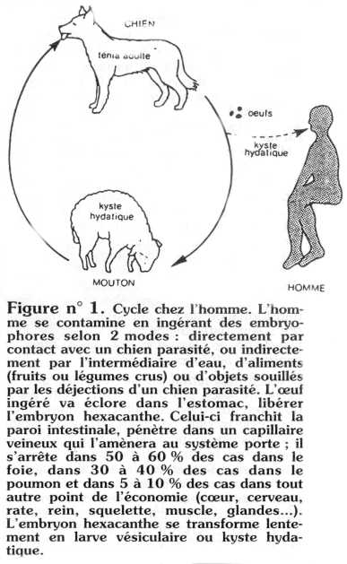
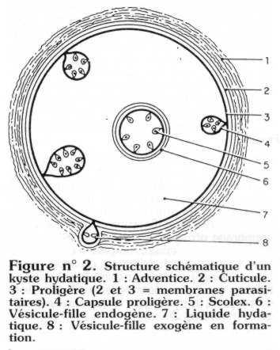
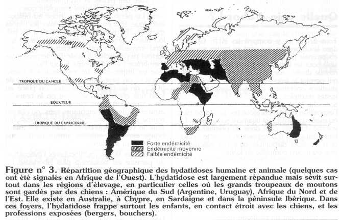

Histoire naturelle et traitement chirurgical du kyste hydatique du foie 
ou: comprendre une maladie pour mieux la soigner

## I. Qu'est-ce que le kyste hydatique du foie ?

### À quoi correspondent ses multiples aspects ?

Le kyste hydatique du foie (KHF) est la forme intermédiaire d'un parasite au cycle complexe _(Taenia Echinococcus granulosus_). La forme adulte de ce parasite est un petit ver qui vit dans l'intestin du chien : il y pond des oeufs. Ceux-ci, évacués avec les selles, sont ingérés par un hôte intermédiaire, le plus souvent un mouton, qui s'infeste en se nourrissant d'herbe souillée. L'homme est un hôte intermédiaire accidentel, avant tout par contacts avec des chiens parasités : l'hydatidose est une maladie des mains sales (_figure n° 1_) !

Une fois ingérés, les oeufs (extrêmement résistants à la chaleur, à la dessiccation ... ) traversent la paroi intestinale et, par voie veineuse mésentérico-portale, gagnent le foie. La plupart, bloqués au niveau des sinusoïdes, s'y arrêtent et s'y développent sous la forme d'un " pseudo-kyste " parasitaire. La cinétique de cette transformation est mal connue, et il peut exister des involutions (impasses parasitaires).

## II. La connaissance de la structure du KHF  
est d'importance essentielle pour le chirurgien

En se développant dans le parenchyme hépatique, l'oeuf se ballonnise : la sphère que constitue le KHF se compose de deux membranes parasitaires (la cuticule externe et la membrane proligère interne) ; elle est remplie de liquide initialement limpide " comme de l'eau ", dans lequel sédimente du sable hydatique (constitué par une multitude d'oosphères ou scolex, formes larvaires (" oeufs ") du parasite, formées par la membrane proligère) _(figure n° 2)._

Au fur et à mesure que sa taille augmente le KHF repousse et comprime le parenchyme hépatique qui l'entoure. Il semble qu'il faille moins d'un an pour que le KHF atteigne une dizaine de centimètres de diamètre. Au cours de sa croissance, le parasite dont la cavité est initialement sous tension refoule les pédicules vasculaires intraparenchymateux (glissoniens et sus hépatiques) qui sont étirés et distendus : il en résulte, dans un premier temps, une panne à la circulation sanguine et une ischémie locale. Ces modifications aboutissent à une transformation du foie, tassé autour du parasite : son parenchyme se sclérose, devient blanchâtre et plus ou moins rigide. Ainsi se constitue l'adventice ou périkyste.

_Il est fondamental de se rappeler que le__périkyste n'est pas du parasite_. Cette pseudo-paroi du KHF est faite du parenchyme hépatique modifié de l'hôte, et elle se continue sans aucun plan de clivage, insensiblement, avec le tissu hépatique sain. L'importance, l'épaisseur et la sclérose de l'adventice sont généralement parallèles au volume du kyste, mais cela est loin d'être constant : on peut voir de petits KHF à périkystes épais et totalement scléreux et de volumineux (11 litres, dans mon expérience !) à périkyste mince et souple.

## III. Le geste chirurgical est conditionné par l'état du périkyste et l'existence d'une éventuelle fistule bilio-kystique

### D'où viennent les fistules bilio-kystiques ?

En refoulant les pédicules glissoniens le KHF distend les canaux biliaires qu'ils contiennent : cette distension aboutit à leur ulcération, à la fois par ischémie et par étirement mécanique. Il se constitue ainsi dans un premier temps une fissuration biliaire : la brèche d'un canal biliaire donne issue à de la bile qui vient au contact du parasite (de la cuticule) dans l'espace virtuel qui sépare celui-ci du périkyste de l'hôte. La bile exerce un effet caustique sur la membrane parasitaire et aboutit à son effraction : en se mêlant au liquide hydatique, la bile se répand dans la cavité parasitaire. Cette diffusion entraîne une souffrance du parasite et une réaction de défense : la vésiculisation des oosphères du sable hydatique qui se transforment en vésicules-filles, souvent innombrables. Lorsque la communication bilio-kystique est large ces vésicules-filles peuvent migrer vers la voie biliaire principale et obstruer celle ci.

La fistulisation biliaire s'accompagne toujours, plus ou moins rapidement, d'une infection, volontiers anaérobie, de la cavité parasitaire, du périkyste adjacent et des voies biliaires (angiocholite). L'infection du périkyste est cause de sa calcification secondaire. C'est également l'infection qui transforme en gelée bilio-purulente louche le contenu de la cavité parasitaire et qui détruit la membrane principale du parasite " premier " dont les débris se mêlent aux vésicules-filles.

Pour les KHF de petit volume, toute cette évolution peut se faire à bas bruit, sans manifestations cliniques autres que de vagues douleurs et aboutir à la mort parasitaire. L'adventice épaissie et calcifiée (radio-opaque) entoure alors une cavité pleine d'une sorte de mastic dans lequel se trouvent parfois encore des débris de membrane. Ces kystes morts ne doivent pas être opérés.

L'incrustation de scolex dans le périkyste et le développement, dans son épaisseur, de vésicules-filles est possible : c'est la " vésiculisation exogène ", phénomène rare en pratique mais cause de controverses thérapeutiques vigoureuses !

### Au total, les KHF se présentent schématique ment sous deux aspects pour le chirurgien :

*   **cavité uniloculaire à périkyste** **souple :** on parle de KHF jeune, non compliqué. C'est un ballon blanc qui, une fois vidé de son contenu (liquide clair, " eau de roche " avec du " sable " au fond), est facilement séparé du foie. La paroi parasitaire fait 2 à 3 mm d'épaisseur, elle est très fragile et se déchire sous son propre poids. Dans certains cas, après ablation du parasite, l'exploration attentive de la face interne de l'adventice permet de reconnaître une fissuration canaliculaire qui tache la compresse d'un peu de bile. Le parenchyme hépatique refoulé est encore souple : après ablation du parasite la cavité qu'il remplissait s'efface spontanément et pratiquement immédiatement; **cavité uni- ou multi-loculaire à** **paroi (périkyste) épaisse,** scléro-calcaire, contenant un magma bilio-purulent plus ou moins épais dans lequel flottent les débris de la membrane principale et des vésicules-filles : KHF évolué, compliqué. Il existe toujours une (parfois plusieurs) fistule bilio-kystique : elle peut mettre largement en communication la cavité parasitaire et les voies biliaires. Cette _fistule bilio-kystique se fermera toujours en l'absence d'obstacle sur la voie biliaire principale._ Le périkyste rigide empêche l'affaissement du foie et le comblement spontané de la cavité résiduelle. En postopératoire non ou mal drainée, celle-ci, se remplit d'un liquide bilio-hématique vite infecté. Le périkyste, non vascularisé, se comporte alors comme un corps étranger : il se séquestre et entretient la suppuration. Ainsi s'expliquent les sepsis chroniques et les désespérantes fistules externes postopératoires...

Entre ces deux aspects tous les intermédiaires sont possibles. Les KHF peuvent aussi être uniques ou multiples, se développer dans n'importe quel segment du foie et aboutir à des communications bilio-kystiques intéressant soit un canalicule distal soit un canal segmentaire ou latéral.

Le volume important du KHF peut enfin entraîner une compression des organes de voisinage et, phénomène très particulier à la maladie hydatique, cette compression , " efface " les plans anatomiques. Ainsi l'estomac, le duodénum, le côlon transverse, le diaphragme, le poumon, peuvent-ils participer au périkyste sans qu'aucun clivage ne puisse plus être trouvé entre ces viscères et le foie. Si les communications kysto-digestives semblent exceptionnelles (existent-elles ?) les communications bilio-bronchiques sont une complication évolutive classique des KHF du dôme hépatique : des vésicules-filles ou des débris membranaires peuvent alors être expectorés dans une vomique bilio-purulente. Le traitement du KHF compliqué, par voie abdominale seule, permet la guérison et la fermeture spontanée de la fistule bronchique.

**La connaissance de l'histoire naturelle permet de comprendre les différents aspects cliniques des KHF :** **formes pseudo-tumorales, formes à** **symptomatologie biliaire, ictériques ou angiocholitiques, pseudo-abcès** **du foie, suppurations de la base pulmonaire droite.**

**Elle permet aussi de schématiser les** **tactiques chirurgicales.**

## IV. Quand opérer ?

Il est raisonnable, en zone d'endémie, d'opérer les KHF dès que les moyens minimaux de la chirurgie sont réunis : possibilité d'anesthésie générale, instrumentation chirurgicale de base (" boîte d'estomac "), bistouri électrique, aspiration opératoire.

On peut se passer de radiographies per-opératoire mais il est précieux d'avoir une sonde de Dormia.

Si les indications les plus évidentes sont les " urgences " : formes biliaires ou suppurées, les interventions " à froid ", pour les formes tumorales, sont souvent les plus simples.

Parmi les moyens diagnostiques modernes l'échographie est le plus performant: simple, peu coûteuse, elle fait facilement le diagnostic en zone d'endémie (elle est en fait souvent inutile !) et surtout elle situe le ou les kystes dans le foie et reconnaît l'aspect uni- ou multiloculaire.

## V. Quelle voie d'abord ?

Tous les KHF, y compris les KHF fistulisés dans les bronches, peuvent se traiter par voie abdominale pure. Si une voie médiane est possible pour les localisations gauche, la voie sous-costale droite, élargie à la demande, est celle qui permet le mieux de faire face à toutes les situations opératoires difficiles : kyste du dôme, kystes multiples... Une valve, ou un écarteur accroché à un piquet relève l'auvent costal et l'exposition du foie est aidée par la section plus ou moins complète du ligament suspenseur. Le volume du kyste peut dans un premier temps faire obstacle à une exposition correcte : celle-ci n'est alors disponible qu'après évacuation plus ou moins complète du kyste.

## VI. Conduite de l'intervention

Elle comprend deux temps principaux :

*   l'éradication du parasite,
*   le traitement du périkyste restant.

### 1. Éradication du parasite

Faut-il " tuer " le parasite (les scolex ou les vésicules-filles) avant de l'évacuer ? Cette notion traditionnelle n'a pas de sens et doit être abandonnée. Inutile pour les KHF uniloculaire, elle est irréalisable pour les KHF multiloculaires (on ne peut injecter chaque vésicule ... ) et les produits parasiticides sont très souvent inefficaces parce que dilués dans le liquide hydatique, ou potentiellement dangereux (coma hyperosmolaire pour le sérum hypertonique, cholangite grave pour le formol, explosion du foie pour l'eau oxygénée ... ). Utilisée correctement (_dans_ _une cavité largement ouverte)_ l'eau oxygénée à 20 volumes aurait ma préférence, mais en situation de pénurie un ammonium quaternaire (Cequartyl®) ou même l'alcool iodé peuvent être utilisés.

#### **a.** Pour les kystes uniloculaires

On utilisera la technique d'ablation du parasite " à kyste fermé " telle que décrite par Galindo pour les KH pulmonaires.

La partie affleurante du KHF est exposée et isolée par des champs opératoires (qui peuvent être imbibés de liquide sporicide) : il faut opérer " propre " comme pour l'évacuation d'un abcès.

On ponctionne directement le KHF, en plein périkyste blanchâtre, avec un gros trocart branché sur l'aspirateur. Lorsque le KHF est bien uniloculaire il s'affaisse immédiatement : on saisit alors le périkyste au pourtour du trocart avec des pinces et on maintient l'aspiration jusqu'à vidange aussi complète que possible. Le périkyste est alors incisé au bistouri électrique, tout en le soulevant avec les pinces tractrices. Le parasite apparaît : c'est un ballon blanc, dégonflé, au sein d'une cavité qui tend immédiatement à s'affaisser. Il ne faut surtout pas chercher à saisir directement cette membrane : elle déchirera. Il faut l'extraire en bloc en improvisant un " extracteur à membrane " : on prend une seringue plastique de 50 cc, on lui coupe les ailettes, on place au fond une compresse sèche et on la branche sur l'aspiration. Avec cet extracteur on peut aspirer toute la membrane sans qu'elle se rompe : elle se tasse contre la compresse qui évite le ventousage de l'aspiration. La membrane est ainsi enlevée simplement, sans effraction ni souillure.

#### B. Dans les kystes multiloculaires

L'évacuation du parasite est beaucoup plus laborieuse. Le KHF ponctionné ne s'affaisse pas ou très peu. Il faut avoir pensé à faire stériliser une ou plusieurs cuillers (voire une louche !) : elles serviront à évacuer les vésicules-filles et les débris parasitaires qui bouchent l'aspirateur. Cette évacuation doit se faire proprement en isolant l'ouverture du KHF par des champs opératoires. L'incision du périkyste doit être large, faite au bistouri électrique, guidée par un doigt introduit dans la cavité : la section s'effectue là où le périkyste fait 1 cm d'épaisseur. L'aspiration est surtout utile à la fin, et la cavité est largement rincée avec du liquide parasiticide.

### 2. Le traitement du périkyste

#### A. Les KHF non compliqués

Ils doivent tous guérir facilement et rapidement par la seule ablation du parasite (et certains, dans les pays riches, le font aujourd'hui par voie cœlioscopique).  
La cavité tend spontanément à s'affaisser au cours même de l'intervention : tout au plus dans certains KHF du dôme au périkyste épais peut-il être utile de faire monter l'épiploon pédiculisé sur l'artère hépatique droite pour éviter la constitution d'une cavité résiduelle.

Les fissurations biliaires, lorsqu'elles existent, sont toujours de très petites tailles : on les recherche en passant une compresse qui se teinte de bile et on les aveugle par un point en X de fil très fin à résorption lente - on peut aussi ne rien faire.

Il n'est pas indispensable de drainer lorsqu'il n'y a pas de fuite biliaire, sinon un drainage déclive banal est nécessaire pour quelques jours.

#### B. Le traitement des KHF évolués est plus complexe.

L'ablation des éléments parasitaires infectés est laborieuse : elle doit néanmoins être absolument complète. Le traitement du périkyste commence par un temps biliaire: on peut essayer d'aveugler la ou les fistules biliaires, mais il faut surtout vérifier la liberté de la VBP à l'aide d'une sonde de Dormia si l'on ne dispose pas de radiographie per-opératoire. La mise en place d'un drain type Kehr est utile pour diriger la fistule biliaire externe et/ou (quand cela est possible ... ) faire une opacification postopératoire. Dans ces conditions l'ablation systématique de la vésicule est justifiée.

_Le geste biliaire doit être suivi de la mise à_ _plat de la cavité résiduelle_ qu'entoure la coque rigide de l'adventice. Si les hépatectomies réglées ou les périkystectomies (passant en dehors de l'adventice) sont des gestes " idéaux ", elles sont souvent inutiles et toujours au-delà du raisonnable dans un contexte de pénurie - ou pour un opérateur à l'expérience limitée. La résection de tout le parenchyme laminé par l'expansion du parasite peut obtenir le même résultat sans danger (car on reste à distance des éléments pédiculaires importants) ni risque hémorragique. Ce n'est pas la " résection du dôme saillant " des anciens traités de technique : l'ouverture d'un chapeau de quelques centimètres est un geste insuffisant. Il faut faire l'ablation de la coque superficielle de la cavité péri-parasitaire, partout où elle est superficielle et fait environ 1 cm d'épaisseur ou moins. Un sujet d'hémostase au pourtour est nécessaire. On peut aussi " désépaissir " à la curette ce qui reste de périkyste en dedans (au contact du foie restant) pour emporter les fragments calcifiés et l'assouplir. Pour les volumineux KHF du foie droit la section complète du ligament suspenseur permet la bascule du foie et facilite le comblement de l'espace mort postérieur. Dans ces conditions un drainage déclive, au moins par deux drains est toujours nécessaire. Ce drainage doit avoir un trajet aussi direct que possible. Il permettra en cas d'infection secondaire des lavages au sérum physiologique. Faits à la seringue, par le chirurgien, ils décaperont le périkyste restant, en permettront l'évacuation et le tarissement de la suppuration.

_Développement et Santé, n° 137, octobre 1998_