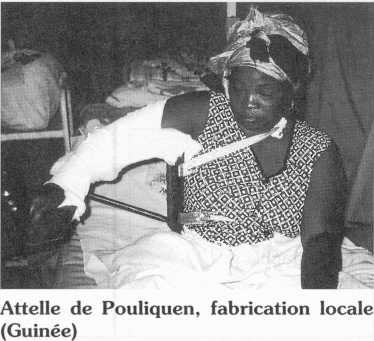
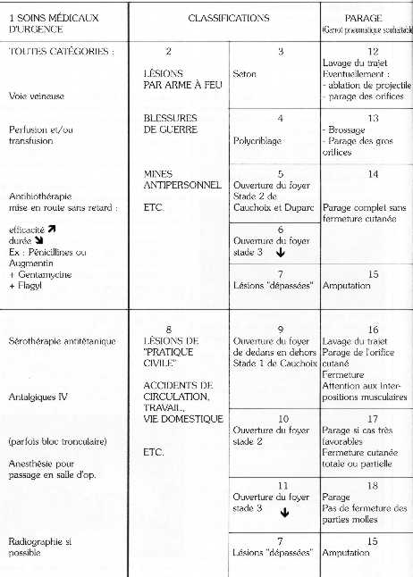
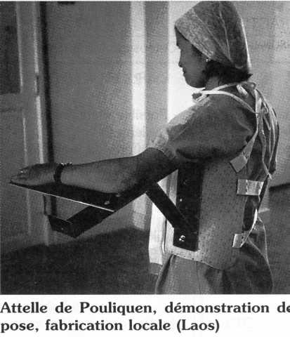
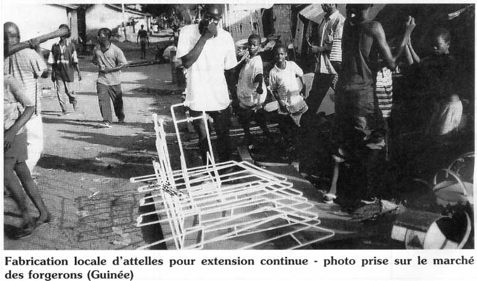
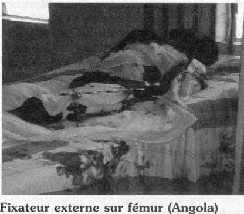

**Traitement d'urgence des fractures ouvertes des membres**

**par Jacques Robinet**

**Chirurgien, Médecins du Monde.**

Cet exposé situe le problème dans le strict cadre des missions humanitaires, prenant en compte les possibilités locales limitées des pays en développement.

Nous avons schématisé ce traitement dans un tableau (_Tableau 1_), dont chaque case est numérotée : les commentaires sont développés ci-dessous, lorsqu'ils sont nécessaires, avec le rappel du numéro.

**1** Les soins sont à mettre en route dès l'admission, d'autant plus qu'elle peut être tardive. De plus, du fait des structures et du personnel local, le transfert au bloc ne sera pas toujours immédiat, aussi, pansement protecteur et alignement provisoire du foyer compléteront, parfois, ces soins médicaux.

**2 et 8** Cette classification rend compte de la souillure potentielle, toujours plus élevée dans les plaies de guerre.

**3** Le trajet du séton conduit à réfléchir sur des lésions associées.

**4** Le polycriblage n'est pas, pour nous, une indication de parage étendu qui risque d'aggraver la situation.

**5 6 9 10 11** Il s'agit des stades de Cauchoix et Duparc qui prennent en compte les lésions des parties molles.

Il faut aussi prendre en compte les pertes de substance osseuse avec deux conséquences :

a) les pertes trop larges conduiront parfois aux indications **7 et 20.**

b) la réparation secondaire des pertes de substance osseuse est un chapitre important, qui sort de cette étude.

**7 et 12**

Appréciation parfois difficile, affaire de conviction. En situation précaire, privilégier le risque vital.

**16** Surtout à la cuisse, une fracture ouverte de dedans en dehors peut cravater le muscle surtout avec le fragment supérieur: une simple libération digitale par l'orifice agrandi, remet tout en place.

**17** Dans nos pays, ce stade conduit parfois non seulement à fermer mais même à ostéo-synthéser d'emblée. Il faut que la fermeture soit possible sans tension et que l'on apprécie la contusion cutanée, parfois lourde de conséquences par nécrose secondaire.

Mais une telle pratique n'est pas admissible dans les pays en développement, en situation précaire, où nous voyons trop souvent des catastrophes consécutives à un empressement chirurgical excessif.

**19 à 24** le plâtre est un pis aller dans les stades **2 et 3** (soins locaux trop aléatoires). Une attelle est concevable dans les cas **19** **20 22 23** mais surtout en traitement provisoire sauf lésions très distales.

<table>

<tbody>

<tr>

<td valign="top">

</td>

<td valign="top">

</td>

</tr>

</tbody>

</table>

**25 l'extension continue s'exercera :**  
- à la rigueur par bandage collé  
- de préférence par broche : Kirschure + étrier tenseur ou Steinmann + étrier simple. Avoir ou faire fabriquer sur place : (attelles de Boppe ou BRAUN au membre inférieur)

(attelles de Pouliquen au membre supérieur) Naturellement le séjour en hôpital s'impose. Maintenir une extension à domicile est trop compliquée

**26** Il est illogique d'ouvrir un stade 1 ou un criblage pour poser un fixateur externe. Le placer à foyer fermé n'est pas très facile et utilise un fixateur dont on n'a peut être pas beaucoup d'exemplaires. Mieux vaut la traction.

**27** A ces stades, le fixateur est le traitement de choix.

Latéral, rigide ou à rotules, ou circulaire, tout dépend des dotations.

**28 29 31**  
Beaucoup de lésions maintenues en attelle ou en extension continue 3 ou 4 semaines sont cicatrisées, avec une bonne biologie et sans fièvre. Une ostéosynthèse secondaire est alors bien moins risquée et peut être décidée en milieu équipé. Elle améliore la continuité osseuse et permettra un retour à domicile.

**32** l'extension de l'ostéosynthèse interne en urgence aux types 2 même très favorables (fermeture sans tension, pas de contusion cutanée, souillure minime) ne peut être conseillée en mission humanitaire.

C'est un exemple dangereux, et un risque excessif.

Il faut savoir qu'après cicatrisation, une ostéo-synthèse est possible même après fixation externe temporaire si la tolérance aux broches a été parfaite et si on laisse cicatriser les orifices quelques jours avant d'intervenir, sous une nouvelle couverture antibiotique.  

  

**Glossaire**

**1- Attelle plâtrée :** bande appliquée sur une seule face du membre (p.ex. face postérieure de la jambe)

Avantages : laisse libre la majeure partie du membre, permet l'inspection, les soins locaux, évite la compression.

Inconvénient : immobilisation peu rigide.

**2- Broche de Kirchner :** tige métallique fine et pointue, utilisée entre autres pour la mise en traction; la broche, introduite transversalement et tendue par un étrier, permet la fixation d'une corde et de poids.

**3- Classification de Cauchoix et Duparc:** sert à graduer la gravité des fractures ouvertes en fonction de l'atteinte des "parties molles":

**a- stade 1 :** ouverture de dedans en dehors (la peau est ouverte par l'intérieur, perforée par les extrémités fracturaires) d'où risque minime de contamination, sauf si le milieu extérieur est contaminant (chute dans un marigot ... )

**b- stade 2 :** ouverture de dehors en dedans, par l'agent traumatisant, mais sans délabrement.

**c- stade 3 :** lésions des parties molles, perte de substance mettant souvent l'os à nu. Le type en est la lésion par mine ou projectiles d'artillerie, mais il peut aussi s'agir de pratique civile.

**4- Fixation externe :** fixation de la fracture par fiches loin du foyer, solidarisées par tige extérieure. S'oppose à la fixation interne par clous centro-médullaires, vis ou plaques au contact du foyer, de ce fait vulnérables à la contamination.

**5- Parage :** désigne le nettoyage chirurgical du foyer. Il peut s'agir d'un geste mineur (simple lavage, excision des orifices) ou complexe, exigeant alors l'excision des tissus souillés, contus, ou voués à la nécrose. Ce geste et les soins ultérieurs sont pratiquement inséparables de la fixation externe.

**6- Plâtre ouvert :** comporte une fenêtre au devant des lésions des parties molles. S'oppose au plâtre fermé, qui n'a pas sa place dans les fractures ouvertes, sauf dans une méthode contestée, dite "espagnole" car utilisée pendant la guerre d'Espagne, consistant à laisser évoluer sous plâtre les processus spontanés de cicatrisation. Il s'agit évidemment d'une arme à deux tranchants.

**7- Polycriblage :** comme son nom le suggère, lacération cutanée par de multiples petites plaies, résultant par exemple de l'action de mine anti-personnel. Souvent superficielles mais toujours souillées, en général ces excoriations ne communiquent pas avec l'os qui s'est fracturé par effet de choc. Leur traitement est le brossage avec antiseptiques, et les pansements gras.

**8- Séton :** désigne une lésion par balle ou arme blanche, comportant un orifice d'entrée, un trajet sur lequel se trouve l'os fracturé, un orifice de sortie. Ces lésions peuvent souvent faire l'objet d'un parage limité aux orifices, avec lavage antiseptique du trajet, sous couvert d'antibiotiques.

_Développement et Santé, n°152, avril 2001_