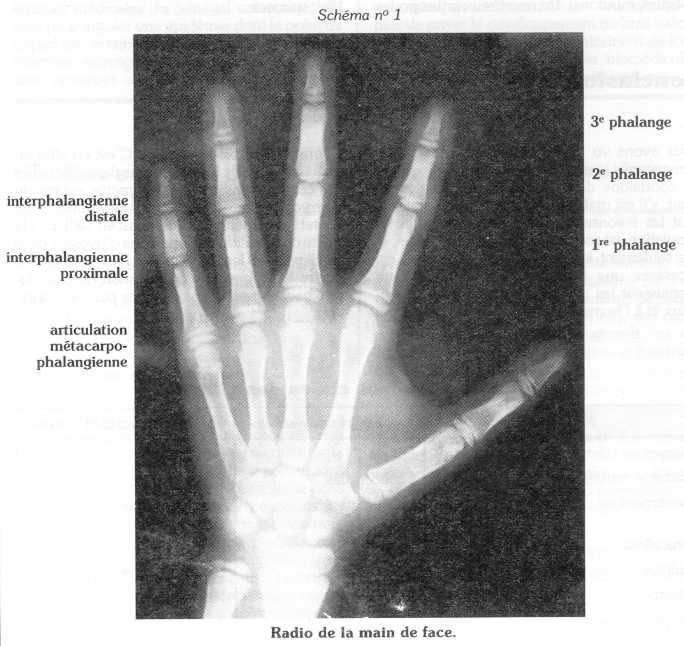
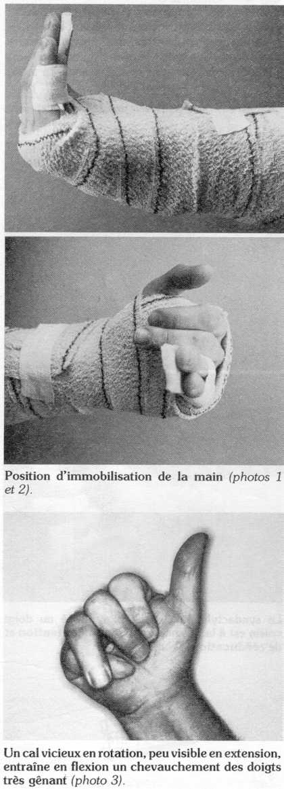
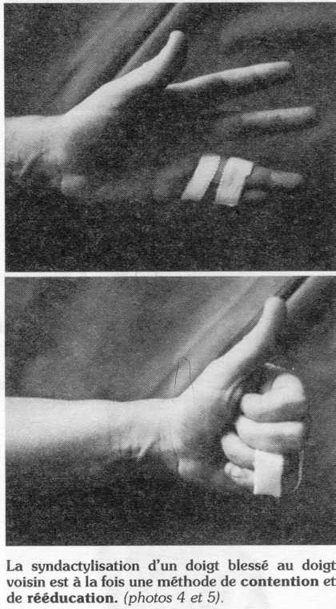
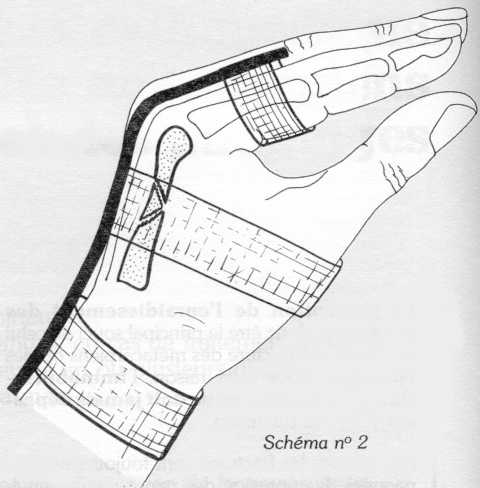
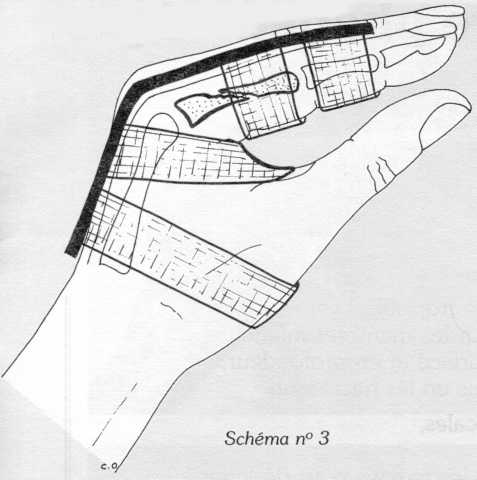
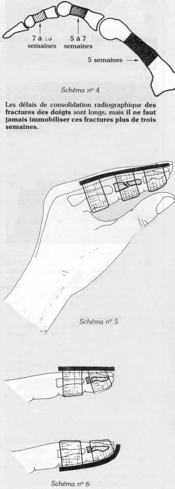

Considérées à tort comme des fractures mineures, les fractures des métacarpiens et des phalanges, en cas de traitement incorrect, aboutissent immanquablement à une raideur d'un ou plusieurs doigts, entravant alors gravement la fonction de la main.

Or, le traitement orthopédique, à condition d'être suivi et contrôlé, permet de traiter aisément la plupart de ces fractures avec de bons résultats.

**Rappel physiologique** *Schéma n° 1*

La main permet à la fois la prise large (empaumement), et le ramassage des petits objets par prise unguéale, grâce à l'extrême **mobilité des doigts.**

La **prévention de l'enraidissement des** **doigts** doit donc être le principal souci de celui qui traite une fracture des métacarpiens ou des phalanges. Pour cette raison, **l'immobilisation de ces fractures ne doit jamais dépasser vingt et un jours.**

Par ailleurs, les fractures sont toujours accompagnées de contusion des parties molles environnantes, source de fibrose entraînant collage tendineux et enraidissement articulaire.

La prévention du collage tendineux se fait en immobilisant le minimum d'articulations, et en encourageant le blessé à mobiliser activement les segments libres. Par exemple, l'immobilisation d'une fracture de la première phalange doit laisser libre le poignet et l'articulation interphalangienne distale.

D'autre part, il faut savoir que les ligaments latéraux des articulations des doigts sont tendus dans certaines positions et détendus dans d'autres. Dans toute contusion, entraînant des phénomènes de fibrose et de rétraction, **Il** **est** **capital d'immobiliser ces articulations en** **position de tension maximum des ligaments latéraux.** Ainsi:

- les articulations **métacarpo-phalangiennes** doivent toujours être immobilisées en **flexion maximum,**

- les articulations **inter-phalangiennes** doivent être immobilisées en **extension.**

C'est la position dite " intrinsèque+ ", car les petits muscles de la main, inter-osseux et lombricaux, sont des fléchisseurs des articulations métacarpo-phalangiennes et des extenseurs des inter-phalangiennes. L'immobilisation de la main est réalisée dans une position reproduisant l'action des muscles intrinsèques *(cf. photos 1* *et 2).*

Enfin, il faut éviter absolument dans les positions d'immobilisation, tout **trouble de la rotation,** particulièrement gênant lors de la flexion des doigts *(cf. photo 3).* Ces troubles sont facilement évités en immobilisant le doigt fracturé avec le doigt voisin:

- soit sur une attelle, et en contrôlant que l'orientation des deux ongles est la même,

- soit à l'aide de sparadrap souple circularisant les phalanges analogues et laissant les articulations inter-phalangiennes libres, c'est la **syndactylisation;** la mobilisation active en flexion extension par le blessé, évitera toute consolidation en position vicieuse *(cf. photos 4 et 5).*

## Traitement des fractures des métacarpiens *Schéma n° 2*

Une attelle dorsale ou palmaire est mise en place pour trois semaines. Elle immobilise le poignet en légère extension, et les **articulations métacarpo-phalangiennes fléchies.** Le blessé est encouragé à immobiliser activement les articulations inter-phalangiennes.

A l'issue de l'immobilisation, une syndactylisation du doigt atteint avec le doigt voisin pendant quinze jours supplémentaires permet de retrouver toute la mobilité.

Les fractures peu déplacées dun métacarpien ne nécessitent pas d'immobilisation, mais une simple syndactylisation pour quelques semaines.

## Traitement des fractures de la première phalange *Schéma n° 3*

Une attelle dorsale ou palmaire est mise en place, laissant le poignet et l'articulation interphalangienne distale fibres. Les articulations métacarpo-phalangiennes sont fléchies. Le blessé est encouragé à mobiliser activement la troisième phalange. A l'issue de l'immobilisation, le relais est pris par une syndactylisation de quinze jours. Il ne faut jamais, au niveau des phalanges, attendre les signes radiologiques de consolidation pour libérer les doigts. En effet, ceux-ci n'apparaissent que tardivement (cf. *schéma n°* 4), et comme nous l'avons vu, les doigts ne supportent pas une immobilisation prolongée.

## Traitement des fractures de la deuxième phalange *Schéma n° 5*

On met en place une attelle dorsale ou palmaire sur le doigt en rectitude pour trois semaines. L'articulation métacarpo-phalangienne est libre. Le traitement est poursuivi par une syndactylisation de quinze jours.

## Traitement des fractures de la troisième phalange *Schéma n° 6*

Les fractures de l'extrémité distale de la troisième phalange, le plus souvent par un mécanisme d'écrasement, ne nécessitent aucune immobilisation, bien que leur consolidation soit très lente *(cf. schéma n° 4).* Seules, les fractures de la base de la troisième phalange, équivalent des arrachements du tendon extenseur, nécessitent une attelle. On met en place:

- soit une attelle, dorsale rectiligne,

- soit une attelle palmaire recourbée maintenant le doigt en extension, mais **laissant** **l'articulation inter-phalangienne proximale libre. Cette attelle est maintenue** **six semaines.**

Au total, le traitement orthopédique des fractures des métacarpiens et des phalanges repose sur des immobilisations segmentaires de brève durée, et sur la syndactylisation.

Il donne de très bons résultats, et permet, dans l'immense majorité des cas de se passer du traitement sanglant.

*Développement et Santé, n°53, octobre 1984*
