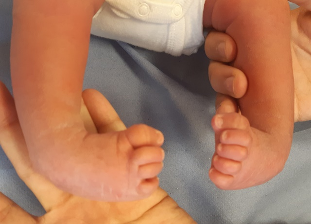
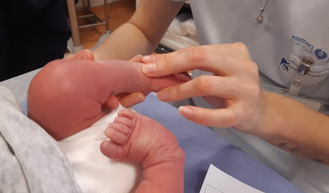
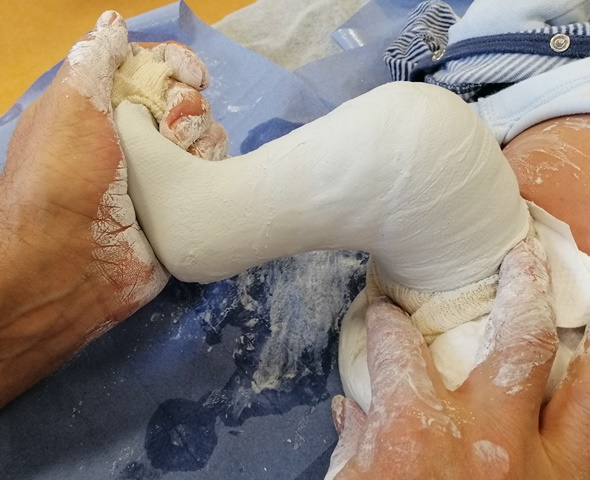
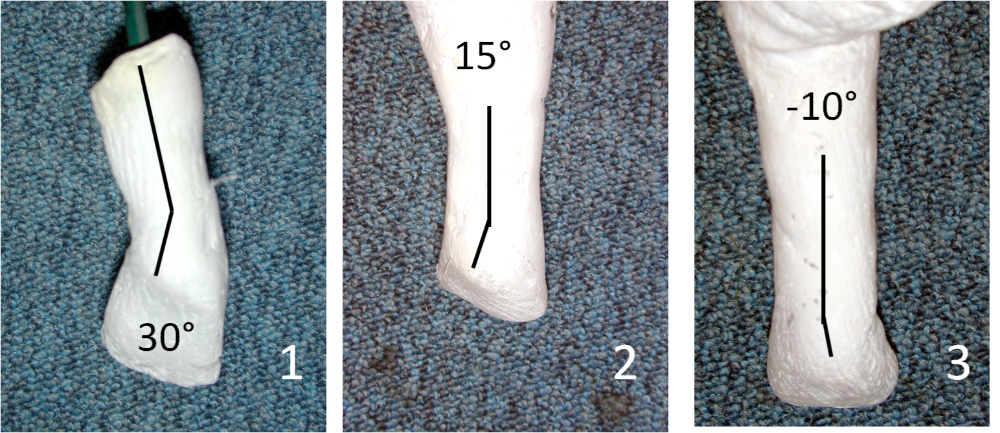
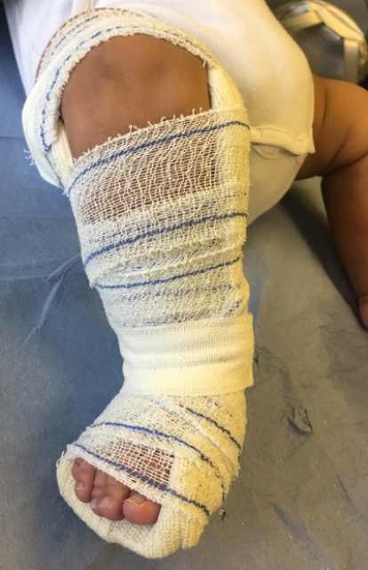

## I- Qu’est-ce qu’un pied bot varus équin ? 
Il s’agit d’une malformation néonatale du pied (1 à 4 pour 1 000 naissances) qui associe des anomalies musculaires, ligamentaires, et osseuses, aboutissant à une déformation dans les trois plans de l’espace (1) : 
- L’équin : absence de flexion dorsale de cheville
- Le varus : l’arrière pied (calcanéus) est dévié en dedans
- L’adduction : l’avant pied est en dedans par rapport à l’arrière pied
- La supination : la plante du pied a tendance à regarder vers le haut  (figure n°1)

Ces défauts sont pérennisés par la présence de nœuds fibreux et de rétractions musculo-tendineuses (triceps sural et muscle tibial postérieur). S’y associent de vraies déformations osseuses qui peuvent néanmoins se corriger par la mise en bonne position du pied, si le traitement est débuté précocement, ceci grâce au remodelage osseux.  

Le **diagnostic **est fait par **échographie anténatale** dans 40% des cas. Ceci est essentiel  dans la mesure où le pied bot, découvert en période anténatale, est un point d’appel d’une potentielle pathologie neuromusculaire plus complexe, mettant en jeu éventuellement la poursuite de la grossesse.  
Une fois cette recherche étiologique faite, il est souhaitable que les  parents rencontrent le chirurgien qui prendra en charge le traitement, afin de les rassurer sur le pronostic à long terme (votre enfant marchera, pourra se chausser normalement et faire du sport), et leur expliquer le traitement qui sera mis en place. 

A la naissance, le facteur essentiel à étudier est la **réductibilité**. En d’autres termes, est-il possible, en manipulant le pied, de réduire les différentes composantes de la déformation ? L’autre question à laquelle il faudra répondre est de **savoir si ce pied bot est associé à une pathologie plus générale**, d’origine neuromusculaire ou autre.

## II. La méthode de Ponseti est la technique de référence actuelle
Cette méthode a été adoptée dans 113 des 193 pays des Nations-Unies (2). Son succès est dû à plusieurs facteurs : 
- l’abondance de la littérature faisant état de son efficacité ;
- la multiplicité et la disponibilité des supports pour apprendre cette technique ;
- son adoption par de multiples organisations ;
- son faible coût.

### Description de la méthode de Ponseti 
L’idée essentielle de cette méthode est de chercher à **corriger le plus tôt possible les différentes déformations du pied**, ceci afin de profiter de la souplesse des tissus du nouveau-né, puis de maintenir la correction en attendant la marche et une croissance suffisante du pied (3). 

Le traitement est débuté dès la **première semaine de vie** par la confection de **plâtres cruropédieux** correcteurs changés toutes les semaines, à raison de six à huit plâtres successifs .  
Ces plâtres sont réalisés après manipulations du pied soit par le chirurgien, soit par un kinésithérapeute (figure n°2). 

La manœuvre consiste à faire tourner le bloc calcanéo-pédieux sous le talus, sans chercher à corriger l’équin (figure n°3). 

Puis on termine le plâtre en prenant le genou, ce qui permet de parfaire la dérotation et d’éviter que le plâtre ne glisse (figure n°4). 

Les différentes composantes de la déformation du pied sont corrigées simultanément excepté l’équin (figure n°5). 

Celui-ci persiste souvent, raison pour laquelle à ce stade, Ponseti réalisait dans 95 % des cas, une ténotomie du tendon d’Achille, sous anesthésie locale en consultation, suivie d’une immobilisation plâtrée de trois semaines. Une fois la correction obtenue, le maintien de celle-ci passe par une immobilisation par attelle de Dennis Browne. En l’absence d’attelle de ce type, il est possible d’immobiliser le pied dans une attelle cruro-pédieuse. Quel qu’en soit le type, elle est portée en permanence pendant les trois premiers mois qui suivent l’ablation du plâtre, puis sur une durée totale de 14 à 16 heures / jour, ceci jusqu’à l’âge de 3 à 4 ans.  Cette prise en charge complète permet à Ponseti de faire état d’un taux de succès de 95 %. 

### Les variantes de la méthode Ponseti
Plusieurs aménagements ont été proposés afin de simplifier la prise en charge, avec une diminution du nombre de plâtre, de la durée du port des attelles ou de l’utilisation d’autres appareillages moins contraignants. Globalement les taux de récidives sont alors plus importants. 

## III. Les autres méthodes
**La méthode fonctionnelle ou méthode dite française (4)**
Elle est basée sur une rééducation par un kinésithérapeute expert, quotidienne au moins au début, avec entre les séances une immobilisation dont les modalités sont variables : 
- Contention souple (méthode dite de Robert Debré) (5) ;
- Contention par une plaquette à concavité plantaire associée à une attelle fémoropédieuse (figure n°6) pendant au moins les six premiers mois (6).

Au fur et à mesure, le rythme de séance est diminué, puis la contention allégée, pour finir, dès l’acquisition de la marche, par une simple attelle de nuit. Le taux de libération chirurgicale est passé de 30 % à 10 % par l’adjonction d’une ténotomie percutanée d’Achille non systématique (7). 

## IV- Quelle méthode choisir ? 
Le choix se fait donc entre la méthode de Ponseti et la méthode dite fonctionnelle. Il n’y a aucune place pour l’ostéopathie dans la prise en charge du pied bot. Le nombre de traitements chirurgicaux est légèrement moindre dans la méthode de Ponseti, même quand la ténotomie d’Achille  est réalisée au cours du traitement par la méthode fonctionnelle. 

## V- La chirurgie 
### La ténotomie percutanée d’Achille
Elle fait partie intégrante de la méthode de Ponseti et est adoptée par nombre de partisans de la méthode fonctionnelle. C’est néanmoins un geste chirurgical dont les conséquences sont peut être sous-évaluées, sur la force tricipitale et la croissance de la grande tubérosité du calcanéus. Son indication précise n’est pas encore claire ; pour certains elle est systématique, pour d’autres elle doit être réalisée quand la flexion dorsale est inférieure à 15 degrés. 

### La grande libération des parties molles
Elle est indiquée le plus souvent lorsque les défauts résiduels sont inacceptables et ne se sont pas corrigés après le début de la marche. Elle consiste à libérer les nœuds fibreux, les articulations talo-crurale et talo-naviculaire, à allonger les tendons d’Achille et du muscle tibial postérieur. Des ostéotomies sont parfois nécessaires. Une période d’immobilisation plâtrée d’au moins deux mois suit cette chirurgie. Puis une rééducation avec maintien par attelle est reprise. Au déplâtrage, une rééducation et un maintien par attelle sont mis en place.

### La chirurgie des défauts résiduels
C’est une chirurgie à la carte, dont les gestes dépendent directement de ce qu’on souhaite corriger. Parfois, la persistance d’une adduction passive de l’avant-pied va faire proposer une ostéotomie du cuboïde pour raccourcir l’arche latérale plus ou moins associée à une libération talo-naviculaire.  
Dans d’autres cas, c’est un défaut dynamique comme un relèvement du pied en supination par manque de récupération des muscles fibulaires qui va faire proposer un transfert ou un hémi-transfert du tendon du muscle tibial antérieur. Ces gestes sont peu agressifs et n’enraidissent pas le pied contrairement à la grande libération. 

## VI- Notre expérience
Avec un peu d’habitude, il est possible très tôt d’avoir une idée du résultat. Tous les pieds bots ne sont pas identiques, et il existe des classifications qui aident à définir un pronostic et à choisir le traitement (8). 

Après avoir éliminé les pathologies associées aux pieds bots, nous gardons le diagnostic de **pied bot idiopathique**, mais ce n’est qu’un aveu d’ignorance. Cette entité recouvre clairement des tableaux très différents avec des pieds « réellement idiopathiques » et pour lesquels tous les traitements seront efficaces pourvus qu’ils soient bien faits, et d’autres pour lesquels on s’attend aux pires difficultés quelle que soit la technique. C’est dans ce groupe que l’on  trouve le plus de pieds bots opérés. Il s’agit également des pieds les plus difficiles à traiter et ce sont bien évidemment sur eux que les résultats chirurgicaux sont les moins bons. **Il faut bien sûr tout faire pour en opérer le moins possible**, en gardant à l’esprit que parfois la chirurgie est nécessaire, et que le résultat sera forcément moins bon que sur un pied simple.  
Les progrès à venir sont à la découverte de véritables étiologies à ces pieds bots difficiles, probablement d’origine neurologique au sens large. Nous savons tous que certains pieds bots récupèrent des muscles fibulaires de qualité rapidement et qu’alors il y a de grande chance que le résultat soit de bonne qualité. La non récupération de ces muscles est un signe neurologique ; il incite alors à des gestes chirurgicaux plus limités comme un transfert du tendon du muscle tibial antérieur en totalité ou en partie.  
Les méthodes d’évaluation des résultats restent peu précises et nous sommes convaincus qu’en fonction des chirurgiens la qualité du résultat n’est pas égale pour le même pied. 

### Prise en charge actuelle du pied bot dans le service 
Lors de la première consultation, le nouveau-né est vu conjointement par le chirurgien et un kinésithérapeute du service, pour évaluer la sévérité de la déformation et expliquer aux parents le traitement.  
Celui-ci **débute toujours par une série de plâtres correcteurs** conformément à la méthode de Ponseti.  La correction de l’essentiel des déformations du pied va rendre celui-ci « présentable » rapidement, ce qui est important sur le plan psychologique pour les parents.  
Une fois la série de plâtres faite (six en moyenne), les défauts résiduels sont évalués. Lorsque persiste l’équin et que la flexion dorsale reste inférieure à 15 degrés, une ténotomie percutanée d’Achille sous anesthésie générale au bloc opératoire est proposée, suivie d’une immobilisation plâtrée de trois à quatre semaines. Puis le relais est pris par des attelles fémoropédieuses portées en permanence et installées par les parents après chaque toilette. Les enfants sont revus à chaque changement d’attelle (toutes les quatre à six semaines). Vers le sixième mois il est très souvent possible de passer à des attelles suropédieuses. Si tout se passe bien, le traitement est poursuivi ainsi jusqu’au moment des premiers pas, à partir duquel l’appareillage est porté uniquement lors de la nuit et de la sieste jusque vers l’âge de trois ans. 

**Nous faisons appel aux kinésithérapeutes dans trois circonstances précises :**
- lorsque le résultat est jugé insuffisant,
- lorsque les parents ne sont pas capables de positionner correctement l’attelle,
- lorsqu’il existe des défauts dynamiques, imposant une rééducation musculaire.

Même lorsque la correction est bonne, la **surveillance **doit être maintenue **jusqu’en fin de croissance des pieds**, car il arrive qu’une dégradation se produise tardivement, soit lors d’une poussée de croissance, soit lors de l’évolution d’une pathologie neuro-musculaire non diagnostiquée dans la petite enfance. 

## Conclusion 
Le pied bot est une véritable déformation tridimensionnelle qui nécessite une prise en charge en milieu spécialisé. La méthode de référence est celle de Ponseti, qui privilégie une correction par plâtres successifs et un maintien de celle-ci par le port d’un appareillage prolongé. Néanmoins, il persiste pour nous des indications de rééducation. En conséquence, la fréquence de traitement chirurgical a beaucoup diminué. Reste qu’il existe des pieds bots sévères probablement non idiopathiques mais dont nous ignorons actuellement la cause et qui nécessiteront une intervention chirurgicale complexe.

**Bibliographie**
1 - Seringe R , Wicart P . Le concept de « bloc calcanéo-pédieux » . In : Cahier d'enseignement de la SOFCOT n o 94 . Paris : Elsevier ; 2007 . p. 177 – 90 .  
2 - Shabtai L, Specht SC, Herzenberg JE. Worldwide spread of the Ponseti method for clubfoot. World J Orthop. 2014;5:585–90.  
3 - Jowett C , Morcuende J , Ramachandran M . Management of congenital talipes equinovarus using the Ponseti method. A systematic review . J Bone Joint Surg Br 2011 ; 93 : 1160 – 4 .  
4 - Masse P . Le traitement du pied bot par la méthode « fonctionnelle » . In : Le pied bot varus équin. Cahiers d'enseignement de la SOFCOT No 3 . Paris : Expansion Scientifique Française ; 1977 . p. 51–6 .  
5 - Bensahel H , Guillaume A , Czukonyi Z , Desgrippes Y . Results of physical therapy for idiopathic clubfoot : a long-term follow-up study . J Pediatr Orthop 1990 ; 10 : 189 – 92 .  
6 - Seringe R , Atia R . Pied bot varus équin congénital idiopathique : résultats du traitement fonctionnel (269 pieds) . Rev Chir Orthop 1990 ; 76 : 490 – 50.  
7 - Bergerault F1, Fournier J, Bonnard C. Idiopathic congenital clubfoot: Initial treatment. Orthop Traumatol Surg Res. 2013 Feb;99(1 Suppl):S150-9. doi: 10.1016/j.otsr.2012.11.001. Epub 2013 Jan 21.  
8 - Dimeglio A , Bensahel H , Souchet P , Mazeau P , Bonnet F . Classification of clubfoot . J Pediatr Orthop B 1995 ; 4 : 129 – 36 .  
 