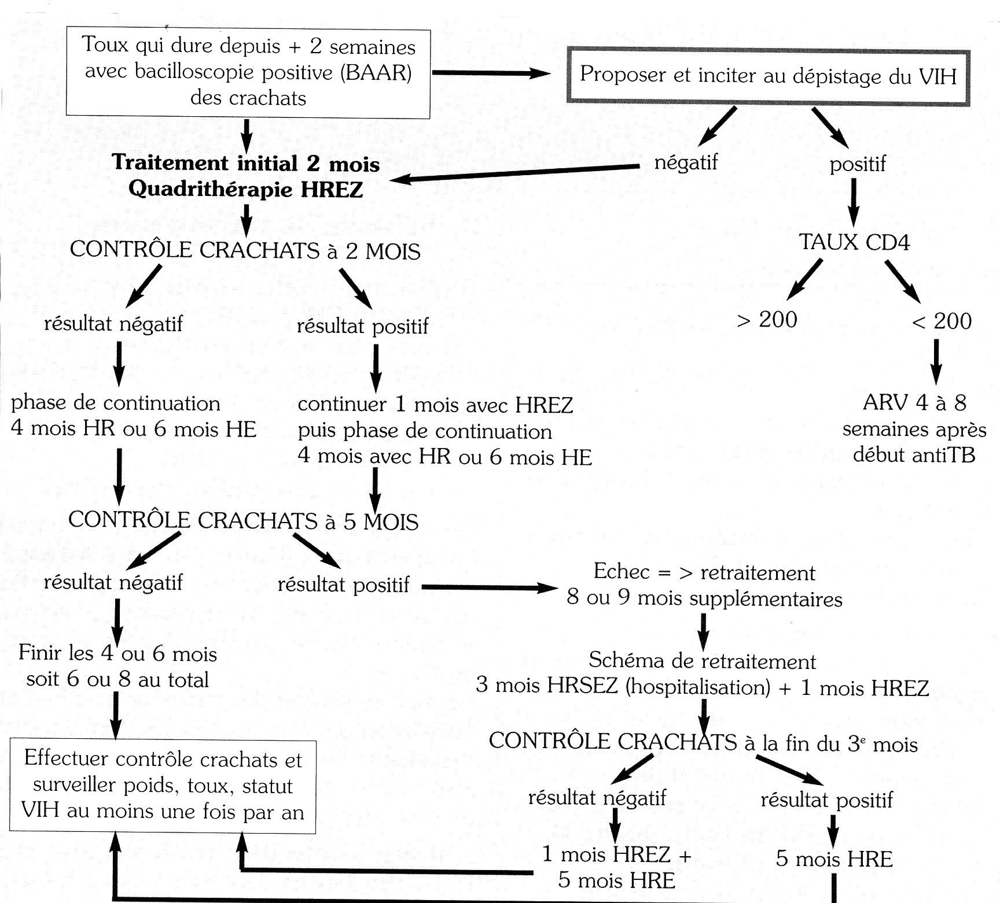

Pour tout le monde (médecins, infirmiers et malades), il s'agit de traitements standardisés au niveau mondial avec des régimes qui ont été rigoureusement évalués.

L'objectif de ce traitement standardisé est de :

<ul>
<li>Guérir le patient de sa tuberculose maladie.</li>
<li>Prévenir le décès ou les complications.</li>
<li>Prévenir les rechutes.</li>
<li>Eviter l'apparition de résistances.</li>
<li>Diminuer la transmission des BK à d'autres sujets.</li>
</ul>

D'après TB/HIV : A Clinical Manual, WHO Genève 2004, 2° Edition.  

Pour la première ligne de traitement cinq (5) antituberculeux sont disponibles : voir tableau sui­vant (dans le cadre du VI,H nous ne parlerons pas de la thiacétazone qui doit être abandonnée).  
<table>

<tbody>

<tr>

<td valign="top"></td>

<td valign="top">

mode d'action

</td>

<td valign="top">

efficacité

</td>

<td valign="top">

posologie

</td>

</tr>

<tr>

<td valign="top">

isoniazide (H)

</td>

<td valign="top">

bactéricide

</td>

<td valign="top">

haute

</td>

<td valign="top">

5 mg/Kg/j

</td>

</tr>

<tr>

<td valign="top">

rifampicine (R)

</td>

<td valign="top">

bactéricide

</td>

<td valign="top">

haute

</td>

<td valign="top">

10 mg/Kg/j

</td>

</tr>

<tr>

<td valign="top">

pyrazinamide (Z)

</td>

<td valign="top">

bactéricide

</td>

<td valign="top">

basse

</td>

<td valign="top">

25 mg/Kg/j

</td>

</tr>

<tr>

<td valign="top">

streptomycine (S)

</td>

<td valign="top">

bactéricide

</td>

<td valign="top">

basse

</td>

<td valign="top">

15 mg/Kg/j

</td>

</tr>

<tr>

<td valign="top">

éthambutol (E)

</td>

<td valign="top">

bactériostatique

</td>

<td valign="top">

basse

</td>

<td valign="top">

15 mg/Kg/j

</td>

</tr>

</tbody>

</table>

## I. Schéma pour tous les nouveaux cas

Traitement de six (6) mois => 2 RHEZ/6 HE ou 4 HR.

### 1. Phase initiale

Deux mois de quadrithérapie isoniazide + rifampi­cine + éthambutol + pyrazinamide.

*   Prise quotidienne le matin 1 heure avant de manger.  
*   Hospitalisation ou ambulatoire en traitement directement observé (DOT).  
*   Examen de crachats à l'issue.

### 2. Phase de continuation

*   Si BK négatif à la fin du 2° mois = 4 mois de bithérapie isoniazide + rifampicine ou 6 mois isoniazide + éthambutol.  
*   Si BK positif à la fin du 2° mois, 1 mois sup­plémentaire RHEZ puis RH 4 mois.  
*   Examen de crachats à la fin du 5° mois (compter à partir du début du traitement).  
    *   Si négatif finir les 6 mois.  
    *   Si positif = échec => retraitement.

## II. Schéma de retraitement

Traitement supplémentaire de 8 mois => 2 RHSEZ/1 RHEZ/5 RHE.

*   Phase initiale une prise quotidienne + injection de S (hospitalisation).  
*   Examen de crachats à la fin du 3° mois.  
*   Phase de continuation
    *   si BK- : 5 mois de RHE
    *   si BK+ : 1 mois RHEZ puis 5 RHE.

Les médicaments choisis pour les régimes thérapeutiques diffèrent d'un pays à l'autre, vous devez vous référer au programme natio­nal de lutte contre la tuberculose, c'est par son intermédiaire que vous disposerez de ces médicaments.

Les phases initiales des traitements se font en hospitalisation ou avec TDO (DOT en anglais), traitement directement observé : le patient avale ses comprimés devant un agent de santé ou un accompagnateur psycho social.

**Attention** : pour les injections de streptomycine il faut absolument utiliser du matériel à usage unique.

Le traitement des tuberculoses multirésistantes fait appel à cyclosérine, éthionamide, kana­mycine, capréomycine et quinolones.

## **III. Contre-indications**

La streptomycine est contre indiquée pendant la grossesse (elle provoque une surdité chez l'enfant).

Il est possible d'utiliser tous ces antitubercu­leux pendant l'allaitement.

En cas d'insuffisance rénale, il est possible de prescrire de la pyridoxine pour prévenir les neuropathies dues à l'isoniazide. La strep­tomycine et l'éthambutol ont une excrétion rénale il est parfois nécessaire de diminuer les doses de ces deux antibiotiques ce qui sera décidé par le superviseur.

En cas d'insuffisance hépatique le pyrazinami­de est contre indiqué car il est très toxique pour le foie ; le régime recommandé est 2SRHE/6HE ou 2SHE/lOHE.

Effets secondaires _(voir article "Médicaments antituberculeux")_

## IV. Traitements associés

Dans certains cas un **corticoide** est nécessaire ; les indications les plus fréquentes sont la méningite et la péricardite tuberculeuses (1-2 mg/Kg/j pendant 1 à 4 semaines). Il est aussi nécessaire de donner des corticoïdes en cas de pleurésie constrictive, d'atteinte des surrénales, de laryngite obstructive, d'hyper­sensibilisation grave, de lésion urétérale ou d'adénopathies massives.

**Algorithme traitement standardisé de la tuberculose**

_Développement et Santé, n°190, 2008_