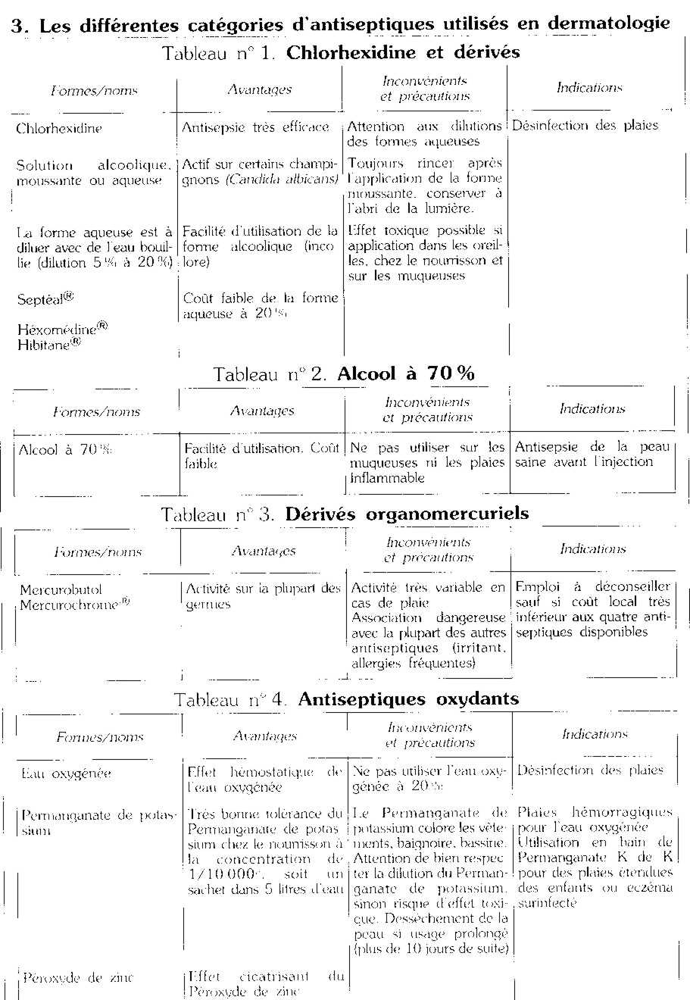
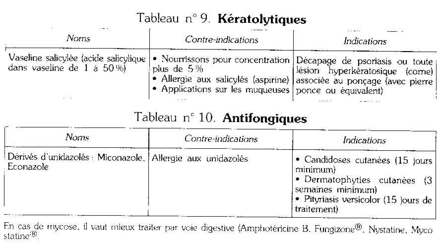

Les traitements locaux connaissent un grand succès auprès des malades de tous les pays atteints d'affections cutanées car l'application d'une lotion ou d'une pommade directement sur la lésion est spectaculaire et logique. Cependant, il faut garder en mémoire quelques règles simples de prescription de ce type de traitement.

### 1. Respecter les indications du traitement local

Paradoxalement, le traitement par voie générale est souvent plus efficace que la voie locale dans beaucoup de maladies ou symptômes dermatologiques.

Exemple : l'urticaire doit être traité par voie générale (par un antihistaminique).

### 2. Les formes galéniques

doivent être utilisées en fonction du type de lésion et de sa localisation. Les formes

- pommade : à réserver aux lésions sèches,

- crème : pour les lésions suintantes ou sèches des plis,

- lotion : pour le cuir chevelu et les lésions suintantes des plis.

Se rappeler que les pommades se transforment en huile à la chaleur, si possible les stocker dans un endroit frais.

### 3. Tous les produits sous forme de tube, pot, bouteille

risquent d'être contaminés dès qu'ils sont ouverts. Il faut systématiquement jeter tout produit ouvert depuis plus de quinze jours.

Il faut donc prévoir le volume du récipient en fonction de la fréquence d'utilisation afin d'éviter de gâcher un produit.

Ne jamais oublier qu'il existe un effet placebo non négligeable avec les produits locaux, d'où leur succès. Il peut s'agir là de l'effet désiré : par exemple, en cas de démangeaison (prurit) chronique sans cause retrouvée ou si la cause a déjà été traitée, un produit local comme la vaseline est à recommander car elle graisse la peau, ce qui diminue le prurit et c'est un produit dénué d'effet secondaire et peu coûteux.

## I. Les antiseptiques

### 1. Règles générales

Ces produits servent à désinfecter la peau saine en prévision d'un acte médical (vaccination, chirurgie), ou lésée pour éviter une infection.

Le produit de base de l'antisepsie est le savon : le simple savonnage et le rinçage à l'eau propre (mais non stérile) suffisent le plus souvent à désinfecter une plaie. Toute application d'un antiseptique doit être précédée d'un savonnage, puis d'un rinçage. L'application de l'antiseptique a pour but de prolonger l'effet du savon et de sécher la plaie pour favoriser sa cicatrisation.

Le choix de l'antiseptique dépend du caractère préventif ou curatif de son emploi, du lieu de son application (peau ou muqueuse), du type d'agent infectieux à combattre, de l'âge du malade (par exemple, les colorants sont très utilisés pour les enfants).

Deux à trois antiseptiques différents suffisent largement à la pratique médicale en dermatologie. Dans la même catégorie d'antiseptique, choisir le moins cher localement.

### 2. Précautions particulières

• Ne pas appliquer successivement deux antiseptiques différents: risque d'incompatibilité, d'irritation ou d'allergie.

• Attention aux dilutions des antiseptiques concentrés ou en poudre : risque de brûlure de la peau et de toxicité (pour le jeune enfant) si la concentration est trop importante et risque d'inefficacité si la dilution est trop faible.

## II. Les antibiotiques locaux

### 1. Règles générales

- Ils ne remplacent pas les antibiotiques par voie générale, même en cas d' infection localisée.
- Ils sont souvent allergisants.
- Ils sont moins efficaces que la plupart des antiseptiques pour la désinfection des plaies.
- Ils sont plus chers que les antiseptiques.
- De ces constatations, on déduit que les indications des antibiotiques locaux sont très réduites. En pratique, on utilise les antibiotiques locaux pour la prévention de la gonococcie néonatale à la naissance (collyre ou pommade ophtalmique à la tétracycline) et le traitement de la conjonctivite bactérienne.

### 2. Précautions d'usage

Les formes crème et pommade sont rapidement contaminées après l'ouverture du conditionnement, il faut les jeter systématiquement après quinze jours d'utilisation.

En cas d'infection cutanée (impétigo, furoncle, plaie surinfectée, ulcère infecté), il est

préférable, après savonnage et rinçage, d'utiliser un antiseptique local plutôt qu'un antibiotique local.

En cas d'impétigo étendu, érysipèle, anthrax, abcès, il faut donner un antibiotique général (Pénicilline M ou G), plus ou moins associé à un geste chirurgical pour l'abcès.

## III. Dermocorticoïdes

### 1. Règles générales

Ils ont des indications rigoureuses en dermatologie limitées à :

- eczéma non surinfecté,

- psoriasis (après décapage par la vaseline( salicylée),

- lichénification (épaississement cutané chronique lié au grattage prolongé).

Malheureusement, ils sont souvent utilisé~ abusivement pour d'autres affections :

- *piqûres d'insectes. urticaire :* le meilleur traitement est un antihistaminique par voie générale.

- *dépigmentation :* nécessité d'application< répétées pendant plusieurs mois avec comme conséquence. l'apparition d'effets secondaires parfois irrémédiables (cf. Précautions d'emploi),

- *prurit :* devant tout prurit, il faut évoquer d'abord une parasitose cutanée (pédiculose gale) qui sera aggravée par l'application de dermocorticoïdes.

Il existe quatre classes de dermocorticoïde correspondant à quatre degrés d'efficacité différente mais aussi de toxicité différente Il faut respecter scrupuleusement les indications de chaque classe de dermocorticoïdes

La classe I contient les dermocorticoïdes à plus forte action et donc à plus fort risque de toxicité.

### 2. Précautions, effets secondaires

Les effets secondaires apparaissent lors de l'application répétée et prolongée des dermocorticoïdes.

*a) Effets secondaires cutanés*

- dermite (surtout chez le nourrisson), - atrophie cutanée, - couperose,

- vergetures,

- aggravation de l'acné,

- hypertrichose (pousse de poils très dis

gracieux chez les femmes et les enfants),

- retard de cicatrisation,

- risque d'infection cutanée, d'aggravation

d'une parasitose.

Il faut traiter toute infection et parasitose cutanée préalablement à l'application de dermocorticoïdes.

*b) Effets systémiques*

Il s'agit d'un risque réel en cas d'application prolongée d'un dermocorticoïde à forte efficacité (classes I et II), surtout chez le nourrisson et les personnes âgées. Les effets sont les mêmes que ceux observés avec les corticoïdes par voie générale (oedèmes, HTA...).

*c) Précautions d'emploi*

Choisir, pour commencer, un dermocorticoïde de classe II pour un adulte, de classe III pour un nourrisson ou un jeune enfant.

Réserver les dermocorticoïdes de classe I aux lésions cutanées des adultes résistant aux dermocorticoïdes de classes supérieures et localisées en dehors de la face. Ne jamais

appliquer un dermocorticoïde de classe I chez un nourrisson.

Continuer le traitement, dès qu'une amélioration est notée, par un dermocorticdide de classe III pour un adulte (ou IV pour un nourrisson ou un jeune enfant), ou espacer les applications du même dermocorticoïde (une fois par jour, puis une fois tous les deux jours). Ne jamais arrêter brutalement un traitement dermocorticôide prolongé (plus de dix jours) car il existe un risque de rechute, en particulier pour l'eczéma.

## IV. Les antiparasitaires

### 1. Règles générales

Ne pas entreprendre de traitement antiparasitaire sans s'être assuré que la personne et toutes les personnes vivant sous le même toit peuvent se traiter en même temps et qu'elles peuvent prendre une douche ou un bain sur place ou à domicile. Il faut également prévoir un changement de vêtement au moment du traitement.

### 2. Précaution d'emploi

• Adapter le choix du produit et surtout la *durée d'application* de l'antiparasitaire à l'âge : risque de toxicité en cas d'application prolongée chez le jeune enfant.

• Avant de conclure qu'un produit parasitaire est inefficace, s'assurer que les soins d'hygiène daccompagnement (bain ou douche, changement de vêtements et de literie) ont été effectués pour toute la famille en même temps.

• Si les soins dhygiène sont impossibles à cause du manque deau (saison sèche) il vaut mieux renoncer au traitement antiparasitaire.

• Si les soins d'hygiène sont faits sur place, il faut s'assurer que la désinfection du lieu est possible (avec de Ieau de Javel à 12° diluée) entre chaque famille et en fin de journée.

*Voir tableau n°7.*

## V. Divers

### 1. Cicatrisants

*Voir tableau n°8*

### 2. Antiprurigineux

Rappels :

La première cause de prurit (démangeaison) est la gale (et les poux). Seul le naheI ment antlpaiasitaire est définitivement efficace dans ce cas.

• Le meilleur moyen thérapeutique contre le prurit est la prise d'antihistaminiques type Dexchlorpheniramine (Polaramine®) par voie générale.

• Toutes les pommades ou crèmes à base d'oxyde de titane et de zinc ainsi que les calamines peuvent être efficaces.

• Il faut également se rappeler de l'importance de l'effet placebo avec les crèmes et les pommades dans cette indication.

• La simple application de vaseline peut suffire à calmer un prurit.

### 3. Kératolytiques

*Voir tableau n° 9.*

### 4. Antifongiques

*Voir tableau n° 10.*

### 5. Dépigmentants

Ils sont pour la plupart très toxiques, en particulier la crème des " Trois Fleurs d'Orient" et le trio dépigmentant, en cas d'applications

répétées pendant une longue durée (risque de brûlures, de décollement cutané généralisé, de dépigmentation inhomogène en " peau de léopard ". Il existe de plus un risque d'hyperpigmentation à l'arrêt du traitement.

Pour conclure, retenons que les traitements locaux en dermatologie ont des indications précises et, somme toute, restreintes dans la pratique quotidienne. Maladie de peau ne signifie pas obligatoirement traitement appliqué sur la peau.

Un traitement par voie générale est souvent plus efficace et ne pose pas le problème de conservation et de risques de contamination des produits locaux.

Enfin, rappelons-nous que les soins d'hygiène de base, à base d'eau et de savon, sont la condition indispensable à tout traitement dermatologique. Aucune crème, pommade ou lotion ne peut les remplacer.
