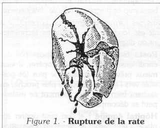
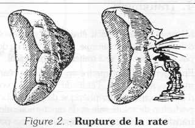
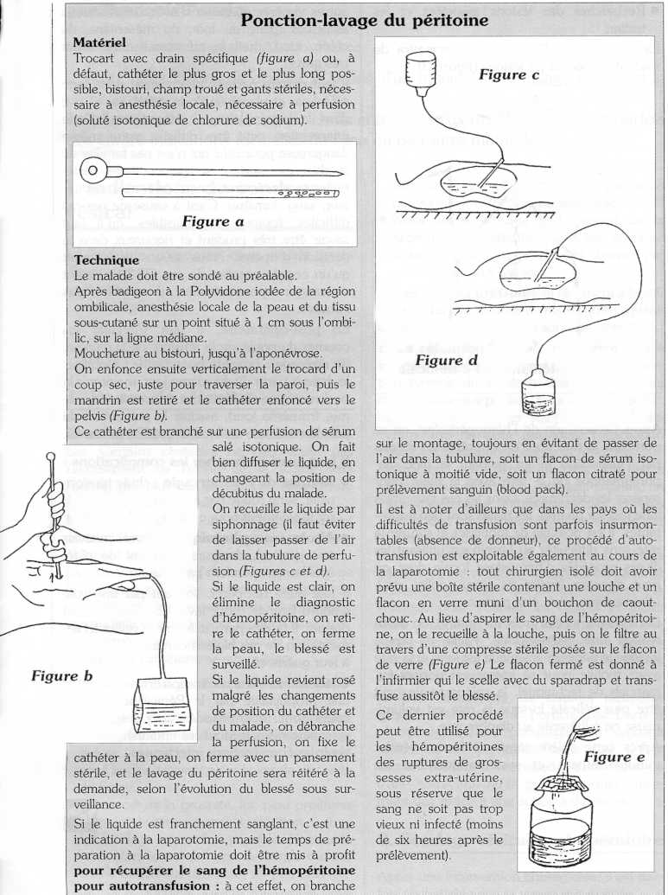
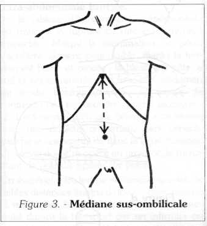

## I. Introduction

La rupture de la rate peut entraîner une grave **hémorragie intrapéritonéale dont il faut** **savoir faire le diagnostic très vite.** La splénectomie (ablation de la rate) représentait, jusqu'à maintenant, le geste de sauvetage le plus couramment réalisé en urgence.

Cependant, la rate a un rôle hématologique et immunologique important. Les malades qui sont splénectomisés courent un risque accru d'infections graves, rares mais parfois foudroyantes. Pour cette raison, on essaie aujourd'hui d'avoir une attitude moins radicale :

*   Certaines plaies sont minimes et le saignement peut se tarir de lui-même, sans qu'il soit nécessaire d'opérer.
*   Dans d'autres cas il est possible, en opérant, de faire l'hémostase en conservant la rate. Ce traitement conservateur est certainement le meilleur, quand il est possible.

Malheureusement, ce n'est pas toujours si simple, loin de là. La rupture de la rate survient de plus en plus souvent au cours d'accidents de la route. Il s'agit alors d'un polytraumatisme et le diagnostic de rupture de la rate peut être difficile, masqué au début par d'autres lésions.

Par ailleurs, les conditions matérielles locales sont souvent précaires : la banque du sang fait défaut, l'anesthésie est rudimentaire, l'expérience du chirurgien (ou du médecin isolé) est parfois insuffisante pour faire face à des lésions complexes. Il ne faut pas sous-estimer ces difficultés matérielles qui risquent de transformer une simple splénectomie en une aventure dangereuse !

Les contusions de la rate surviennent surtout chez les enfants et adolescents et les adultes de trente à quarante ans, plus souvent des hommes. Il s'agit le plus souvent de traumatismes fermés (contusions) consécutifs à des accidents de la route (accidents de voiture, de moto, de vélo ou piéton renversé), parfois de rixe avec coups sur l'abdomen, ou encore, chute d'un lieu élevé, ou dans un contexte de guerre : plaies par arme à feu touchant l'hypocondre gauche mais aussi explosions de bombe ou de roquette, par effet de souffle ou par éclat.

Après avoir analysé les différents types de lésions observées, nous étudierons la conduite à tenir pour chaque tableau rencontré et selon les moyens techniques dont on dispose sur place.

## Il. Lésions anatomiques

### 1. Lésions de la rate

Elles sont de gravité très variable.

#### a) Plaie de la rate

*   Petite plaie superficielle ou décapsulation, par arrachement d'une frange épiploïde ou d'une adhérence péritonéale.
*   Plaie parenchymateuse, simple et linéaire ou au contraire complexe et étoilée, plus ou moins profonde (_figure 1)._
*   Plaie du hile de la rate avec lésion ou désinsertion d'une artère ou d'une veine avec souvent une plaie du parenchyme associée.

Ces trois types de plaie peuvent entraîner une hémorragie intra-abdominale brutale ou au contraire former initialement un hématome périsplénique limité. Cet hématome peut aboutir à une hémostase spontanée ou bien continuer de saigner à bas bruit.

#### b) Hématome sous-capsulaire

C'est une contusion de la rate avec formation d'un hématome sans effraction de la capsule splénique.

*   Conséquence _(figure 2)_ : cet hématome sous tension, peut se rompre après quelques jours (un à dix) entraînant une hémorragie intra-abdominale retardée.

### 2. Lésions associées

Elles sont fréquentes et on doit toujours les rechercher en examinant ces blessés :

*   Traumatisme thoracique, avec fracture des dernières côtes gauches, hémothorax.

*   Contusion rénale gauche.
*   Fracture du rachis.
*   Plaies et contusions du côlon (angle colique gauche), du grêle, du pancréas, du diaphragme, qui seront découvertes à l'intervention, lors d'un examen systématique rigoureux de tout l'abdomen.

## III. Conduite à tenir

### 1 . A L'arrivée

Le blessé doit être examiné méthodiquement et complètement pour préciser :

*   la nature du traumatisme, le point d'impact, le délai écoulé depuis l'accident;
*   les premiers symptômes : douleurs, syncopes, vomissements;
*   le pouls, la tension, la coloration des conjonctives, la respiration;
*   l'état de l'abdomen par une palpation douce
*   l'état du thorax, des membres, du rachis, du crâne;
*   l'état des reins (palpation des fosses lombaires, examen des urines au besoin par sondage).

### 2. Premiers soins

Il faut tout de suite commencer la réanimation de ce patient dont l'état de choc plus ou moins franc peut être dû à d'autres lésions. Il faut s'assurer d'une respiration efficace, mettre en route une perfusion (sérum salé isotonique, Plasmion®, sang isogroupe si possible et si les signes cliniques d'hémorragie sont marqués), immobiliser les fractures (traction, attelle).

A partir de ce moment les chiffres de pouls, tension, respiration, diurèse, seront notés heure par heure sur une feuille de surveillance. En effet, la conduite à tenir va dépendre de l'évolution après ces paramètres.

### 3. Différentes situations possibles

#### Premier cas : hémorragie intra-abdominale brutale

Ici, le tableau d'hémorragie intrapéritonéale est franc et la rupture de rate est fortement suspectée. Malgré la réanimation, le pouls s'accélère, devient petit, faible, filant; la tension est basse et pincée ; le blessé est pâle, a soif et ses extrémités sont froides. L'abdomen est tendu, douloureux avec des traces de contusion de l'hypocondre gauche (ecchymose, fracture de côte), une défense à ce niveau avec une douleur qui irradie vers l'épaule gauche et une matité du flanc (à la percussion). Ce blessé doit être opéré en urgence, le mieux étant de pouvoir opérer sur place.

Un éventuel transfert ne se conçoit que sur de faibles distances (moins d'une ou deux heures) et médicalisé (le blessé étant réanimé et surveillé durant le transport par un infirmier ou un médecin expérimentés).

#### Deuxième cas: le blessé polytraumatisé

Lorsqu'il existe plusieurs lésions sévères (fractures, etc.), l'origine d'une hémorragie non extériorisée peut ne pas être claire. Pour mettre en évidence un saignement intrapéritonéal, on peut alors réaliser une ponction lavage du péritoine (voir _encadré_). Si ce test est franchement positif, il faut prévoir une laparotomie en urgence.

#### Troisième cas : hémorragie progressive

Quelquefois le saignement est progressif et pendant un jour ou deux les signes cliniques sont pauvres. Les signes suivants doivent donner l'alerte :

*   discrète hyperthermie ;
*   trouble du transit, constipation, diarrhée, nausées ;
*   vague douleur de l'hypocondre gauche irradiant à l'épaule gauche (mieux mise en évidence après avoir surélevé les pieds du lit) ;
*   anémie, subictère, hypotension ;
*   empâtement à la palpation de l'hypocondre gauche ;

*   si l'on dispose de clichés radiographiques, on constatera que la coupole diaphragmatique gauche est surélevée et que l'angle colique gauche est abaissé ;
*   l'échographie, si l'on en dispose, facilite beaucoup ce diagnostic difficile cliniquement.

Dans ces formes progressives, la conduite à tenir est fonction des conditions techniques dont on dispose :

*   **Poste isolé :** si l'on ne dispose pas des conditions nécessaires pour opérer, il vaut mieux prévoir l'évacuation le plus tôt possible vers l'hôpital équipé le plus proche, en sachant bien qu'à tout moment ce malade peut se décompenser.
*   **Hôpital équipé :** si l'on peut opérer sur place, il faut garder ce blessé en observation et repos strict, à l'hôpital :
    *   parfois tout s'arrange progressivement, l'hémostase se fait d'elle-même, et l'on peut éviter une laparotomie (il faudra que ce blessé reste très prudent et évite tout traumatisme pendant plusieurs semaines);
    *   ailleurs les symptômes persistent ou s'accentuent et il faut se résoudre à opérer.

#### Quatrième cas : ruptures "en deux temps".

Il faut connaître le risque des ruptures en deux temps des hématomes sous-capsulaires de la rate _(voir figure 2);_ ils se rompent après une période cliniquement silencieuse pouvant aller jusqu'à dix jours. Il faut donc garder ces patients au repos et sous surveillance pendant ce délai si l'on veut éviter tout accident, en particulier chez l'enfant porteur d'une rate pathologique.

### 4. Traitement

Même si le malade doit être placé, si possible, dans un service de chirurgie, le traitement ne doit pas se résumer au seul traitement chirurgical.

**En urgence**, il faut mettre en route une réanimation adaptée à l'état du blessé : voie d'abord veineuse périphérique de bon calibre, perfusion de soluté salé et de macromolécules, transfusion de sang isogroupe si cela est possible, traitement des lésions associées, antalgiques (paracétamol).

Lorsqu'elle est rendue nécessaire par l'hémorragie intra-abdominale, **l'opération** a deux objectifs :

*   Faire la splénectomie ou l'hémostase des lésions spléniques.

*   Rechercher des lésions associées et les traiter.

La médiane est l'incision qui permettra de s'adapter à toutes les lésions _(figure 3)_

Après l'évacuation de l'hémopéritoine, on se porte sur la rate dont on apprécie les lésions par l'inspection et en palpant la face diaphragmatique de la rate avec la main pour repérer les déchirures. Dans les cas favorables (une fois sur quatre), les plaies sont peu importantes, il est possible de mobiliser et suturer la rate sans difficulté, au besoin en utilisant les divers procédés d'hémostase locale dont on peut disposer (treillis de vicryl, colle, etc.). L'hémostase devra être parfaite.

Dans les autres cas (trois sur quatre), on devra réaliser une splénectomie. Facile et rapide lorsque le pédicule splénique est long et la rate assez mobile pour se laisser extérioriser (cf. manuels de technique), la splénectomie peut être plus délicate lorsque la rate est volumineuse ou adhérente au diaphragme.

Après cette splénectomie, il faudra vérifier minutieusement et systématiquement les autres viscères et traiter d'éventuelles lésions associées (plaie du foie, du mésentère, du côlon, etc.), dont la méconnaissance serait très grave.

Il faut ensuite parfaire l'hémostase de la loge splénique et placer un drain (tubulaire, n° 30) dans la loge splénique.

**Attention !** Cette intervention peut être difficile, voire même dangereuse pour celui qui n'est pas familier de la chirurgie, surtout si les conditions matérielles sont précaires (anesthésie, aide, aspirateur, sang, lumière). C'est à cause de ces cas difficiles, toujours imprévisibles, qu'il faut savoir être très prudent et rigoureux dans la décision d'opérer. Nous savons maintenant qu'un certain nombre de cas (25 %) peuvent s'arranger spontanément, il ne faut pas l'oublier.

En postopératoire, il faut surveiller les courbes du pouls, de la tension, de la diurèse, du drainage : quantité quotidienne; mobiliser le drain à partir du deuxième jour, maintenir la perfusion jusqu'à la reprise du transit (deuxième, troisième jour), assurer la prévention du paludisme et une antibiothérapie (Pénicilline G).

**Il faut aussi rechercher les complications :**

*   Reprise de l'hémorragie : chute tensionnelle, sang rouge par le drain : il faut réopérer rapidement pour compléter l'hémostase.
*   **Abcès sous-phrénique :** fièvre, mauvais état général, douleurs ou point de côté, écoulement purulent par le drain.

Il faut aussi ré-opérer, souvent par une voie d'abord latérale, pour laver abondamment et drainer. Il faudra particulièrement veiller à l'alimentation de ces blessés dénutris, pour aider à leur guérison.

Ultérieurement une vaccination (Pneumovax) et une prophylaxie par la Pénicilline au long cours sont recommandés chez les patients splénectomisés (surtout les enfants) pour prévenir les complications infectieuses.

_Développement et Santé, n°158, avril 2002_